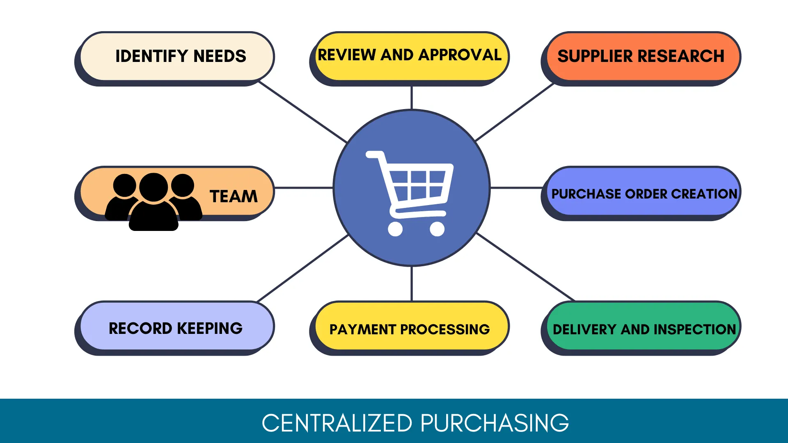

## Table of Contents

## What is a Central Purchasing Department?

A Central Purchasing Department is a part of a company that handles all the buying for the entire organization. It's like having one big shopping team that buys everything from office supplies to raw materials needed for production. This department works to make sure that the company gets the best deals and the right quality of products by negotiating with suppliers and managing contracts.

Having a Central Purchasing Department helps a company save money and time. Instead of each part of the company buying things on their own, the central team can buy in bulk, which often costs less. It also makes it easier to keep track of what's being spent and to make sure everyone is following the company's buying rules. This way, the company can focus more on its main work, like making products or providing services, without worrying about the shopping.

## What are the primary functions of a Central Purchasing Department?

The main job of a Central Purchasing Department is to buy things for the whole company. They make sure the company gets what it needs, like office supplies or materials for making products. They talk to suppliers to get good prices and make sure the stuff they buy is good quality. They also keep track of what the company is spending on these items.

Another important thing they do is manage contracts with suppliers. This means they make agreements about what the company will buy, how much it will cost, and when it will be delivered. By handling all the buying in one place, they can buy more at once, which usually saves money. It also helps the company follow its own rules about buying things, so everything is done the right way.

Overall, the Central Purchasing Department helps the company save time and money. It lets other parts of the company focus on their main jobs, like making products or serving customers, without having to worry about buying things. This way, the company can work better and more efficiently.

## How does a Central Purchasing Department differ from decentralized purchasing?

A Central Purchasing Department means one team buys everything for the whole company. They talk to suppliers, make deals, and keep track of spending all from one place. This can save money because they can buy a lot at once and get better prices. It also makes it easier to make sure everyone follows the company's buying rules.

Decentralized purchasing is different because each part of the company buys what it needs on its own. This can be quicker because teams don't have to wait for the central team to buy things. But it might cost more because they can't buy as much at once, and it can be harder to make sure everyone follows the rules.

Both ways have good and bad points. Central purchasing can save money and make things more organized, but it might take longer to get what you need. Decentralized purchasing can be faster, but it might cost more and be harder to keep track of everything.

## What are the basic advantages of having a Central Purchasing Department?

Having a Central Purchasing Department helps a company save money. When one team buys everything, they can buy a lot at once, which usually means they get better prices from suppliers. They can also make deals with suppliers for the whole company, not just one part of it. This way, the company can spend less on things like office supplies or materials for making products.

It also makes things more organized. Instead of each part of the company buying things on their own, the central team keeps track of what's being spent and makes sure everyone follows the company's buying rules. This makes it easier to see where the money is going and to make sure everything is done the right way. It lets other parts of the company focus on their main jobs, like making products or serving customers, without having to worry about buying things.

## Can you explain the concept of economies of scale in relation to central purchasing?

Economies of scale is a big idea that helps explain why buying in larger amounts can save money. When a Central Purchasing Department buys things for the whole company, they can order a lot at once. This is important because suppliers often give better prices if you buy more. So, instead of each part of the company buying a little bit of what they need, the central team can buy a lot and get a better deal. This means the company spends less money on the same things.

This concept works well with central purchasing because it lets the company take advantage of these savings. For example, if the company needs paper, the Central Purchasing Department can buy a huge amount of paper all at once. The supplier might give them a lower price per sheet because they're buying so much. This way, the company saves money on paper and can use that money for other important things. It's like getting a discount for buying in bulk, which helps the company be more efficient and spend less.

## How does a Central Purchasing Department improve supplier relationships?

A Central Purchasing Department helps improve supplier relationships by dealing with them all the time. When the same team always talks to the suppliers, they get to know each other better. This means they can trust each other more and work together better. The central team can tell the suppliers exactly what the company needs and when, so the suppliers can plan better and make sure they deliver on time. This makes the suppliers happy because they know what to expect and can rely on the company for regular business.

Also, because the Central Purchasing Department buys everything for the company, they can make big deals with suppliers. They can promise to buy a lot of stuff if the supplier gives them a good price. This is good for the supplier because they get a lot of business from one customer. The suppliers might even offer special deals or better service to keep the company happy. Over time, this can lead to strong, long-lasting relationships where both the company and the suppliers benefit.

## What are the potential disadvantages of a Central Purchasing Department?

A Central Purchasing Department can sometimes make things slower. When each part of the company has to go through the central team to buy what they need, it can take longer to get things. This might slow down the work because people have to wait for the central team to make the order. If something is needed quickly, this delay can be a big problem.

Another issue is that the central team might not know exactly what each part of the company needs. They might not understand the specific needs of different teams or departments. This can lead to buying things that are not quite right or not buying enough of what is really needed. This can make it harder for the company to work efficiently and might even lead to wasted money on things that aren't used.

Overall, while a Central Purchasing Department can save money and make buying more organized, it can also make things slower and sometimes lead to buying the wrong things. It's important for the company to think about these potential problems and find ways to manage them, like making sure the central team talks a lot with other parts of the company to understand their needs better.

## How might a Central Purchasing Department affect smaller departments or branches within an organization?

A Central Purchasing Department can affect smaller departments or branches in different ways. One big way is that it might make things slower for them. When smaller departments need something, they have to ask the central team to buy it. This can take time, and if they need something quickly, waiting for the central team can be a problem. It can slow down their work and make it harder for them to do their jobs well.

Another way it can affect smaller departments is by not always meeting their specific needs. The central team might not know exactly what each small department needs. They might buy things that don't fit well with what the smaller departments are doing. This can lead to the smaller departments getting things that aren't quite right or not getting enough of what they really need. This can make it harder for them to work efficiently and might even waste money on things they can't use.

## What are the challenges in implementing a Central Purchasing Department?

Setting up a Central Purchasing Department can be tough. One big challenge is getting everyone in the company to agree to it. Some parts of the company might not want to give up their control over buying things. They might worry that the central team won't understand their specific needs or that it will take longer to get what they need. This can lead to disagreements and make it hard to get everyone on board with the new way of doing things.

Another challenge is making sure the central team knows what everyone in the company needs. The central team has to talk a lot with different departments to understand their needs. If they don't do this well, they might end up buying the wrong things or not enough of what is really needed. This can lead to wasted money and unhappy departments. It takes time and effort to build good communication and trust between the central team and the rest of the company.

## How can technology enhance the efficiency of a Central Purchasing Department?

Technology can make a Central Purchasing Department work better by helping them keep track of what the company is buying and spending. With special software, the central team can see all the orders in one place. This makes it easier to know what everyone needs and to make sure they are getting the best deals. The software can also help them see patterns in what the company buys, so they can plan better and buy things in bigger amounts to save money.

Another way technology helps is by making it easier to talk to suppliers. With online tools, the central team can send orders and get updates from suppliers quickly. This means they can get things faster and make sure everything is going smoothly. Technology also helps them keep all their contracts and agreements with suppliers organized, so they can make sure everyone is following the rules and getting what they need on time.

## What metrics should be used to evaluate the performance of a Central Purchasing Department?

To see how well a Central Purchasing Department is doing, it's important to look at a few key things. One important thing is how much money they are saving the company. This can be measured by comparing the prices they get from suppliers to what the company would pay if each part bought things on their own. Another thing to look at is how quickly they can get what the company needs. If the central team can get things faster than before, that's a good sign they are doing well.

Another way to measure their performance is by looking at how happy the rest of the company is with their work. This can be done by asking different departments if they are getting what they need on time and if the things they get are the right quality. It's also good to see if the Central Purchasing Department is following the company's buying rules. If they are doing all these things well, it means they are helping the company work better and save money.

## What are some advanced strategies for optimizing a Central Purchasing Department's operations?

One advanced strategy for making a Central Purchasing Department work better is using data to make smarter buying decisions. By looking at past orders and spending, the central team can see patterns and figure out the best times to buy things in bulk. This can help them get better deals from suppliers and save money for the company. They can also use special software to predict what the company will need in the future, so they can plan ahead and make sure they always have what they need without overbuying.

Another important strategy is building strong relationships with suppliers. The central team can work closely with a few key suppliers to make sure they understand the company's needs and can deliver on time. This can lead to special deals and better service, which helps the company save money and work more smoothly. By talking regularly with suppliers and sharing information about future needs, the central team can make sure everyone is on the same page and working together well.

A third strategy is to keep improving how the central team talks with the rest of the company. By using technology like online ordering systems and regular meetings, the central team can make sure they know exactly what each department needs. This helps them buy the right things and avoid wasting money on things that aren't needed. Good communication also helps build trust and makes sure everyone is happy with the central team's work.

## What is the Intersection of Central Purchasing and Algorithmic Trading?

Integrating algorithmic trading models into central purchasing strategies can revolutionize procurement processes by leveraging advanced data analysis and decision-making capabilities. Algorithmic trading, with its basis in financial markets, employs sophisticated algorithms and [artificial intelligence](/wiki/ai-artificial-intelligence) to execute trades with precision and speed. Similarly, in a central purchasing system, these algorithms can be adapted to optimize procurement decisions.

The use of algorithms in purchasing allows organizations to achieve a better alignment with market dynamics. By analyzing vast amounts of data in real time, these algorithms can forecast price trends, identify optimal purchasing windows, and find the best suppliers. This capability enhances responsiveness, enabling organizations to react swiftly to volatile market conditions and capitalize on opportunities for cost savings.

For instance, an algorithm can analyze market data to predict a rise in the price of raw materials and issue a purchasing order before the price spike, thereby reducing procurement costs. The formula for calculating the expected price change might be a simple linear regression model expressed as:

$$
P(t+1) = \alpha + \beta \cdot X(t) + \epsilon
$$

Here, $P(t+1)$ represents the predicted price at time $t+1$, $\alpha$ and $\beta$ are coefficients derived from historical data, $X(t)$ is the market variable (e.g., commodity index or currency exchange rate) at time $t$, and $\epsilon$ is the error term. This model aids in identifying trends, enhancing procurement strategy alignment with market conditions.

However, integrating such complex algorithmic systems into central purchasing poses significant challenges. The primary difficulty lies in the seamless integration of these technologies with existing procurement systems. It requires sophisticated IT infrastructure and robust data management practices to ensure that data flows effortlessly between systems for timely and accurate analysis.

Additionally, while automation can streamline processes, maintaining the balance between automated systems and human oversight is crucial. Human expertise is essential for making strategic decisions, particularly in situations where algorithms might not account for unforeseen variables or context-specific factors. Ensuring that there is a framework for human intervention, decision validation, and monitoring of automated processes is vital to minimize risks associated with over-reliance on technology.

In conclusion, the intersection of algorithmic trading and central purchasing represents a transformative opportunity for organizations seeking to enhance efficiency and strategic decision-making. Nonetheless, successful integration demands careful planning, investment in advanced technologies, and a steadfast commitment to both automation and human expertise.

## References & Further Reading

[1]: Monczka, R. M., Handfield, R. B., Giunipero, L. C., & Patterson, J. L. (2015). ["Purchasing and Supply Chain Management"](https://books.google.com/books/about/Purchasing_and_Supply_Chain_Management.html?id=cAJoBwAAQBAJ). Cengage Learning.

[2]: DeGarmo, E. P. (1997). ["Materials and Processes in Manufacturing"](https://archive.org/details/degarmosmaterial0000blac) (8th ed.). Prentice Hall.

[3]: Treleaven, P., Galas, M., & Lalchand, V. (2013). ["Algorithmic Trading Review"](https://www.researchgate.net/publication/262239006_Algorithmic_Trading_Review). Communications of the ACM, 56(11), 76–85.

[4]: Harris, J. (2023). ["The Evolution of Algorithmic Trading: From First Generation to AI Algorithms"](https://teslamotorsclub.com/tmc/threads/crash-test-model-y-vs-volvo-xc60.338607/). Journal of Strategic Change.

[5]: ["Strategic Procurement in Global Supply Chains: Analytical Models and Applications"](https://www.researchgate.net/publication/382133140_Navigating_Complexity_Insights_into_Strategic_Procurement_Practices_in_Global_Supply_Chains) by Bharat Rao and Dariusz Fodor