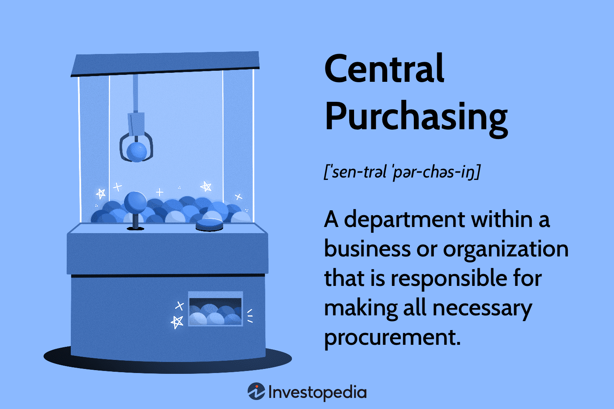

The business landscape is continuously evolving with advancements in technology and strategic management approaches, particularly in the areas of central purchasing in procurement and algorithmic trading. Central purchasing aims to consolidate procurement activities within an organization to leverage economies of scale, reduce costs, and improve negotiation power. This method streamlines the procurement process, ensuring consistent quality and reducing redundancies. However, it can also pose challenges, such as inefficiencies and reduced agility due to bureaucratic structures that may hinder local decision-making.

On the other hand, algorithmic trading is revolutionizing financial markets through the execution of trade orders using complex algorithms and mathematical models. By enabling high-speed, accurate transactions, algorithmic trading aids in minimizing costs and swiftly adapting to dynamic market conditions. When integrated into procurement strategies, algorithmic trading offers strategic advantages such as better market analysis and optimal purchase timings.



This article will explore the intersection of central purchasing and algorithmic trading. It will outline the benefits and drawbacks of these approaches and discuss the potential impacts of algorithmic trading on central procurement strategies. Understanding these concepts is critical for businesses aiming to optimize efficiency, cost management, and strategic investments. As organizations strive to enhance their operational effectiveness, balancing the benefits and challenges of these methodologies can lead to significant strategic advantages.

## Table of Contents

## Understanding Central Purchasing and Procurement

Central purchasing is a strategic function within an organization, designed to streamline the procurement of goods and services by centralizing responsibilities into a dedicated department. This approach leverages economies of scale, potentially resulting in significant cost savings. By consolidating purchasing efforts, organizations can negotiate better prices, standardize quality, and optimize supply chain management.

Economies of scale arise when an organization increases its output of goods or services, leading to a reduction in the average cost per unit due to fixed costs being spread over a larger number of units. In the context of procurement, central purchasing allows organizations to order larger quantities of goods and services, thereby securing bulk purchase discounts and favorable terms from suppliers. This collective bargaining power is particularly beneficial for large organizations operating across multiple locations or divisions.

Another advantage of central purchasing is the reduction of redundancies. By consolidating purchasing efforts, an organization minimizes the duplication of tasks and resources, which often occurs when procurement is managed at multiple levels within the organization. This centralization ensures consistency in purchasing practices, which helps in maintaining uniform quality and standards across the organization.

Furthermore, central purchasing simplifies processes by establishing standardized procedures and protocols, which streamline communication and coordination with suppliers. This can lead to more efficient inventory management, reduced lead times, and decreased risk of stockouts or overstock situations.

Despite these advantages, central purchasing also presents several challenges. A significant drawback is the potential for inefficiencies due to bureaucratic processes. Since all procurement decisions must pass through a centralized department, the agility of the organization can be hindered. This can lead to delays in response times, as local branches or departments are required to seek approval for their procurement needs.

Moreover, the centralized nature of this purchasing strategy may stifle local decision-making, as it does not always take into account the unique needs and conditions of individual branches or departments. Local managers, who may have valuable insights into specific market conditions or supplier relationships, could find themselves constrained by the overarching policies and procedures imposed by the central purchasing department.

In summary, while central purchasing offers substantial benefits in terms of cost savings, efficiency, and standardization, it is crucial for organizations to remain mindful of the associated challenges. Striking a balance between centralized control and local autonomy is essential to maximize the effectiveness of central purchasing strategies.

## Pros of Central Purchasing

Centralized procurement offers a distinct advantage by enabling organizations to consolidate their purchasing activities, leading to substantial cost reductions. By pooling their purchasing power, organizations can secure bulk buying discounts from suppliers, thereby lowering the overall expenditure on goods and services. This consolidated approach enhances the organization's negotiation capability with suppliers, allowing them to obtain more favorable terms and conditions. This can lead to better pricing, extended credit terms, or additional value-added services, all of which contribute to significant cost savings. 

Furthermore, centralized procurement ensures consistent quality control by standardizing purchasing decisions across the organization. With fewer suppliers to manage, organizations can develop and maintain stronger relationships with their suppliers. This streamlining not only simplifies the supplier management process but also allows organizations to work closely with suppliers to ensure that the goods and services received meet or exceed the organization's quality standards. As a result, the risk of receiving subpar or inconsistent products is minimized.

Operational efficiencies are also a key benefit of centralized procurement. By reducing the number of individual purchasing decisions and transactions, organizations can lower administrative overheads. This simplification leads to a more streamlined decision-making process, as procurement policies and procedures are centralized. It reduces the time and resources spent on managing disparate purchasing activities across various departments or locations, allowing the organization to focus more on strategic activities rather than routine administrative tasks.

## Cons of Central Purchasing

Central purchasing, while offering numerous advantages, also presents several notable drawbacks that can impact organizational efficiency and flexibility. One significant issue is the potential for delays in decision-making. In a centralized procurement system, all purchasing decisions must be approved by a central authority. This often results in slower processing times, as multiple layers of approval can be necessary before a purchase is finalized. Such delays can hinder an organization’s ability to respond swiftly to changes in market conditions or urgent operational needs, potentially leading to missed opportunities or inefficient resource allocation.

Furthermore, central purchasing can lead to increased transportation costs. When goods are acquired through a centralized system, they typically need to be shipped from the central purchasing hub to various operational sites. This distribution process can increase logistical expenses, particularly for organizations with geographically dispersed operations. The need to transport products over long distances not only adds to costs but can also lead to longer lead times and inventory holding challenges.

Another critical downside of central purchasing is the risk associated with bulk ordering and reduced supplier diversity. By concentrating orders with a limited number of suppliers, organizations might secure [volume](/wiki/volume-trading-strategy) discounts but at the expense of supply chain flexibility and resilience. Relying heavily on a small pool of suppliers can make an organization vulnerable to disruptions, whether due to supplier bankruptcy, natural disasters, or other unforeseen events. Additionally, this lack of diversity can stifle innovation, as suppliers may have little incentive to offer improved products or services when there is no competitive pressure.

The limited engagement with diverse suppliers can also mean that organizations may miss out on innovations and unique offerings that smaller or niche suppliers might provide. In a rapidly changing market environment, being overly dependent on a narrow supplier base can limit an organization’s adaptability and ability to leverage new technologies or trends.

In summary, while central purchasing can offer cost efficiencies, these need to be weighed carefully against the potential for decision-making delays, increased logistical costs, and risks associated with reduced supplier diversity. Organizations must balance central purchasing benefits with strategies that maintain responsiveness, supplier flexibility, and supply chain resilience.

## Algorithmic Trading: An Overview

Algorithmic trading, often referred to as algo trading, involves the use of sophisticated computer algorithms to automate the buying and selling of financial instruments at high speeds and with high precision. This approach leverages advanced mathematical models and statistical analyses to monitor markets for opportunities, execute trades, and manage risks more efficiently than traditional methods.

At its core, [algorithmic trading](/wiki/algorithmic-trading) is designed to improve execution speed, minimize transaction costs, and capitalize on market efficiencies. This is primarily achieved through the automation of trade execution, which allows for rapid response to market changes. For instance, an algorithm might be programmed to recognize specific market patterns and execute trades based on these patterns without human intervention. An example of a simple algorithmic trading strategy could be designed as follows in Python:

```python
# Example of a simple moving average crossover strategy
def moving_average_crossover(prices, short_window=40, long_window=100):
    short_avg = prices.rolling(window=short_window, min_periods=1).mean()
    long_avg = prices.rolling(window=long_window, min_periods=1).mean()

    signal = (short_avg > long_avg).astype(int)  # Generate buy/sell signals
    return signal

# Assuming 'prices' is a pandas Series of stock prices
# signals = moving_average_crossover(prices)
```

Algorithmic trading has become a cornerstone of modern financial markets, accounting for a significant portion of total trading volume on major exchanges. The strategic advantages it offers include optimal purchase timing, as algorithms can be programmed to execute trades at the most favorable price points, thus reducing market impact costs and slippage. Additionally, it enhances risk management by deploying risk metrics and controls in real-time, thereby safeguarding the investment portfolio against unforeseen market movements.

The integration of algorithmic decision-making into procurement can offer substantial benefits similar to those observed in financial markets. By applying predictive analytics and data-driven strategies, organizations can time their purchases to coincide with favorable market conditions, thus securing better pricing and enhancing overall cost efficiency.

Despite the benefits, the implementation of algorithmic trading systems requires substantial investment in both technology and skilled personnel. Developing and maintaining these systems demands expertise in programming, quantitative analysis, and market structures. Furthermore, there is a risk of over-reliance on automated systems, which may fail under highly unpredictable market conditions or exhibit unforeseen malfunctions. Therefore, a balanced approach that combines algorithmic strategies with human oversight is crucial for effective deployment.

## Pros and Cons of Algorithmic Trading in Procurement

Algorithmic trading has increasingly found its applications in procurement, offering distinct advantages alongside notable challenges. One of the primary benefits is the enhanced speed and accuracy in executing orders. Through sophisticated algorithms, procurement activities can be streamlined, resulting in better pricing and improved risk management. This efficiency is crucial in a rapidly changing market environment where timely decision-making directly impacts cost savings and operational success.

Moreover, algorithmic trading aids in better market analysis and forecasting, thereby aligning procurement strategies with market movements. By utilizing historical and real-time data, algorithms can predict market trends more accurately, enabling organizations to make informed purchasing decisions. This alignment reduces the likelihood of overstocking or stockouts, which can significantly affect an organization's financial performance.

However, embracing algorithmic trading in procurement is not without its challenges. A considerable investment in technology infrastructure is required, along with the hiring of skilled personnel capable of managing and interpreting complex algorithmic processes. The financial and resource commitment can be substantial, particularly for smaller organizations with limited budgets.

Additionally, there is the risk of over-reliance on automated systems. While algorithms can process vast amounts of data far quicker than human counterparts, they may falter in unpredictable conditions. For instance, during market anomalies or black swan events, rigid algorithms lacking the flexibility of human intuition may lead to suboptimal procurement decisions. Therefore, maintaining a balance between automation and human oversight is crucial to mitigate potential risks.

## The Intersection of Central Purchasing and Algorithmic Trading

Integrating algorithmic trading models into central purchasing strategies can revolutionize procurement processes by leveraging advanced data analysis and decision-making capabilities. Algorithmic trading, with its basis in financial markets, employs sophisticated algorithms and [artificial intelligence](/wiki/ai-artificial-intelligence) to execute trades with precision and speed. Similarly, in a central purchasing system, these algorithms can be adapted to optimize procurement decisions.

The use of algorithms in purchasing allows organizations to achieve a better alignment with market dynamics. By analyzing vast amounts of data in real time, these algorithms can forecast price trends, identify optimal purchasing windows, and find the best suppliers. This capability enhances responsiveness, enabling organizations to react swiftly to volatile market conditions and capitalize on opportunities for cost savings.

For instance, an algorithm can analyze market data to predict a rise in the price of raw materials and issue a purchasing order before the price spike, thereby reducing procurement costs. The formula for calculating the expected price change might be a simple linear regression model expressed as:

$$
P(t+1) = \alpha + \beta \cdot X(t) + \epsilon
$$

Here, $P(t+1)$ represents the predicted price at time $t+1$, $\alpha$ and $\beta$ are coefficients derived from historical data, $X(t)$ is the market variable (e.g., commodity index or currency exchange rate) at time $t$, and $\epsilon$ is the error term. This model aids in identifying trends, enhancing procurement strategy alignment with market conditions.

However, integrating such complex algorithmic systems into central purchasing poses significant challenges. The primary difficulty lies in the seamless integration of these technologies with existing procurement systems. It requires sophisticated IT infrastructure and robust data management practices to ensure that data flows effortlessly between systems for timely and accurate analysis.

Additionally, while automation can streamline processes, maintaining the balance between automated systems and human oversight is crucial. Human expertise is essential for making strategic decisions, particularly in situations where algorithms might not account for unforeseen variables or context-specific factors. Ensuring that there is a framework for human intervention, decision validation, and monitoring of automated processes is vital to minimize risks associated with over-reliance on technology.

In conclusion, the intersection of algorithmic trading and central purchasing represents a transformative opportunity for organizations seeking to enhance efficiency and strategic decision-making. Nonetheless, successful integration demands careful planning, investment in advanced technologies, and a steadfast commitment to both automation and human expertise.

## Conclusion

Central purchasing and algorithmic trading significantly reshape how modern organizations enhance efficiency, cost-effectiveness, and strategic decision-making. Central purchasing allows firms to leverage economies of scale, enabling substantial cost savings and improved supplier management. On the other hand, algorithmic trading brings an unprecedented level of speed and precision in decision-making processes, allowing firms to respond dynamically to market fluctuations.

Creating a synergy between these two disciplines can revolutionize organizational operations. By combining the strategic bulk purchasing ability of central procurement with the analytical prowess of algorithmic trading, companies can achieve enhanced alignment between procurement strategies and evolving market conditions. This hybrid approach not only supports better decision-making but also improves operational agility.

However, successfully integrating these systems is not without its challenges. It requires a strategic framework that combines investment in advanced technologies with the requisite human expertise. Emphasizing human oversight is crucial to mitigate potential risks associated with over-automation, ensuring that automated processes do not fail unpredictably. Therefore, organizations must carefully balance the efficiency of automation with the indispensable nuance of human judgment to navigate complexities effectively and maximize the potential of their procurement strategies.

## References & Further Reading

[1]: Monczka, R. M., Handfield, R. B., Giunipero, L. C., & Patterson, J. L. (2015). ["Purchasing and Supply Chain Management"](https://books.google.com/books/about/Purchasing_and_Supply_Chain_Management.html?id=cAJoBwAAQBAJ). Cengage Learning.

[2]: DeGarmo, E. P. (1997). ["Materials and Processes in Manufacturing"](https://archive.org/details/degarmosmaterial0000blac) (8th ed.). Prentice Hall.

[3]: Treleaven, P., Galas, M., & Lalchand, V. (2013). ["Algorithmic Trading Review"](https://www.researchgate.net/publication/262239006_Algorithmic_Trading_Review). Communications of the ACM, 56(11), 76–85.

[4]: Harris, J. (2023). ["The Evolution of Algorithmic Trading: From First Generation to AI Algorithms"](https://teslamotorsclub.com/tmc/threads/crash-test-model-y-vs-volvo-xc60.338607/). Journal of Strategic Change.

[5]: ["Strategic Procurement in Global Supply Chains: Analytical Models and Applications"](https://www.researchgate.net/publication/382133140_Navigating_Complexity_Insights_into_Strategic_Procurement_Practices_in_Global_Supply_Chains) by Bharat Rao and Dariusz Fodor