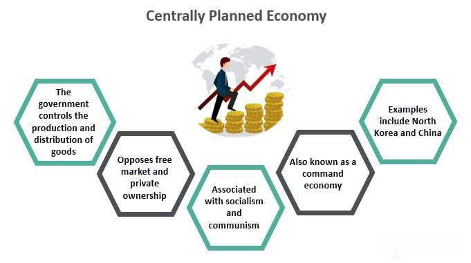

The economic systems across the globe manifest a broad spectrum of diversity and intricacy. Within this expanse, centralized markets hold a distinguished position characterized by their structured nature and comprehensive regulatory oversight. Centralized markets operate through a central exchange, where all buying and selling orders are routed, providing transparency and reducing the risks associated with unknown or variable counterparties. This well-organized structure promotes fair trading conditions and facilitates investor confidence, thereby ensuring predictable pricing and enhancing market efficiency.

In recent years, algorithmic trading has markedly transformed the operations of these markets by revolutionizing market structure and trading practices. Algorithmic trading, the use of computer algorithms to execute trades based on predetermined criteria, has streamlined processes, allowing traders to capitalize on small market movements with high speed and precision. This transformation has deeply influenced market dynamics, shifting the focus toward technological integration into traditional trading practices. It has also raised questions about market liquidity, price discovery, and order execution practices.

This article focuses on exploring the concept of centralized markets along with the evolving market structures they embody. It examines how algorithmic trading continues to reshape the financial landscape, enhancing efficiency yet posing novel challenges. As financial markets become increasingly integrated with sophisticated technology, understanding these evolving elements becomes essential for investors and market participants. The discussion will cover the essential characteristics of centralized markets, analyze the substantial impact algorithmic trading has on market dynamics, and evaluate the future trends that may shape these economic environments.

As the convergence of technology with financial markets accelerates, grasping the interconnections between centralized market structures and algorithmic trading will be crucial for maintaining competitiveness in this evolving sector. This ongoing transformation underlines the necessity for continuous learning and adaptation among traders and investors aiming to achieve their financial objectives.

## Table of Contents

## Understanding Centralized Market Structures

Centralized markets are integral to global financial systems, facilitating trade by channeling all orders through a single, well-regulated exchange. This centralized approach ensures a high degree of transparency, reducing the risks associated with dealing with multiple counterparties. By streamlining transactions through a central entity, such markets provide a coherent structure that promotes reliability and trust among investors.

The New York Stock Exchange (NYSE) serves as a prominent example of a centralized market. Established in 1792, the NYSE has grown to become one of the largest securities exchanges globally, offering a unified platform for buying and selling a broad array of financial instruments. The centralized nature of the NYSE allows for predictable pricing mechanisms, which can lead to improved market efficiency. This system benefits investors by fostering fair trading conditions and providing a clear methodology for price discovery.

One of the key advantages of centralized markets is their role in enhancing [liquidity](/wiki/liquidity-risk-premium). By aggregating buy and sell orders in one location, these markets ensure that participants can execute trades swiftly and at transparent prices. This liquidity is crucial for maintaining investor confidence, as it minimizes the likelihood of significant price deviations due to variable demand or supply. Additionally, centralized markets often impose strict regulatory standards, further bolstering investor trust by ensuring compliance and reducing the risk of malfeasance.

Despite these advantages, centralized market structures face challenges arising from the advent of decentralized markets and blockchain technology. Decentralized exchanges (DEXs) offer an alternative by allowing for peer-to-peer trading without a central authority. This can potentially diminish the role of traditional exchanges like the NYSE by offering lower fees and quicker transactions, albeit with varying levels of transparency and security. Blockchain, a technology underpinning many decentralized platforms, promises increased transparency and efficiency but also challenges conventional regulatory frameworks.

The limitations of centralized market models include potential inefficiencies due to bureaucracy and inflexibility in adapting to rapid technological changes. Furthermore, centralized markets require significant resources to maintain infrastructure and regulatory compliance.

In conclusion, while centralized markets like the NYSE have historically played a pivotal role in trading activities by ensuring stability and trust, they must adapt to the growing influence of decentralized technologies. Understanding the advantages and limitations of both centralized and decentralized models is essential for stakeholders to navigate the evolving financial landscape effectively.

## Market Structure Analysis for Algorithmic Trading

Algorithmic trading has transformed the landscape of financial markets by introducing a new level of precision and efficiency in trade execution. Central to this transformation is the platform of market structure analysis, which allows traders to derive insights necessary for optimizing strategies and managing risks effectively.

Market structure refers to the organization and dynamics of a market, including the roles of various participants, the characteristics of trading venues, and the liquidity flows that dictate market behavior. In a centralized market, participants range from institutional investors and broker-dealers to individual traders, each playing strategic roles that influence market outcomes. Trading venues, such as stock exchanges and electronic communication networks (ECNs), serve as arenas where these participants interact, facilitating the buying and selling of securities.

Liquidity, defined as the ability to buy or sell an asset without causing a significant impact on its price, is a critical [factor](/wiki/factor-investing) in market structure analysis. High liquidity typically leads to tighter spreads and lower transaction costs, benefiting traders seeking cost-effective execution. Conversely, low liquidity can result in wider spreads and increased [volatility](/wiki/volatility-trading-strategies), posing challenges for executing large orders.

One of the pivotal components in market structure analysis is the analysis of order types and execution mechanisms. Traders have access to various order types—such as market orders, limit orders, and stop orders—which provide flexibility in executing trades. Each order type has distinct characteristics that can impact trade execution and costs. For instance, while market orders ensure execution at the current price, they may expose traders to market volatility. Limit orders, on the other hand, offer price control but come with the risk of non-execution.

The advent of high-frequency trading ([HFT](/wiki/high-frequency-trading-strategies)) has further accentuated the importance of understanding market microstructure. HFT involves executing a large number of orders at extremely high speeds, often within microseconds. The success of HFT strategies largely depends on exploiting minute price discrepancies, necessitating an in-depth understanding of market timing and order flow. Consequently, even marginal changes in the speed or sequence of trades can have significant impacts on trading results.

Technological innovations, particularly in real-time analytics and [artificial intelligence](/wiki/ai-artificial-intelligence) (AI), are reshaping how market structure analysis is conducted. Real-time analytics enable traders to process vast amounts of market data instantaneously, allowing for timely decision-making and strategy adjustments. AI technologies further enhance this capability by employing [machine learning](/wiki/machine-learning) algorithms to identify patterns and predict market movements, offering a competitive edge in the fast-paced trading environment.

In summary, the analysis of market structure is integral to the efficacy of [algorithmic trading](/wiki/algorithmic-trading), providing a foundation for strategy optimization and risk management. By understanding the nuances of market participants, trading venues, and liquidity, traders can make informed decisions to achieve cost-effective and efficient trade execution. As technology continues to evolve, embracing innovative tools and methodologies will remain crucial for navigating the complexities of modern financial markets.

## The Role of Algorithmic Trading

Algorithmic trading utilizes advanced computational algorithms to execute trades automatically based on predetermined conditions and strategies. This technology is leveraged by various market participants, including high-frequency trading (HFT) firms, institutional investors, and retail traders, to optimize their trading activities and outcomes.

The core advantage of algorithmic trading lies in its ability to process vast amounts of market data in real-time, identifying and capitalizing on minute market movements that may otherwise be imperceptible to human traders. By rapidly analyzing market conditions and executing trades with minimal latency, algorithmic trading systems can improve transaction costs and enhance execution speed. This efficiency is particularly beneficial in high-frequency trading, where the ability to execute trades in milliseconds can be crucial for success.

Algorithmic trading has driven notable changes in market liquidity and price discovery. By facilitating continuous, automated trading, algorithms can enhance market liquidity, ensuring that buy and sell orders are matched more efficiently. This constant flow of trading activity contributes to more accurate price discovery, reflecting real-time market conditions and valuations.

However, the implementation of algorithmic trading is not without challenges. The complexity and speed of these trading systems necessitate robust risk management practices to prevent significant losses from unanticipated market movements. Market participants must develop comprehensive risk models and controls to manage the risks associated with algorithmic trading strategies.

Furthermore, the rapid growth of algorithmic trading has prompted increased scrutiny and regulatory oversight. Financial regulators are concerned with the potential for systemic risks and market disruptions caused by high-speed trading. Ensuring compliance with regulatory standards is essential for algorithmic trading firms to operate within legal constraints while maintaining market integrity.

In summary, while algorithmic trading has revolutionized trade execution by improving speed and cost efficiency, it requires careful management of the associated risks and adherence to regulatory guidelines to ensure sustained benefits in the evolving financial markets.

## Challenges and Considerations

The complexity and dynamism of financial markets create significant challenges in accurate market structure analysis. As markets become more technologically advanced, the quality and availability of data become increasingly vital for effective analysis and strategy development. High-quality data is crucial for making informed decisions and optimizing trading strategies, as algorithms depend on large volumes of historical and real-time data for [backtesting](/wiki/backtesting) and execution. Any lapses in data integrity can lead to erroneous conclusions and suboptimal trading outcomes.

Technological infrastructure plays a central role in supporting these advancements. Robust systems are required to process vast amounts of data quickly and efficiently, making features like low latency and high computational power indispensable. The continual evolution of technology necessitates regular updates and enhancements to maintain competitive edge and ensure that trading strategies are executed with precision.

Moreover, regulatory constraints and compliance requirements introduce further layers of complexity to trading activities. Financial markets are governed by a diverse set of rules and regulations designed to maintain stability and protect investors. Traders must navigate these regulatory landscapes, which can vary significantly across different jurisdictions. Compliance involves significant resources to monitor and adapt to changes in regulatory standards, which might include transaction reporting, maintaining audit trails, and ensuring data privacy.

The ethical considerations in algorithmic trading are also paramount. Traders must strike a delicate balance between leveraging advanced technologies and adhering to regulatory standards to uphold ethical trading practices. It is important for market participants to ensure that their strategies do not manipulate markets or exploit other traders unfairly. To achieve this, robust risk management frameworks are necessary to monitor and mitigate risks associated with automated trading.

Understanding and adapting to these challenges are essential for maintaining a competitive edge in the market. Traders who can effectively integrate high-quality data analysis, advanced technological infrastructure, and robust compliance mechanisms will be better positioned to succeed. As the financial landscape continues to evolve, those who remain responsive to these challenges and flexibility adapt their strategies will have a distinct advantage. Maintaining this competitive edge requires ongoing learning and adaptation to keep pace with technological and regulatory developments.

## Future Trends in Market Structures

The integration of artificial intelligence (AI) and machine learning (ML) into financial markets is revolutionizing market data analysis and the optimization of trading strategies. AI and ML offer sophisticated algorithms capable of processing vast amounts of financial data, identifying patterns, and predicting market trends with greater accuracy. This technological evolution allows traders to develop data-driven strategies and execute trades more efficiently.

Blockchain technology is also making significant strides in transforming market structures. By offering a decentralized ledger system, blockchain enhances transparency, reduces transaction costs, and increases security in market operations. This technology's potential to provide immutable and transparent transaction records can improve trust and efficiency in financial markets, reducing the need for intermediaries and enabling faster settlements.

The growing demand for real-time analytics is driving advancements in data processing and streaming technologies. Traders increasingly require access to up-to-date market information to make informed decisions quickly. This demand is pushing the development of innovative solutions that enable high-speed data analysis and intuitive visualization tools. Enhanced real-time capabilities allow traders to respond promptly to market changes and capitalize on emerging opportunities.

Regulatory technology (RegTech) innovations are helping traders navigate the complex regulatory environments of financial markets. Automated compliance tools streamline regulatory processes, reduce operational risks, and ensure adherence to various legal and ethical standards. These technologies enable market participants to focus more on strategy development and execution while maintaining compliance with financial regulations.

Collaborative platforms designed for sharing market insights are emerging as valuable resources for traders and investors. These platforms facilitate knowledge exchange and collective decision-making by pooling expertise and perspectives from various market participants. By fostering a collaborative environment, traders can gain insights from peers, enhance their strategies, and improve overall market intelligence.

As financial markets continue to evolve, these trends underscore the importance of leveraging advanced technologies and collaborative efforts to remain competitive and achieve investment goals.

## Conclusion

Centralized market structures and algorithmic trading are pivotal in reshaping the financial landscape. These systems streamline the processing of transactions, ensuring efficiency and accuracy in the global exchange of securities. Understanding the dynamics of these markets, including the roles of various participants and the technological implications, is essential for investors and traders alike. It is crucial to recognize how these elements interact, as they define the operational framework within which trading occurs.

Despite the complexities and challenges inherent in modern trading environments, recent advancements in artificial intelligence, blockchain, and data analytics present exciting new opportunities. AI algorithms continue to enhance decision-making processes, allowing for more sophisticated and adaptive trading strategies. Blockchain technology, with its promise of increased transparency and reduced transaction costs, stands to revolutionize the traditional methods of conducting transactions. Additionally, the ever-improving field of analytics is crucial for extracting actionable insights from vast quantities of market data, enabling more informed trading decisions.

As financial markets continue to evolve at a rapid pace, the ability to adapt to these changes is paramount. Staying competitive requires a willingness to embrace new technologies and methodologies that enhance both trading efficiency and effectiveness. This adaptability is not just about technology adoption; it also involves understanding the nuances of market developments and being proactive in strategic adjustments.

The ongoing evolution of market structures underscores the importance of continuous learning and adaptation. In a world where financial markets are becoming increasingly complex, the commitment to keeping abreast of new developments, regulatory changes, and technological innovations is vital for achieving financial success. This continuous learning ethos ensures that investors and traders remain agile, informed, and capable of capitalizing on emerging opportunities in a dynamic financial environment.

## References & Further Reading

[1]: Madhavan, A. (2000). "Market Microstructure: A Survey." Journal of Financial Markets, 3(3), 205-258. [Link](https://www.sciencedirect.com/science/article/pii/S1386418100000070)

[2]: O'Hara, M. (1995). "Market Microstructure Theory." Blackwell Publishers. [Link](https://openlibrary.org/books/OL1103097M/Market_microstructure_theory)

[3]: Gomber, P., Arndt, B., Lutat, M., & Uhle, T. (2011). "High-Frequency Trading." EURONEX Working Paper Series. [Link](https://papers.ssrn.com/sol3/papers.cfm?abstract_id=1858626)

[4]: Aldridge, I. (2013). ["High-Frequency Trading: A Practical Guide to Algorithmic Strategies and Trading Systems"](https://www.amazon.com/High-Frequency-Trading-Practical-Algorithmic-Strategies/dp/1118343506) (2nd ed). Wiley Finance.

[5]: Hasbrouck, J. (2007). "Empirical Market Microstructure: The Institutions, Economics, and Econometrics of Securities Trading." Oxford University Press. [Link](https://archive.org/details/empiricalmarketm0000hasb)

[6]: Abergel, F., Chakrabarti, B., Chakraborti, A., Deo, N., & Sharma, K. (2012). "Quantum Finance: Path Integrals and Hamiltonians for Options and Interest Rates." Springer. [Link](https://link.springer.com/chapter/10.1007/978-3-030-11364-3_8)

[7]: Luckock, H. (2003). "A steady-state model of the continuous double auction." Quantitative Finance, 3(5), 385-404. [Link](https://www.semanticscholar.org/paper/A-steady-state-model-of-the-continuous-double-Luckock/7eef62899c8f41331be390f1b9fb39aad2c8ba23)