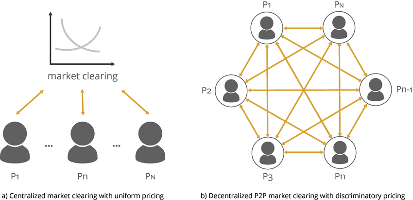

## Table of Contents

## What is a centralized market?

A centralized market is a type of market where all the buying and selling happens in one place. This place can be a physical location, like a stock exchange building, or it can be online, like a website where people trade things. In a centralized market, there is usually one main organization or group that runs everything. They make the rules, keep track of all the trades, and make sure everything is fair and legal.

Centralized markets are good because they can be easier to use and understand. Since everything happens in one place, it's simpler for people to find what they want to buy or sell. Also, having one group in charge can help keep the market safe and trustworthy. However, if the main group running the market makes a mistake or does something wrong, it can cause big problems for everyone using the market.

## How does a centralized market differ from a decentralized market?

A centralized market and a decentralized market are different in how they work and who is in charge. In a centralized market, everything happens in one place, like a big store or a website. There is one main group that runs the market, makes the rules, and keeps everything organized. This can make it easier for people to buy and sell things because they know exactly where to go and who to trust. However, if the main group makes a mistake or does something wrong, it can cause big problems for everyone using the market.

On the other hand, a decentralized market does not have one main place or group in charge. Instead, buying and selling can happen in many different places, and different people or groups can make their own rules. This can be good because it gives people more freedom and choices. But it can also be harder to use because there is no one main place to go, and it can be harder to know if you can trust everyone you are dealing with. Both types of markets have their own good and bad points, and which one is better depends on what people need and want.

## What are the main characteristics of a centralized market?

A centralized market has one main place where all the buying and selling happens. This place could be a building, like a stock exchange, or it could be a website where people trade things. There is one group in charge of running the market. They make the rules, keep track of all the trades, and make sure everything is fair and legal. This makes it easy for people to find what they want to buy or sell because they know exactly where to go.

Having one group in charge can also make the market safer and more trustworthy. People can feel more confident about using the market because they know there is someone making sure everything is done right. However, if the group in charge makes a mistake or does something wrong, it can cause big problems for everyone using the market. So, while centralized markets can be easy to use and safe, they also depend a lot on the group that runs them.

## Can you provide examples of centralized markets?

A good example of a centralized market is the New York Stock Exchange (NYSE). It's a big building in New York where people come to buy and sell stocks. The NYSE has one group in charge that makes the rules and keeps everything running smoothly. People from all over the world can trade stocks there, but it all happens in that one place. This makes it easy for people to know where to go if they want to buy or sell stocks.

Another example is eBay, which is an online centralized market. On eBay, people can buy and sell all sorts of things, like clothes, electronics, and even cars. Everything happens on the eBay website, and eBay is the group in charge. They make the rules, keep track of all the trades, and make sure everything is fair. This makes it easy for people to find what they want to buy or sell, all in one place online.

## What are the advantages of trading in a centralized market?

Trading in a centralized market has some big advantages. One of the main benefits is that it's easy to use. Since all the buying and selling happens in one place, people know exactly where to go if they want to trade something. This can make things simpler and faster for everyone. Also, having one group in charge can make the market safer. The group can make sure that everyone follows the rules and that trades are fair and legal. This can help people feel more confident about using the market.

Another advantage is that centralized markets can be more organized. With one group keeping track of everything, it's easier to see what's happening in the market. This can help people make better decisions about what to buy or sell. Plus, if there's a problem, the group in charge can fix it quickly. This can make the market run more smoothly and help prevent big problems from happening. Overall, centralized markets can be a good choice for people who want a simple, safe, and well-organized place to trade.

## What are the potential disadvantages or risks associated with centralized markets?

One big risk of centralized markets is that they depend a lot on the group in charge. If this group makes a mistake or does something wrong, it can cause big problems for everyone using the market. For example, if the group in charge of a stock exchange makes a bad decision, it can affect the prices of stocks and hurt people who are trading. This can make the market less safe and less trustworthy.

Another disadvantage is that centralized markets can be less flexible. Because there is one group making all the rules, it can be harder for the market to change and adapt to new situations. If people want to try new ways of trading or if there are new technologies that could make trading better, it might be harder to use them in a centralized market. This can make the market less able to grow and improve over time.

## How is regulation handled in centralized markets?

In centralized markets, regulation is usually handled by the main group in charge. This group makes the rules that everyone has to follow when they are buying and selling. They also keep an eye on everything that happens in the market to make sure people are following the rules. If someone breaks the rules, the group can take action to fix the problem. This can help keep the market safe and fair for everyone.

The main group also works with government agencies to make sure the market follows the law. These agencies can set rules that the market has to follow, and they can check to make sure the market is doing what it's supposed to do. If the market is not following the law, the government can step in and make changes. This helps make sure that the market is not only safe and fair but also legal.

## What role do intermediaries play in centralized markets?

In centralized markets, intermediaries are people or groups that help with buying and selling. They act like the middleman between buyers and sellers. For example, in a stock exchange, brokers are intermediaries who help people buy and sell stocks. They know a lot about the market and can help people make good choices. Intermediaries can also make trading easier by handling the paperwork and making sure everything is done right.

Intermediaries are important because they help keep the market running smoothly. They can help match buyers with sellers, and they can also help solve problems if something goes wrong. However, intermediaries can also make trading more expensive because they charge fees for their services. So, while they can be very helpful, people need to think about the cost when they use intermediaries in centralized markets.

## How does the structure of a centralized market impact market efficiency?

The structure of a centralized market can make it more efficient because everything happens in one place. This makes it easy for buyers and sellers to find each other and trade. When there is one group in charge, they can set clear rules and keep everything organized. This helps the market run smoothly and quickly. Also, the group can use technology to make trading faster and easier. This can help more trades happen and make the market more efficient.

However, the structure of a centralized market can also have some downsides for efficiency. If the group in charge makes a mistake or does something wrong, it can cause big problems for the whole market. This can slow things down and make it harder for people to trade. Also, because there is one group making all the rules, it can be harder for the market to change and adapt to new ideas or technologies. This can make the market less able to improve over time and might make it less efficient in the long run.

## What technologies are commonly used to support operations in centralized markets?

In centralized markets, technology plays a big role in making things run smoothly. One common technology is the trading platform, which is like a big computer system where people can buy and sell things online. This platform keeps track of all the trades and makes sure everything is done correctly. It can also show real-time prices and other important information, which helps people make good decisions about what to buy or sell. Another important technology is the order matching system, which quickly matches buyers with sellers so trades can happen fast.

Besides these, centralized markets also use technology to keep everything safe and fair. They use systems to watch for any problems or cheating, and they can quickly fix things if something goes wrong. For example, they might use special software to check for unusual trading patterns that could be a sign of fraud. They also use technology to keep records of all the trades, which helps them follow the rules and make sure everything is legal. All these technologies help make centralized markets work better and be more trustworthy for everyone using them.

## How do centralized markets adapt to global economic changes?

Centralized markets adapt to global economic changes by using their central group to make quick decisions and changes. When something big happens in the world, like a financial crisis or a new law, the group in charge can change the rules or use new technology to help the market keep working well. For example, if there is a big drop in stock prices, the group might stop trading for a little while to calm things down. They can also use technology to share information faster and help people understand what is happening.

Another way centralized markets adapt is by working with other markets and governments around the world. They can talk to each other and make plans together to handle big changes. For example, if many countries are facing the same problem, like a global recession, they can work together to make rules that help everyone. This can make the market stronger and more able to handle whatever changes come its way.

## What future trends might affect the operation and effectiveness of centralized markets?

In the future, technology will play a bigger role in how centralized markets work. One big trend is the use of [artificial intelligence](/wiki/ai-artificial-intelligence) (AI) and [machine learning](/wiki/machine-learning). These technologies can help the market run better by quickly finding patterns and making smart decisions. For example, AI can help spot fraud faster or give traders better information to make choices. Another trend is blockchain technology, which can make trading safer and more transparent. With blockchain, every trade is recorded in a way that is hard to change, which can help people trust the market more.

Another trend that might affect centralized markets is the push for more regulation. As more people use these markets, governments might make stricter rules to keep everything fair and safe. This could mean more checks and balances, which might slow things down a bit but also make the market more trustworthy. Also, as the world becomes more connected, centralized markets will need to work better with other markets around the world. This can help them handle big global changes, like economic crises or new laws, more smoothly. Overall, these trends could make centralized markets more efficient and reliable in the future.

## References & Further Reading

[1]: Madhavan, A. (2000). "Market Microstructure: A Survey." Journal of Financial Markets, 3(3), 205-258. [Link](https://www.sciencedirect.com/science/article/pii/S1386418100000070)

[2]: O'Hara, M. (1995). "Market Microstructure Theory." Blackwell Publishers. [Link](https://openlibrary.org/books/OL1103097M/Market_microstructure_theory)

[3]: Gomber, P., Arndt, B., Lutat, M., & Uhle, T. (2011). "High-Frequency Trading." EURONEX Working Paper Series. [Link](https://papers.ssrn.com/sol3/papers.cfm?abstract_id=1858626)

[4]: Aldridge, I. (2013). ["High-Frequency Trading: A Practical Guide to Algorithmic Strategies and Trading Systems"](https://www.amazon.com/High-Frequency-Trading-Practical-Algorithmic-Strategies/dp/1118343506) (2nd ed). Wiley Finance.

[5]: Hasbrouck, J. (2007). "Empirical Market Microstructure: The Institutions, Economics, and Econometrics of Securities Trading." Oxford University Press. [Link](https://archive.org/details/empiricalmarketm0000hasb)

[6]: Abergel, F., Chakrabarti, B., Chakraborti, A., Deo, N., & Sharma, K. (2012). "Quantum Finance: Path Integrals and Hamiltonians for Options and Interest Rates." Springer. [Link](https://link.springer.com/chapter/10.1007/978-3-030-11364-3_8)

[7]: Luckock, H. (2003). "A steady-state model of the continuous double auction." Quantitative Finance, 3(5), 385-404. [Link](https://www.semanticscholar.org/paper/A-steady-state-model-of-the-continuous-double-Luckock/7eef62899c8f41331be390f1b9fb39aad2c8ba23)