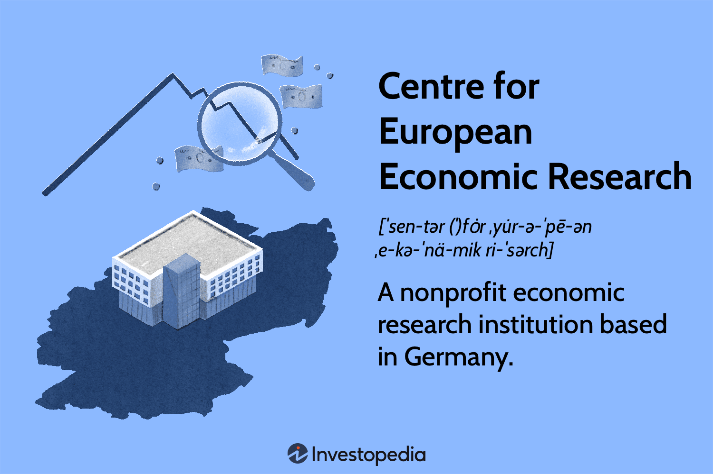

In today's fast-paced financial world, understanding economic research and its interaction with algorithmic trading is crucial for investors, analysts, and policymakers. As financial markets grow more intricate, the need for timely and insightful economic analysis becomes increasingly important. This is where institutions like the ZEW (Centre for European Economic Research) play an essential role, providing valuable insights into economic trends and sentiments within Europe.

Founded in Mannheim, Germany, the ZEW stands out as a leading research institute dedicated to analyzing European economies. Through its comprehensive studies, the ZEW aids in decoding economic indicators and sentiment, which are vital for well-informed investment and policy decisions. The institute's research spans various economic topics, providing a basis for understanding shifts in market conditions and aiding stakeholders in navigating economic uncertainties.

A significant aspect of the financial market's evolution is the rise of algorithmic trading, which involves the use of computer programs to execute trades at high speeds and volumes, based on predetermined criteria. While algorithmic trading offers benefits such as improved execution speeds and reduced costs, it also poses challenges, including potential market instability. Recognizing the implications of this trading method, the ZEW contributes to the discussion by providing empirical data and expert analysis, enabling stakeholders to make more informed decisions regarding the regulation and management of market activities.

This article explores the critical role of ZEW in economic research and examines how algorithmic trading impacts financial markets. Through a detailed review of the ZEW's endeavors and the broader financial trading landscape, this article aims to shed light on how economic research informs trading strategies and policy formulations, ensuring that market participants are well-equipped to tackle the challenges of modern financial systems.

## Table of Contents

## Understanding the Centre for European Economic Research (ZEW)

The Centre for European Economic Research (ZEW), established in 1990, is a prominent economic research institute dedicated to analyzing European economies. Located in Mannheim, Germany, ZEW plays a crucial role in shaping economic policy and provides profound insights through its research activities. The institute is renowned for producing the ZEW Indicator of Economic Sentiment, a significant forecasting tool utilized by financial and economic analysts to gauge economic trajectories in Germany and beyond.

ZEW's funding structure comprises governmental support along with external project-based financing. This diversified financial backing allows the institute to maintain a broad scope of research initiatives without being restricted by single-source financing constraints. The diverse funding also facilitates comprehensive and objective analyses.

The multidisciplinary approach embraced by ZEW integrates various fields of expertise, welcoming economists, engineers, IT specialists, and other professionals. This varied team allows ZEW to address complex economic issues from multiple perspectives and devise holistic solutions applicable to real-world scenarios. This inclusive approach ensures that research conducted at ZEW is both innovative and practical, equipped to inform policy and economic decision-making effectively.

Among the wide spectrum of economic topics addressed by ZEW, the ZEW Indicator of Economic Sentiment remains a cornerstone of the institute's research output. This indicator is particularly influential due to its ability to encapsulate expert assessments concerning economic developments and sentiment. It serves as a predictive measure that stakeholders, including investors and policymakers, rely upon for strategic planning and decision-making.

Furthermore, the collaborative environment at ZEW fosters partnerships with national and international research entities, augmenting its impact on European economic research and policy formulation. This cooperative network extends the reach of ZEW's research findings and ensures a far-reaching influence on economics, both within Europe and on a global scale.

## The ZEW Economic Sentiment Indicator

The ZEW Economic Sentiment Indicator serves as a barometer for financial market experts' expectations regarding future economic conditions in Germany, as well as in other major global economies. Introduced by the Centre for European Economic Research (ZEW), this indicator is instrumental for policymakers, investors, and financial analysts in shaping strategic economic decisions. It synthesizes expert opinions to provide a forward-looking measure of economic confidence, taking the pulse of what is anticipated by those engaged directly with financial markets.

This sentiment indicator is generated from a survey conducted monthly, involving a panel of knowledgeable experts from banks, insurance companies, and selected corporations. Participants are asked to provide their expectations on economic developments over the next six months, resulting in a systematic aggregation of forecasts. The specific focus on sentiment rather than rigid economic data allows for capturing the qualitative aspects of market outlook, which are often missed by traditional economic indicators.

The computation of the ZEW Economic Sentiment Indicator involves calculating the difference between the share of experts predicting an improvement in economic conditions and those forecasting a deterioration. Mathematically, this can be expressed as:

$$
\text{ZEW Economic Sentiment Indicator} = (\% \text{Improvers} - \% \text{Decliners})
$$

This formulation yields a single index value reflecting investor optimism or pessimism. A positive value indicates a prevailing optimistic outlook, while a negative value signals a majority pessimistic expectation among surveyed experts.

In practice, the ZEW Indicator is valued for its forward-looking nature. It has shown efficacy in anticipating turning points in economic activity, providing an edge for investment decision-making and economic strategy planning. By reflecting shifting sentiments, the indicator plays a crucial role in gauging economic trajectories and guiding actions in financial markets. Given its monthly publication, the indicator offers timely insights, allowing stakeholders to adapt swiftly to emerging trends and potential shifts in the economic landscape.

## Algorithmic Trading and Its Impact on Financial Markets

Algorithmic trading, also known as algo trading, integrates sophisticated computer algorithms to automatically execute orders in the financial markets. These algorithms operate on predefined criteria, such as timing, price, or quantity, enabling traders to make rapid decisions without manual intervention. This technological approach has revolutionized trading by increasing efficiency, reducing transaction costs, and optimizing accuracy in trade executions. Its high-speed capability allows traders to exploit small market anomalies that may exist for only fractions of a second, thereby capturing profits that would be impossible with traditional trading methods.

Despite these advantages, [algorithmic trading](/wiki/algorithmic-trading) carries inherent risks that can affect market stability. A significant concern is the potential for market instability due to the homogeneous nature of many trading algorithms. When these algorithms operate based on similar signals or trends, they can trigger substantial and simultaneous buy or sell orders, which may lead to sudden and extreme market movements. This occurrence was notably illustrated during the "Flash Crash" of May 6, 2010, when the U.S. stock market suffered a dramatic drop in a mere 36 minutes.

A survey conducted by the Centre for European Economic Research (ZEW) highlighted apprehensions among financial experts regarding the potential negative impacts of algorithmic trading on market stability. According to the survey, experts expressed concern that the amplification of rapid transactions by algorithmic systems could lead to increased [volatility](/wiki/volatility-trading-strategies) in the markets. The propensity for synchronized trading actions at overwhelming speeds creates a risk profile where small errors in algorithm logic or external economic shocks could prompt large-scale undesired consequences in financial markets.

Moreover, algorithmic trading's dominance in the market raises questions about equity and fairness, as these systems potentially favor firms with substantial technological resources over traditional traders. Consequently, there are ongoing debates and calls for stringent regulatory frameworks to manage the risks associated with algorithmic trading activities. The focus is on implementing measures that preserve competitive fairness and ensure the integrity and robustness of financial markets globally.

## Research and Perspectives on Algo Trading by ZEW

ZEW researchers have persistently emphasized the necessity for stringent regulations to counteract the risks associated with algorithmic trading. Algorithmic trading, while beneficial for its speed and efficiency in executing trades, also poses significant challenges. These include the amplification of market volatility and the potential for systemic risks, as similar trading algorithms act simultaneously based on uniform market signals.

One potential solution proposed by ZEW researchers involves the more rigorous regulation of trading suspensions. Trading halts, or circuit breakers, are mechanisms used to temporarily halt trading on an exchange to curb panic-selling. Enhanced regulation could ensure these halts are responsive and effective, thereby preventing cascading effects in volatile market conditions.

Another area of focus is imposing greater controls over algorithmic strategies. This can include the imposition of 'stress tests' for algorithmic trading systems, akin to those used in the banking sector, to assess how these algorithms perform under high volatility conditions. By doing so, regulators could limit the use of overly aggressive or risky trading strategies that may destabilize the market.

ZEW's ongoing research consistently assesses the broader impact of algorithmic trading, aiming to balance innovation with stability. The institute advocates for policies that incorporate comprehensive assessments of algorithmic impacts, reflecting on the dual role of fostering technological advancement while ensuring financial market stability. This might entail international cooperation for a cohesive regulatory framework and continuous monitoring of the trading algorithms' outputs and effects.

Through this meticulous research and recommendation of precise regulatory measures, ZEW plays a pivotal role in shaping policies that aim to safeguard market integrity while accommodating the technological advancements offered by algorithmic trading.

## The Role of ZEW in European Economic Policy and Decision Making

The ZEW (Centre for European Economic Research) plays a vital role in shaping European economic policy and decision-making. As a prominent institution in economic research, ZEW provides critical insights that assist in the formulation of policies affecting various facets of the economy. 

One of the key areas where ZEW contributes is through its studies on labor markets. The research conducted offers in-depth analyses of employment trends, wage dynamics, and labor mobility, which are essential for policymakers aiming to enhance employment rates and improve working conditions. By informing decisions with robust data and projections, ZEW supports the development of policies that foster job creation and economic growth.

In taxation, ZEW’s work provides a comprehensive understanding of tax policies and their implications on both domestic and international scales. Its research evaluates the efficiency and equity of tax systems, helping to design reforms that optimize revenue without stifling economic activity. Such studies are crucial for balancing the fiscal budget and ensuring sustainable economic development.

ZEW also addresses the digital economy, which is increasingly becoming a cornerstone of modern economic structures. By analyzing the impact of digital innovation on productivity, market competition, and regulatory frameworks, ZEW supports the creation of policies that encourage technological advancement while safeguarding consumer interests and market fairness.

Climate policies are another significant focus, with ZEW researching the economic effects of environmental regulations and sustainable practices. These studies are vital for crafting policies aimed at reducing carbon emissions and promoting renewable energy, thus contributing to global environmental goals while considering economic viability.

Beyond Germany, ZEW’s research influences economic strategies across the European Union. Its analyses and recommendations often inform EU-wide policies, providing a unified approach to tackling economic challenges faced by member states. This transnational impact underscores the center’s importance as a resource for evidence-based policy development, supporting initiatives that aim to strengthen the economic union and enhance integration among EU countries.

Overall, ZEW's research plays a pivotal role in supporting governmental and institutional decision-making throughout Europe, contributing to a nuanced understanding of economic dynamics and influencing policies that shape the future of the European economic landscape.

## Conclusion

The evolution of modern financial markets is marked by the intersection of economic research and algorithmic trading, both of which add layers of complexity and opportunity for those navigating these sectors. At the core of understanding this intersection lies the work of the Centre for European Economic Research (ZEW), which offers critical insights into prevailing economic trends and sentiments. This intelligence is invaluable for investors, analysts, and policymakers working within the European context and beyond.

ZEW's comprehensive research underpins its capacity to influence market participants' understanding of economic conditions, which is particularly vital in financial markets characterized by rapid technological advancements and burgeoning data sets. The role of ZEW becomes increasingly significant as algorithmic trading — the use of computer algorithms to execute trades based on a set of rules or criteria — continues to gain prevalence. This method of trading is capable of processing large volumes of transactions in a fraction of the time taken by humans, emphasizing the importance of rigorous market analysis and sentiment indicators that ZEW provides.

Algorithmic trading, while advantageous in terms of speed and efficiency, carries inherent risks such as exacerbated market volatility and systemic fragility. These can manifest when similar algorithms simultaneously trigger large sell-offs or buy-ins, possibly leading to market disturbances. Understanding and effectively regulating algorithmic trading is crucial for ensuring the stability of financial markets. Drawing on the insights from ZEW's extensive research, which includes expert opinions on the implications of these trading systems, helps create frameworks to safeguard market integrity.

In conclusion, ZEW's contributions extend beyond just providing economic forecasts; they are instrumental in forging strategies that anticipate and mitigate potential risks associated with advancements in trading technologies. By focusing on regulation informed by thorough and ongoing research, economic stability can be fostered amidst the complexities of modern markets. This balance of foresight and intervention is essential for maintaining the robustness and fluidity of financial ecosystems globally.

## References & Further Reading

[1]: Friedrich Heinemann, Tilman Brück, and Michael Bräuninger (2007). ["The ZEW Indicator of Economic Sentiment and its Potential Use in Financial Market Analysis."](https://www.sciencedirect.com/science/article/pii/S0176268007000326) Economic Modelling, 24(3), 337-352.

[2]: Chaboud, Alain P., et al. (2009). ["Rise of the Machines: Algorithmic Trading in the Foreign Exchange Market."](https://www.federalreserve.gov/pubs/ifdp/2009/980/ifdp980.pdf) International Finance Discussion Papers.

[3]: Cartea, Álvaro, and Sebastian Jaimungal (2016). ["Algorithmic and High-Frequency Trading."](https://assets.cambridge.org/97811070/91146/frontmatter/9781107091146_frontmatter.pdf) Cambridge University Press.

[4]: ZEW - Leibniz Centre for European Economic Research. ["ZEW Economic Sentiment Indicator."](https://www.mql5.com/en/economic-calendar/germany/zew-economic-sentiment-indicator)

[5]: Easley, David, Marcos M. López de Prado, and Maureen O'Hara (2011). ["The Microstructure of the 'Flash Crash': Flow Toxicity, Liquidity Crashes, and the Probability of Informed Trading."](https://papers.ssrn.com/sol3/papers.cfm?abstract_id=1695041) The Journal of Portfolio Management.