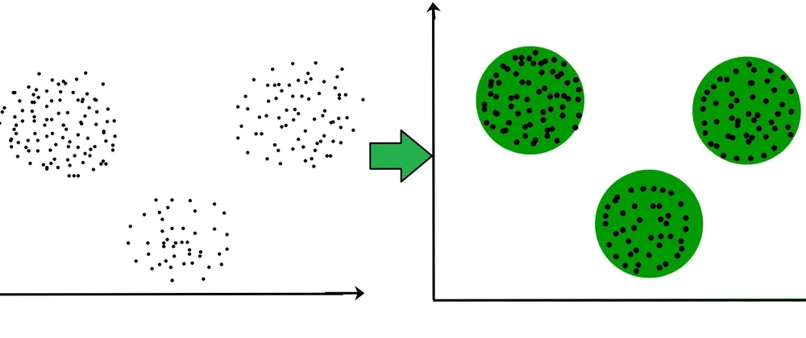

## Table of Contents

## What is centroid-based clustering in machine learning?

Centroid-based clustering is a type of unsupervised machine learning where data points are grouped into clusters based on their distance to the center of the cluster, known as the centroid. The main idea is to find a central point for each group, and then assign each data point to the group whose centroid is closest to it. This method is commonly used in algorithms like K-means clustering, where the number of clusters, K, is specified beforehand, and the goal is to minimize the distance between the points and the centroid of their assigned cluster.

In K-means clustering, the process starts by randomly choosing K initial centroids. Then, each data point is assigned to the nearest centroid, and the centroid's position is recalculated as the mean of all points assigned to it. This process of assignment and recalculation is repeated until the centroids no longer move significantly, indicating that the clusters have stabilized. The formula for updating the centroid in K-means can be expressed as $$ \text{new centroid} = \frac{1}{n} \sum_{i=1}^{n} x_i $$ where $n$ is the number of points in the cluster and $x_i$ are the points assigned to that cluster. This method is effective for finding spherical clusters in data but may struggle with clusters of different shapes or sizes.

## How does centroid-based clustering differ from other clustering methods?

Centroid-based clustering, like K-means, works by finding the center of clusters and grouping points based on their distance to these centers. It's different from other methods because it focuses on making the distance between points and their cluster's center as small as possible. This method needs you to decide how many clusters you want before you start, and it works well when the clusters are round and spread out evenly. But, it might not be the best choice if your data has clusters that are stretched out or mixed together in complex ways.

Other clustering methods, like hierarchical clustering, don't need you to pick the number of clusters ahead of time. Instead, hierarchical clustering builds a tree of clusters by either combining smaller clusters into bigger ones (bottom-up) or splitting bigger clusters into smaller ones (top-down). This method can show you how your data is grouped at different levels, which can be useful if you're not sure how many clusters you should have. Another method, density-based clustering like DBSCAN, groups points together based on how close they are to each other, not to a center point. It's good at finding clusters of any shape and can even find points that don't belong to any cluster, which centroid-based methods can't do easily.

In summary, centroid-based clustering is great for simple, well-separated clusters but might struggle with more complex data structures. Other methods like hierarchical and density-based clustering offer different approaches that can handle a wider variety of data shapes and don't always require you to specify the number of clusters in advance.

## What are the common algorithms used in centroid-based clustering?

The most common algorithm used in centroid-based clustering is K-means. In K-means, you start by choosing a number of clusters, K, and then you randomly pick K points as the starting centroids. After that, each data point is assigned to the nearest centroid, and the centroid is recalculated as the average of all the points assigned to it. This process keeps going until the centroids don't move much anymore, which means the clusters have settled. The formula for updating the centroid in K-means is $$ \text{new centroid} = \frac{1}{n} \sum_{i=1}^{n} x_i $$ where $n$ is the number of points in the cluster and $x_i$ are the points assigned to that cluster.

Another popular algorithm is K-medoids, which is similar to K-means but uses actual data points as the center of the clusters instead of the mean. In K-medoids, you pick K points to be the initial medoids, and then you swap these medoids with non-medoid points to see if it reduces the total distance within the clusters. This method can be more robust to outliers because it uses real data points instead of averages. Both K-means and K-medoids are great for finding clusters when the data is spread out evenly, but they might not work as well if the clusters are not round or if they overlap a lot.

There's also a variation called K-means++ which improves on the standard K-means by choosing the initial centroids in a smarter way. Instead of [picking](/wiki/asset-class-picking) them randomly, K-means++ selects the first centroid randomly and then picks the next centroids based on their distance from the already chosen ones. This helps to spread out the initial centroids better, which can lead to faster convergence and better clustering results. The process in K-means++ for choosing the next centroid can be described as picking a point with probability proportional to $$ D(x)^2 $$, where $D(x)$ is the distance from point $x$ to the nearest centroid already chosen.

## Can you explain the K-means clustering algorithm?

K-means clustering is a way to group data points into clusters based on how close they are to the center of each cluster, called the centroid. To start, you pick a number of clusters, K, and then randomly choose K points as the initial centroids. After that, every data point is assigned to the nearest centroid. Once all points are assigned, the centroid of each cluster is recalculated as the average of all the points in that cluster. This process of assigning points and recalculating centroids is repeated until the centroids don't move much anymore, which means the clusters have settled. The formula for updating the centroid is $$ \text{new centroid} = \frac{1}{n} \sum_{i=1}^{n} x_i $$ where $n$ is the number of points in the cluster and $x_i$ are the points assigned to that cluster.

K-means is great for finding round clusters in data, but it might not work well if the clusters are not round or if they overlap a lot. It's also sensitive to the initial choice of centroids, which can lead to different results if you run it multiple times. To help with this, there's a variation called K-means++, which picks the initial centroids in a smarter way. Instead of choosing them randomly, K-means++ selects the first centroid randomly and then picks the next centroids based on their distance from the already chosen ones. This helps to spread out the initial centroids better, which can lead to faster convergence and better clustering results. The process in K-means++ for choosing the next centroid can be described as picking a point with probability proportional to $$ D(x)^2 $$, where $D(x)$ is the distance from point $x$ to the nearest centroid already chosen.

## How do you determine the optimal number of clusters in K-means?

To find the best number of clusters for K-means, you can use the elbow method. This method involves running K-means with different numbers of clusters, from a small number to a larger one. For each number of clusters, you calculate the total within-cluster sum of squares (WCSS), which measures how spread out the points are within each cluster. You then plot these WCSS values against the number of clusters. The point where the WCSS starts to decrease more slowly, forming an "elbow" in the plot, is often considered the optimal number of clusters. This is because adding more clusters beyond this point doesn't reduce the WCSS much, suggesting that the extra clusters aren't adding much value. The formula for WCSS is $$ \text{WCSS} = \sum_{i=1}^{k} \sum_{x \in C_i} \|x - \mu_i\|^2 $$ where $k$ is the number of clusters, $C_i$ is the $i$-th cluster, $x$ is a point in the cluster, and $\mu_i$ is the centroid of the $i$-th cluster.

Another method to determine the optimal number of clusters is the silhouette score. The silhouette score measures how similar an object is to its own cluster compared to other clusters. It ranges from -1 to 1, where a high value indicates that the object is well matched to its own cluster and poorly matched to neighboring clusters. To use this method, you run K-means with different numbers of clusters and calculate the average silhouette score for each. The number of clusters that gives the highest average silhouette score is considered the best. This method can be especially useful when the elbow method doesn't give a clear answer. The silhouette score for a single point $i$ is calculated as $$ s(i) = \frac{b(i) - a(i)}{\max(a(i), b(i))} $$ where $a(i)$ is the average distance from $i$ to the other points in the same cluster, and $b(i)$ is the average distance from $i$ to the points in the nearest neighboring cluster.

## What is the role of the centroid in centroid-based clustering?

In centroid-based clustering, the centroid is like the center point of each cluster. It helps group data points together by finding the middle of the group and then assigning each point to the cluster whose centroid is closest to it. The centroid is important because it shows where the heart of the cluster is, and it's used to measure how spread out the points in the cluster are. For example, in K-means clustering, the centroid is recalculated as the average of all the points in the cluster. The formula for updating the centroid is $$ \text{new centroid} = \frac{1}{n} \sum_{i=1}^{n} x_i $$ where $n$ is the number of points in the cluster and $x_i$ are the points assigned to that cluster.

The centroid also plays a key role in deciding how well the clusters are formed. If the points in a cluster are very close to the centroid, it means the cluster is tight and the points are similar to each other. On the other hand, if the points are far from the centroid, the cluster might be too spread out or not well-defined. This is why the centroid is used in methods like the within-cluster sum of squares (WCSS) to see how good the clustering is. By looking at how the WCSS changes with different numbers of clusters, you can find the best number of clusters for your data.

## How does the K-means algorithm initialize centroids?

In the K-means algorithm, the initial centroids are chosen randomly from the data points. This means you pick K points from your dataset to start with, where K is the number of clusters you want. The choice of these starting points can affect how the clusters turn out, so different runs of K-means might give you different results. To make the initial choice better, a method called K-means++ is often used. K-means++ picks the first centroid randomly, but then it chooses the next centroids based on how far they are from the ones already picked. This helps spread out the starting centroids, which can lead to better and faster clustering.

In K-means++, after choosing the first centroid randomly, the next centroid is picked with a probability that's proportional to the square of the distance from the point to the nearest centroid already chosen. This means points that are farther away from the current centroids have a higher chance of being picked next. The formula for this probability is $$ P(x) = \frac{D(x)^2}{\sum_{y \in S} D(y)^2} $$ where $D(x)$ is the distance from point $x$ to the nearest centroid, and $S$ is the set of all points not yet chosen as centroids. By using this method, K-means++ tries to make sure the initial centroids are well spread out, which can help the algorithm find better clusters more quickly.

## What are the challenges faced in centroid-based clustering?

One of the main challenges with centroid-based clustering, like K-means, is that you need to pick the number of clusters, K, before you start. If you pick the wrong number, your clusters might not make sense. Another problem is that K-means works best with round clusters. If your data has clusters that are stretched out or have weird shapes, K-means might not find them well. Also, K-means can be sensitive to where you start the centroids. If you start them in a bad spot, you might end up with different clusters each time you run the algorithm. To help with this, people use a method called K-means++, which picks the starting centroids in a smarter way to try and get better results.

Another challenge is that centroid-based clustering can be affected a lot by outliers. Outliers are points that are way different from the rest of the data. They can pull the centroid away from where it should be, making the clusters worse. Also, calculating the distance between points and centroids can be hard if your data has different types of information, like numbers and categories. You might need to change how you measure distance to make it work right. Finally, centroid-based clustering can take a long time to run if you have a lot of data or if you're trying a lot of different numbers of clusters to find the best one.

## How can you handle outliers in centroid-based clustering?

Outliers can mess up centroid-based clustering like K-means because they can pull the centroid away from where it should be. This makes the clusters not as good as they could be. One way to deal with outliers is to use a different type of centroid-based clustering called K-medoids. Instead of using the average of the points like K-means does, K-medoids uses real points from the data as the center of the clusters. This can make the clustering less sensitive to outliers because the center of the cluster can't be pulled too far away by just one weird point.

Another way to handle outliers is to clean up your data before you start clustering. You can look for points that are really far away from the rest and take them out or fix them. There are also special methods like DBSCAN that can find outliers on their own. DBSCAN groups points together based on how close they are to each other, and it can label points that don't fit into any group as outliers. This can help you see which points might be causing problems in your K-means clustering.

## What is the impact of scaling on centroid-based clustering?

Scaling is really important for centroid-based clustering like K-means. If your data has different types of numbers, like some that are really big and some that are really small, it can mess up the clustering. For example, if you're looking at people's ages and their income, the income numbers might be much bigger than the age numbers. This can make the clustering focus too much on income and not enough on age. To fix this, you can use scaling to make all the numbers the same size. One common way to do this is to use something called normalization, which changes the numbers so they're between 0 and 1. The formula for normalization is $$ x_{\text{normalized}} = \frac{x - x_{\text{min}}}{x_{\text{max}} - x_{\text{min}}} $$ where $x$ is the original number, $x_{\text{min}}$ is the smallest number in the dataset, and $x_{\text{max}}$ is the biggest number. By doing this, you make sure that all the features are treated equally when you're clustering.

Another way to scale data is to use standardization, which changes the numbers so they have a mean of 0 and a standard deviation of 1. The formula for standardization is $$ x_{\text{standardized}} = \frac{x - \mu}{\sigma} $$ where $x$ is the original number, $\mu$ is the mean of the dataset, and $\sigma$ is the standard deviation. Standardization can be helpful if your data follows a normal distribution. Both normalization and standardization help make sure that the distances between points are calculated fairly, which can lead to better clusters. Without scaling, the clustering might not work well because the algorithm could be tricked by the different sizes of the numbers.

## How does the K-means++ algorithm improve upon standard K-means?

The K-means++ algorithm improves upon the standard K-means by choosing the starting points, or centroids, in a smarter way. In regular K-means, the centroids are picked randomly from the data points. This can lead to bad clusters if the starting points are not spread out well. K-means++ fixes this by picking the first centroid randomly, but then it chooses the next centroids based on how far they are from the ones already picked. This helps spread out the starting centroids, which can make the clustering faster and better. The formula for picking the next centroid in K-means++ is $$ P(x) = \frac{D(x)^2}{\sum_{y \in S} D(y)^2} $$, where $D(x)$ is the distance from point $x$ to the nearest centroid already chosen, and $S$ is the set of all points not yet chosen as centroids.

By using K-means++, you're more likely to get good clusters even if you run the algorithm multiple times. This is because the initial centroids are chosen to be far apart from each other, which helps the algorithm avoid getting stuck in bad spots. K-means++ can also make the clustering process faster because it starts with a better setup, meaning fewer steps are needed to find the best clusters. Overall, K-means++ makes K-means more reliable and efficient, which is why it's often used instead of the standard K-means.

## What advanced techniques can be used to enhance the performance of centroid-based clustering?

One advanced technique to enhance the performance of centroid-based clustering is using a method called Mini-Batch K-means. This technique is a faster version of K-means that works well with big datasets. Instead of using all the data points at once, Mini-Batch K-means looks at smaller groups of points, called mini-batches, and updates the centroids based on these groups. This makes the clustering process quicker and can still give good results. The formula for updating centroids in Mini-Batch K-means is similar to regular K-means, but it uses a smaller set of points: $$ \text{new centroid} = \frac{1}{n} \sum_{i=1}^{n} x_i $$ where $n$ is the number of points in the mini-batch and $x_i$ are the points in that batch.

Another technique is to use hierarchical K-means, which combines the ideas of K-means and hierarchical clustering. Hierarchical K-means starts by dividing the data into a large number of small clusters using K-means. Then, it merges these small clusters into bigger ones, creating a tree-like structure of clusters. This method can help find the best number of clusters automatically and can handle data with different shapes better than regular K-means. By using this approach, you can get a more detailed view of how your data is grouped at different levels.

## References & Further Reading

[1]: Hartigan, J. A., & Wong, M. A. (1979). ["Algorithm AS 136: A K-Means Clustering Algorithm."](https://www.stat.cmu.edu/~rnugent/PCMI2016/papers/HartiganKMeans.pdf) Journal of the Royal Statistical Society. Series C (Applied Statistics), 28(1), 100-108.

[2]: Lloyd, S. P. (1982). ["Least squares quantization in PCM."](https://ieeexplore.ieee.org/document/1056489) IEEE Transactions on Information Theory, 28(2), 129-137.

[3]: MacQueen, J. (1967). ["Some Methods for Classification and Analysis of Multivariate Observations."](https://projecteuclid.org/ebooks/berkeley-symposium-on-mathematical-statistics-and-probability/Some-methods-for-classification-and-analysis-of-multivariate-observations/chapter/Some-methods-for-classification-and-analysis-of-multivariate-observations/bsmsp/1200512992) Proceedings of the Fifth Berkeley Symposium on Mathematical Statistics and Probability, Volume 1: Statistics, 281-297, University of California Press.

[4]: Arthur, D., & Vassilvitskii, S. (2007). ["k-means++: The advantages of careful seeding."](https://theory.stanford.edu/~sergei/papers/kMeansPP-soda.pdf) Proceedings of the Eighteenth Annual ACM-SIAM Symposium on Discrete Algorithms, 1027–1035.

[5]: Han, J., & Kamber, M. (2011). ["Data Mining: Concepts and Techniques."](https://www.sciencedirect.com/book/9780123814791/data-mining-concepts-and-techniques) Elsevier.

[6]: Ester, M., Kriegel, H. P., Sander, J., & Xu, X. (1996). ["A density-based algorithm for discovering clusters in large spatial databases with noise."](https://dl.acm.org/doi/10.5555/3001460.3001507) Proceedings of the Second International Conference on Knowledge Discovery and Data Mining, 226-231.

[7]: Jain, A. K. (2010). ["Data clustering: 50 years beyond K-means."](https://www.sciencedirect.com/science/article/pii/S0167865509002323) Pattern Recognition Letters, 31(8), 651-666.

[8]: Xu, R., & Wunsch II, D. (2005). ["Survey of clustering algorithms."](https://ieeexplore.ieee.org/document/1427769) IEEE Transactions on Neural Networks, 16(3), 645-678.