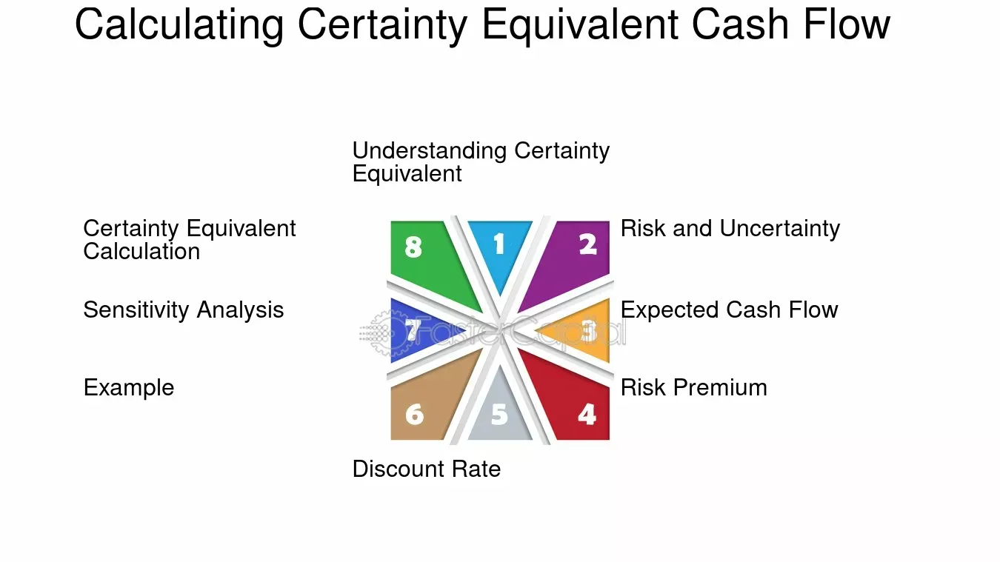

## Table of Contents

## What is the basic definition of certainty equivalent?

Certainty equivalent is a simple way to understand how much money someone would be willing to accept instead of taking a risk. Imagine you have a chance to win a big prize, but it's not guaranteed. The certainty equivalent is the smaller, sure amount of money that you would be just as happy to receive instead of taking that chance.

For example, if you could enter a contest to win $100, but you're only going to win half the time, you might decide that you'd be just as happy with a guaranteed $40. That $40 is your certainty equivalent because it's the amount that makes you feel the same as taking the risk. It helps people and businesses make decisions by comparing risky choices to safer ones.

## How does the concept of certainty equivalent apply to decision making under uncertainty?

When making decisions under uncertainty, the concept of certainty equivalent helps people figure out what they really want. Imagine you have to choose between a sure thing and a gamble. The certainty equivalent is the amount of money you'd take for sure, instead of taking the gamble. It's like saying, "I'd rather have this smaller, safe amount than take my chances with the bigger, risky one." By figuring out your certainty equivalent, you can compare different choices more easily and decide which one feels better to you.

For example, if you're thinking about investing in a new business that might make you a lot of money but could also fail, you can use the certainty equivalent to help you decide. You might ask yourself, "What's the smallest amount of money I'd be happy with, instead of taking this risk?" If the certainty equivalent is higher than what you might realistically get from the business, then maybe the safe choice is better. This way, the certainty equivalent helps you weigh the pros and cons of risky decisions by turning them into something easier to understand and compare.

## Can you explain the relationship between certainty equivalent and risk aversion?

The relationship between certainty equivalent and risk aversion is all about how much someone dislikes taking risks. Risk aversion means a person would rather have a sure thing than take a chance, even if the chance could lead to a bigger reward. The certainty equivalent is the amount of money that makes a person feel just as good as taking that chance. So, if someone is very risk-averse, their certainty equivalent for a risky choice will be pretty high. They'd want a big, safe amount of money to feel okay about not taking the risk.

For example, imagine you could win $100 from a game, but you only win half the time. If you're very risk-averse, you might say, "I'd rather have $40 for sure than take my chances." That $40 is your certainty equivalent. Someone who is less risk-averse might be okay with a lower certainty equivalent, like $30, because they don't mind the risk as much. By looking at someone's certainty equivalent, you can tell how much they dislike taking risks. The higher their certainty equivalent, the more risk-averse they are.

## What is the formula used to calculate the certainty equivalent?

The formula to calculate the certainty equivalent depends on a person's risk preferences and the expected value of the risky option. If you know the expected value of the risky option and the person's risk aversion, you can find the certainty equivalent. The expected value is the average amount you'd get if you did the risky thing many times. Risk aversion is how much someone dislikes risk. To find the certainty equivalent, you need a utility function that shows how much happiness or satisfaction a person gets from different amounts of money. The certainty equivalent is the amount of money that gives the same level of happiness as the expected value of the risky option.

For example, if the expected value of a risky investment is $100 and you know the person's utility function, you can use that to find the certainty equivalent. If the person's utility function shows they get the same level of happiness from a sure $70 as they would from the expected $100, then $70 is their certainty equivalent. It's the amount of money that makes them just as happy as taking the risk. By using the utility function and the expected value, you can figure out what amount of money would make someone feel the same as if they took the risk.

## How do you determine the certainty equivalent for a given set of outcomes and probabilities?

To find the certainty equivalent for a set of outcomes and their probabilities, you first need to figure out the expected value of those outcomes. The expected value is like the average amount you would get if you did the risky thing many times. You find it by multiplying each possible outcome by its chance of happening and then adding all those numbers together. For example, if you could win $100 with a 50% chance or get nothing with a 50% chance, the expected value would be (0.5 * $100) + (0.5 * $0) = $50.

Once you have the expected value, you need to know how much someone likes or dislikes taking risks. This is called their risk aversion, and it's shown by something called a utility function. A utility function is a way to measure how happy or satisfied someone is with different amounts of money. To find the certainty equivalent, you look for the amount of money that gives the same level of happiness as the expected value. If the expected value is $50 and the person's utility function shows they get the same happiness from a sure $30 as they would from the expected $50, then $30 is their certainty equivalent. It's the amount of money that makes them feel just as good as taking the risk.

## What are some common examples of using certainty equivalent in personal finance?

When people make decisions about their money, they often think about how much risk they want to take. For example, imagine you are thinking about investing in a stock that could go up or down. You might ask yourself, "What's the smallest amount of money I'd be happy to get for sure, instead of taking the chance on this stock?" If the stock has a 50% chance of doubling your money and a 50% chance of losing it all, the expected value of the investment is breaking even. But if you're someone who doesn't like to take risks, you might decide that you'd rather have a guaranteed $50 than take the chance on the stock. That $50 is your certainty equivalent, the amount that makes you feel just as good as the risky investment.

Another common example is deciding whether to buy insurance. Let's say you're thinking about getting car insurance that covers a big repair if you get into an accident. The insurance costs $500 a year, but it will pay for a $5,000 repair if you need it. You might ask, "What's the smallest amount of money I'd be happy to get for sure, instead of paying for the insurance and hoping I never need it?" If you're very worried about the cost of a big repair, you might decide that you'd rather pay the $500 for sure than risk having to pay $5,000. That $500 is your certainty equivalent for the peace of mind the insurance gives you. By figuring out your certainty equivalent, you can make better choices about whether to take a risk or play it safe with your money.

## How does the certainty equivalent differ from expected value, and when is it more appropriate to use one over the other?

The certainty equivalent and expected value are both ways to help people make choices, but they look at things a bit differently. The expected value is like the average amount you would get if you did something risky many times. It's found by multiplying each possible outcome by its chance of happening and then adding them up. For example, if you have a 50% chance to win $100 and a 50% chance to win nothing, the expected value is $50. The certainty equivalent, on the other hand, is the amount of money you'd be happy to get for sure, instead of taking the risk. It's based on how much you like or dislike taking risks, and it's the amount that makes you feel just as good as the expected value.

When deciding whether to use the expected value or the certainty equivalent, it depends on how much you care about risk. If you're making a decision where risk doesn't matter much to you, like choosing between two sure things, the expected value might be all you need. But if you're choosing between a sure thing and a risky thing, the certainty equivalent is more helpful. It takes into account how much you dislike risk, which the expected value doesn't. For example, if you're thinking about buying insurance, you might want to know the certainty equivalent because it shows the amount of money that makes you feel just as good as the peace of mind the insurance gives you. So, the certainty equivalent is better when you want to understand how risk affects your choices.

## What role does utility theory play in the calculation of certainty equivalents?

Utility theory helps us figure out how happy or satisfied someone is with different amounts of money. When we want to find the certainty equivalent, we need to know a person's utility function, which shows how much happiness they get from different outcomes. If someone is deciding between a risky choice and a sure thing, the certainty equivalent is the amount of money that gives them the same level of happiness as the expected value of the risky choice. So, utility theory is really important because it tells us how to measure and compare happiness.

For example, if you could win $100 with a 50% chance or nothing with a 50% chance, the expected value is $50. But to find the certainty equivalent, we need to know how happy you would be with $50 compared to other amounts. If your utility function shows that you'd be just as happy with a sure $30 as you would be with the expected $50, then $30 is your certainty equivalent. By using utility theory, we can see how much someone values safety over risk, which helps them make better choices.

## How can certainty equivalents be applied in business investment decisions?

When businesses make investment decisions, they often have to choose between taking a risk and playing it safe. The certainty equivalent helps them figure out what they really want. Imagine a company is thinking about investing in a new project that could make them a lot of money but also might fail. They can use the certainty equivalent to decide if the risk is worth it. They ask themselves, "What's the smallest amount of money we'd be happy with, instead of taking this risk?" If the certainty equivalent is higher than what they might realistically get from the project, then maybe the safe choice is better. This way, the certainty equivalent helps businesses weigh the pros and cons of risky investments by turning them into something easier to understand and compare.

For example, a company might be considering expanding into a new market. There's a chance they could double their profits, but there's also a chance they could lose money. The expected value of the expansion might be a 50% increase in profits. But if the company is very risk-averse, they might decide that they'd rather have a guaranteed 20% increase in profits than take the risk. That 20% increase is their certainty equivalent. By figuring out their certainty equivalent, the company can make a better decision about whether to go ahead with the expansion or stick with a safer option.

## What are the limitations and potential biases when using certainty equivalents in decision making?

When using certainty equivalents in decision making, there are some limitations and potential biases to keep in mind. One big limitation is that finding the certainty equivalent depends a lot on knowing someone's utility function, which shows how happy they are with different amounts of money. But figuring out a person's utility function can be hard because people's feelings about risk can change over time or be different in different situations. Also, the certainty equivalent assumes that people make choices based on how much they like or dislike risk, but sometimes people make decisions based on other things, like how much they trust the information they have or how they feel about the decision.

Another issue is that people can be biased when they think about risks. For example, they might be overconfident and think a risky choice is safer than it really is, which could make their certainty equivalent too low. Or they might be too scared of risk and choose a certainty equivalent that's too high, missing out on good opportunities. Also, people often find it hard to think about small chances of big outcomes, so they might not figure out their certainty equivalent correctly. These biases can lead to bad decisions, so it's important to be aware of them and try to think carefully about the risks and rewards.

## How do advanced statistical models incorporate certainty equivalents in risk assessment?

Advanced statistical models use certainty equivalents to help figure out how much risk people are willing to take. These models look at the expected value of different choices, which is the average amount you'd get if you did something many times. But they also use a person's utility function, which shows how happy they are with different amounts of money. By combining the expected value with the utility function, the models can find the certainty equivalent, which is the amount of money someone would be happy to get for sure, instead of taking a risk. This helps businesses and people make better decisions by understanding how much they value safety over the chance of a bigger reward.

Sometimes these models use something called Monte Carlo simulations to figure out the certainty equivalent. These simulations run many different scenarios to see what might happen if you take a risk. By looking at all these scenarios, the model can find the average outcome, or expected value, and then use the utility function to find the certainty equivalent. This way, the models can give a more detailed picture of the risks and rewards, helping people make choices that match their feelings about risk. It's like trying on different hats to see which one fits best, but with numbers and probabilities instead of hats.

## Can you discuss any recent research or developments in the application of certainty equivalents in fields like behavioral economics or finance?

In recent years, researchers in behavioral economics have been looking at how people actually use certainty equivalents in real life. They've found that people often don't stick to the numbers as much as the models say they should. Instead, emotions and other factors play a big role. For example, a study showed that people might choose a lower certainty equivalent if they feel excited about a risky choice, even if it's not the best decision. This has led to new models that try to include these emotions and other human factors, making them more realistic and helpful for understanding how people really make choices.

In the world of finance, certainty equivalents are being used in new ways to help with investment decisions. A recent development is the use of machine learning to figure out someone's utility function more accurately. By looking at lots of data about how people have made choices in the past, these models can predict what their certainty equivalent might be for new investments. This can help investors make better decisions by understanding how much risk they're really willing to take. It's like having a smart friend who knows you really well and can help you choose the best path forward.

## What is the Certainty Equivalent?

The certainty equivalent is a core concept in financial decision-making, representing the guaranteed sum an investor would prefer over a risky investment. This reflects the individual's threshold for risk acceptance, which can vary widely among investors due to differing risk tolerance levels and investment goals. A crucial component of financial theory, the certainty equivalent allows investors to quantify how much risk they are willing to circumvent by choosing a certain payoff over a probabilistic one.

Understanding the certainty equivalent requires delving into the relationship between risk and utility functions. Utility functions, which describe an investor's preference for wealth under conditions of uncertainty, are instrumental in deriving the certainty equivalent. In essence, utility functions map outcomes to a numerical value reflecting the investor's level of happiness or satisfaction derived from that outcome.

Mathematically, if $U$ is a utility function and $X$ is a random variable representing a risky investment with certain payoffs, the certainty equivalent $CE$ is defined such that:

$$
U(CE) = \mathbb{E}[U(X)]
$$

where $\mathbb{E}[U(X)]$ is the expected utility. This equation ensures that the utility derived from the certainty equivalent is equal to the expected utility of the risky investment. The calculation of the certainty equivalent is influenced by the investor's risk aversion, a measure of an investor's aversion to uncertainty. More risk-averse individuals will have lower certainty equivalents, requiring a higher assured payout to forgo the risky prospect.

The certainty equivalent underlines the investor's decision-making process by balancing anticipated returns with perceived risks. It essentially translates the investor’s subjective risk preferences into an objective figure, facilitating more rational investment choices. By examining the difference between the expected value of a risky investment and its certainty equivalent, investors discern the implicit price they are paying to avoid risk—a crucial insight for effective financial planning and management.

## What is the Certainty Equivalent in Algorithmic Trading?

Algorithmic trading systems use certainty equivalents as a critical tool to effectively analyze and manage trading risks. Understanding investors' risk preferences is central to designing algorithms that match specific investment strategies. The certainty equivalent provides a numerical measure reflecting these preferences, thus enabling a personalized investment approach that aligns more closely with the investor's risk appetite.

By leveraging certainty equivalents, traders can quantify risk premiums, which are essential in evaluating the additional returns required to compensate for the investor's willingness to accept risk. These risk premiums are integral in adjusting trading models dynamically. For example, in a trading algorithm, certainty equivalents can be used to evaluate potential trade-offs between expected returns and associated risks, allowing the algorithm to alter positions based on changing market conditions and individual risk tolerance.

The formula for calculating the certainty equivalent (CE) of an investment with uncertain outcomes can be expressed as:

$$
CE = U^{-1} \left( \mathbb{E}[U(W + X)] \right)
$$

where $U$ is the utility function, $\mathbb{E}$ denotes the expected value, $W$ is current wealth, and $X$ is the uncertain payoff.

Python code can also be utilized to compute certainty equivalents within [algorithmic trading](/wiki/algorithmic-trading) models. For example:

```python
import numpy as np

def certainty_equivalent(wealth, payoffs, utility_function):
    expected_utility = np.mean(utility_function(wealth + payoffs))
    return utility_function.inv(expected_utility)

# Example utility function: Constant Relative Risk Aversion (CRRA)
class CRRAUtility:
    def __init__(self, risk_aversion):
        self.risk_aversion = risk_aversion

    def __call__(self, wealth):
        if self.risk_aversion == 1:
            return np.log(wealth)
        else:
            return (wealth ** (1 - self.risk_aversion)) / (1 - self.risk_aversion)

    def inv(self, utility):
        if self.risk_aversion == 1:
            return np.exp(utility)
        else:
            return ((1 - self.risk_aversion) * utility) ** (1 / (1 - self.risk_aversion))

# Usage example
crra = CRRAUtility(risk_aversion=2)
current_wealth = 100000
payoffs = np.random.normal(1000, 200, 1000)  # Simulated payoffs
ce = certainty_equivalent(current_wealth, payoffs, crra)
print(f"Certainty Equivalent: {ce}")
```

Using certainty equivalents enables more informed and strategic trading decisions, minimizing potential losses during volatile market episodes. Algorithms adjust trading actions based on risk-return profiles, ensuring strategic alignment with the investor’s acceptance of risk. This integration results in more coherent investment methodologies that are robust against market fluctuations, leading to enhanced decision-making and optimized returns relative to the given risks.

## How do Certainty Equivalent and Expected Value compare?

The certainty equivalent offers a valuable perspective on financial decisions by integrating individual risk preferences—contrasting with the expected value, which provides a generalized average outcome. Expected value is a statistical measure that computes the mean of all possible outcomes of a particular investment or decision, weighted by their probabilities. Mathematically, the expected value $E(X)$ of a discrete random variable $X$ with outcomes $x_1, x_2, \ldots, x_n$ and associated probabilities $p_1, p_2, \ldots, p_n$ is calculated as:

$$

E(X) = \sum_{i=1}^{n} x_i \cdot p_i 
$$

While the expected value captures the central tendency of outcomes, it fails to account for investors' individual risk tolerance. In contrast, the certainty equivalent represents the guaranteed amount that an investor would find equally desirable to a risky prospect, factoring in their risk aversion. This personalization means that for the same expected value, different investors, each with their own risk tolerance, may determine distinct certainty equivalents.

For instance, consider two investors assessing the same asset that has an expected value of $100. A risk-averse investor might have a lower certainty equivalent, such as $80, preferring a guaranteed $80 over the potential [volatility](/wiki/volatility-trading-strategies) of the $100 expected value. Conversely, a risk-neutral investor might have a certainty equivalent closer to $100, indicating less concern about risk.

This differentiation is significant as it enables investors to make more informed decisions aligned with their unique risk profiles, rather than relying solely on generic statistical averages. As a result, financial actors, be they individual investors or corporate entities, can tailor their strategies to match their specific risk tolerance levels, enhancing the relevance and effectiveness of their decision-making processes.

## References & Further Reading

[1]: Arrow, K. J. (1965). "Aspects of the Theory of Risk-Bearing." Yrjo Jahnsson Foundation.

[2]: Markowitz, H. (1952). ["Portfolio Selection"](https://onlinelibrary.wiley.com/doi/abs/10.1111/j.1540-6261.1952.tb01525.x). The Journal of Finance, 7(1), 77-91.

[3]: Pratt, J. W. (1964). ["Risk Aversion in the Small and in the Large"](https://www.sciencedirect.com/science/article/pii/B9780127808505500174). Econometrica, 32(1/2), 122-136.

[4]: Sharpe, W. F. (1964). ["Capital Asset Prices: A Theory of Market Equilibrium Under Conditions of Risk"](https://onlinelibrary.wiley.com/doi/full/10.1111/j.1540-6261.1964.tb02865.x). The Journal of Finance, 19(3), 425-442.

[5]: Varian, H. R. (1992). "Microeconomic Analysis." W.W. Norton & Company.