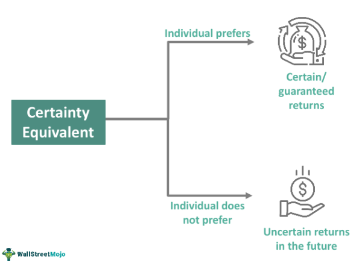

In today's complex financial environment, effective decision-making is pivotal for both individuals and institutions. Uncertainty and risk pervade markets, creating challenges that necessitate tools and frameworks to navigate them successfully. One such concept that aids in financial decision-making is the certainty equivalent. This concept is instrumental because it helps quantify an investor's risk preferences and translates them into actionable insights by indicating the guaranteed amount an investor would accept in lieu of a risky investment.

Algorithmic trading, a rapidly growing sector in finance, benefits significantly from an understanding of risk management and financial decision-making. This involves deploying advanced algorithms to automate trading strategies based on predicted outcomes, statistical arbitrage, and various quantitative models. Here, certainty equivalents become crucial as they help evaluate risk-reward scenarios and tailor algorithms that align with specific risk preferences.



This article explores how certainty equivalents are employed in various contexts such as financial decisions, risk management, and algorithmic trading. It aims to provide a comprehensive understanding of certainty equivalents by examining both their theoretical foundations and practical applications. Understanding certainty equivalents can enhance the efficacy of financial decision-making processes, improve risk management strategies, and optimize algorithmic trading systems by aligning them with desired risk profiles and expected outcomes.

## Table of Contents

## Understanding the Certainty Equivalent

The certainty equivalent is a core concept in financial decision-making, representing the guaranteed sum an investor would prefer over a risky investment. This reflects the individual's threshold for risk acceptance, which can vary widely among investors due to differing risk tolerance levels and investment goals. A crucial component of financial theory, the certainty equivalent allows investors to quantify how much risk they are willing to circumvent by choosing a certain payoff over a probabilistic one.

Understanding the certainty equivalent requires delving into the relationship between risk and utility functions. Utility functions, which describe an investor's preference for wealth under conditions of uncertainty, are instrumental in deriving the certainty equivalent. In essence, utility functions map outcomes to a numerical value reflecting the investor's level of happiness or satisfaction derived from that outcome.

Mathematically, if $U$ is a utility function and $X$ is a random variable representing a risky investment with certain payoffs, the certainty equivalent $CE$ is defined such that:

$$
U(CE) = \mathbb{E}[U(X)]
$$

where $\mathbb{E}[U(X)]$ is the expected utility. This equation ensures that the utility derived from the certainty equivalent is equal to the expected utility of the risky investment. The calculation of the certainty equivalent is influenced by the investor's risk aversion, a measure of an investor's aversion to uncertainty. More risk-averse individuals will have lower certainty equivalents, requiring a higher assured payout to forgo the risky prospect.

The certainty equivalent underlines the investor's decision-making process by balancing anticipated returns with perceived risks. It essentially translates the investor’s subjective risk preferences into an objective figure, facilitating more rational investment choices. By examining the difference between the expected value of a risky investment and its certainty equivalent, investors discern the implicit price they are paying to avoid risk—a crucial insight for effective financial planning and management.

## Theoretical Foundations of the Certainty Equivalent

Key theories supporting the certainty equivalent include Risk-Aversion Theory and Portfolio Theory, both of which are essential in understanding and analyzing the trade-off between risk and reward. 

Risk-Aversion Theory posits that investors have varying degrees of risk aversion, which influences their preference for certain outcomes over uncertain ones with the same expected value. A risk-averse investor prefers a certain payoff over a gamble with the same expected payoff, as they are concerned about the potential for unfavorable outcomes. This tendency is reflected in the utility function, $U(x)$, that describes the investor's satisfaction or utility derived from wealth $x$. The certainty equivalent, in this context, is the amount of guaranteed money an investor would accept instead of undertaking a risky asset with a higher expected value. Mathematically, it satisfies the condition $U(\text{CE}) = \mathbb{E}[U(W)]$, where $\text{CE}$ is the certainty equivalent and $W$ is a random variable representing the uncertain payoff.

Portfolio Theory, particularly Modern Portfolio Theory (MPT) introduced by Harry Markowitz, further supports the concept of certainty equivalents by providing a structured approach to optimizing asset allocation. It emphasizes the relationship between portfolio risk and expected return, advocating for diversification to mitigate risk. The expected return of a portfolio is calculated as a weighted average of the returns of its individual assets, while the risk is determined by the variance or standard deviation of the portfolio's return. Portfolio Theory informs the computation of certainty equivalents by presenting a framework for assessing the risk-return trade-off and determining the optimal risk premium— the additional return an investor requires as compensation for taking on risk.

The mathematical framework for calculating certainty equivalents integrates expected payoffs with risk premiums. The risk premium reflects the additional expected return investors demand to compensate for the risk of an uncertain investment. In practice, the certainty equivalent can be derived by subtracting the risk premium from the expected return, offering a measure that accounts for both the potential upside and the investor's risk tolerance.

In summary, the foundations provided by Risk-Aversion Theory and Portfolio Theory enable a comprehensive understanding of certainty equivalents. They help quantify the interplay of risk and reward, offering a robust mechanism for investors to assess the desirability of various financial opportunities by incorporating their unique risk preferences and the inherent uncertainties of financial markets.

## Applications in Financial Decision-Making

The certainty equivalent plays a significant role in financial decision-making by helping investors evaluate and compare guaranteed returns with risky investment opportunities. Essentially, it determines the minimum amount an investor would accept as a certain outcome rather than engaging in a risky endeavor that has a higher yet uncertain return. This process aids investors in effectively balancing their appetite for risk with potential returns, leading to more informed investment choices.

In investment evaluations and capital budgeting, the certainty equivalent method is utilized to adjust the cash flows of potential projects by considering their risk-adjusted value. This adjustment provides a realistic view of an investment’s worth from the investor's perspective, incorporating individual risk tolerance into the evaluation. The certainty equivalent is calculated by using utility functions that represent an investor’s risk preferences, thereby allowing the transformation of risky cash flows into their certain counterparts.

Within corporate finance, the certainty equivalent proves beneficial in risk-adjusting cash flows for project evaluations. By converting expected cash flows into their certain equivalents, companies can assess project viability more accurately. This adjustment is often crucial in scenarios where cash flows are uncertain and fluctuate based on market conditions. For instance, if a project has an expected cash flow of $100,000 with a risk premium of $20,000, the certainty equivalent would be $80,000, assuming the investor accepts this as a sufficiently risk-adjusted guaranteed amount.

Insurance products also integrate certainty equivalents to evaluate premiums against potential claims. Insurers use this concept to assess the risk associated with different products and tailor premium valuations accordingly. By understanding the certainty equivalent, insurers can price premiums that reflect the level of risk they are willing to cover, ensuring that the premiums collected align with the risk they assume.

The versatility of the certainty equivalent makes it instrumental across various financial settings, enabling better decision-making aligned with individual and corporate risk appetites. This analytical tool allows both investors and corporations to navigate complex financial landscapes more effectively, transforming theoretical risk assessments into practical and actionable financial strategies.

## Certainty Equivalent in Algorithmic Trading

Algorithmic trading systems use certainty equivalents as a critical tool to effectively analyze and manage trading risks. Understanding investors' risk preferences is central to designing algorithms that match specific investment strategies. The certainty equivalent provides a numerical measure reflecting these preferences, thus enabling a personalized investment approach that aligns more closely with the investor's risk appetite.

By leveraging certainty equivalents, traders can quantify risk premiums, which are essential in evaluating the additional returns required to compensate for the investor's willingness to accept risk. These risk premiums are integral in adjusting trading models dynamically. For example, in a trading algorithm, certainty equivalents can be used to evaluate potential trade-offs between expected returns and associated risks, allowing the algorithm to alter positions based on changing market conditions and individual risk tolerance.

The formula for calculating the certainty equivalent (CE) of an investment with uncertain outcomes can be expressed as:

$$
CE = U^{-1} \left( \mathbb{E}[U(W + X)] \right)
$$

where $U$ is the utility function, $\mathbb{E}$ denotes the expected value, $W$ is current wealth, and $X$ is the uncertain payoff.

Python code can also be utilized to compute certainty equivalents within [algorithmic trading](/wiki/algorithmic-trading) models. For example:

```python
import numpy as np

def certainty_equivalent(wealth, payoffs, utility_function):
    expected_utility = np.mean(utility_function(wealth + payoffs))
    return utility_function.inv(expected_utility)

# Example utility function: Constant Relative Risk Aversion (CRRA)
class CRRAUtility:
    def __init__(self, risk_aversion):
        self.risk_aversion = risk_aversion

    def __call__(self, wealth):
        if self.risk_aversion == 1:
            return np.log(wealth)
        else:
            return (wealth ** (1 - self.risk_aversion)) / (1 - self.risk_aversion)

    def inv(self, utility):
        if self.risk_aversion == 1:
            return np.exp(utility)
        else:
            return ((1 - self.risk_aversion) * utility) ** (1 / (1 - self.risk_aversion))

# Usage example
crra = CRRAUtility(risk_aversion=2)
current_wealth = 100000
payoffs = np.random.normal(1000, 200, 1000)  # Simulated payoffs
ce = certainty_equivalent(current_wealth, payoffs, crra)
print(f"Certainty Equivalent: {ce}")
```

Using certainty equivalents enables more informed and strategic trading decisions, minimizing potential losses during volatile market episodes. Algorithms adjust trading actions based on risk-return profiles, ensuring strategic alignment with the investor’s acceptance of risk. This integration results in more coherent investment methodologies that are robust against market fluctuations, leading to enhanced decision-making and optimized returns relative to the given risks.

## Comparing Certainty Equivalent and Expected Value

The certainty equivalent offers a valuable perspective on financial decisions by integrating individual risk preferences—contrasting with the expected value, which provides a generalized average outcome. Expected value is a statistical measure that computes the mean of all possible outcomes of a particular investment or decision, weighted by their probabilities. Mathematically, the expected value $E(X)$ of a discrete random variable $X$ with outcomes $x_1, x_2, \ldots, x_n$ and associated probabilities $p_1, p_2, \ldots, p_n$ is calculated as:

$$

E(X) = \sum_{i=1}^{n} x_i \cdot p_i 
$$

While the expected value captures the central tendency of outcomes, it fails to account for investors' individual risk tolerance. In contrast, the certainty equivalent represents the guaranteed amount that an investor would find equally desirable to a risky prospect, factoring in their risk aversion. This personalization means that for the same expected value, different investors, each with their own risk tolerance, may determine distinct certainty equivalents.

For instance, consider two investors assessing the same asset that has an expected value of $100. A risk-averse investor might have a lower certainty equivalent, such as $80, preferring a guaranteed $80 over the potential [volatility](/wiki/volatility-trading-strategies) of the $100 expected value. Conversely, a risk-neutral investor might have a certainty equivalent closer to $100, indicating less concern about risk.

This differentiation is significant as it enables investors to make more informed decisions aligned with their unique risk profiles, rather than relying solely on generic statistical averages. As a result, financial actors, be they individual investors or corporate entities, can tailor their strategies to match their specific risk tolerance levels, enhancing the relevance and effectiveness of their decision-making processes.

## Conclusion

The certainty equivalent serves as a pivotal tool in financial decision-making and risk management. By effectively linking theoretical concepts with practical applications, it provides valuable insights for both investors and corporations. In particular, certainty equivalents are instrumental in expanding financial fields such as algorithmic trading, where robust strategies are essential. Understanding and applying this concept enhances financial planning by aligning investments with individual risk tolerance, thus optimizing strategic outcomes in uncertain environments.

The role of the certainty equivalent extends beyond basic risk management. It allows financial actors to quantify their risk-reward profiles, leading to more informed and personalized decision-making processes. By taking into account investor-specific risk preferences, the certainty equivalent offers a tailored approach that is often more relevant than mere expected value computations. For instance, while the expected value might provide a statistical average of potential outcomes, the certainty equivalent incorporates the investor's unique risk aversion level to present a guaranteed value they would accept as an alternative to uncertain prospects.

In algorithmic trading, the certainty equivalent facilitates the development of trading models that can dynamically adjust to changing market conditions. By quantifying risk premiums and integrating these into trading algorithms, it becomes possible to craft strategies that minimize potential losses even in volatile markets. This approach not only shields portfolios from adverse fluctuations but also enhances overall trading efficacy.

Algorithmic systems, armed with certainty equivalents, can thus navigate complex financial terrains while adhering to risk thresholds defined by investors. This alignment not only safeguards investments but also ensures that financial strategies remain consistent with the investor's broader objectives.

In summary, the certainty equivalent is an essential aspect of contemporary financial management. It bridges theoretical models with practical applications, enhancing risk assessment and decision-making processes across varied financial scenarios. By leveraging the certainty equivalent, investors and corporate entities can achieve a more nuanced understanding of risk, thereby fostering strategic planning that is both prudent and agile in the face of uncertainty.

## References & Further Reading

[1]: Arrow, K. J. (1965). "Aspects of the Theory of Risk-Bearing." Yrjo Jahnsson Foundation.

[2]: Markowitz, H. (1952). ["Portfolio Selection"](https://onlinelibrary.wiley.com/doi/abs/10.1111/j.1540-6261.1952.tb01525.x). The Journal of Finance, 7(1), 77-91.

[3]: Pratt, J. W. (1964). ["Risk Aversion in the Small and in the Large"](https://www.sciencedirect.com/science/article/pii/B9780127808505500174). Econometrica, 32(1/2), 122-136.

[4]: Sharpe, W. F. (1964). ["Capital Asset Prices: A Theory of Market Equilibrium Under Conditions of Risk"](https://onlinelibrary.wiley.com/doi/full/10.1111/j.1540-6261.1964.tb02865.x). The Journal of Finance, 19(3), 425-442.

[5]: Varian, H. R. (1992). "Microeconomic Analysis." W.W. Norton & Company.