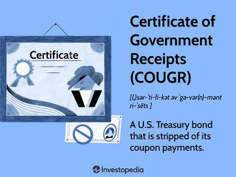

The world of financial securities offers a diverse array of investment opportunities, each with its unique features and historical significance. Among these is the Certificate of Accrual on Treasury Security (CATS), a type of bond introduced in the early 1980s by Salomon Brothers. These securities emerged during a period characterized by considerable innovation in the financial markets, which saw the creation of numerous products designed to meet the needs of various investors and to optimize financial strategies.

CATS represent a specific type of financial instrument known as zero-coupon bonds. Unlike traditional bonds that provide periodic interest payments (coupons) to their holders, zero-coupon bonds are sold at a significant discount to their face value and do not offer interest payments throughout their term. Instead, the return to the investor is the difference between the purchase price and the face value, realized upon maturity. This feature allows investors to benefit from compounded interest over time without the need for periodic reinvestment of coupon payments, making such bonds an appealing option for certain types of investment strategies and portfolio management.



The introduction of CATS reflects a broader trend within the financial industry during the 1980s, where experimentation and innovation were at the forefront. This era witnessed the creation of several feline-themed securities, each with unique attributes catering to different risk appetites and financial objectives. Despite not being issued anymore due to the advent of government-backed programs like STRIPS, the historical significance of CATS remains relevant in today’s financial landscape, particularly given their influence on subsequent financial products and strategies.

Understanding CATS provides valuable insight into the evolution of financial markets and innovation in financial instruments. Their characteristics, including the predictable cash flow structure inherent in zero-coupon bonds, continue to inform modern investment strategies. This includes algorithmic trading, where the ability to anticipate cash flows and valuations is crucial for devising effective trading models and strategies.

## Table of Contents

## What Are Certificate of Accrual on Treasury Securities (CATS)?

Certificates of Accrual on Treasury Securities (CATS) represented a category of zero-coupon bonds introduced by Salomon Brothers between 1982 and 1986. These financial instruments offered a unique investment opportunity, distinct from conventional bonds primarily due to their zero-coupon nature. Zero-coupon bonds like CATS do not provide periodic interest payments known as coupons. Instead, they are sold at a significant discount from their face value, and the investor receives the full face value at the time of maturity. This difference between the purchase price and the face value represents the investor's return, essentially mimicking the effect of compounded interest.

To illustrate the financial mechanics behind zero-coupon bonds like CATS, consider the following formula for the bond's present value:

$$

PV = \frac{FV}{(1 + r)^n} 
$$

where $PV$ is the present value or purchase price of the bond, $FV$ is the face value at maturity, $r$ is the yield to maturity (interest rate), and $n$ is the number of years until maturity.

For investors, the appeal of purchasing a zero-coupon bond lies in its predictability and the ability to lock in a certain yield over a specified term. CATS provided a distinct advantage by eliminating the reinvestment risk inherent in traditional bonds that pay periodic interest, as there are no interim cash flows subject to changing interest rates.

CATS were initially created by stripping the principal and the interest components of U.S. Treasury securities, allowing investors to purchase them separately. This innovation offered a new way for market participants to tailor their investment strategies around specific cash flow needs and [interest rate](/wiki/interest-rate-trading-strategies) expectations. Although CATS have been replaced by other financial products over time, their structure remains a testament to creative financial engineering, providing insightful lessons on how investment vehicles can be tailored to meet various economic environments and investor preferences.

## The Rise and Fall of CATS

CATS were introduced in an atmosphere of financial innovation during the early 1980s, where inventive financial products emerged regularly. The appeal of CATS lay in their structure as zero-coupon bonds, selling at a discount and redeemable at full face value upon maturity. This design appealed to investors seeking predictable growth without the periodic interest payments of traditional bonds.

The introduction of CATS coincided with the launch of other creatively themed securities such as TIGRs (Treasury Investment Growth Receipts) and LIONs (Liquid Investment Opportunities Notes), all aiming to maximize returns through variations of zero-coupon treasury securities. These products attempted to unlock value in U.S. Treasuries by providing alternative pathways for investor engagement.

However, the U.S. government's introduction of the Separate Trading of Registered Interest and Principal of Securities (STRIPS) program in 1985 effectively nullified the need for CATS and similar products. Through STRIPS, investors could buy the individual interest and principal components of a treasury bond directly from the government. This official option lacked the counterparty risk present in privately issued securities and aligned with investor preferences for direct government-backed options.

Despite the onset of the STRIPS program and the cessation of new CATS issues, existing CATS securities continued to attract interest in secondary markets. Investors frequently sought legacy CATS as part of portfolio diversification strategies, leveraging their zero-coupon nature for predictable, lump-sum future payments. Consequently, while new issuance halted, the secondary market provided a venue for trading and speculative opportunities centered on these financial instruments. 

Thus, although CATS no longer hold the prevalence they once did, they served as a pivotal bridge toward the broader acceptance and utilization of government-backed zero-coupon bonds, enriching the tapestry of financial innovation in the process.

## The Algorithmic Trading Connection

In today’s financial landscape, [algorithmic trading](/wiki/algorithmic-trading) has gained prominence as a vital aspect of bond trading, largely due to its ability to enhance efficiency and precision. Certificates of Accrual on Treasury Securities (CATS) are particularly well-suited for such trading strategies due to their predictability in cash flows. This predictability stems from their nature as zero-coupon bonds, where the appreciation from the discounted purchase price to the face value at maturity provides a clear and fixed yield. Unlike conventional bonds, which involve periodic coupon payments, CATS eliminate cash flow uncertainty, offering a single cash flow event at their maturity. 

Algorithmic trading models can leverage this characteristic of CATS to optimize their strategies. These models often rely on historical performance metrics and valuation strategies to predict future market behavior, and CATS, with their defined maturity value, become ideal components of such analyses. For instance, algorithms designed to perform [arbitrage](/wiki/arbitrage) or statistical analysis can effectively use CATS to assess yield curves and identify potential trading opportunities, especially when comparing them to coupon-bearing securities. 

Moreover, the use of historical data on CATS allows for the calibration of models that seek to optimize bond portfolios or predict market movements. For instance, a trader could employ a simple Python-based algorithm to calculate the expected yield of a CATS bond and compare it against current market rates to evaluate its investment potential:

```python
def calculate_yield(purchase_price, face_value, years_to_maturity):
    """
    Calculate the annual yield of a zero-coupon bond.

    :param purchase_price: Price at which the bond was bought
    :param face_value: The maturity value of the bond
    :param years_to_maturity: Number of years until maturity
    :return: Annual yield as a percentage
    """
    return ((face_value / purchase_price) ** (1 / years_to_maturity) - 1) * 100

purchase_price = 750
face_value = 1000
years_to_maturity = 10

yield_percent = calculate_yield(purchase_price, face_value, years_to_maturity)
print(f"The expected annual yield is: {yield_percent:.2f}%")
```

In this example, the script evaluates the yield of a CATS bond bought at $750 with a maturity value of $1000 over ten years, offering insights into its profitability. By integrating such calculations, algorithmic models can quickly adapt to market changes, ensuring optimal decision-making in dynamic trading environments. 

Ultimately, understanding and integrating the historical performance and valuation strategies of instruments like CATS can significantly enhance the efficacy of algorithmic trading models, providing traders with the tools needed to navigate complex financial markets effectively.

## CATS Redemption and Legacy

The redemption process for Certificates of Accrual on Treasury Securities (CATS) can be intricate due to their historical nature and the numerous bank mergers that have occurred since their issuance. One of the key complications arises from tracing the redeeming entity, which may have changed names or ownership over the years. Bondholders are advised to utilize the CUSIP (Committee on Uniform Securities Identification Procedures) number. This alphanumeric code uniquely identifies the bond and aids in determining the current institution responsible for processing redemption.

CATS, despite their obsolescence, offer a window into past financial engineering and the evolution of risk management strategies within the securities market. They serve as an illustrative example of how financial instruments can be innovatively structured to meet certain investment goals, such as offering attractive yields through zero-coupon structures and the compounded interest they engender. The concept of purchasing a security at a discount and redeeming it at face value upon maturity, while no longer novel, helped set the stage for subsequent advancements in bond structuring and the creation of complex debt instruments.

The legacy of CATS extends beyond their direct financial function. By examining these instruments, financial scholars and practitioners gain insight into the historical context and decision-making processes that shaped modern financial markets. For today's investors and analysts, understanding such precedents is crucial, especially when constructing algorithmic trading strategies that rely heavily on historical data and performance metrics of various securities. Thus, while CATS may no longer be a staple of contemporary investment portfolios, their influence persists in the principles and techniques that continue to underpin financial innovation.

## Conclusion

Certificates of Accrual on Treasury Securities (CATS) served as a distinctive financial instrument that significantly influenced the development of treasury securities. Originating in the early 1980s, CATS introduced investors to the concept of zero-coupon bonds, offering a novel way to invest in government debt without the need for periodic interest payments. This unique characteristic allowed CATS to gain traction by providing a straightforward mechanism for compounding interest, as they matured at their face value.

Although CATS have become obsolete with the advent of the U.S. Treasury's STRIPS program, which directly offers zero-coupon bonds, the impact of CATS on financial markets persists. Their introduction marked a period of financial innovation, inspiring subsequent instruments and contributing to the diversification of investment strategies. The legacy of CATS lies in their role in illustrating the potential of financial engineering to manage risk and optimize investment returns.

Understanding the historical significance and characteristics of CATS offers valuable insights into the mechanics of bond markets and financial innovation. This knowledge proves particularly beneficial in the context of algorithmic trading, where historical data and predictable cash flows, as demonstrated by CATS, are critical to developing effective trading strategies. By examining the lifecycle of CATS, contemporary financial analysts and traders can draw lessons on market dynamics and the evolution of financial products, reinforcing the importance of adaptability and foresight in financial markets.

## References & Further Reading

[1]: Livingston, M. (1978). ["Zero-Coupon Bonds: Determinants of Yields and Arbitrage Opportunity."](http://www.bondeconomics.com/2020/10/arbitrage-in-practice-and-theory.html) Financial Analysts Journal.

[2]: Stigum, M., & Crescenzi, A. (2007). ["Stigum's Money Market."](https://www.amazon.com/Stigums-Money-Market-Marcia-Stigum/dp/0071448454) McGraw-Hill Education.

[3]: Homer, S., & Sylla, R. E. (2005). ["A History of Interest Rates."](https://www.amazon.com/History-Interest-Rates-Fourth-Finance/dp/0471732834) Wiley.

[4]: Fabozzi, F. J. (2007). ["Fixed Income Analysis."](https://www.amazon.com/Fixed-Income-Analysis-Frank-Fabozzi/dp/047005221X) Wiley.

[5]: Jarrow, R. A., & Turnbull, S. M. (2000). ["Derivative Securities."](https://archive.org/details/derivativesecuri0000jarr) South-Western College Pub.