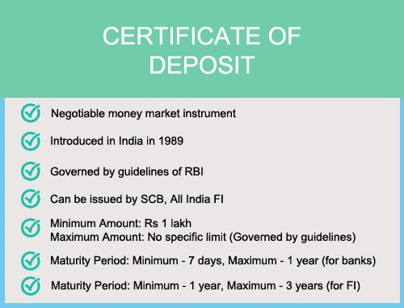

## Table of Contents

## What is a Certificate of Deposit (CD) Index?

A Certificate of Deposit (CD) Index is a tool that helps measure the average interest rates offered by banks on Certificates of Deposit. CDs are special types of savings accounts where you agree to keep your money in the bank for a fixed period of time, and in return, the bank pays you a higher interest rate than a regular savings account. The CD Index tracks these rates across different banks and time periods, like 3 months, 6 months, or 1 year, to give a general idea of what rates are available in the market.

This index is useful for people who want to compare CD rates from different banks without having to check each one individually. By looking at the CD Index, you can see if the rates are going up or down over time, which can help you decide when to invest in a CD. For example, if the index shows that rates are increasing, you might want to wait a bit longer before buying a CD to get a better rate. On the other hand, if rates are falling, it might be a good time to lock in a higher rate.

## How does a CD Index work?

A CD Index works by collecting data on the interest rates that banks offer for Certificates of Deposit. This data comes from many different banks and includes rates for different lengths of time, like 3 months, 6 months, or 1 year. The index then calculates an average of these rates to show what the typical CD rate is at any given time. This helps people see the overall trend in CD rates across the market.

People can use the CD Index to make better decisions about when to buy a CD. If the index shows that rates are going up, it might be smart to wait a bit longer before investing, so you can get a higher rate. But if the index shows that rates are going down, it could be a good time to buy a CD and lock in a higher rate before it drops even more. By keeping an eye on the CD Index, you can make smarter choices about your savings.

## What are the benefits of using a CD Index?

Using a CD Index can help you make smarter choices about your money. When you want to put your money into a Certificate of Deposit, the CD Index shows you the average interest rates that banks are offering. This helps you see if the rates are going up or down, so you can decide if it's a good time to invest. For example, if the index shows that rates are getting higher, you might want to wait a bit before buying a CD to get a better rate.

Another benefit is that the CD Index saves you time. Instead of checking the rates at every bank, you can look at the index and quickly see what rates are available across the market. This makes it easier to compare different banks and find the best deal for your money. By using the CD Index, you can make sure you're getting a good return on your savings without spending a lot of time researching.

## How can someone invest in a CD Index?

You can't directly invest in a CD Index because it's not a financial product you can buy. Instead, the CD Index is a tool that shows you the average interest rates banks offer for Certificates of Deposit. By looking at the CD Index, you can see if rates are going up or down and decide when it's a good time to buy a CD.

To use the information from the CD Index, you would go to a bank or a financial institution and open a Certificate of Deposit. You choose how long you want to keep your money in the CD, like 3 months, 6 months, or a year, and the bank will give you an [interest rate](/wiki/interest-rate-trading-strategies) based on what they're offering at that time. By comparing the rate the bank offers to the CD Index, you can see if it's a good deal or if you should wait for a better rate.

## What are the risks associated with a CD Index?

The main risk with using a CD Index is that it's just an average of rates from different banks. This means the rates you see on the index might not be the same as the rates you get from your bank. If you see a high rate on the index, your bank might not offer that rate, so you could end up with a lower return than you expected.

Another risk is that the CD Index can change over time. If you see a good rate on the index and decide to wait for it to go even higher, it might go down instead. This means you could miss out on a good rate if you wait too long. So, while the CD Index can help you make better choices, it's important to remember that it's just a guide and not a guarantee of what you'll get.

## How does the CD Index compare to other investment options?

The CD Index is different from other investment options because it's not something you can buy. Instead, it's a tool that shows you the average interest rates for Certificates of Deposit. This can help you decide when to put your money into a CD, but it's not an investment itself. Other options like stocks, bonds, or mutual funds can be bought directly and might offer higher returns, but they also come with more risk. With a CD, your money is safer, but the returns are usually lower.

When you use the CD Index to help with your investment choices, you're looking at a safer, more predictable option compared to stocks or mutual funds. Stocks can go up and down a lot, which means you could make more money, but you could also lose money. CDs, on the other hand, give you a fixed rate of return, so you know exactly what you'll get if you keep your money in the bank for the full term. The CD Index helps you see if that fixed rate is good compared to what other banks are offering, but it won't help you decide if you should invest in stocks or other riskier options.

## What factors influence the performance of a CD Index?

The performance of a CD Index is influenced by several key factors, including the overall interest rate environment set by the Federal Reserve. When the Federal Reserve raises interest rates, banks usually offer higher rates on CDs to attract more money from savers. This means the CD Index, which tracks these rates, will go up. On the other hand, if the Federal Reserve lowers interest rates, banks will offer lower rates on CDs, causing the CD Index to go down.

Another [factor](/wiki/factor-investing) that affects the CD Index is the competition among banks. If one bank starts offering a higher rate to attract more customers, other banks might follow suit to stay competitive. This competition can drive up the rates shown on the CD Index. Additionally, the economy's health plays a role. In a strong economy, banks might offer higher rates because people are more likely to save money. In a weak economy, banks might lower rates to encourage people to spend rather than save, which can bring down the CD Index.

## How often is the CD Index updated, and what data is used?

The CD Index is updated regularly, often on a daily or weekly basis, depending on the source that publishes it. This frequent updating helps keep the index current with the latest interest rates that banks are offering for Certificates of Deposit. By checking the CD Index often, you can see how rates are changing over time and make better decisions about when to invest your money.

The data used to create the CD Index comes from a wide range of banks and financial institutions. These banks report the interest rates they offer for different lengths of time, like 3 months, 6 months, or 1 year. The index then calculates an average of these rates to show what the typical CD rate is across the market. This way, the CD Index gives you a good idea of the overall trend in CD rates, helping you compare different banks and find the best deal for your savings.

## Can you explain the methodology behind calculating the CD Index?

The CD Index is calculated by gathering interest rate data from a lot of different banks. These banks tell us what rates they are offering for Certificates of Deposit, or CDs, for different lengths of time, like 3 months, 6 months, or 1 year. Once we have all this data, we add up all the rates and then divide by the number of banks to find the average rate. This average rate is what we call the CD Index. It gives us a good idea of what rates are like across the whole market.

The way we calculate the CD Index makes sure it's fair and accurate. We include rates from big banks and small banks, so the index represents what's happening everywhere. By updating the index regularly, usually every day or every week, we can see how CD rates are changing over time. This helps people decide if it's a good time to put their money into a CD, based on whether rates are going up or down.

## What historical trends can be observed in the CD Index?

Looking back at the history of the CD Index, we can see that it goes up and down over time. When the economy is doing well and people are saving more money, banks often offer higher interest rates on CDs to attract more savings. This pushes the CD Index up. For example, during the late 1990s and early 2000s, the CD Index was high because interest rates were generally higher. But when the economy isn't doing so well, or when the Federal Reserve lowers interest rates, the CD Index goes down. This happened during the 2008 financial crisis when banks lowered their CD rates, causing the index to drop.

Another trend we see is that the CD Index can change quickly when there are big events or policy changes. For instance, when the Federal Reserve decides to raise or lower interest rates, the CD Index usually follows suit pretty fast. This happened in 2015 when the Federal Reserve started raising rates after keeping them low for a long time, and the CD Index started to climb. Also, during times of high inflation, like in the late 1970s and early 1980s, the CD Index was very high because banks had to offer higher rates to keep up with rising prices. By watching these trends, people can get a better idea of when it might be a good time to invest in a CD.

## How do regulatory changes affect the CD Index?

Regulatory changes can have a big impact on the CD Index. When the government or the Federal Reserve makes new rules about how banks can operate, it can change the interest rates they offer on Certificates of Deposit. For example, if the Federal Reserve sets a higher interest rate to control inflation, banks might raise their CD rates to stay competitive. This would make the CD Index go up. On the other hand, if the Federal Reserve lowers interest rates to help the economy grow, banks would likely offer lower CD rates, which would bring the CD Index down.

These changes can happen quickly and affect the CD Index almost right away. If new rules make it harder for banks to offer high rates, the CD Index might drop. But if the rules make it easier for banks to compete and offer better rates to customers, the CD Index could go up. People who are thinking about investing in a CD need to keep an eye on these regulatory changes because they can make a big difference in the rates they might get.

## What advanced strategies can be used to optimize returns from a CD Index?

One way to get the best return from using the CD Index is to watch it closely and time your investments. If the CD Index is going up, it might be smart to wait a little bit before putting your money into a CD. This way, you might be able to get a higher rate when it goes up even more. On the other hand, if the CD Index is going down, it could be a good time to buy a CD quickly to lock in a higher rate before it drops too much. By keeping an eye on the CD Index, you can make better choices about when to invest your money.

Another strategy is to use a CD ladder. This means you split your money into different CDs that mature at different times. For example, you could put some money into a 3-month CD, some into a 6-month CD, and some into a 1-year CD. As each CD matures, you can look at the CD Index to see if rates have changed. If rates have gone up, you can reinvest that money into a new CD at a higher rate. If rates have gone down, you can still keep some money in CDs that were locked in at higher rates. This way, you can take advantage of changes in the CD Index and keep your money [earning](/wiki/earning-announcement) good returns over time.

## References & Further Reading

[1]: Chaboud, A. P., Chiquoine, B., Hjalmarsson, E., & Vega, C. (2014). ["Rise of the Machines: Algorithmic Trading in the Foreign Exchange Market."](https://www.jstor.org/stable/43612951) The Federal Reserve.

[2]: Lopez de Prado, M. (2018). ["Advances in Financial Machine Learning."](https://www.amazon.com/Advances-Financial-Machine-Learning-Marcos/dp/1119482089) John Wiley & Sons.

[3]: Aronson, D. (2006). ["Evidence-Based Technical Analysis: Applying the Scientific Method and Statistical Inference to Trading Signals."](https://www.amazon.com/Evidence-Based-Technical-Analysis-Scientific-Statistical/dp/0470008741) John Wiley & Sons.

[4]: Chan, E. P. (2008). ["Quantitative Trading: How to Build Your Own Algorithmic Trading Business."](https://github.com/egorpe/EPChan-QuantitativeTrading/blob/master/example7_6.m) John Wiley & Sons.

[5]: Jansen, S. (2020). ["Machine Learning for Algorithmic Trading."](https://github.com/stefan-jansen/machine-learning-for-trading) Packt Publishing.