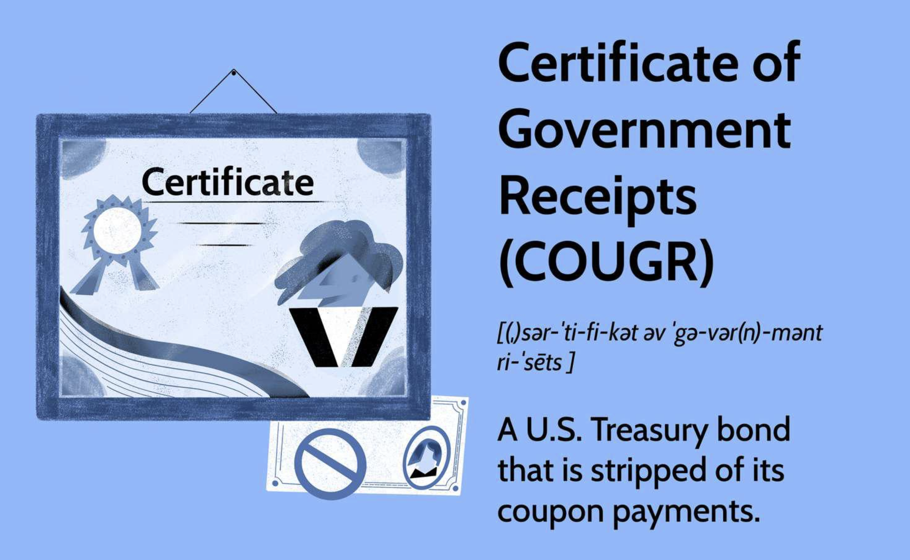

## Table of Contents

## What is a Certificate of Government Receipts?

A Certificate of Government Receipts is a document that shows the money the government has received. It is like a receipt you get when you buy something, but it is for the government's money. This certificate helps keep track of all the money coming into the government from different sources, like taxes and fees.

These certificates are important because they help the government know how much money they have. This helps them plan how to spend the money on things like schools, roads, and hospitals. By keeping good records with these certificates, the government can make sure they are using the money wisely and fairly.

## Why are Certificates of Government Receipts important?

Certificates of Government Receipts are important because they show all the money the government gets. They are like a big list that keeps track of money from taxes, fees, and other places. This helps the government know exactly how much money they have to work with.

Having these certificates helps the government plan how to use the money wisely. They can decide how much to spend on schools, roads, and hospitals. By keeping good records, the government can make sure they are using the money in a fair way and helping the people who need it most.

## How can one obtain a Certificate of Government Receipts?

To get a Certificate of Government Receipts, you usually need to go to a government office. This could be a place like a tax office or a finance department. You might need to fill out a form and show some ID to prove who you are. Sometimes, you can also ask for the certificate online through a government website, but you still might need to send in some documents.

Once you have submitted your request, the government office will check your information. They will make sure everything is correct and that you are allowed to get the certificate. After they finish checking, they will give you the Certificate of Government Receipts. This might take a few days or even a few weeks, depending on how busy the office is.

## What information is typically included in a Certificate of Government Receipts?

A Certificate of Government Receipts usually has the date when the money was received. It also shows how much money came in and where it came from, like taxes or fees. The certificate will have a special number so it can be tracked easily. It might also include the name of the person or group that gave the money to the government.

This certificate helps keep everything clear and organized. It makes sure that the government knows exactly how much money they have and where it came from. By having all this information in one place, the government can plan better and use the money in the right way.

## Who issues Certificates of Government Receipts?

Certificates of Government Receipts are usually issued by government offices that handle money. These can be places like the tax office or the finance department. They are the ones who keep track of all the money coming into the government from different sources like taxes and fees.

When someone asks for a Certificate of Government Receipts, the government office will check the request and make sure everything is correct. If it is, they will issue the certificate. This helps the government keep good records of all the money they receive, which is important for planning how to use it wisely.

## In what scenarios is a Certificate of Government Receipts required?

A Certificate of Government Receipts is often needed when someone wants to check how much money the government has received. For example, if a business pays a lot of taxes, they might need the certificate to prove they paid the right amount. It can also be used by people who want to make sure the government is using their tax money correctly. They can ask for the certificate to see where the money is coming from and how much there is.

Sometimes, the government itself needs these certificates to keep their records straight. They use them to plan how to spend the money on things like schools, roads, and hospitals. By looking at the certificates, they can make sure they have enough money for everything they need to do. This helps them use the money wisely and fairly.

## How does a Certificate of Government Receipts differ from other financial certificates?

A Certificate of Government Receipts is different from other financial certificates because it focuses only on the money the government gets. It shows all the money coming in from taxes, fees, and other sources. Other financial certificates, like a Certificate of Deposit or a Stock Certificate, are about money that people or businesses put into banks or companies. They show how much money someone has invested and what they might get back.

The Certificate of Government Receipts helps the government keep track of its money and plan how to spend it. It's like a big list that says how much money came in and where it came from. Other financial certificates, like a Bond Certificate, are promises to pay back money with interest. They are used by the government or companies to borrow money, not to keep track of what they receive. So, while all these certificates deal with money, they serve different purposes and are used in different ways.

## What are the legal implications of a Certificate of Government Receipts?

A Certificate of Government Receipts has important legal implications. It serves as an official record that shows the government has received money from certain sources. This document can be used in legal cases to prove that payments, like taxes or fees, were made correctly. If someone claims they paid a tax but the government says they didn't, the certificate can be used as evidence to settle the dispute.

These certificates also help with government transparency and accountability. By law, governments need to keep good records of their money to show they are using it properly. If there is a question about how the government is spending its money, the Certificate of Government Receipts can be checked to see where the money came from and how much there was. This helps make sure the government follows the rules and uses the money in a fair way.

## How is the authenticity of a Certificate of Government Receipts verified?

The authenticity of a Certificate of Government Receipts is verified by checking it against the records kept by the government office that issued it. When someone asks for a certificate, the office looks at their records to make sure the money was really received. They check the date, the amount, and where the money came from. If everything matches, they know the certificate is real.

If someone thinks a certificate might be fake, they can take it back to the government office. The office will look at their records again and compare them to the certificate. They might also use special marks or numbers on the certificate to make sure it's not a copy. This way, they can tell if the certificate is real or not.

## What are the potential risks associated with Certificates of Government Receipts?

Certificates of Government Receipts can be risky if they are lost or stolen. If someone finds a lost certificate or steals one, they might try to use it to pretend they paid money to the government when they didn't. This can cause problems because the government might think they have more money than they really do. It's important to keep these certificates safe and report any lost ones right away.

Another risk is that someone might make a fake certificate. If someone makes a fake one, it could trick the government into thinking they received money when they didn't. This can lead to mistakes in the government's records and make it hard for them to plan how to use their money. To avoid this, the government uses special marks and numbers to check if a certificate is real.

## How have Certificates of Government Receipts evolved over time?

Certificates of Government Receipts have changed a lot over time. In the past, they were just simple pieces of paper that showed how much money the government got. People had to go to the government office to get them, and they were written by hand. It was hard to keep track of all the certificates because there were so many, and sometimes they got lost or mixed up.

Now, things are different. Many governments use computers to keep track of their money, so Certificates of Government Receipts are often digital. This makes it easier to keep them safe and find them when needed. People can even ask for these certificates online, which saves time and makes everything more organized. Even though they are still important for showing how much money the government has, the way we use and keep them has gotten much better.

## What future developments can we expect in the regulation and use of Certificates of Government Receipts?

In the future, we might see more digital Certificates of Government Receipts. Governments could use special computer systems to keep track of all the money they get. This would make it easier to check if a certificate is real and stop people from making fake ones. People might be able to get these certificates online even more easily, without having to go to a government office. This would save time and make everything quicker and more organized.

Also, rules about Certificates of Government Receipts might change to make sure they are used correctly. Governments might have new laws to make sure these certificates are safe and that no one can use them in the wrong way. They might also use these certificates to show people more clearly where their money is going, helping everyone understand how the government spends its money. This would make things more open and fair for everyone.

## References & Further Reading

[1]: ["Advances in Financial Machine Learning"](https://www.amazon.com/Advances-Financial-Machine-Learning-Marcos/dp/1119482089) by Marcos Lopez de Prado

[2]: ["Evidence-Based Technical Analysis: Applying the Scientific Method and Statistical Inference to Trading Signals"](https://www.amazon.com/Evidence-Based-Technical-Analysis-Scientific-Statistical/dp/0470008741) by David Aronson

[3]: ["Machine Learning for Algorithmic Trading"](https://github.com/stefan-jansen/machine-learning-for-trading) by Stefan Jansen

[4]: ["Quantitative Trading: How to Build Your Own Algorithmic Trading Business"](https://www.amazon.com/Quantitative-Trading-Build-Algorithmic-Business/dp/1119800064) by Ernest P. Chan

[5]: ["Markets in Financial Instruments Directive II (MiFID II)"](https://finance.ec.europa.eu/regulation-and-supervision/financial-services-legislation/implementing-and-delegated-acts/markets-financial-instruments-directive-ii_en) - European Securities and Markets Authority

[6]: Bergstra, J., Bardenet, R., Bengio, Y., & Kégl, B. (2011). ["Algorithms for Hyper-Parameter Optimization."](https://proceedings.neurips.cc/paper/2011/file/86e8f7ab32cfd12577bc2619bc635690-Paper.pdf) Advances in Neural Information Processing Systems 24.