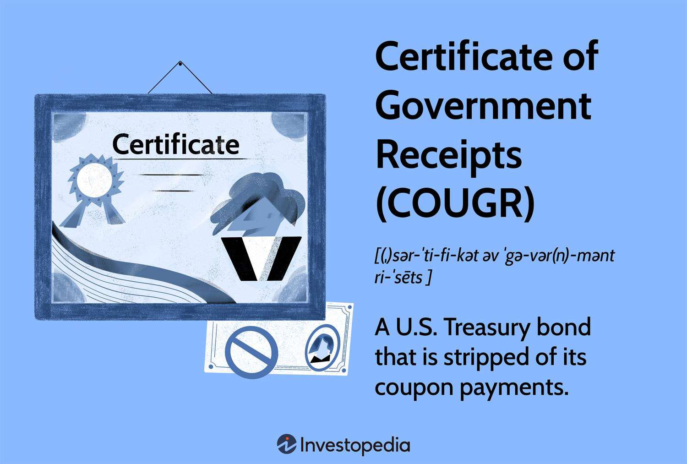

Financial instruments, government receipts, and government finance are integral components of global economic systems. These elements form the backbone of financial markets, facilitating capital flow, supporting economic development, and ensuring the effective functioning of governments. Financial instruments, such as stocks, bonds, and derivatives, allow for the trading of capital and risk, providing mechanisms for wealth creation and risk management.

Government securities, a subset of financial instruments, include Treasury bills (T-Bills) and Treasury bonds (T-Bonds), which are issued to finance government expenditures. These securities are pivotal in managing a country's fiscal policy and serve as benchmarks for pricing other financial assets. They are also utilized by investors for portfolio diversification and risk mitigation.



The evolution of algorithmic trading marks a significant shift in how financial markets operate. This advancement involves the use of sophisticated computer algorithms to conduct trading activities efficiently and effectively. Algorithmic trading enhances market efficiency by reducing human errors and optimizing the speed of trade executions. This technology plays a crucial role in the trading of government securities by ensuring timely and accurate transactions, thereby bolstering market stability.

In summary, understanding the complex relationships between financial instruments, government receipts, and algorithmic trading is essential for grasping the dynamics of modern financial markets. This interconnectedness supports economic growth and ensures that markets function smoothly, benefiting both government entities and private investors.

## Table of Contents

## Understanding Financial Instruments

Financial instruments are crucial components of the global economy, serving as tradable assets that encompass a wide range of categories, including stocks, bonds, and derivatives. These instruments are pivotal in facilitating capital flow, investment, and risk management across financial markets.

Stocks represent equity ownership in a corporation, granting shareholders a claim on part of the company's assets and earnings. Bonds, on the other hand, are debt securities issued by entities such as corporations or governments to raise capital, with the issuer obligated to pay back the principal amount along with interest.

Derivatives are financial contracts whose value is derived from an underlying asset, index, or [interest rate](/wiki/interest-rate-trading-strategies). Common examples include options, futures, and swaps. These instruments allow for risk hedging and speculation, offering participants the ability to manage exposure to price fluctuations.

Government securities, particularly Treasury bills (T-Bills) and Treasury bonds (T-Bonds), are paramount among financial instruments. T-Bills are short-term securities maturing within one year, while T-Bonds are long-term investments with maturities extending beyond ten years. Both serve as essential tools for government financing, providing the necessary funds to support public spending while offering investors a relatively secure investment option backed by the government's credit.

These securities also play a significant role in portfolio diversification. By incorporating government securities, investors can balance portfolios, reducing overall risk while potentially enhancing returns. Treasury securities are often sought for their [liquidity](/wiki/liquidity-risk-premium) and lower default risk, making them attractive during volatile market conditions.

The significance of government securities extends to their function as benchmarks for other interest rates in the economy, influencing yields on various financial products. Additionally, they serve as crucial instruments in monetary policy implementation, where central banks conduct open market operations to manage money supply and interest rates.

In conclusion, financial instruments, particularly government securities like T-Bills and T-Bonds, are not only critical for government financing but also serve as foundational assets in diversified investment portfolios. Their stability, risk mitigation properties, and role in economic policy make them indispensable in modern finance.

## Government Receipts and Finance

Government receipts are crucial components of a nation's fiscal landscape, encompassing various forms of revenue collected by governmental entities. These revenues enable governments to fund public services, infrastructure development, and other essential operations. They are typically derived from taxes, tariffs, fees, and the sale of government securities. The issuance of securities is a significant mechanism for a government to manage its short-term and long-term funding needs.

Certificates of Government Receipts (COUGR) and Treasury Separate Trading of Registered Interest and Principal Securities (STRIPS) are prominent examples of government-issued securities. COUGRs represent a type of zero-coupon bond, where the interest and principal are stripped and sold separately as individual securities. This separation allows investors to purchase securities that meet their specific cash flow requirements or investment strategies. Treasury STRIPS, similarly, are created by separating the interest and principal components of Treasury bonds or notes, offering bonds with no periodic interest payments, resulting in their trading at a discount and maturing at face value. The lack of intermediate cash flows makes STRIPS particularly appealing to investors who have long-term financial commitments and want predictable returns.

For the government, these instruments are pivotal in assuring a secure investment climate. By issuing such instruments, the government can effectively control and manage public debt, thereby stabilizing the macroeconomic environment. The sale of these securities also provides immediate cash flow, which can be used to cover budget deficits or to refinance maturing debt. In their essence, these securities provide a dual advantage: they offer investors a relatively safe investment vehicle, and they provide a dependable source of funding that contributes to the government's fiscal stability.

Understanding these dynamics is vital for both policymakers and investors, as it illustrates how government receipts support broader economic objectives and contribute to the sustainability of public finance. By carefully managing the issuance and sale of COUGRs, Treasury STRIPS, and other financial instruments, governments can tactically navigate economic fluctuations and adhere to fiscal policy goals while offering investors sound investment opportunities.

 to Algorithmic Trading

Algorithmic trading, often referred to as algo trading, involves the use of computer algorithms to execute trades based on predefined strategies without direct human intervention. These algorithms, developed with sophisticated mathematical models, can analyze multiple markets and execute orders at speeds and frequencies that a human trader cannot achieve. The core objective of algo trading is to automate the trading process to optimize the timing, price, and [volume](/wiki/volume-trading-strategy) of trades, thus improving efficiency and effectiveness in the financial markets.

Algo trading significantly enhances market efficiency by ensuring that trades are executed at the most opportune moments. This is achieved through strategies that can include [arbitrage](/wiki/arbitrage), [trend following](/wiki/trend-following), and market-making, among others. Algorithms designed for trading can process large volumes of market data across multiple exchanges simultaneously, identifying and acting upon trading signals far faster than a human could. By minimizing the delay between data input and trade execution—often in mere fractions of a second—algo trading essentially reduces market inefficiencies.

Furthermore, one of the primary advantages of [algorithmic trading](/wiki/algorithmic-trading) is its potential to reduce human error. Traditional trading methods depend heavily on human judgment, which can be swayed by emotions and psychological biases. In contrast, algorithms make decisions based on a set of logical rules derived from historical data and statistical analysis. This objectivity ensures that trades are executed without the influence of emotional constraints or bias, leading to more consistent and predictable trading outcomes.

In terms of optimizing trade execution speed, algo trading uses advanced computing technologies to seize ultra-fast trading opportunities. Algorithms can execute trades with precision timing and continuous monitoring of market conditions, enabling the rapid placement of large volumes of orders without significant manual intervention. This capability is particularly critical in volatile markets where conditions can change rapidly, affecting asset prices.

The role of algorithmic trading is especially pronounced in the trading of government securities, such as Treasury bills (T-Bills) and Treasury bonds (T-Bonds). These securities are attractive candidates for algo trading because of their stability and predictability compared to more volatile financial instruments. Algorithmic systems can execute timely and accurate transactions in these securities, maintaining liquidity in government bond markets, and facilitating efficient price discovery. By handling large volumes of government securities transactions quickly and accurately, algo trading contributes to the overall health and fluidity of financial markets.

In conclusion, algorithmic trading represents a transformative advancement in financial markets, streamlining the trade execution process and enhancing market operations' overall efficiency and reliability.

## The Intersection of Government Securities and Algo Trading

Government securities, such as Treasury Bills (T-Bills) and Treasury Bonds (T-Bonds), offer a stable and predictable investment environment, making them ideal candidates for algorithmic trading, or algo trading. The stability of these securities arises from their backing by the government, which significantly reduces default risk. This intrinsic stability is advantageous for algorithmic strategies, which rely on the consistency of market conditions to optimize trading outcomes.

Algorithmic trading systems can dynamically manage portfolios of government securities, adjusting holdings in response to changes in interest rates, market demand, or other economic indicators. These systems employ sophisticated algorithms to analyze vast amounts of market data, identifying patterns or anomalies that may indicate opportunities for buying or selling. By leveraging these data-driven approaches, algo trading aims to maximize returns while minimizing risks, such as interest rate fluctuations or liquidity issues.

The integration of algo trading with government securities also enhances liquidity. Liquidity refers to the ease with which assets can be bought or sold in the market without affecting their price. The rapid and efficient execution of trades by algorithms increases the turnover rate of these securities, ensuring that there is a consistent market presence. This increased liquidity not only benefits individual traders and institutional investors but also contributes to the overall stability and efficiency of financial markets.

Moreover, algo trading improves pricing accuracy for government securities. Algorithms continuously analyze real-time market data to determine the fair value of securities, factoring in [volatility](/wiki/volatility-trading-strategies), interest rates, and other relevant economic indicators. This leads to more precise pricing, ensuring that government securities are valued realistically at any given moment. As a result, investors are less likely to experience significant price disparities, which can occur in less liquid or manually traded markets.

The advantages of combining government securities with algorithmic trading manifest in enhanced market management and strategy optimization. For instance, a Python-based algorithm might be employed to monitor economic indicators and historical price data, automatically executing buy or sell orders based on predefined criteria. This capability allows investors to respond promptly to economic shifts, safeguarding their portfolios from potential adverse impacts.

```python
import numpy as np
import pandas as pd

# Example: Simulated algorithmic trading strategy for T-Bonds
def moving_average_strategy(prices, short_window=20, long_window=50):
    signals = pd.DataFrame(index=prices.index)
    signals['price'] = prices
    signals['short_mavg'] = prices.rolling(window=short_window, min_periods=1, center=False).mean()
    signals['long_mavg'] = prices.rolling(window=long_window, min_periods=1, center=False).mean()
    signals['signal'] = 0.0

    # Generate buy signals
    signals['signal'][short_window:] = np.where(
        signals['short_mavg'][short_window:] > signals['long_mavg'][short_window:], 1.0, 0.0
    )

    # Generate trading orders
    signals['positions'] = signals['signal'].diff()
    return signals

# Simulated price data for T-Bonds
prices = pd.Series([100, 101, 102, 103, 104, 105, 106, 107, 106, 108])

# Run the strategy
signals = moving_average_strategy(prices)
print(signals)
```

This simulated algorithm demonstrates a basic strategy using moving averages to generate buy signals for T-Bonds. By continually processing price data, the algorithm positions the portfolio to capitalize on upward trends, exemplifying how algo trading manages government securities efficiently. As technology advances, the role of algo trading in optimizing the management of government securities is expected to grow, presenting both opportunities and challenges for market participants.

## Challenges and Opportunities in Algo Trading

Algorithmic trading, often referred to as algo trading, provides numerous advantages, yet it also brings specific challenges to the financial markets. One of the primary benefits of algorithmic trading is its ability to enhance market efficiency through rapid execution of trades. However, this speed can also contribute to heightened market volatility. For instance, high-frequency trading strategies can lead to sudden price swings due to the rapid execution of large volumes of trades in short time frames.

Technical failures are another critical challenge associated with algo trading. As trading systems rely heavily on complex algorithms and technology infrastructure, any malfunction can result in significant financial losses. The "Flash Crash" of May 6, 2010, serves as a historical example where algorithmic traders significantly contributed to a sudden market plunge followed by a quick recovery, highlighting the potential risks associated with reliance on technology.

Regulatory frameworks are essential for maintaining market integrity with the increasing prevalence of algo trading. These frameworks ensure that trading practices remain fair and transparent. For example, the European Union has implemented the Markets in Financial Instruments Directive II (MiFID II), which imposes stringent requirements on algorithmic traders, including risk controls and testing of algorithms to prevent market abuse.

The advancement of [artificial intelligence](/wiki/ai-artificial-intelligence) (AI) and [machine learning](/wiki/machine-learning) opens new opportunities for refining trading strategies and improving risk management. Machine learning algorithms can process vast amounts of data to identify patterns and trends, potentially offering a competitive edge in developing sophisticated trading models. For instance, neural networks could be employed to predict stock price movements more accurately than traditional models.

AI-driven algorithms can also enhance risk management by adapting strategies in real time based on market conditions. This adaptive learning capability allows for more robust responses to market shifts, potentially reducing exposure to adverse events. Consider a scenario where a machine learning model adjusts portfolio allocations dynamically in response to predicted market downturns, thereby minimizing risk.

In conclusion, while algorithmic trading streamlines and optimizes trade processes, it demands continuous oversight to mitigate challenges related to volatility and technical failures. Ongoing advancements in AI and machine learning present significant opportunities for enhancing the precision and adaptability of trading strategies, fostering a more resilient financial ecosystem.

## Conclusion

The complex interaction between financial instruments, government receipts, and algorithmic trading represents a pivotal aspect of contemporary investment strategies. Financial instruments like government securities serve not only as mechanisms for government financing and low-risk investments but also as key elements in the automation strategies employed by algorithmic trading. Investors seeking to navigate these sophisticated markets use algorithmic trading to gain efficiency and precision, benefiting from reduced human error and optimized trade execution speed. 

Algorithmic trading, especially with government securities, offers the ability to dynamically manage portfolios by automatically adjusting based on predefined rules and market conditions. This technology enables investors to maximize returns and minimize risks through timely and accurate transactions in government securities such as Treasury bills and bonds. With increased liquidity and pricing accuracy, algo trading enhances the management capabilities over these assets, thus playing a crucial role in modern financial markets.

However, to fully utilize these advancements, investors must keep abreast of regulatory changes, employ cutting-edge technologies such as AI and machine learning, and ensure compliance with market standards. These factors offer new opportunities to refine trading strategies and improve risk management, thus pushing the boundaries of what algorithmic trading can achieve. As innovation continues, maintaining a balance between leveraging technology for market advantage and adhering to regulatory mandates will be paramount in unlocking the full potential of these evolved financial tools.

## References & Further Reading

[1]: ["Advances in Financial Machine Learning"](https://www.amazon.com/Advances-Financial-Machine-Learning-Marcos/dp/1119482089) by Marcos Lopez de Prado

[2]: ["Evidence-Based Technical Analysis: Applying the Scientific Method and Statistical Inference to Trading Signals"](https://www.amazon.com/Evidence-Based-Technical-Analysis-Scientific-Statistical/dp/0470008741) by David Aronson

[3]: ["Machine Learning for Algorithmic Trading"](https://github.com/stefan-jansen/machine-learning-for-trading) by Stefan Jansen

[4]: ["Quantitative Trading: How to Build Your Own Algorithmic Trading Business"](https://www.amazon.com/Quantitative-Trading-Build-Algorithmic-Business/dp/1119800064) by Ernest P. Chan

[5]: ["Markets in Financial Instruments Directive II (MiFID II)"](https://finance.ec.europa.eu/regulation-and-supervision/financial-services-legislation/implementing-and-delegated-acts/markets-financial-instruments-directive-ii_en) - European Securities and Markets Authority

[6]: Bergstra, J., Bardenet, R., Bengio, Y., & Kégl, B. (2011). ["Algorithms for Hyper-Parameter Optimization."](https://proceedings.neurips.cc/paper/2011/file/86e8f7ab32cfd12577bc2619bc635690-Paper.pdf) Advances in Neural Information Processing Systems 24.