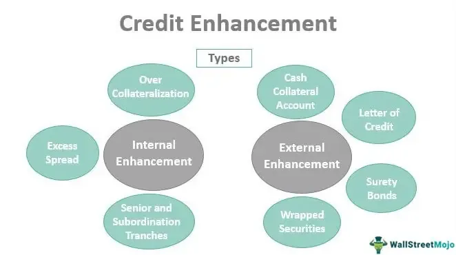

The world of finance is vast and complex, characterized by both a diverse range of financial instruments and sophisticated trading strategies. At the heart of this intricate system, debt securities, certificates of indebtedness, and contemporary innovations like algorithmic trading hold pivotal roles in shaping financial markets.

Debt securities, which encompass an array of instruments including bonds and certificates of indebtedness, are fundamental to both funding mechanisms and investment opportunities. These instruments represent promises of repayment and are typically used by corporations and governments to raise capital. Certificates of indebtedness, a subset of these securities, illustrate the government's commitment to repaying borrowed funds with interest, often over the short term. They provide essential insights into market liquidity and investor behavior.



Modern financial markets have also been significantly transformed by algorithmic trading. This innovation utilizes computer algorithms to automate trading processes, enabling rapid execution and high-frequency trading that enhance market efficiency. As algorithms scan market data, they execute trades based on predetermined criteria, which can range from trend-following to arbitrage strategies.

This article explores the interplay between these diverse elements, highlighting their critical roles and functions within the financial sector. It aims to provide readers with a comprehensive understanding of how financial instruments like debt securities and certificates of indebtedness coalesce with advanced trading strategies like algorithmic trading. By examining these connections, one can better appreciate their collective impact on investment decisions and trading practices within the financial landscape.

## Table of Contents

## Understanding Financial Instruments and Debt Securities

Financial instruments are fundamental components of the financial markets, encompassing a wide range of products that facilitate various investment, funding, and risk management opportunities. Among the basic categories of financial instruments are equities, fixed income securities such as bonds, and complex derivatives like Collateralized Debt Obligations (CDOs). Each instrument type serves distinct functions, catering to the diverse needs of investors and financial professionals.

Debt securities, a critical subset of financial instruments, represent a promise by the issuer to repay borrowed funds with interest at a specified future date. These instruments are essential in providing governments, corporations, and municipalities with necessary capital while offering investors a relatively secure investment option. Bonds are the most common type of debt security, typically offering periodic interest payments and the return of principal at maturity. Bonds are issued in various forms, including corporate bonds, municipal bonds, and sovereign bonds, each with unique characteristics and risk profiles.

Certificates of indebtedness stand out as a specific type of short-term government debt instrument. These certificates, often used by governments to manage short-term funding needs, represent a government's obligation to repay investors with interest over a short duration. They are similar to Treasury bills in function and purpose, providing [liquidity](/wiki/liquidity-risk-premium) while maintaining a low-risk profile compared to other debt instruments. These certificates have historically been pivotal in managing public finances and offering investors a safe, short-term investment avenue.

Understanding the nuances of these instruments, particularly debt securities and certificates of indebtedness, is crucial for effective investment and financial decision-making. Investors and financial professionals must assess factors such as credit risk, [interest rate](/wiki/interest-rate-trading-strategies) risk, liquidity, and potential returns when dealing with debt instruments. By comprehending these characteristics, market participants can better position themselves to achieve their financial objectives and manage risks in the dynamic economic environment.

## Certificates of Indebtedness: A Historical Perspective

Certificates of indebtedness have historically played a significant role as short-term investment vehicles, providing a cornerstone for managing governmental financial operations and offering liquidity to investors. These securities were primarily used by governments to address immediate funding needs and were comparable to modern Treasury bills in function and purpose.

The primary characteristic that defined certificates of indebtedness was their short-term maturity, typically ranging from a few months to a year. This short maturity made them an ideal tool for governments to bridge temporary fiscal gaps without committing to long-term debt, which often comes with higher interest obligations and more complex repayment structures. By issuing these certificates, governments could maintain cash flow and fund essential public projects and services. Investors, in turn, found these instruments attractive due to their low risk and predictable returns, backed by the government's creditworthiness.

Historically, these securities were crucial during periods of economic uncertainty or transition. For instance, during wartime or economic downturns, governments' urgent liquidity needs were often met by issuing certificates of indebtedness. The predictability and short-term nature allowed governments to react quickly to changing fiscal demands without excessive borrowing costs associated with long-duration bonds.

Despite their widespread use in the past, certificates of indebtedness began to be phased out with the advent of more efficient financial instruments. The development of better market mechanisms and the introduction of sophisticated financial products, such as Treasury bills and bonds with more flexible terms, led to the decline in their issuance. These modern instruments offered improved features like better interest rate structures, more liquidity options, and were part of more comprehensive debt management strategies that suited the evolving needs of financial markets.

The historical significance of certificates of indebtedness lies in their contribution to the understanding and evolution of short-term government debt mechanisms. They provided a foundation upon which modern financial instruments were built, influencing the design and functionality of contemporary debt securities. Understanding this evolution offers valuable insights into how financial instruments are adapted to meet the changing demands of both governments and investors over time. The lessons learned from their use continue to inform current practices in managing short-term government debt, ensuring that liquidity and fiscal stability are maintained across varying economic conditions.

## The Rise of Algorithmic Trading

Algorithmic trading, or algo trading, leverages computer algorithms to automate and optimize trading strategies, transforming the landscape of financial markets. By utilizing sophisticated algorithms, traders can execute orders with precision and speed, allowing for rapid trade executions and managing high trading volumes efficiently. This automation significantly enhances market efficiency by reducing human error and emotional biases in trading decisions.

Key strategies employed in [algorithmic trading](/wiki/algorithmic-trading) include trend-following, [arbitrage](/wiki/arbitrage), and market-making. Trend-following strategies analyze historical price data to identify and capitalize on ongoing trends in the market. These strategies often employ technical indicators, such as moving averages, to predict future price movements based on past patterns.

Arbitrage strategies seek to exploit price discrepancies of the same asset across different markets or exchanges. These opportunities are typically short-lived, requiring swift execution to capture profits. Algorithms can detect and respond to these discrepancies faster than human traders, making arbitrage a popular application of algorithmic trading.

Market-making involves providing liquidity to the market by simultaneously offering to buy and sell securities. Algorithms can efficiently manage market-making activities by continuously updating bid-ask prices in response to market conditions, thus ensuring liquidity and narrowing spreads.

The rapid execution and high-frequency nature of algorithmic trading have revolutionized modern trading practices. It allows for continuous market participation, where algorithms can react to real-time data without the need for human intervention. This not only improves execution quality but also enhances the overall liquidity of the financial markets.

In conclusion, the adoption of algorithmic trading has redefined trading dynamics by melding technology with financial markets. Its ability to quickly analyze data and execute trades with precision underscores its importance in contemporary trading strategies.

## Integrating Debt Securities and Algorithmic Trading

Debt securities, including bonds and notes, are crucial elements in modern financial markets, acting as instruments for raising capital and generating fixed income for investors. The integration of algorithmic trading with these debt instruments marks a significant advancement, enhancing both the liquidity and efficiency of financial markets.

Algorithmic trading utilizes computer algorithms to execute trades at speeds and volumes that surpass human capabilities. This method is particularly effective in the trading of debt securities, where rapid execution and the ability to process vast amounts of data in real-time are critical. By analyzing historical data, market sentiment, and other variables, algorithms can predict price movements and optimize trading strategies for debt securities. This involves buying or selling actions often initiated in milliseconds, thereby capturing small price variations that can yield substantial profits over numerous transactions.

For example, consider a simple moving average crossover strategy, which could be implemented for trading a bond. The algorithm can monitor two moving averages—a short-term and a long-term one—and execute a buy order when the short-term average crosses above the long-term average, signaling an upward trend. Conversely, the algorithm might sell when the short-term average falls below the long-term average, indicating a downturn.

Here is a basic Python example demonstrating a moving average crossover strategy for trading securities:

```python
import pandas as pd

# Load historical price data
data = pd.read_csv('debt_security_prices.csv')
data['Short_MA'] = data['Close'].rolling(window=20).mean()
data['Long_MA'] = data['Close'].rolling(window=50).mean()

# Define trading signals
data['Signal'] = 0
data['Signal'][20:] = np.where(data['Short_MA'][20:] > data['Long_MA'][20:], 1, -1)

# Execute trades based on signals
data['Position'] = data['Signal'].diff()
```

This code identifies buying opportunities (when the short-term moving average crosses above the long-term) and selling opportunities (the reverse situation). Such automation can significantly enhance the execution speed and precision involved in trading debt securities.

The benefits of integrating algorithmic trading with debt securities extend beyond individual investors. It also contributes to overall market efficiency. By facilitating large volumes of trade with minimal human intervention, algorithmic trading helps to narrow bid-ask spreads and provides greater liquidity. This can make debt markets more accessible and functional even during volatile periods.

However, these benefits do not come without risks. The same speed and efficiency can exacerbate market fluctuations if not managed carefully. Abrupt market movements might trigger erroneous transactions, a risk further amplified by the complexity of the algorithms themselves. Thus, a robust framework for risk management and compliance is essential alongside advanced algorithmic strategies.

Overall, the fusion of algorithmic trading with debt securities sets a new standard in financial trading. It exemplifies how technology can unlock opportunities and drive innovation in investment strategies, benefiting investors through improved precision, speed, and efficiency.

## Risks and Considerations

Debt securities and algorithmic trading, though beneficial, entail several risks that must be addressed by investors and market participants. The potential for significant market [volatility](/wiki/volatility-trading-strategies) is one of the primary risks. Market volatility can notably impact debt securities, especially those with long maturities. Changes in interest rates, credit ratings, or economic conditions can lead to abrupt shifts in their market value. Investors in debt securities must be cautious about interest rate risk, as an increase in rates could depreciate the value of their holdings.

Algorithmic trading introduces its own set of complexities and potential pitfalls. The reliance on computer algorithms for executing trades at high speeds might precipitate market instability. For instance, during the "Flash Crash" of May 6, 2010, the Dow Jones Industrial Average plummeted by about 1,000 points within minutes, a situation partly attributed to algorithmic trading systems reacting to market conditions. Such incidents highlight the risk of automated trading exacerbating market fluctuations due to rapid and large-[volume](/wiki/volume-trading-strategy) trades executed by pre-programmed criteria.

Regulatory challenges also present significant concerns for both debt securities and algorithmic trading. The financial markets are subject to extensive regulation aimed at ensuring stability and fairness. Laws such as the Dodd-Frank Act in the United States require transparency and set forth limitations on speculative trading activities, including those conducted via algorithms. Market participants must ensure that their trading strategies and investment practices comply with these regulations to avoid penalties and legal scrutiny.

Ethical considerations are crucial when dealing with algorithmic trading. The ethical implications of high-frequency trading, front-running, and market manipulation are perennial concerns. Algorithms might exploit market inefficiencies or create unfair trading environments, potentially leading to unethical practices. Investors and institutions using algorithmic trading must develop systems that respect ethical standards and contribute to market integrity.

In summary, while debt securities and algorithmic trading offer enhanced liquidity and efficiency, they also pose significant risks. Investors must remain vigilant about market volatility, adhere to regulatory requirements, and uphold ethical standards to effectively manage these financial tools. Engaging in continuous risk assessment and adaptation is essential to harness their benefits while minimizing potential adverse impacts.

## Conclusion

Understanding the dynamic relationship between debt securities, certificates of indebtedness, and algorithmic trading is essential for navigating modern financial markets. These components interconnect to shape the landscape of investment and trading, influencing everything from market liquidity to the speed and efficiency of transactions. As debt securities continue to provide critical funding and investment opportunities, the evolution of algorithmic trading offers new methods for maximizing these opportunities through advanced data analysis and high-frequency trading strategies.

However, with these opportunities come significant challenges. The rapid technological advancements in algorithmic trading demand continuous adaptation and education for investors and institutions to stay ahead. The complexities of the algorithms used, combined with the inherent risks of market volatility, necessitate a comprehensive understanding and careful management approach to mitigate potential downsides.

Moreover, the evolving regulatory landscape poses additional challenges, requiring investors to remain vigilant of compliance issues and ethical considerations. Balancing these factors is crucial to harnessing the full potential of financial instruments while safeguarding against systemic risks.

Ongoing research plays a vital role in this context, driving innovation and helping to refine strategies that integrate debt securities with algorithmic trading. By fostering a culture of continuous learning and adaptation, investors and institutions can effectively leverage the benefits these financial instruments offer. 

In conclusion, as these financial elements continue to evolve, they require a nuanced approach that combines knowledge, technology, and foresight. By doing so, investors will not only enhance their financial strategies but also contribute to a more resilient and efficient market system.

## References & Further Reading

[1]: ["Advances in Financial Machine Learning"](https://www.amazon.com/Advances-Financial-Machine-Learning-Marcos/dp/1119482089) by Marcos Lopez de Prado

[2]: ["Quantitative Trading: How to Build Your Own Algorithmic Trading Business"](https://github.com/LucindaYa/quant-resources/blob/master/Quantitative%20Trading%20How%20to%20Build%20Your%20Own%20Algorithmic%20Trading%20Business.pdf) by Ernest P. Chan

[3]: ["Evidence-Based Technical Analysis: Applying the Scientific Method and Statistical Inference to Trading Signals"](https://www.amazon.com/Evidence-Based-Technical-Analysis-Scientific-Statistical/dp/0470008741) by David Aronson

[4]: ["Machine Learning for Algorithmic Trading"](https://github.com/stefan-jansen/machine-learning-for-trading) by Stefan Jansen

[5]: Bergstra, J., Bardenet, R., Bengio, Y., & Kégl, B. (2011). ["Algorithms for Hyper-Parameter Optimization."](https://dl.acm.org/doi/10.5555/2986459.2986743) Advances in Neural Information Processing Systems 24.