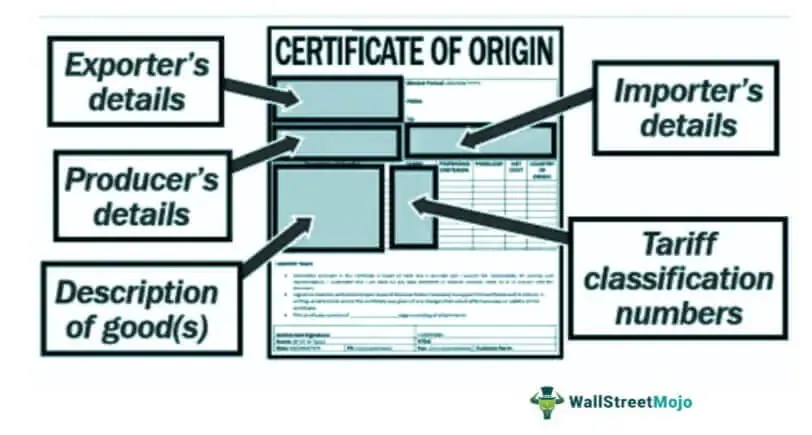

In international trade, the Certificate of Origin (CO) serves a fundamental function by certifying the specific country where goods are manufactured, processed, or harvested, thereby confirming their origin. This recognition is indispensable for numerous reasons, primarily for adhering to international trade agreements and regulations that dictate the movement of goods across borders. The CO, a pivotal document in trade, assists in determining the applicable tariffs, which directly impacts the pricing and competitiveness of products in global markets. Furthermore, the CO supports fair trade practices by confirming the origin of goods, which aids in maintaining transparency and integrity in trade dealings, reducing the incidence of fraud and mislabeling.

This article provides a comprehensive examination of the various types of Certificates of Origin available, their significance in international trade, the systematic procedure to obtain these documents, and their indirect influence on algorithmic trading strategies. By understanding these elements, businesses can ensure compliance with trade regulations and maximize the economic benefits derived from international trading activities.

## Table of Contents

## Understanding the Certificate of Origin

A Certificate of Origin (CO) is a pivotal document in the framework of international trade. It serves as an official attestation of the country in which the goods in question were manufactured or produced. This certification is indispensable for various reasons, notably in ensuring adherence to customs regulations and trade agreements, thereby facilitating smoother transactions across international borders.

COs enforce compliance with the origin criteria outlined in trade agreements. They are integral to the administration of trade policies since they confirm the product nationality, which has significant repercussions for tariff applications. The basis for calculating these tariffs often hinges on the country of origin as documented in the CO. According to these trade agreements, goods may qualify for reduced tariff rates, affecting the overall cost and competitiveness of the products in international markets.

Beyond tariff implications, COs play a crucial role in determining the eligibility of goods for preferential treatment under various international agreements, such as free trade agreements (FTAs). By providing proof of origin, exporters can capitalize on the benefits afforded by these agreements, thereby gaining a competitive edge through reduced costs and enhanced access to foreign markets.

Moreover, COs serve as a tool for preventing fraudulent trade practices. By authenticating the origin of goods, they help to uphold production standards and establish accountability, thereby maintaining fair trade practices. For importers, COs offer assurance regarding the origin of products, contributing to the transparency and integrity of the supply chain.

In summary, Certificates of Origin are fundamental to the functioning of international trade processes, ensuring compliance with various regulations and fostering trade relations through verifiable origination details. Their impact on tariffs, eligibility for trade advantages, and the prevention of trade malpractices underscores their importance in global commerce.

## Types of Certificates of Origin

Certificates of Origin (COs) are vital documents in international trade that identify the country where goods were produced. They play a significant role in determining the applicable duties and ensuring compliance with trade agreements. COs are categorized mainly into three types, each serving different purposes in the global trading environment.

**Nonpreferential Certificates of Origin** indicate that the goods being traded do not qualify for reduced tariffs under any specific trade agreements. These certificates are essential for goods entering markets that impose standard tariff rates irrespective of any trade agreements. Nonpreferential COs help in establishing the product's origin, thereby ensuring that standard customs duties are applied correctly, without the benefits of preferential tariffs. They provide a baseline assurance of the goods' nationality without impacting trade agreement concessions.

**Preferential Certificates of Origin** are used when goods are eligible for reduced tariffs or other advantages under a free-trade or preferential trade agreement. Countries that participate in bilateral or multilateral trade agreements often have specific criteria that products must meet to benefit from reduced tariffs. Preferential COs confirm that goods meet these criteria, thereby allowing traders to take advantage of reduced barriers such as lower customs duties or complete duty exemptions. This type of CO facilitates trade by making goods more competitive in the target markets due to the cost savings from reduced tariffs.

**Electronic Certificates of Origin (e-COs)** represent the digital evolution of trade documentation. They offer several advantages over traditional paper-based COs, including increased efficiency, reduced errors, and enhanced security. By automating the application and verification process, e-COs reduce processing times and the risk of document manipulation. They also contribute to greater transparency in international trade operations by providing an accessible digital trail. The use of e-COs is increasingly favored in modern trade systems, aligning with the broader digitization trends across global supply chains.

The distinct types of COs reflect their roles in facilitating international trade, whether through standard compliance, leveraging trade agreements, or utilizing digital advancements to streamline trade processes.

## Importance and Benefits of COs

Certificates of Origin (COs) are vital documents in international trade, serving to determine the applicable tariffs on goods, which directly affects their cost in global markets. By establishing the country of origin, COs help assess whether goods are eligible for preferential tariffs or fall under the general tariff rates on imports. In contexts where specific trade agreements apply, COs can substantiate claims for tariff reductions or exemptions, thus impacting the competitive pricing of products in international commerce.

Beyond tariff implications, COs are essential for ensuring adherence to import regulations and mitigating the risk of customs delays or legal issues. By providing verifiable proof of origin, these documents facilitate the customs clearance process, reducing the chances of shipments being held for further inspection or facing penalties due to discrepancies in documentation. This compliance aspect of COs is crucial for maintaining the smooth flow of goods across borders, minimizing disruptions in the supply chain.

Furthermore, COs play a significant role in combating unfair trade practices, such as dumping, which involves exporting goods at unfairly low prices to gain market dominance. By verifying the origin and production standards of goods, COs aid in enforcing regulations that protect domestic industries from such practices. This verification process ensures that products meet the necessary quality and safety standards, thereby promoting fair trade and fostering trust among trading partners.

In summary, Certificates of Origin are indispensable for determining tariffs, ensuring regulatory compliance, and maintaining fair trade practices. Their role in international trade dynamics is crucial for facilitating seamless cross-border transactions and protecting markets from malpractices.

## Steps to Obtain a Certificate of Origin

To obtain a Certificate of Origin (CO), exporters must follow a structured series of steps designed to ensure compliance with international trade regulations. The process typically involves four key stages: registration, application, verification, and issuance.

**Registration**: Exporters must first register with an accredited chamber of commerce or an authorized certifying body. This step is crucial as only recognized entities can issue legally valid Certificates of Origin. The registration process often requires the submission of business credentials and proof of company identity. This preliminary step verifies that exporters are legitimate business entities engaged in the trade of goods.

**Application**: Once registered, exporters need to complete and submit the required documentation that specifies the details of the goods and their origin. The application form generally includes crucial information such as the description of the goods, the manufacturer, the country of origin, and the destination country. Documentation may also be required to substantiate the claims about the origin of goods, such as invoices, bills of lading, or a manufacturer’s declaration.

**Verification**: After submission, the certifying authority conducts a thorough review of the application to ensure it adheres to international guidelines and trade agreements. This verification process might involve checking the authenticity of the documents provided and ensuring that the details align with the regulatory requirements of both the exporting and importing countries. The verification aims to confirm the accuracy and integrity of the information submitted, preventing fraud and ensuring that only compliant goods receive a CO.

**Issuance**: Upon successful verification, the certifying authority issues the Certificate of Origin. Increasingly, these are issued in electronic format (e-CO), which enhances the efficiency, accuracy, and security of the trade documentation process. The electronic CO is then used by the exporter in trade transactions to facilitate customs clearance and qualify for any tariff benefits that the goods might be eligible for under trade agreements.

The successful completion of these steps enables exporters to demonstrate due compliance with international trade norms, thereby smoothing the pathway for their goods through customs and reducing the potential for delays or additional costs.

## Certificate of Origin in Algo Trading

Incorporating Certificates of Origin (COs) into [algorithmic trading](/wiki/algorithmic-trading) strategies can significantly enhance the assessment of international trade conditions and optimize trading decisions. Though traditionally a logistical facet of trade, COs [carry](/wiki/carry-trading) critical information that can influence financial algorithms by shaping trade flows and tariff structures.

COs play a pivotal role in defining tariffs, which directly impact the pricing strategy and competitiveness of goods on the global stage. For instance, a preferential CO can lower tariffs due to trade agreements, reducing import costs and potentially altering supply-demand dynamics in favor of countries with favorable trade terms. Conversely, nonpreferential COs might maintain higher tariffs, affecting the cost and flow of goods from specific regions.

Algorithmic trading platforms can leverage CO data to better forecast market trends, price movements, and the ensuing effects on financial instruments impacted by such trades. By integrating CO data, algorithms can adjust to changing tariff landscapes, offering a more nuanced comprehension of market conditions. For example, algorithms can be designed to:

1. **Analyze Tariff Changes:** Algorithms can use CO data to detect shifts in tariff regulations and forecast their potential impact on commodity prices. By creating predictive models, traders can simulate market conditions and derive insights on how these changes might alter competitive dynamics and impact stock or commodity indices.

2. **Optimize Trading Decisions:** The data from COs can serve as input for constructing predictive analytics models that identify trading signals. By monitoring CO-related tariff adjustments, algorithms can refine decision-making processes, promoting investments in sectors or stocks likely to benefit from reduced trade barriers.

3. **Risk Management:** Understanding the origin and tariff status of goods helps in assessing geopolitical and economic risks associated with various trading strategies. Algorithms can quantify these risks and adjust trading portfolios accordingly, balancing exposures and safeguarding against potential market instability.

By considering how COs influence tariffs and trade competitiveness, algorithmic traders can achieve a more strategic alignment with global trade trends, thus enhancing the efficacy of market assessments and performance. Such integration underscores the importance of COs not just in logistics but in providing critical insights that shape financial markets and trading outcomes.

## Conclusion

The Certificate of Origin (CO) remains a cornerstone in international trade by playing a pivotal role in maintaining regulatory compliance and promoting economic cooperation across borders. Its importance is underscored by its utility in preventing trade malpractices, establishing product nationality, and determining applicable tariffs. This regulatory instrument not only optimizes the logistical aspects of trade but also ensures that international transactions are conducted transparently and fairly, thereby fostering a competitive global marketplace.

In the context of algorithmic trading, understanding COs becomes crucial for effectively analyzing market dynamics and optimizing trading strategies. The origins of commodities, as verified by COs, can significantly affect market conditions, influencing tariff structures, impacting the pricing mechanisms, and altering the competitive landscape of goods in international markets. Consequently, algo trading platforms can integrate CO data to devise algorithms that better anticipate market trends and exploit trade opportunities.

As international trade systems grow in complexity and digitalization becomes more prevalent, the role of the Certificate of Origin is expected to evolve, further enhancing transparency and fairness in trade practices. By leveraging advancements like electronic Certificates of Origin (e-COs), the process becomes more streamlined, reducing errors and enhancing security. Thus, the ongoing evolution in global trade emphasizes the enduring significance of the CO, making it indispensable not only for traditional trade practices but also for the advanced mechanisms driving modern financial markets.

## References & Further Reading

[1]: International Chamber of Commerce. ["Certificates of Origin."](https://iccwbo.org/business-solutions/certificates-of-origin/)

[2]: World Customs Organization. ["The Customs Convention on the A.T.A. Carnet for the Temporary Admission of Goods."](https://www.wcoomd.org/-/media/wco/public/global/pdf/about-us/legal-instruments/conventions-and-agreements/ata/pf_ata_conv_text.pdf?la=en)

[3]: International Trade Centre. ["Export and Import Documentation."](https://www.intracen.org/resources/data-and-analysis/trade-statistics)

[4]: United Nations Economic Commission for Europe. ["Trade Facilitation: Certificate of Origin."](https://unece.org/trade/uncefact/tf_recommendations)

[5]: ["Blockchain in Trade Facilitation: Sectoral Challenges in Certificates of Origin (COO) Implementation"](https://unctad.org/system/files/official-document/tcsdtlinf2023d1_en.pdf) by UNCTAD

[6]: ["Global Trade and Customs Journal"](https://law-store.wolterskluwer.com/s/product/global-trade-and-customs-journal-online/01t4R00000Oirl8QAB) for insights into international trade documentation and regulations.