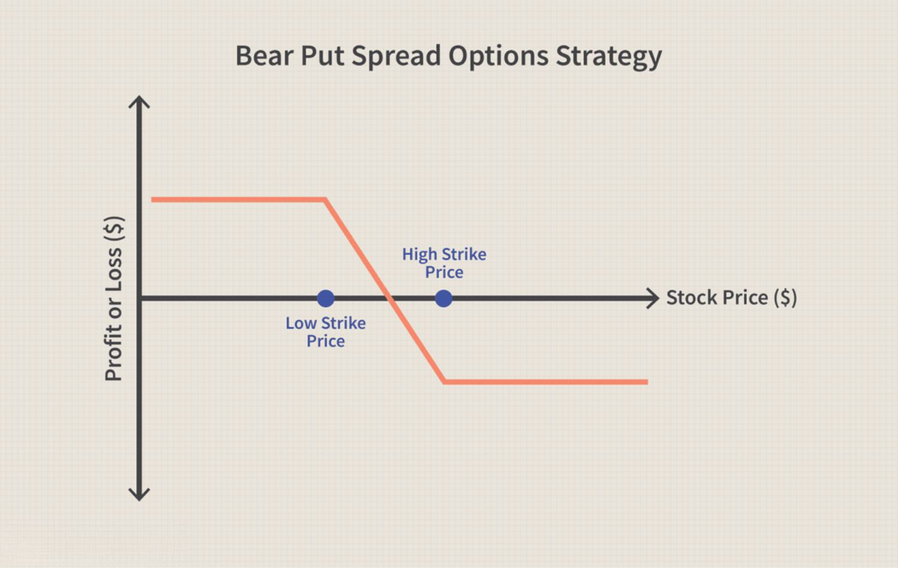

Bear markets, characterized by prolonged periods of declining asset prices, pose significant challenges to investors, often leading to substantial financial losses and a negative impact on market sentiment. These downturns highlight the necessity for strategic planning in investment portfolios, as they stress-test the solidity and resilience of one's financial strategy. During such times, safeguarding investments becomes crucial, ensuring that portfolios are protected against the severe erosive effects bear markets can induce.

To mitigate these risks, investors must become familiar with various investment protection strategies. These strategies are designed not only to preserve capital but also to leverage potential opportunities that arise even in declining markets. Certificates of Deposit (CDs) and algorithmic trading stand out among the diverse range of options available. CDs are fixed-income instruments that provide guaranteed returns and safety from the volatility inherent in equity markets, thus acting as a stable cornerstone in investment portfolios during turbulent economic times.



On the other hand, algorithmic trading, which involves using automated computational algorithms to execute trades based on predefined criteria, provides an innovative approach to navigating bear markets. It offers the potential to swiftly capitalize on market inefficiencies and trends, thereby adding a layer of active management to an investment strategy. The combination of these strategies facilitates a more robust approach to market downturns. By harnessing the steady income from CDs alongside the dynamic capabilities of algorithmic trading, investors can build a balanced portfolio capable of weathering financial storms.

Ultimately, integrating a mixture of different strategies can enable investors to remain adaptable in the face of uncertainty. Such an approach not only diversifies risk but also aligns long-term investment goals with current market conditions. Success in bear markets depends heavily on preparation and the utilization of strategies that collectively address both safety and opportunity.

## Table of Contents

## Understanding Bear Markets

A bear market is commonly defined as a period when the prices of securities, particularly stocks, fall by at least 20% from recent highs, sustained over a period of at least two months. These prolonged declines are often accompanied by widespread investor pessimism and negative sentiment. A bear market is typically triggered by a range of economic factors, such as declining corporate earnings, rising unemployment, or macroeconomic events like geopolitical tensions and disruptions. During these times, investors may experience decreased confidence in the economy, causing them to retract investments or withhold new funds from entering the market.

Historically, bear markets show recurring patterns that correlate with economic cycles. For instance, the Great Depression beginning in 1929, the dot-com bubble burst in 2000, and the global financial crisis in 2008 are notable examples. Each event demonstrated the significant impact of economic contractions on stock valuations, further accentuating the cyclical nature of these market downturns.

Several economic indicators can hint at the onset of a bear market. These include declining GDP, particularly over consecutive quarters, and increasing unemployment rates. Additionally, an inverted yield curve—a situation where short-term interest rates exceed long-term rates—often predicts economic downturns and subsequent bear markets. Other signals include falling consumer confidence and declining industrial production, which can often precede decreases in stock prices.

The psychological impact of bear markets can be profound, instilling fear and anxiety among investors. This emotional response often leads to panic selling, where investors sell off assets in anticipation of further losses. Psychological phenomena such as loss aversion may prevent investors from realizing the actual value of their investments, exacerbating market downturns as more participants sell in response to decreasing market conditions. Consequently, this can prolong the duration and severity of the bear market as confidence takes longer to restore.

## Investment Protection Through CDs

Certificates of Deposit (CDs) are financial instruments offered by banks and credit unions that provide a fixed [interest rate](/wiki/interest-rate-trading-strategies) in exchange for the customer agreeing to leave a lump sum deposit untouched for a predetermined period. The functioning of a CD is relatively straightforward. An investor deposits a fixed amount of money into a CD account for a specified term, which can range from a few months to several years. In return, the bank pays the depositor interest, typically at a higher rate than a standard savings account, because the funds are not accessible until the maturity date. Upon maturity, the investor receives the principal amount along with the accrued interest.

### Pros and Cons of Using CDs as a Safe Haven During a Bear Market

**Pros:**
- **Capital Preservation:** CDs are considered low-risk investments, making them appealing during bear markets when preserving capital becomes a priority.
- **Fixed Interest Rates:** They offer guaranteed returns, providing stability and predictability in a declining market.
- **Insurance Protection:** In the United States, CDs are insured by the Federal Deposit Insurance Corporation (FDIC) up to the limit of $250,000 per depositor, per institution, ensuring the safety of invested capital.

**Cons:**
- **Limited Liquidity:** The funds are locked up for the duration of the term, leading to potential penalties or loss of interest if an early withdrawal is needed. 
- **Lower Returns:** Compared to stocks and other aggressive investment vehicles, CDs typically offer modest returns, which might not keep up with inflation over extended periods.

### Comparing CDs with Stocks and Other Investment Options

CDs provide a stark contrast to stocks in risk-reward profiles. While stocks offer the potential for significant appreciation, particularly over the long term, they also involve higher risk, especially during bear markets. CDs, on the other hand, prioritize the safety of principal and stable returns. In a diversified investment portfolio, CDs can serve as the conservative allocation, acting as a ballast against the [volatility](/wiki/volatility-trading-strategies) of stocks and more aggressive investments like mutual funds or exchange-traded funds (ETFs).

When compared with bonds, another conservative investment option, CDs typically offer similar safety but with more limited [liquidity](/wiki/liquidity-risk-premium). Whereas bonds can be sold before maturity in secondary markets, incurring potential capital gains or losses, CDs require holding onto maturity for full benefit.

### How to Effectively Use CDs to Balance Risk in a Diversified Portfolio

Incorporating CDs in a diversified portfolio involves strategically balancing the lower risk and stable return characteristics of CDs with higher-risk, higher-reward investments. One effective strategy is the laddering technique, which can optimize liquidity and returns. By staggering the maturity dates of CDs, investors ensure regular access to portions of their funds, allowing for potential reinvestment at potentially higher rates if interest rates rise.

### Python Example for Calculating CD Returns

For investors interested in calculating the future value of a CD, the formula is as follows:

$$
FV = P \times (1 + \frac{r}{n})^{n \times t}
$$

Where:
- $FV$ = Future Value of the investment including interest
- $P$ = Principal investment amount 
- $r$ = Annual interest rate (decimal)
- $n$ = Number of times interest is compounded per year
- $t$ = Number of years the money is invested

Here's a simple Python function to calculate the future value of a CD:

```python
def calculate_cd_future_value(principal, rate, times_compounded, years):
    return principal * (1 + rate / times_compounded) ** (times_compounded * years)

# Example
principal = 10000  # $10,000
annual_rate = 0.03  # 3% interest
times_compounded = 1  # Compounded yearly
years = 5  # 5-year term

future_value = calculate_cd_future_value(principal, annual_rate, times_compounded, years)
print(f"The future value of the CD is: ${future_value:.2f}")
```

In conclusion, while CDs may not offer as high returns as riskier assets, their security and predictability can make them valuable components in an investment strategy focused on risk management, particularly during the uncertainties of bear markets.

 to Algorithmic Trading

Algorithmic trading, often referred to as algo trading, involves the use of computer algorithms to execute trading orders systematically. These algorithms determine the timing, price, and quantity of orders, relying on pre-set criteria or model predictions. The basic principle of [algorithmic trading](/wiki/algorithmic-trading) is to leverage computational power to process large data sets faster than human traders, allowing for the execution of trades at speeds and frequencies impossible for a human.

Algorithms automate investment strategies by systematically following specific rules derived from historical data analysis, statistical models, or [machine learning](/wiki/machine-learning) outcomes. This mechanization eliminates emotional decision-making, a common pitfall for human traders during volatile markets. For instance, an algorithm can be programmed to execute trades when an asset's price moves beyond a particular threshold or when a certain market condition is triggered.

Algorithmic trading has several advantages, especially during volatile markets. One significant benefit is the ability to respond rapidly to market changes and to exploit even fleeting price discrepancies for profitable trades. This is particularly useful in bear markets, where prices often fluctuate wildly. Furthermore, algorithmic trading aids in maintaining discipline amidst market turbulence by adhering strictly to predefined strategies, thus mitigating impulse trading based on emotion rather than analysis.

Common strategies employed by algorithmic traders in bear markets include short-selling, statistical [arbitrage](/wiki/arbitrage), and market-making. Short-selling provides the opportunity to profit from declining asset prices, a frequent scenario in bear markets. Statistical arbitrage involves complex modeling techniques to identify pricing inefficiencies across related securities, enabling traders to execute trades that capitalize on these gaps. Market-making algorithms provide liquidity to the market by simultaneously offering buy and sell quotes, [earning](/wiki/earning-announcement) profits from the spread, and potentially cushioning the impacts of market downturns.

In summary, algorithmic trading leverages advanced computing techniques to automate trade execution based on predefined criteria. It offers speed, precision, and objectivity, which can be crucial advantages when navigating the turbulence often associated with bear markets.

## Algorithmic Trading Strategies for Bear Markets

Algorithmic trading, characterized by using complex algorithms to make high-frequency trading decisions, becomes particularly valuable during bear markets. One widely employed strategy in declining markets is short-selling. Short-selling involves borrowing and selling securities with the expectation that their prices will fall, allowing traders to buy them back at a lower price and pocket the difference. This technique, when integrated with algorithms, can optimize the timing and execution of trades, thus amplifying potential gains even as the market declines.

Moving averages and other technical indicators serve crucial roles in algorithmic trading strategies aimed at bear markets. Moving averages, such as simple moving averages (SMA) and exponential moving averages (EMA), help identify the general direction of an asset over a specific period. For example, a short-term SMA crossing below a long-term SMA could be a signal that a downward trend is strengthening. These indicators are often used in trading algorithms to automatically trigger buy or sell orders.

Mathematically, a simple moving average is represented as:

$$
\text{SMA}_n = \frac{1}{n} \sum_{i=0}^{n-1} P_i
$$

where $P_i$ is the asset's price at time $i$ and $n$ is the number of observations.

Technical analysis may also employ other indicators, such as the Relative Strength Index (RSI) and moving average convergence/divergence (MACD), to generate signals about potential price movements. These indicators can be incorporated into algorithmic trading models to strengthen forecasts and trigger precision trades.

Data-driven insights are pivotal in algorithmic trading, especially in turbulent market conditions. These insights, derived from historical data and statistical models, allow algorithms to adapt to market changes swiftly and accurately. Machine learning techniques, including regression analysis and neural networks, are increasingly employed to enhance the predictive power of algorithms. By analyzing vast data sets, these algorithms can uncover patterns and relationships that human traders might overlook.

Python is a popular choice for implementing algorithmic trading strategies due to its rich ecosystem of libraries like Pandas for data manipulation, NumPy for numerical computations, and TA-Lib for technical analysis. A simple example of using Python to calculate a moving average is as follows:

```python
import pandas as pd

# Assuming 'data' is a DataFrame with a column 'Close' for closing prices
data['SMA_50'] = data['Close'].rolling(window=50).mean()
```

Case studies of successful algorithmic trading during bear markets highlight the efficacy of these strategies. For instance, during the 2008 financial crisis, some hedge funds employed algorithmic trading strategies to detect inefficiencies and profit from short positions. Another example involves the COVID-19 pandemic, where certain algorithmic traders capitalized on extreme volatility through high-frequency trading, adapting rapidly to shifting market conditions.

These strategies not only emphasize the technical sophistication inherent in algorithmic trading but also showcase its practical application in navigating the challenges of a bear market. By integrating short-selling with data-driven insights and technical indicators, algorithmic trading provides a robust framework for achieving profitability even amidst declining markets.

## CD Laddering Technique

CD laddering is a strategic investment approach that involves purchasing a series of Certificates of Deposit (CDs) with different maturity dates. This technique aims to maximize returns while maintaining liquidity and reducing interest rate risk. By staggering the maturity dates, an investor can take advantage of higher interest rates for longer-duration CDs while ensuring cash flow at regular intervals.

### Step-by-Step Guide to Building a CD Ladder

1. **Determine the Total Investment Amount**: Decide on the total amount you wish to invest in CDs. This should align with your overall investment strategy and risk tolerance.

2. **Choose Ladder Duration and Intervals**: Decide on the total duration of the ladder (e.g., three years, five years) and the frequency of maturity intervals (e.g., every six months, annually). Common choices are annual intervals over a three to five-year horizon.

3. **Select CDs of Different Maturities**: Purchase CDs with staggered maturity dates. For example, if you have a five-year ladder with annual intervals, buy CDs maturing in one, two, three, four, and five years.

4. **Reinvest Matured CDs**: As each CD matures, reinvest the principal and interest in a new CD at the end of the ladder's duration. This takes advantage of potentially higher interest rates and keeps the ladder going.

### How Laddering Can Provide Liquidity and Increase Returns

CD laddering offers several advantages:

- **Liquidity**: With CDs maturing at regular intervals, investors have access to a portion of their investment without incurring penalties for early withdrawal. This regular access to funds can be especially important for meeting unexpected financial needs.

- **Higher Returns**: Typically, longer-term CDs offer higher interest rates than shorter-term ones. By maintaining a CD ladder, investors can benefit from these higher rates over time while still preserving liquidity.

- **Interest Rate Risk Mitigation**: Laddering spreads interest rate risk across different maturities. If interest rates rise, maturing CDs can be reinvested at higher rates. Conversely, if rates fall, the ladder already includes some longer-term CDs locked in at higher rates.

### Examples of Different Maturity Strategies in CD Laddering

- **Short-Term Ladder**: This might include CDs maturing every three months over a one-year period. It's ideal for investors who prioritize liquidity and have a short investment horizon.

- **Long-Term Ladder**: Consists of CDs with maturities extending up to five or more years. This approach suits investors looking to maximize returns over a longer period.

- **Stepped Ladder**: Involves incrementally increasing the duration between maturities as the ladder progresses, such as starting with six months, then one year, two years, and so on. This variant balances liquidity needs and the desire for higher long-term returns.

- **Equal Interval Ladder**: Every CD has identical intervals between maturities, like a consistent one-year gap. This standard method provides regular reinvestment opportunities and stabilizes cash flow.

CD laddering is a versatile strategy that enhances an investor's ability to manage liquidity, earn attractive returns, and mitigate interest rate risks, making it an attractive option for balancing a diversified investment portfolio.

## Risk Management in Bear Markets

Risk management in bear markets is vital for investors looking to mitigate losses and protect their portfolios. A fundamental step in this process is assessing risk tolerance and maintaining financial discipline. Risk tolerance refers to the degree of variability in investment returns that an individual is willing to withstand. It is influenced by factors such as investment goals, time horizon, and personal financial circumstances. Understanding one’s risk tolerance helps in making informed decisions that align with financial objectives, especially during market downturns.

Diversification is a crucial strategy to reduce risk. By allocating investments across various asset classes, industries, and geographic regions, investors can minimize the impact of a poor-performing asset on their overall portfolio. This approach ensures that not all investments are exposed to the same market risks. For example, bonds and real estate might perform well when equity markets are declining, providing a buffer against losses.

Defensive stocks play a significant role in protecting portfolios during bear markets. These include companies in essential industries such as utilities, healthcare, and consumer staples, which tend to maintain stable earnings regardless of economic conditions. Sector allocation also comes into play by shifting investments towards industries less sensitive to economic cycles. For example, demand for utilities remains relatively constant, providing a steady income stream even when the broader market falters.

Setting stop-loss orders is a practical method for managing potential losses. A stop-loss order is an instruction to sell a security when it reaches a certain price, thus limiting an investor's loss on a position. This tool can help investors maintain discipline by preventing emotional decisions during times of high volatility. For instance, if an investor sets a stop-loss order 10% below the purchase price of a stock, it ensures automatic selling if the stock price drops, locking in the loss at a manageable level.

Managing emotional responses to market changes is essential. In bear markets, fear and panic can lead to irrational decision-making. Investors need to remain calm and adhere to their pre-determined investment strategies, focusing on long-term goals rather than short-term market fluctuations. This disciplined approach helps mitigate emotional biases, such as selling off assets prematurely during market downturns, which can lead to realized losses.

By combining these strategies, investors can better weather the storm of bear markets, preserving their capital and positioning themselves for success when the market eventually recovers.

## Integrating CDs and Algorithmic Trading

Integrating multiple investment strategies, such as combining Certificates of Deposit (CDs) with algorithmic trading, can provide a comprehensive approach to managing and growing financial portfolios during bear markets. Diversifying investment techniques can help stabilize income streams while maximizing potential gains through dynamic trading strategies.

Certificates of Deposit offer a low-risk, stable income by securing funds over fixed periods at predetermined interest rates. This predictability can be particularly appealing during bear markets when market volatility can erode the value of riskier investments. However, the opportunity for substantial gains through CDs alone may be limited. Conversely, algorithmic trading can exploit market inefficiencies and even benefit from declining markets by employing strategies like short-selling.

Balancing the stable income from CDs with the active gains achieved through algorithmic trading involves strategic timing and allocation of resources. Algorithmic trading, supported by sophisticated mathematical models and real-time data analysis, can optimize the timing of CD investments by forecasting market trends and interest rate movements. Algorithms can assist in determining optimal entry and [exit](/wiki/exit-strategy) points for CD investments, ensuring the highest possible yield given market conditions.

Moreover, technology enables the integration of various data inputs to enhance decision-making. For example, using Python libraries such as Pandas for data manipulation or NumPy for numerical computation, investors can devise algorithms that continuously assess economic indicators and interest rates. These tools allow for dynamic portfolio reallocation, shifting liquidity toward CD investments when predicted returns are favorable, or toward equities and derivatives when forecasts suggest potential market recoveries.

Here's a simple example of Python code demonstrating how one might calculate optimal timing for CD investment decisions based on predicted interest rate movements:

```python
import numpy as np
import pandas as pd
from sklearn.linear_model import LinearRegression

# Hypothetical interest rate data
interest_rate_data = pd.DataFrame({
    'time': np.arange(0, 10),
    'rate': [2.5, 2.55, 2.6, 2.67, 2.65, 2.7, 2.75, 2.8, 2.85, 2.9]
})

# Create a linear regression model to predict interest rates
model = LinearRegression()
model.fit(interest_rate_data[['time']], interest_rate_data['rate'])

# Predict future interest rates
future_times = pd.DataFrame({'time': np.arange(10, 15)})
predicted_rates = model.predict(future_times)

# Output the predictions
future_times['predicted_rate'] = predicted_rates
print(future_times)
```

Real-world examples demonstrate the utility of combining CDs with algorithmic strategies. During periods of heightened volatility, algorithms can trigger the strategic withdrawal from traditional equity investments in favor of short-term CDs, thus safeguarding capital while awaiting more stable conditions to reinvest in aggressive trading pursuits.

In sum, integrating CDs with algorithmic trading offers a dual advantage of stability and agility. This hybrid strategy allows investors to navigate the complexities of bear markets, sustaining income through safe investments while simultaneously leveraging technology to capitalize on market fluctuations. Such a multifaceted approach ensures both protection and potential growth, reinforcing the investor's ability to withstand and thrive in unpredictable financial climates.

## Conclusion

In navigating the challenges of bear markets, investors have a range of strategies at their disposal to protect and potentially grow their investments. The article reviewed several key approaches, including the use of Certificates of Deposit (CDs) as a stable, low-risk investment option, alongside more dynamic methods such as algorithmic trading to capitalize on market volatility. Each strategy offers unique benefits and can be tailored to suit an investor's needs depending on their risk tolerance and financial goals.

Financial education and strategic planning offer enduring value in the context of volatile markets. By understanding the fundamentals of investment, individuals can make informed decisions that align with their financial objectives, reducing undue risk exposure. Educated investors are less likely to react emotionally during market downturns, maintaining a disciplined approach to portfolio management.

It's essential for investors to remain proactive and adaptable, regularly reassessing their strategies in response to changing market conditions and personal financial circumstances. Adaptability ensures that investments remain aligned with one's risk profile and evolving financial landscape.

Investment strategies have evolved significantly over time, with technological advancements and new financial products providing enhanced tools and opportunities for managing market challenges. Combining traditional methods like CDs with innovative techniques such as algorithmic trading demonstrates the dynamic interplay between stability and growth potential. As markets continue to evolve, investors who stay informed and flexible in their approach are more likely to succeed in safeguarding and growing their financial assets.

## References & Further Reading

[1]: Bergstra, J., Bardenet, R., Bengio, Y., & Kégl, B. (2011). ["Algorithms for Hyper-Parameter Optimization."](https://papers.nips.cc/paper/4443-algorithms-for-hyper-parameter-optimization) Advances in Neural Information Processing Systems 24.

[2]: ["Advances in Financial Machine Learning"](https://www.amazon.com/Advances-Financial-Machine-Learning-Marcos/dp/1119482089) by Marcos Lopez de Prado

[3]: ["Evidence-Based Technical Analysis: Applying the Scientific Method and Statistical Inference to Trading Signals"](https://www.amazon.com/Evidence-Based-Technical-Analysis-Scientific-Statistical/dp/0470008741) by David Aronson

[4]: ["Machine Learning for Algorithmic Trading"](https://github.com/stefan-jansen/machine-learning-for-trading) by Stefan Jansen

[5]: ["Quantitative Trading: How to Build Your Own Algorithmic Trading Business"](https://www.amazon.com/Quantitative-Trading-Build-Algorithmic-Business/dp/1119800064) by Ernest P. Chan