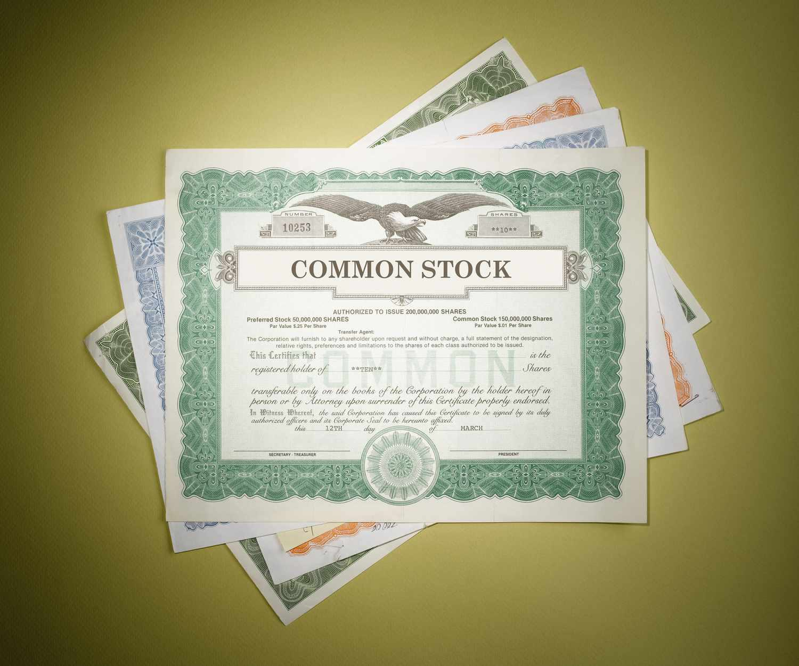

In the world of finance, the intersection of stock investment and algorithmic trading has paved the way for a new era of strategic investment approaches. Stock trading is no longer confined to the manual buying and selling of shares by individual traders. Instead, automation and data-driven strategies have reshaped the landscape, giving rise to new concepts such as investment stock certification and certified stock algorithmic trading.

Investment stock certification involves a rigorous process of verifying the authenticity and compliance of stocks, serving as a safeguard for investors. This certification can add a layer of assurance and credibility to an investment, especially in a market where trust is paramount. Certified stocks are those for which stock certificates have been issued, confirming that the underlying assets meet specified standards.

Algorithmic trading, or algo trading, enhances these investment strategies by employing computer algorithms to execute trades. These algorithms rely on sophisticated mathematical models and fast computing technologies to make decisions in milliseconds, often enabling traders to exploit small market inefficiencies. By integrating real-time data analysis, algo trading minimizes human error and has become an essential component of modern trading.

The combination of certified stock and algorithmic trading optimizes investment strategies, offering a robust framework for navigating the complexities of financial markets. As traders and institutional investors increasingly recognize these synergies, opportunities for innovation and growth continue to expand. This article provides insights into these complex yet rewarding financial concepts, exploring what it means to be certified in stock trading and how algorithmic trading integrates into this evolving landscape.

## Table of Contents

## Understanding Investment Stock Certification

Investment stock certification is crucial in the financial landscape, primarily serving to verify the authenticity and compliance of stocks intended for trading. This process helps ensure that the stocks are legitimate, thereby safeguarding the interests of investors and enhancing the integrity of the financial markets.

Certified stock often refers to shares that come with a stock certificate, a physical or electronic document that serves as proof of stock ownership. This certification adds a layer of assurance and credibility to the investment, as it authenticates the legitimacy of the stocks and confirms the investor’s ownership rights.

The process of obtaining stock certification involves several key steps. Firstly, the issuing company must ensure that all stocks are duly registered and comply with the pertinent financial regulations and market standards. This may involve a series of audits and checks by independent third-party organizations or regulatory bodies to validate that the stocks meet legal and financial criteria. The process ensures that the stocks are free from any encumbrances or legal disputes, thereby protecting investors from potential financial risks.

The significance of stock certification extends beyond simple ownership verification. It provides investors with confidence in the quality and legality of their investments. In many markets, certified stocks are considered more reliable, making them attractive to both individual and institutional investors. Moreover, certification can influence a stock's marketability, as certified stocks may be more easily tradeable in secondary markets, thus providing [liquidity](/wiki/liquidity-risk-premium) to investors and reinforcing market efficiency.

In conclusion, investment stock certification plays a vital role in the smooth functioning of stock markets by ensuring that stocks meet necessary compliance standards and are legitimate. This process not only protects investors but also upholds the credibility of financial markets by facilitating trust and transparency in stock transactions.

## The Role of Certificated Stock in the Market

Certificated stock is integral to the operation of the futures market, ensuring both quality and compliance of traded commodities. Typically, certificated stock refers to shares for which a stock certificate has been issued, enhancing the credibility and authenticity of the investment. In the context of futures contracts, the role of certificated stock is particularly important as it acts as a testament to the quality and standardization of the underlying commodity. This certification process guarantees that the commodities meet minimum specifications, thereby instilling confidence in investors regarding the futures contracts they engage in.

The certification process involves a detailed verification of the commodity's attributes, which is essential to match the specified standards set by the futures exchanges. This process offers assurance to investors that the commodities they are trading are of the described quality and quantity, thereby reducing the risk associated with commodity trading. The role of certificated stock becomes even more crucial as it helps mitigate discrepancies and potential disputes arising from the delivery of non-compliant commodities.

Key exchanges, such as the Chicago Mercantile Exchange (CME) and the New York Mercantile Exchange (NYMEX), play pivotal roles in certificated stock trading. These exchanges establish stringent requirements and criteria that commodities must meet to be certified for trading. By setting these standards, exchanges ensure that there's uniformity and reliability in the commodities being traded, facilitating a smoother functioning of the futures market. In essence, certificated stock forms the backbone of trust and efficiency in commodity trading, fostering a transparent and reliable trading environment.

## Algorithmic Trading: Transforming Investment Strategies

Algorithmic trading, commonly known as algo trading, represents a significant shift in investment strategies, where computer algorithms and pre-defined execution criteria are leveraged to optimize trading performance. These algorithms analyze market conditions and make trading decisions at speeds and accuracies impossible for human traders, thereby revolutionizing the financial markets.

One of the primary advantages of [algorithmic trading](/wiki/algorithmic-trading) is its ability to enhance decision-making processes. Through the utilization of vast datasets, algorithms can identify patterns and trends that inform strategic trading decisions. This results in minimized human error, as emotional and psychological factors are eliminated from the trading equation. For example, algorithms can rapidly process and interpret historical data, real-time market information, and other financial indicators to execute trades at optimal times, maximizing potential returns.

Several algorithmic trading strategies contribute to this transformation. High-frequency trading ([HFT](/wiki/high-frequency-trading-strategies)) is one such strategy, where powerful computers execute a large number of orders at extremely fast speeds, often within fractions of a second. This strategy relies heavily on sophisticated algorithms designed to react to market changes quicker than a human could detect. Another prominent strategy is statistical [arbitrage](/wiki/arbitrage), which involves complex mathematical models to exploit price inefficiencies between different financial instruments, aiming to profit from the statistical probabilities of price convergence.

Trend-following algorithms form another essential part of algorithmic strategies. These algorithms are designed to identify and capitalize on market trends, based on the principle that prices move in predictable patterns. By analyzing moving averages and other technical indicators, trend-following algorithms can enter and [exit](/wiki/exit-strategy) trades aligned with emerging market trends, potentially leading to profitable outcomes.

Algorithmic trading also facilitates market-making strategies, where algorithms place buy and sell orders to profit from the spread between them. Market makers provide liquidity to markets, ensuring smoother operations and less [volatility](/wiki/volatility-trading-strategies). Algorithms employed in market-making must be highly responsive to ensure efficient order execution in dynamically changing markets.

The introduction of [machine learning](/wiki/machine-learning) and [artificial intelligence](/wiki/ai-artificial-intelligence) into algorithmic trading strategies marks a further evolution of this field. These technologies enable the creation of self-learning algorithms that continuously improve their trading performances by analyzing new data inputs and adjusting their execution strategies accordingly. Machine learning models can identify new market signals and adapt to evolving market conditions without explicit reprogramming.

In conclusion, algorithmic trading significantly impacts market dynamics by increasing efficiency, improving pricing accuracy, and providing deeper liquidity. It facilitates a more precise and systematic approach to trading, which benefits institutional and retail investors alike. However, its rise does bring challenges, such as the management of algorithm-driven flash crashes and the ethical implications of high-frequency trading practices that regulatory bodies continue to address. Overall, algorithmic trading is a powerful tool that is reshaping investment strategies, offering both opportunities and challenges to the modern financial landscape.

## Certified Stock Algorithmic Trading: Bridging the Gap

Certified stock algorithmic trading represents the confluence of verified stock investments and high-speed trading strategies powered by algorithms. At the core of this fusion is the assurance that certifications provide in validating the legitimacy and compliance of stocks within algorithmic frameworks. Such certifications serve as a safeguard against fraudulent securities, thereby enhancing trust among investors who engage in high-frequency trading environments.

Algorithmic trading systems rely on vast datasets to execute trades with efficiency and precision, often utilizing machine learning and artificial intelligence to identify trading opportunities. By integrating certified stocks, these systems can ensure that only legitimate and verified securities are included in their trading portfolios. This adds a layer of compliance, which is particularly critical given the regulatory scrutiny faced by algorithm-driven markets.

Recent advancements in certified stock algorithmic trading are largely driven by technological innovations. For example, blockchain technology is being explored as a potential tool for maintaining immutable records of stock certifications, further ensuring transparency and reducing the potential for fraud. Additionally, the development of sophisticated algorithms capable of real-time verification of certification status can significantly streamline the trading process, since traditional verification methods can be time-consuming and resource-intensive.

Furthermore, trends such as the integration of environmental, social, and governance ([ESG](/wiki/esg-investing)) criteria into algorithmic trading are gaining [momentum](/wiki/momentum). Certified stocks that meet specific ESG standards are increasingly being targeted by algo trading strategies, allowing investors to align their portfolios with sustainable and ethical investment principles while maintaining efficient trading operations.

As technology continues to evolve, the implementation of artificial intelligence and machine learning in certified stock algorithmic trading is expected to grow, offering new possibilities to enhance both the speed and accuracy of trading decisions. This underscores the need for continuous innovation and adaptation within the financial sector to maintain competitiveness and compliance in an ever-changing market landscape.

## Educational Pathways for Aspiring Traders

Aspiring traders seeking a career in stock investment and algorithmic trading have access to various educational resources and certification programs designed to equip them with the necessary skills and knowledge. These programs are tailored to different levels of expertise, from beginners to advanced traders, and focus on essential aspects of the field.

To excel in certified stock trading, an understanding of financial markets, securities regulations, and trading practices is crucial. Key skills include financial analysis, risk management, and proficiency in using trading platforms. Additionally, a strong grasp of financial instruments and market dynamics is essential for making informed trading decisions.

For those interested in algorithmic trading, knowledge of programming languages and quantitative analysis is imperative. Algorithmic traders must be proficient in coding, often using languages such as Python, R, or C++, to develop and implement trading algorithms. Understanding data structures, statistical models, and machine learning techniques further enhances trading strategies.

Several online courses offer comprehensive training in these areas. Platforms like Coursera and edX host courses on financial markets, algorithmic trading, and related programming skills. These courses often include modules on [backtesting](/wiki/backtesting) algorithms, data analysis, and real-time trading applications. Specifically, programs like the "Algorithmic Trading and Finance Models with Python, R, and Stata Essential Training" provide practical insights and code samples for aspiring algo traders.

Professional certifications can significantly bolster a trader's credibility. The Chartered Financial Analyst (CFA) designation, for example, is highly regarded in the field of stock investment. For those focusing on algorithmic trading, the Certificate in Quantitative Finance (CQF) offers specialized training in quantitative methods and finance theory.

Each certification and [course](/wiki/best-algorithmic-trading-courses) provides a structured pathway for learning, equipping traders with both theoretical knowledge and practical experience. By pursuing these educational opportunities, aspiring traders can align themselves with industry standards and enhance their career prospects in the ever-evolving field of stock investment and algorithmic trading.

## Benefits and Challenges of Certified Stock and Algo Trading

Combining certified stock trading with algorithmic methods presents various benefits and challenges for traders. By integrating traditional stock certification processes with advanced algorithmic trading techniques, investors can potentially achieve increased efficiency and reduced costs. 

**Benefits**

The primary advantage of certified stock algorithmic trading is increased operational efficiency. Algorithmic trading systems can execute trades at speeds and frequencies far beyond human capabilities. This speed enables the swift execution of certified trades, maximizing the use of small price differentials to yield profit. The computational power of algorithmic trading systems allows them to analyze vast datasets quickly, leading to better-informed decisions. This can be particularly effective in managing certified stocks, where compliance and verification are crucial.

Furthermore, employing algorithms reduces trading costs through minimized human intervention. Lower transaction costs are achieved by reducing the need for manual oversight, which can also lead to fewer errors, enhancing the overall reliability of the trading process.

**Challenges**

However, the integration of certified stock trading with algorithmic methods is not without its challenges. One of the most significant hurdles is navigating the regulatory landscape. Financial markets are heavily regulated, and algorithmic trading introduces complexities in compliance, especially in maintaining the authenticity and certification status of stocks being traded. Ensuring adherence to regulations requires constant monitoring and updating of the trading algorithms to reflect the latest compliance standards.

Another challenge is the necessity for continuous learning and adaptation to technological advancements. As algorithmic trading technology develops rapidly, traders must stay informed about the latest trends and updates. This includes not only technical aspects but also understanding the evolving regulatory environment surrounding certified stock trading.

**Practical Tips**

To effectively navigate these challenges, traders should invest in comprehensive certification programs that focus on both stock certification and algorithmic trading. This dual focus will provide the necessary knowledge and skills to bridge the gap between traditional trading methods and modern algorithmic strategies.

Additionally, implementing robust risk management practices is crucial in certified stock algorithmic trading. These practices should include setting clear parameters and fail-safes within the algorithms to mitigate potential risks, thereby safeguarding against unexpected market movements or technical failures.

Furthermore, deploying adaptive machine learning models within your trading systems can enhance the responsiveness of algorithms to changing market conditions and regulatory requirements. Machine learning can provide significant insights and improvements to trading strategies over time, offering a competitive edge in compliance and execution efficiency.

In conclusion, certified stock algorithmic trading offers promising advantages in terms of efficiency and cost reduction, but it also demands careful attention to regulatory compliance and ongoing technological education. By embracing education and strategic planning, traders can successfully harness the benefits while mitigating the inherent challenges.

## Future Outlook: Innovations and Opportunities

The future of finance is set to be revolutionized by emerging technologies, particularly in algorithmic trading and investment stock certifications. As digital platforms and big data analytics evolve, they pave the way for more sophisticated trading algorithms that can process market information at unprecedented speeds and accuracy. Innovations such as machine learning and artificial intelligence are increasingly being integrated into trading strategies. These technologies enhance the ability to predict market trends and optimize trading decisions, potentially increasing returns and reducing risks.

One notable opportunity arising from this trend is the development of adaptive algorithms. Unlike traditional static models, adaptive algorithms can learn and evolve in real-time, adjusting their strategies based on changing market conditions. This dynamic approach offers traders a powerful tool to maintain competitiveness in volatile markets. Additionally, quantum computing, though still in its nascent stages, promises to further escalate these capabilities by solving complex optimization problems that are infeasible for classical computers.

Blockchain technology also holds potential to transform investment practices through enhanced transparency and security in stock certifications. By utilizing decentralized ledgers, blockchain can facilitate more efficient tracking of stock ownership and transfers, thus reducing the risk of fraud and errors. This could lead to faster settlement times and lower transaction costs, making the investment process more efficient.

To capitalize on these innovations, traders must stay informed about the latest technological developments and be willing to adapt their strategies. Continuous education in new tools and technologies is critical in this fast-paced environment. Platforms offering real-time data analytics and cloud-based trading infrastructures are becoming essential resources for traders seeking to leverage these advancements.

Ultimately, the trajectory of technology in finance offers promising opportunities for those ready to embrace change. By integrating innovative tools into their trading and certification processes, traders can potentially unlock new levels of efficiency and profitability. This era of technological advancement challenges traditional paradigms, encouraging a proactive approach to investment strategies that prioritize agility and informed decision-making.

## Conclusion

As we navigate the financial landscape, the integration of certified stock and algorithmic trading marks a significant shift in investment strategies. Certified stock adds a layer of reliability and assurance, mitigating the risks involved by ensuring that stocks meet specific compliance and authenticity standards. This approach, coupled with algorithmic trading, enhances the precision and efficiency of trade execution. Algorithmic trading leverages advanced computer algorithms to analyze market data, execute trades at optimal speeds, and minimize human errors, offering a powerful tool for modern traders.

Education and continuous learning are pivotal in this evolving terrain. Aspiring traders must acquire robust skills in data analysis, financial principles, and the regulatory nuances surrounding trade certifications. By pursuing relevant educational pathways and professional certifications, individuals can equip themselves with the necessary tools to excel in both certified stock trading and algorithmic methodologies.

The future promises transformative opportunities as technology continues to innovate within financial markets. Traders who remain adaptable and informed about emerging trends stand to benefit significantly. Exploring these strategies and considering their implications can pave the way for more informed investment decisions, ultimately enhancing one's ability to succeed in this dynamic environment.

Encouragingly, adopting these strategies invites traders to think critically about how certifications and technological tools can be best leveraged to optimize their investment approaches. Through investment in their own education and adaptability, investors can not only meet the challenges posed by modern markets but also capitalize on the vast opportunities within them.

## References & Further Reading

[1]: Bergstra, J., Bardenet, R., Bengio, Y., & Kégl, B. (2011). ["Algorithms for Hyper-Parameter Optimization."](https://dl.acm.org/doi/10.5555/2986459.2986743) Advances in Neural Information Processing Systems 24.

[2]: ["Advances in Financial Machine Learning"](https://www.amazon.com/Advances-Financial-Machine-Learning-Marcos/dp/1119482089) by Marcos Lopez de Prado

[3]: ["Evidence-Based Technical Analysis: Applying the Scientific Method and Statistical Inference to Trading Signals"](https://www.amazon.com/Evidence-Based-Technical-Analysis-Scientific-Statistical/dp/0470008741) by David Aronson

[4]: ["Machine Learning for Algorithmic Trading"](https://github.com/stefan-jansen/machine-learning-for-trading) by Stefan Jansen

[5]: ["Quantitative Trading: How to Build Your Own Algorithmic Trading Business"](https://www.amazon.com/Quantitative-Trading-Build-Algorithmic-Business/dp/1119800064) by Ernest P. Chan