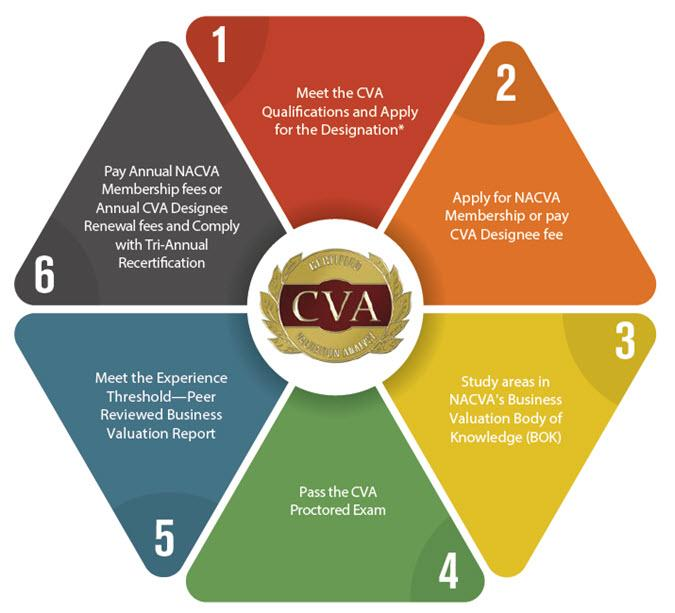

The business world is increasingly complex, characterized by rapid technological advancements, globalization, and evolving market dynamics. Accurately assessing the value of a company has become crucial for activities such as mergers, acquisitions, legal disputes, and strategic planning. In this context, Certified Valuation Analysts (CVAs) offer essential insights and expertise. They contribute significantly to the financial stability and growth of organizations by providing accurate and reliable business valuations.

Certified Valuation Analysts play a pivotal role in the financial ecosystem by ensuring that decision-makers are equipped with precise valuation metrics, which are foundational to an array of strategic initiatives. Whether determining the fair market value during a merger or acquisition, supporting litigation with expert testimony, or ensuring compliance in financial reporting, the work of CVAs aids in navigating today's multifaceted financial landscape.



In the burgeoning field of algorithmic trading, their evaluations extend to assessing companies that develop and utilize advanced trading algorithms and technologies. By evaluating these entities, CVAs assist businesses and investors in understanding market potentials and the inherent risks of these technologies. This is crucial in a field where speed, precision, and reliability of financial data are paramount.

In this article, we will examine the responsibilities of a Certified Valuation Analyst, focusing on their duties and importance across various sectors, including the rapidly expanding domain of financial analysis and trading. Through their expertise, CVAs provide strategic insights essential for informed decision-making in an ever-evolving market environment.

## Table of Contents

## What is a Certified Valuation Analyst (CVA)?

A Certified Valuation Analyst (CVA) is a professional designation conferred by the National Association of Certified Valuators and Analysts (NACVA), a prominent organization known for setting standards in the business valuation industry. The CVA designation is highly regarded and signifies that an individual has surpassed specific educational and experiential benchmarks and has successfully passed a demanding examination. 

Professionals who attain the CVA designation often come from diverse backgrounds, including accounting, finance, and business, bringing a wealth of expertise to the valuation field. The credential ensures that they have a deep understanding of valuation theory, principles, methodologies, and practices. The comprehensive examination tests candidates on various valuation approaches and requires them to demonstrate competence in both technical and compliance aspects of business valuation.

The primary role of a CVA is to perform credible and objective valuations that are integral to strategic business decisions, legal cases, and financial reporting. This might involve the use of approaches such as the Income Approach, Market Approach, or Asset Approach depending on the specific circumstances and requirements of each valuation assignment. For example, the Income Approach might be employed using a formula such as:

$$
\text{Value} = \frac{\text{Expected Earnings}}{\text{Discount Rate}}
$$

This formula calculates the value of a business based on its expected future earnings, adjusted for the time value of money by applying an appropriate discount rate. This and other methodologies are used by CVAs to ensure that valuations are robust, defensible, and aligned with the latest industry standards and practices.

Beyond individual assessments, CVAs play a crucial role in ensuring transparency and accuracy in financial reporting. By providing well-substantiated valuations, they help businesses comply with reporting standards such as GAAP or IFRS, thereby supporting financial statements that accurately reflect a company's economic reality. This credibility is paramount in legal settings where valuations may be scrutinized intensely.

In summary, a CVA is a distinguished professional designation awarded by NACVA to individuals who have demonstrated proficient knowledge and skills in business valuation. CVAs are essential for providing accurate valuations that inform vital business and financial decisions.

## Key Responsibilities of a CVA

Certified Valuation Analysts (CVAs) are tasked with performing detailed business valuations through various methodologies and approaches. Their primary responsibility revolves around providing valuation services for a multitude of purposes, including mergers, acquisitions, financial reporting, and tax planning. These responsibilities are grounded in the necessity to determine an accurate and fair market value of businesses and assets.

To achieve these valuations, CVAs employ several recognized valuation methods. Two primary approaches include the Income Approach and the Market Approach. 

### Income Approach

The Income Approach evaluates a company's worth based on its ability to generate future economic benefits. It often involves Discounted Cash Flow (DCF) analysis, where the expected future cash flows are estimated and then discounted back to their present value using an appropriate discount rate.

#### Example Formula:
$$

\text{Value} = \sum_{t=1}^{n} \frac{CF_t}{(1 + r)^t}
$$
Where:
- $CF_t$ = Cash flow at time $t$,
- $r$ = Discount rate,
- $n$ = Number of periods.

### Market Approach

The Market Approach involves comparing the subject company to similar businesses that have been sold recently, utilizing multiples derived from market data. Commonly used multiples include Price-to-Earnings (P/E) and Enterprise Value-to-EBITDA (EV/EBITDA).

#### Example Python Code for Applying Market Multiples:
```python
# Assume we have determined a set of comparable companies' EV/EBITDA multiples
ev_ebitda_multiples = [7.5, 8.2, 9.0]  
average_multiple = sum(ev_ebitda_multiples) / len(ev_ebitda_multiples)

# Applying the average multiple to the subject company's EBITDA
subject_company_ebitda = 10_000_000
estimated_enterprise_value = average_multiple * subject_company_ebitda

print(f"Estimated Enterprise Value: ${estimated_enterprise_value}")
```   

CVAs play a crucial role in helping stakeholders understand the fair market value of businesses, thus influencing negotiations and transaction terms significantly. By leveraging their expertise, CVAs ensure that businesses are neither undervalued nor overvalued, providing strategic insights that enhance negotiation leverage and support more informed decision-making.

## CVA Duties Across Various Industries

Certified Valuation Analysts (CVAs) hold pivotal roles in various industries by providing essential valuation services. These services are crucial in enabling businesses to make informed decisions, fulfill reporting requirements, and settle legal matters effectively.

In the context of mergers and acquisitions (M&A), CVAs are engaged to ascertain the fair value of companies considered for acquisition or sale. This involves a comprehensive analysis of both tangible and intangible assets, financial performance, industry position, and market conditions. The methodologies applied can include the Comparable Company Analysis (CCA), the Discounted Cash Flow (DCF), and the Precedent Transactions Analysis. For instance, in DCF analysis, future cash flows of a business are estimated and discounted back to the present value using a discount rate that reflects the risk profile of the business:

$$

PV = \sum_{t=1}^{n} \frac{CF_t}{(1+r)^t} 
$$

where $PV$ is the present value, $CF_t$ is the cash flow at time $t$, $r$ is the discount rate, and $n$ is the total number of periods.

In legal disputes, the role of a CVA extends to offering expert testimony and creating detailed valuation reports that bolster litigation processes. These reports may address issues such as shareholder disputes, divorce settlements, or bankruptcy proceedings, where the impartial valuation of business assets is critical. CVAs prepare comprehensive evaluations based on standardized methods which hold up to judicial scrutiny and can effectively influence case outcomes.

For financial reporting, CVAs ensure compliance with fair value measurement and disclosure requirements as dictated by frameworks like the Generally Accepted Accounting Principles (GAAP) and the International Financial Reporting Standards (IFRS). This includes the accurate valuation of assets and liabilities that companies must present in their financial statements. CVAs employ methodologies that maximize transparency and reliability, facilitating investor confidence and aligning with both regulations and best practice standards.

Each of these activities underscores the importance of CVAs across various sectors. Their specialized expertise and methodical approach support businesses in maintaining accuracy, transparency, and legal compliance, thereby driving more informed business decisions.

## The Role of CVAs in Algorithmic Trading

As [algorithmic trading](/wiki/algorithmic-trading) has become a pivotal component of modern financial markets, the demand for precise valuations of companies engaged in developing trading algorithms and technology has increased. Certified Valuation Analysts (CVAs) contribute significantly in this domain by providing expert assessments of these companies, which are crucial for informed investment decisions.

One of the primary roles of CVAs in algorithmic trading is to evaluate the financial health of firms that develop algorithmic trading systems and technologies. This involves a comprehensive analysis of the company’s financial statements, revenue models, and market trends to determine their current and projected financial well-being. The task requires a deep understanding of both financial analysis and the technical aspects of algorithmic trading.

CVAs may employ various valuation methodologies, including discounted cash flow (DCF) analysis, which calculates the present value of expected future cash flows. The formula for DCF is:

$$
\text{DCF} = \sum \frac{C_t}{(1 + r)^t}
$$

where $C_t$ is the cash flow at time $t$, and $r$ is the discount rate. By estimating the future performance of algorithmic trading firms using such models, CVAs provide valuable insights into their potential profitability.

Additionally, CVAs analyze the market potential and risks associated with algorithmic trading technologies. This requires evaluating factors like algorithm efficiency, scalability, and the company's intellectual property, all of which influence market competitiveness. The assessment also covers regulatory considerations, as compliance with financial market regulations is critical to both the firm's operational success and its valuation.

The insights derived from CVAs’ valuations assist investors in understanding the potential benefits and risks associated with investing in algorithmic trading technology companies. By providing a detailed analysis of a company's financial and operational status, CVAs support the decision-making process for investments, mergers, or acquisitions in this rapidly evolving sector.

In summary, CVAs play a crucial role in the evaluation of companies within the algorithmic trading industry. Their expertise in financial valuation and technology assessment equips investors with the necessary information to make strategic decisions, promoting growth and stability in financial markets driven by algorithmic trading advancements.

## Educational and Certification Path for CVAs

To become a Certified Valuation Analyst (CVA), individuals must meet several educational and professional criteria set by the National Association of Certified Valuators and Analysts (NACVA). Initially, candidates are required to have a business degree, such as a Bachelor’s in Business Administration, Finance, Accounting, Economics, or a related field. In some cases, equivalent professional experience in finance or valuation can substitute for formal education, allowing candidates without a business degree to pursue certification.

Candidates must also hold an active membership with NACVA. This membership grants access to resources essential for the certification process, including preparatory materials and professional networks. Once these prerequisites are satisfied, candidates are eligible to take the CVA exam. This examination is rigorous, assessing a range of competencies in business valuation concepts, empirical analysis, and application of valuation approaches. The exam ensures that candidates possess not only theoretical knowledge but also practical valuation skills.

Maintaining the CVA designation involves fulfilling continuing professional education (CPE) requirements. NACVA mandates that CVAs complete a certain number of hours of ongoing education periodically, ensuring they remain abreast of industry developments, regulatory changes, and evolving valuation methodologies. This ongoing education is vital, as it ensures that CVAs can provide actionable insights and maintain their professional credibility in a rapidly changing financial environment.

## Benefits of Hiring a CVA

Engaging a Certified Valuation Analyst (CVA) offers businesses a multitude of benefits critical for their financial and strategic planning initiatives. One of the primary advantages is the credibility a CVA provides. Due to their extensive training and certification process, CVAs are recognized for their expertise in delivering accurate and reliable business valuations. This credibility can be particularly beneficial during negotiations, where stakeholders may seek assurance that valuations are based on robust analytical frameworks and sound judgment.

Another significant benefit of hiring a CVA is the strategic insights they provide into a company's economic standing. CVAs utilize a variety of valuation methodologies, such as the income approach, market approach, and asset-based approach, to deliver comprehensive analyses. These insights are essential for companies aiming to optimize their economic strategies in line with current market conditions. For instance, during mergers or acquisitions, a CVA’s analysis can determine the fair market value, helping businesses to negotiate better terms and ensure fair dealing.

Additionally, having a CVA on board enhances a business's negotiation leverage. Their expert valuations, grounded in quantitative methods and qualitative analysis, allow businesses to approach negotiations with a well-supported understanding of their market value. This evidence-based approach can lead to more favorable outcomes, as parties are less likely to dispute valuations that are transparently and thoroughly prepared by a certified professional.

Moreover, CVAs assist in strategic planning by aligning business valuations with market dynamics. For example, in industries subject to rapid changes or technological advancements, CVAs can help businesses remain competitive by providing valuations that incorporate the industry's current risk factors and growth potential. Their expertise ensures that valuation models are adaptable and relevant, taking into consideration both macroeconomic trends and specific industry conditions.

Overall, hiring a CVA empowers businesses to navigate complex financial landscapes with precision and confidence. Through credible valuations and insightful economic analysis, CVAs play an instrumental role in supporting tactical negotiations and facilitating informed strategic decisions.

## Conclusion

Certified Valuation Analysts (CVAs) play a pivotal role in today's dynamic business environment by providing precise business valuations. These valuations are integral to informed decision-making processes across various sectors, including mergers and acquisitions, financial reporting, and legal disputes. The accuracy and expertise that CVAs bring to the table ensure that companies can navigate complex transactions and market conditions with confidence. Their ability to establish fair market values is especially critical during mergers and acquisitions, where the precise valuation of assets can determine the success of negotiations and transactions.

In the rapidly evolving landscape of algorithmic trading, CVAs contribute significantly by assessing the financial health and potential of firms that develop trading algorithms and technological solutions. Their insights help investors and other stakeholders understand the risks and opportunities associated with these innovate technologies. By providing thorough and objective valuations, CVAs facilitate sound investment decisions, thus supporting the stability and growth of financial markets.

Overall, the expertise of Certified Valuation Analysts extends beyond traditional valuation tasks, influencing strategic business decisions and helping leaders confidently navigate complex financial environments. Their role is indispensable for organizations seeking to maximize value and achieve strategic objectives in an increasingly complex and competitive global market.

## References & Further Reading

[1]: Bergstra, J., Bardenet, R., Bengio, Y., & Kégl, B. (2011). ["Algorithms for Hyper-Parameter Optimization."](https://dl.acm.org/doi/10.5555/2986459.2986743) Advances in Neural Information Processing Systems 24.

[2]: ["Advances in Financial Machine Learning"](https://www.amazon.com/Advances-Financial-Machine-Learning-Marcos/dp/1119482089) by Marcos Lopez de Prado

[3]: ["Evidence-Based Technical Analysis: Applying the Scientific Method and Statistical Inference to Trading Signals"](https://www.amazon.com/Evidence-Based-Technical-Analysis-Scientific-Statistical/dp/0470008741) by David Aronson

[4]: ["Machine Learning for Algorithmic Trading"](https://github.com/stefan-jansen/machine-learning-for-trading) by Stefan Jansen

[5]: ["Quantitative Trading: How to Build Your Own Algorithmic Trading Business"](https://www.amazon.com/Quantitative-Trading-Build-Algorithmic-Business/dp/1119800064) by Ernest P. Chan