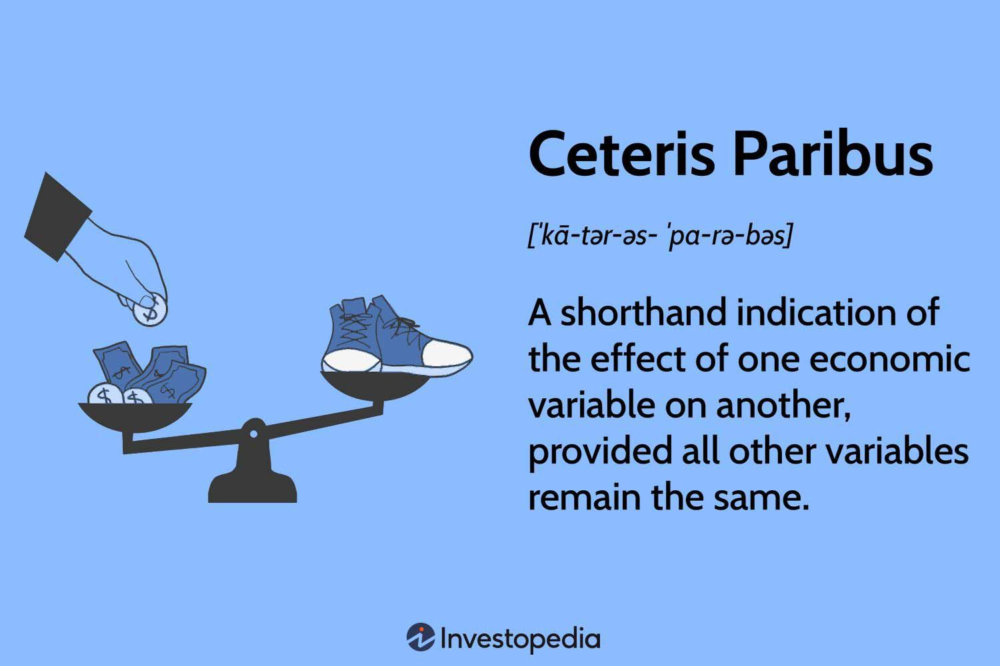

In the intriguing world of algorithmic trading, understanding the causality between variables is pivotal for success. Algorithmic trading involves the use of computer algorithms to automate trading decisions, analyzing vast amounts of data to determine the best times and ways to buy or sell financial instruments. In such a complex field, identifying and understanding the causal effects between various market variables can significantly enhance trading strategies and improve financial outcomes.

The concept of ceteris paribus, often utilized in economics, serves as a fundamental assumption for isolating causal relationships. Derived from Latin, meaning 'all else being equal', ceteris paribus allows for the analysis of the impact of a single variable while holding other influencing factors constant. This principle is particularly important in financial markets where multiple variables can interact simultaneously, making it challenging to discern their individual effects.



Applying the ceteris paribus assumption in algorithmic trading is valuable because it provides a structured approach to understanding causality rather than mere correlation. By isolating a single market factor, traders can make more informed decisions based on logical reasoning. For instance, understanding how variations in interest rates, when all other conditions are constant, affect stock prices can lead to more accurate predictive models and strategic trading executions.

This article highlights the significance of the ceteris paribus assumption and its application in causal analysis within algorithmic trading. By exploring how this assumption can aid in making informed trading decisions, traders can enhance their strategies, thereby optimizing trading performance and reducing risks associated with market volatility. The systematic approach fostered by ceteris paribus is essential for navigating the competitive landscape of algorithmic trading effectively.

## Table of Contents

## Understanding Ceteris Paribus in Economics

Ceteris paribus is a fundamental principle in economics applied to analyze causal relationships by keeping all other influencing factors constant. This assumption is crucial for simplifying complex economic models, allowing economists and analysts to focus on the interaction between specific dependent and independent variables without the noise of confounding effects.

The principle of ceteris paribus is often used in theoretical models to analyze how a change in one variable influences another. For instance, consider the basic demand function $Q_d = f(P, \text{Y})$, where $Q_d$ is the quantity demanded, $P$ is the price, and $\text{Y}$ is income. When examining the relationship between price and quantity demanded, economists assume ceteris paribus to conclude that if the price decreases, the quantity demanded increases, all else being equal. This means that while analyzing price effects, income ($\text{Y}$) and other potential factors are held constant.

In practice, ceteris paribus is essential due to the complexity of economic systems, where variables often exhibit multiple interdependencies. For example, both consumer income and preferences can simultaneously affect the demand for goods, making it challenging to isolate the impact of price changes. By employing the ceteris paribus assumption, economists can theoretically isolate and examine the direct effect of changes in a single [factor](/wiki/factor-investing) such as price, while assuming no changes in other influencing factors.

Despite its utility, the ceteris paribus assumption comes with limitations. Real-world scenarios rarely allow for perfect isolation of variables because multiple factors tend to change simultaneously. Nevertheless, this methodology provides a controlled framework for hypothesis testing and model building. In more advanced econometric models, techniques like multiple regression analysis further attempt to achieve the ceteris paribus condition by controlling for various factors statistically.

Overall, by leveraging the ceteris paribus assumption, economists gain a clearer understanding of specific causal relationships, thereby improving the interpretability and precision of economic analyses and forecasts.

## Ceteris Paribus in Algorithmic Trading

Algorithmic trading is fundamentally based on the analysis of data to forecast market movements and execute trades efficiently. A critical assumption utilized in this domain is ceteris paribus, which allows traders to focus on the influence of a specific market variable, such as interest rates, while disregarding other unrelated factors. This assumption is pivotal for refining algorithms that cater to precise reactions in financial markets.

In this context, ceteris paribus aids in constructing models that isolate the effect of a single economic indicator. Suppose a trader is interested in understanding how changes in interest rates affect stock prices. By applying the assumption of ceteris paribus, the complexity of the model is reduced by keeping other variables constant, such as exchange rates or commodity prices. This is especially important in [algorithmic trading](/wiki/algorithmic-trading), where clarity and precision in understanding these relationships determine the effectiveness of trading decisions.

Consider a simple linear regression model used in predicting stock prices based on [interest rate](/wiki/interest-rate-trading-strategies) changes:

$$
Y = \beta_0 + \beta_1 X + \epsilon
$$

Here, $Y$ represents the stock price, $X$ is the interest rate, $\beta_0$ is the intercept, $\beta_1$ is the coefficient that measures the change in stock price for a unit change in interest rate, and $\epsilon$ is the error term. Applying ceteris paribus means assuming that the error term captures only the effect of omitted variables that are not of immediate interest and holding them constant.

This approach is crucial because market conditions are constantly evolving with multiple influencing factors at play. Traders must simplify their models initially to focus on singular relationships before possibly incorporating other complexities. In automated trading systems, such as those built using Python, one may employ libraries like pandas and numpy to manipulate dataset structures and sklearn for implementing regression models. Here is a simple Python snippet demonstrating this:

```python
import pandas as pd
from sklearn.linear_model import LinearRegression

# Sample data
data = {'Interest Rate': [2.0, 2.5, 3.0, 3.5], 'Stock Price': [100, 102, 101, 105]}
df = pd.DataFrame(data)

# Define X and Y
X = df[['Interest Rate']]
Y = df['Stock Price']

# Create and fit the model
model = LinearRegression()
model.fit(X, Y)

# Coefficient interpretation
beta_0, beta_1 = model.intercept_, model.coef_[0]
print(f"Intercept: {beta_0}, Coefficient of Interest Rate: {beta_1}")
```

By focusing on the designated variable under the ceteris paribus condition, algorithmic traders enhance their ability to generate insights that lead to better-informed trading decisions. This disciplined approach is vital for developing algorithms that maintain a singular focus on specific relationships in an otherwise complex and interdependent financial ecosystem.

## Challenges of Applying Ceteris Paribus

Despite its advantages, the application of ceteris paribus in algorithmic trading is not without its challenges. In the dynamic environment of financial markets, achieving a state where all other variables are held constant is an ideal that is rarely attainable. Real-world markets are subject to a myriad of unpredictable influences, ranging from geopolitical events to sudden shifts in investor sentiment. These factors introduce noise, complicating the isolation of causal effects and potentially skewing analysis.

Algorithmic traders, therefore, must navigate this complexity and find ways to incorporate it into their models. Oversimplification due to the ceteris paribus assumption can lead to ineffective trading strategies. For instance, while it may be beneficial to analyze the impact of interest rate changes on stock prices in isolation, ignoring other simultaneous market developments—like changes in fiscal policy or unexpected corporate earnings announcements—can result in misleading conclusions and unprofitable trades.

To address these challenges, traders can employ more sophisticated statistical techniques and computational tools. Methods such as multi-factor models or [machine learning](/wiki/machine-learning) algorithms can help capture the interdependencies among various market factors. One example might involve applying a machine learning model that accounts for multiple predictors while still attempting to isolate the effect of a particular variable. Python libraries such as scikit-learn or TensorFlow can be useful in building these complex models. For instance:

```python
from sklearn.linear_model import LinearRegression
import numpy as np

# Simulated data representing changes in stock prices (y) influenced by interest rates (x1) and other factors (x2)
x1 = np.random.rand(100, 1)  # Interest rates
x2 = np.random.rand(100, 1)  # Other factors
y = 3 * x1 + 1.5 * x2 + np.random.rand(100, 1)  # Dependent variable (Stock prices)

# Combining predictors
X = np.hstack((x1, x2))

# Creating and fitting Linear Regression model
model = LinearRegression().fit(X, y)
```

In this simple linear regression model, both interest rates and another factor are considered predictors, allowing the model to capture their simultaneous effects on stock prices. Thus, while ceteris paribus provides a useful lens for analysis, acknowledging and incorporating real-world complexities into algorithmic models is crucial for crafting reliable, effective trading strategies.

## Benefits of Ceteris Paribus in Causal Analysis

Utilizing the ceteris paribus assumption in causal analysis enables traders to build more reliable predictive models by focusing on explicit cause-and-effect relationships. By isolating the effect of a single variable while keeping other factors constant, traders can gain a clearer understanding of how specific market stimuli impact trading outcomes. This focused approach helps disentangle complex variable interactions, offering a more precise lens through which to view market dynamics.

One of the primary benefits of this methodology is the enhancement of algorithmic accuracy. By ensuring that trading strategies are based on genuine causations rather than superficial correlations, traders are better positioned to predict market movements. This can lead to higher returns and reduced risk. In algorithmic trading, where decisions are made based on programmed logic, avoiding spurious correlations is crucial. The ceteris paribus assumption provides a structured way to filter noise from the data, ensuring that trading decisions are informed by robust causative insights.

Moreover, employing ceteris paribus aids in developing systematic trading strategies. While correlation indicates a relationship between variables, it does not establish a cause. This distinction is vital for traders aiming to create strategies that are not just reactive but proactive. Grounding these strategies in logical causation provides a robust framework for anticipating market shifts. By concentrating on the isolated impact of variables—such as interest rate changes on asset prices—traders can execute strategies that are both systematic and adaptable to the identified causal mechanisms.

In practice, this approach can be implemented using statistical models to test hypotheses about causal relationships. For instance, when using Python, libraries like `statsmodels` or `causalimpact` could be employed to analyze time series data under this assumption.

```python
import pandas as pd
import statsmodels.api as sm

# Example: Testing the causal impact of variable 'X' on 'Y'
data = pd.DataFrame({'Y': [...], 'X': [...], 'control_variable': [...]})
X = data[['X', 'control_variable']]  # Independent variables
y = data['Y']  # Dependent variable

# Add a constant to the independent variables
X = sm.add_constant(X)

# Fit the model
model = sm.OLS(y, X).fit()

# Causality can be tested through hypothesis testing
print(model.summary())
```

By focusing on one trading factor while maintaining other variables constant, traders utilize a principled approach that enhances both the precision and reliability of their trading algorithms. This foundation in causality rather than correlation allows for a systematic, evidence-based trading strategy that potentially maximizes return on investment while mitigating risks.

## Practical Applications in Market Analysis

Traders can effectively apply the ceteris paribus assumption by examining how monetary policy changes impact stock prices. Analyzing a scenario where the central bank adjusts interest rates demonstrates this. By holding other economic variables constant, traders can focus on the direct relationship between interest rate changes and stock market responses. This isolated analysis helps identify whether an increase or decrease in interest rates might lead to stock price fluctuations, providing a clearer understanding of cause and effect.

Similarly, the ceteris paribus assumption is advantageous for evaluating the impact of fiscal policies or commodity price shifts on market indices. For instance, when a government alters its fiscal policy, like increasing public spending, the assumption allows traders to isolate the effects on market indices by temporarily disregarding other extraneous variables. This focused analysis aids in predicting how fiscal expansions or contractions influence overall market performance.

Moreover, traders can employ this assumption to understand commodity price movements' effects on financial assets. Consider a situation where the price of [crude oil](/wiki/crude-oil) changes. By using ceteris paribus to isolate the crude oil price change while keeping other economic factors constant, traders can better assess its specific influence on stock markets. This focused approach enhances their capacity to make informed predictions regarding market trends.

Overall, by concentrating on one variable at a time using the ceteris paribus assumption, traders can develop more precise market forecasts. This practice reduces the noise introduced by multiple interacting variables, thus improving the efficacy of predictive algorithms and ultimately aiding in crafting robust trading strategies.

## Conclusion

The ceteris paribus assumption serves as an indispensable instrument for algorithmic traders, particularly in the context of causal analysis. This principle, by allowing traders to isolate the effect of a single variable while holding other factors constant, aids in the development of more precise and targeted financial models. The ability to control for specific variables helps in recognizing genuine causative relationships rather than mere correlations, thereby enhancing the clarity and reliability of trading strategies.

However, translating the ceteris paribus assumption into practical application is not without its hurdles. Financial markets are inherently complex and influenced by a plethora of interdependent variables. Achieving perfect isolation is often not feasible due to these complexities, which can result in oversimplification if not carefully managed. Algorithmic traders must navigate this sophisticated environment by balancing the need for simplification with an understanding of the underlying intricate market dynamics.

Despite these challenges, the thoughtful application of ceteris paribus enhances trading strategies by systematically addressing causality. By focusing on how changes in one variable can manifest in market behavior, traders can construct models with improved accuracy, potentially leading to higher returns and reduced risk exposure. 

As algorithmic trading technologies continue to advance, maintaining a robust grasp of the ceteris paribus assumption will be paramount. This understanding ensures that traders can effectively analyze and adapt to ever-changing market conditions, solidifying ceteris paribus as a cornerstone of financial analysis and strategic decision-making.

## References & Further Reading

[1]: Angrist, J. D., & Pischke, J. S. (2008). ["Mostly Harmless Econometrics: An Empiricist's Companion."](https://www.jstor.org/stable/j.ctvcm4j72) Princeton University Press.

[2]: Pearl, J. (2009). ["Causality: Models, Reasoning, and Inference"](https://dl.acm.org/doi/book/10.5555/1642718) (2nd ed.). Cambridge University Press.

[3]: ["Advances in Financial Machine Learning"](https://www.amazon.com/Advances-Financial-Machine-Learning-Marcos/dp/1119482089) by Marcos Lopez de Prado

[4]: ["Quantitative Trading: How to Build Your Own Algorithmic Trading Business"](https://www.amazon.com/Quantitative-Trading-Build-Algorithmic-Business/dp/1119800064) by Ernest P. Chan

[5]: Granger, C. W. J. (1980). ["Testing for Causality: A Personal Viewpoint."](https://www.sciencedirect.com/science/article/pii/016518898090069X) Journal of Economic Dynamics and Control, 2, 329-352.

[6]: Hastie, T., Tibshirani, R., & Friedman, J. (2009). ["The Elements of Statistical Learning: Data Mining, Inference, and Prediction."](https://link.springer.com/book/10.1007/978-0-387-84858-7) Springer Series in Statistics.