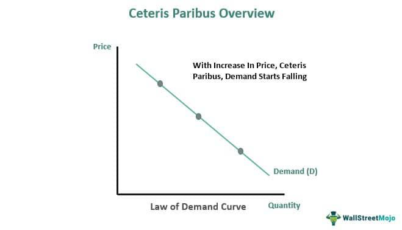

In today's rapidly evolving financial landscape, trading practices are increasingly dominated by the integration of economic principles and technological advancements. At the core of economic theory lies the concept of ceteris paribus, a Latin term meaning "all other things being equal." This notion allows economists to focus on the impact of a single variable amidst the complex interplay of market forces, offering a foundational tool for understanding and predicting economic scenarios.

Ceteris paribus serves as a critical analytical tool for isolating the relationship between economic variables, which is essential for constructing models that explain and anticipate market behaviors. It simplifies the multifaceted nature of economic systems to facilitate clearer insights into causation. Despite its restricted applicability due to the oversimplification of real-world conditions, ceteris paribus remains a cornerstone in the study of economics.



Simultaneously, algorithmic trading has emerged as a transformative force in financial markets. As a product of technological progress, it employs sophisticated computer algorithms to execute trades at speeds and precision levels that surpass human capability. Algorithms can integrate economic principles, including those outlined under ceteris paribus, to construct strategies that enhance trading efficiency and effectiveness.

The fusion of these elements underscores a critical intersection in modern finance where economic theories inform and enhance algorithmic models, leading to more effective trading strategies. This article examines how ceteris paribus underpins economic modeling, explores its integration within algorithmic trading frameworks, and considers the prospective trends that could further redefine this integration in the future. Through understanding the interaction between these elements, stakeholders in the financial sector can gain valuable insights into leveraging economic principles and advancing trading technologies to maximize market opportunities.

## Table of Contents

## Understanding Ceteris Paribus

Ceteris paribus, a fundamental principle in economic theory, is a Latin phrase that translates to "all other things being equal." It is a crucial analytical tool that allows economists to isolate the effects of a single variable on economic outcomes, thereby simplifying the intricate reality of markets. By assuming that all other influencing factors remain constant, economists can focus on the causal relationships between the variables of interest and make more precise predictions and analyses.

This concept is often utilized to understand how changes in one aspect of an economic model affect the overall outcome, while other potentially confounding variables are held constant. For instance, in analyzing the law of demand, economists might use ceteris paribus to examine how a change in the price of a good affects the quantity demanded, assuming that factors such as consumer preferences, incomes, and the prices of other goods remain unchanged.

Example: Let's say we have a demand function represented as:

$$
Q_d = f(P, Y, T, P_r, E)
$$

where $Q_d$ is the quantity demanded, $P$ is the price of the good, $Y$ is consumer income, $T$ are consumer tastes, $P_r$ is the price of related goods, and $E$ represent expectations. Using ceteris paribus, one can isolate the effect of a change in $P$ by holding $Y, T, P_r,$ and $E$ constant, thereby focusing solely on the relationship between $P$ and $Q_d$.

Despite its utility, the concept of ceteris paribus is not without its limitations. One significant challenge is the potential for oversimplification. Real-world markets are complex and dynamic, with numerous interdependent variables that can influence outcomes. By holding certain variables constant, economists may overlook interactions and external factors that could provide a more comprehensive understanding of market behavior.

Nevertheless, the application of ceteris paribus remains a cornerstone of economic modeling, signaling its importance in both theoretical and practical analyses. Its ability to distinguish specific causal relationships makes it an indispensable part of economic inquiry, despite the acknowledgment of its simplifying assumptions.

## Economic Theories and Ceteris Paribus

Economic theories frequently employ the concept of ceteris paribus, meaning "all other things being equal," to develop models that aim to predict market behavior. This methodological approach serves to isolate the variables of interest and delineate their direct effects on economic outcomes, thereby offering more precise and accurate analyses.

A quintessential example of the application of ceteris paribus is found within the analysis of supply and demand, a foundational principle of economic theory. Under ceteris paribus conditions, economists are able to examine how variations in price impact the quantity demanded or supplied while assuming all other factors—such as consumer preferences, income levels, and market conditions—remain constant. 

Mathematically, the demand function can be expressed as:

$$
Q_d = f(P, Y, T, P_s, P_c)
$$

where $Q_d$ is the quantity demanded, $P$ is the price of the good, $Y$ is the consumer's income, $T$ represents tastes and preferences, $P_s$ is the price of substitutes, and $P_c$ is the price of complementary goods. Applying ceteris paribus allows us to focus solely on the relationship between $Q_d$ and $P$, assuming other variables like $Y$, $T$, $P_s$, and $P_c$ are held constant:

$$
\frac{\partial Q_d}{\partial P}
$$

In macroeconomic contexts, ceteris paribus aids in understanding the effects of fiscal and monetary policies. For instance, when assessing the impact of an [interest rate](/wiki/interest-rate-trading-strategies) change on national output, economists isolate this variable, maintaining other economic indicators stable to clearly interpret the resulting influence.

Despite the simplification it offers, the application of ceteris paribus is not without its limitations. Critics point out that the assumption of holding all else constant may lead to oversimplifications, neglecting the intricate and interconnected nature of modern economies. Nevertheless, its utility in economic analysis and modeling remains vital, providing a structured approach to decipher complex economic phenomena.

## Algorithmic Trading: Bridging Technology and Economics

Algorithmic trading represents a significant intersection of technology and economics, where computer programs are employed to execute trades at exceptional speeds based on predefined criteria. These algorithms adeptly integrate economic principles, such as the dynamics of supply and demand modeled through ceteris paribus conditions, to inform and refine trading strategies. By isolating specific variables while assuming others remain constant, ceteris paribus allows algorithms to focus on significant economic relationships, ensuring that the trading decisions are grounded in robust economic theory.

The efficacy and precision of [algorithmic trading](/wiki/algorithmic-trading) provide considerable advantages in modern financial markets. Speed and accuracy are paramount, as algorithms can process vast amounts of data and execute orders in fractions of a second, mitigating the delay between decision-making and market execution. This capability not only enhances trading efficiency but also reduces the risk of human error that could arise in manual trading scenarios.

Technological advancements play a crucial role in algorithmic trading by enabling real-time data analysis and decision-making. The integration of sophisticated data analytics and [machine learning](/wiki/machine-learning) models allows traders to process complex datasets, identify patterns, and make predictive analyses that can be immediately actioned upon. This instantaneous processing capacity significantly enhances the utility of economic models, allowing traders to adapt to shifting market conditions and capitalize on fleeting opportunities.

By leveraging these technological tools, traders can simulate various market scenarios while changing one variable at a time, aligning closely with ceteris paribus assumptions. For example, a Python-based algorithm might process historical price data and simulate future pricing outcomes based on continuous supply or demand adjustments:

```python
import numpy as np

def simulate_market_dynamics(prices, supply_change, demand_change):
    # Prices: Historical price data
    # supply_change, demand_change: Percentage changes in supply and demand

    # Simulate new prices
    new_prices = prices * (1 + demand_change - supply_change)

    return new_prices

# Sample historical prices
historical_prices = np.array([100, 102, 105, 107, 110])

# Assumed market changes
supply = 0.02   # 2% increase in supply
demand = 0.03   # 3% increase in demand

predicted_prices = simulate_market_dynamics(historical_prices, supply, demand)
print("Predicted Prices:", predicted_prices)
```

In summary, through the integration of economic principles with cutting-edge technology, algorithmic trading not only facilitates the creation of dynamic and responsive trading systems but also underscores the importance of incorporating traditional economic models into contemporary trading practices.

## Integrating Ceteris Paribus into Algorithmic Trading

Incorporating ceteris paribus into algorithmic trading models provides a structured approach to analyzing how individual economic variables influence market outcomes. By isolating these variables, traders can design algorithms that effectively test hypotheses and predict the consequences of specific changes in market conditions. This process enhances the reliability of trading strategies, allowing them to be more adaptable to market fluctuations.

When applying ceteris paribus in algorithmic trading, the strategy often involves setting fixed assumptions about other influencing factors, akin to a controlled experiment. For example, in a simplified market where the price of a commodity depends on supply and demand, keeping all else equal, a trader might construct an algorithm that tests how a change in supply affects prices by maintaining demand constant. Here's a basic Python example illustrating this concept:

```python
def price_change_with_constant_demand(current_supply, demand_constant, price_elasticity):
    """
    Calculate the change in price due to a change in supply, keeping demand constant.
    """
    try:
        new_price = price_elasticity * (current_supply / demand_constant)
        return new_price
    except ZeroDivisionError:
        return None

# Example usage
current_supply = 100
demand_constant = 50
price_elasticity = 1.5

new_price = price_change_with_constant_demand(current_supply, demand_constant, price_elasticity)
print(f"New price with constant demand: {new_price}")
```

This hypothetical function models the simple relationship between supply and price, assuming demand remains unchanged. By systematically varying supply, traders can observe resultant price changes, providing insights into market dynamics under ceteris paribus conditions.

Despite its utility, employing ceteris paribus in algorithmic trading does present challenges. Financial markets are inherently dynamic and interconnected, making it difficult to account for all potential external influences. This complexity necessitates sophisticated models that can integrate continuously changing market data. Furthermore, as global financial systems grow more interdependent, isolating singular variables under the assumption that all other factors remain constant becomes increasingly challenging.

In practice, successful integration of ceteris paribus requires algorithms to be not only precise in hypothesis testing but also adaptable. These algorithms must incorporate mechanisms for updating strategies based on real-time data inputs, effectively navigating the uncertainty and [volatility](/wiki/volatility-trading-strategies) of global markets. As such, algorithmic trading strategies that incorporate ceteris paribus must balance the need for isolation of variables with the necessity of responding to an unyielding flow of new information.

## Benefits and Criticisms

Ceteris paribus, by holding all other variables constant, provides a crucial tool for simplifying economic analysis. This simplification allows economists and traders to devise strategies based on clear and direct relationships. In the context of algorithmic trading, this concept aids in price discovery processes and facilitates a more profound understanding of market dynamics over time. When variables are isolated effectively, patterns and causal relationships become more apparent, enabling traders to make informed decisions.

However, the use of ceteris paribus is not without criticism. One significant limitation is its tendency to overlook human psychology and the interconnectedness of modern financial systems. Financial markets are influenced by a multitude of factors, including investor behavior and external economic conditions that ceteris paribus cannot account for. This can sometimes lead to oversimplifications in economic models and predictions, which may fail to capture the complexity of real-world market interactions.

Algorithmic trading similarly faces criticism related to its reliance on historical data. Algorithms typically base predictions and trading strategies on prior market data, under the assumption that historical patterns will repeat. However, this reliance can be problematic when unprecedented market conditions arise, as algorithms may not be equipped to handle them effectively. This has been evident in instances where market shocks, such as during financial crises, lead to significant deviations from historical trends, rendering algorithmic predictions unreliable.

Despite these criticisms, the integration of ceteris paribus in economic theories remains a valuable approach for understanding simplified models of market behavior. As financial technology continues to progress, efforts to better incorporate unpredictability and human factors into these models are critical in advancing the reliability and effectiveness of algorithmic trading strategies.

## Future Directions in Economic Theory and Algorithmic Trading

Continued technological integration is poised to significantly redefine the application of economic theory within trading practices. At the forefront of this transformation is the evolution of machine learning (ML) and [artificial intelligence](/wiki/ai-artificial-intelligence) (AI), which introduce novel methodologies for enhancing economic models and algorithms. These advanced technologies empower traders to analyze vast datasets with unprecedented efficiency, identifying subtle patterns and trends that traditional methods might overlook. Consequently, ML algorithms, such as neural networks and [reinforcement learning](/wiki/reinforcement-learning), can optimize trading strategies by adapting to dynamic market conditions.

Moreover, behavioral economics is anticipated to play an increasingly pivotal role in the development of future trading algorithms. Traditional economic models, often reliant on ceteris paribus, can oversimplify the complex interactions of market forces by assuming static variables. By integrating behavioral insights, algorithms can account for the psychological and social factors influencing market participants, offering a more holistic view of market dynamics. For instance, sentiment analysis tools could be employed to gauge market sentiment from news articles or social media, feeding this data into predictive models to assess potential market movements.

Python, a widely-used programming language in quantitative finance, provides robust libraries for implementing these advanced models. For example:

```python
from sklearn.ensemble import RandomForestRegressor
from sklearn.metrics import mean_squared_error
import numpy as np

# Sample data: feature matrix X and target vector y
X = np.random.rand(100, 5)  # 100 samples, 5 features
y = np.random.rand(100)

# Splitting the data into training and testing sets
X_train, X_test = X[:80], X[80:]
y_train, y_test = y[:80], y[80:]

# Initialize the machine learning model
model = RandomForestRegressor()

# Fit the model to the training data
model.fit(X_train, y_train)

# Make predictions
y_pred = model.predict(X_test)

# Evaluate the model
mse = mean_squared_error(y_test, y_pred)
print("Mean Squared Error:", mse)
```

In addition to ML and AI, ongoing innovations in financial technologies are expected to result in progressively sophisticated trading strategies that leverage comprehensive economic theories. Developments in blockchain, for instance, offer enhanced transparency and security in trading, potentially revolutionizing settlement processes and reducing transaction costs. Similarly, quantum computing, although still nascent, presents the potential to solve complex optimization problems at speeds unattainable by classical computers, which could further refine algorithmic trading strategies.

As these technologies continue to evolve, the synthesis of economic theory and cutting-edge technology will play an increasingly critical role in shaping the future of trading practices. Stakeholders in the finance sector must remain attentive to these trends to harness their full potential, ultimately enhancing trading efficiency and strategy formulation.

## Conclusion

The intersection of ceteris paribus, economic theory, and algorithmic trading represents a dynamic and evolving field in finance. This integration has the potential to transform trading practices through the precise application of economic principles in algorithm development. By leveraging the concept of ceteris paribus, algorithms can enhance trading efficiency by isolating and examining the impact of individual economic variables while holding others constant. This approach allows for more focused strategy formulation, potentially increasing the accuracy of market predictions.

Despite the challenges associated with this integration, such as the oversimplification inherent in ceteris paribus and the volatility of markets, economic theories still offer significant promise in refining trading algorithms. These theories provide a systematic framework to interpret and respond to complex market events, enhancing the strategic orientation of trading systems. As stakeholders in finance explore these opportunities, their understanding of the integration between economic theories and algorithmic trading will be crucial. This knowledge can help them fully harness the capabilities of modern trading technologies and stay competitive in ever-changing markets.

As financial systems continue to evolve, the role of economic principles in algorithmic trading is expected to grow even further. Emerging technologies like machine learning and AI could mitigate some of the limitations of ceteris paribus, incorporating complex datasets and diverse market signals into trading strategies. Behavioral economics may also be integrated into future algorithms, addressing psychological factors and emotional responses that influence market behavior. These advancements point towards a future where economic theories are seamlessly woven into the fabric of algorithmic trading, enabling more sophisticated, responsive, and comprehensive trading strategies.

## References & Further Reading

[1]: Bergstra, J., Bardenet, R., Bengio, Y., & Kégl, B. (2011). ["Algorithms for Hyper-Parameter Optimization."](https://papers.nips.cc/paper/4443-algorithms-for-hyper-parameter-optimization) Advances in Neural Information Processing Systems 24.

[2]: ["Advances in Financial Machine Learning"](https://www.amazon.com/Advances-Financial-Machine-Learning-Marcos/dp/1119482089) by Marcos Lopez de Prado

[3]: ["Evidence-Based Technical Analysis: Applying the Scientific Method and Statistical Inference to Trading Signals"](https://www.amazon.com/Evidence-Based-Technical-Analysis-Scientific-Statistical/dp/0470008741) by David Aronson

[4]: ["Machine Learning for Algorithmic Trading"](https://github.com/stefan-jansen/machine-learning-for-trading) by Stefan Jansen

[5]: ["Quantitative Trading: How to Build Your Own Algorithmic Trading Business"](https://www.amazon.com/Quantitative-Trading-Build-Algorithmic-Business/dp/1119800064) by Ernest P. Chan