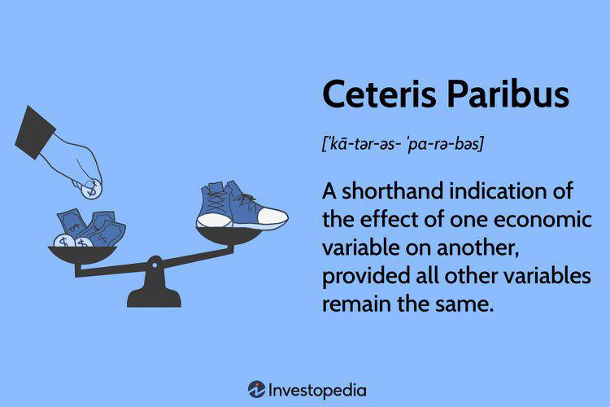

In the world of economic analysis, two Latin phrases, "Ceteris Paribus" and "Mutatis Mutandis," play a crucial role in understanding variable interactions. These concepts hold significance not only in theoretical economics but also in practical applications, such as algorithmic trading. Algorithmic trading, often abbreviated as algo trading, uses these economic principles to improve trading strategies. This article explores the meanings and applications of these concepts in economic theories and algo trading.

Understanding how Ceteris Paribus and Mutatis Mutandis can enhance algorithmic trading models offers traders and economists advanced tools for market analysis and trend prediction. As automated trading systems grow in financial markets, integrating these economic ideas provides a competitive advantage. This article outlines the importance of these economic concepts, examines their applications in algo trading, and provides insights into how they lead to better trading outcomes.



## Table of Contents

## Understanding Ceteris Paribus

The term 'Ceteris Paribus' translates to 'all other things being equal.' This phrase is pivotal in economic analysis, especially when assessing the impact of a single variable while holding other influencing factors constant. By adopting this method, economists can simplify the often intricate web of economic interactions, hence allowing a focused analysis on the causal relationship between two specific variables. For instance, in the law of demand, the effect of price changes on demand can be analyzed effectively by assuming that all other factors such as consumer income and preferences are unchanged. This assumption allows for a clearer understanding of how a change in price alone affects demand.

Ceteris Paribus is integral to economic modeling and hypothesis testing. It provides researchers with the ability to isolate cause-and-effect relationships without the confounding influence of external variables. By focusing on individual variables, it is easier to understand their specific role and contribution to economic outcomes, leading to more accurate models and conclusions about causal factors.

In algorithmic trading, the application of Ceteris Paribus is invaluable. Algorithmic trading involves the use of computer programs to execute trades at high speed and [volume](/wiki/volume-trading-strategy), based on pre-determined criteria. Here, Ceteris Paribus aids in isolating individual factors that impact market movements, allowing precise adjustments to trading strategies. For example, a trading algorithm might examine the impact of [interest rate](/wiki/interest-rate-trading-strategies) changes on stock prices by keeping other variables like market sentiment and geopolitical developments constant. This controlled approach enables the creation of more refined and efficient trading models, which can lead to better trading outcomes. The clarity provided by Ceteris Paribus in understanding specific market variables can enhance predictive accuracy and strategy optimization, giving traders an edge in decision-making.

## Exploring Mutatis Mutandis

Mutatis Mutandis, translating to 'with necessary changes being made,' involves modifying variables while maintaining the overall framework of economic analysis. This principle acknowledges the need for some variables to change in response to other dynamic factors, thus differentiating it from Ceteris Paribus, which keeps most variables static. By allowing for alterations while preserving the core structure, Mutatis Mutandis offers a more holistic approach, particularly valuable in situations involving several interconnected variables.

In economic and financial modeling, employing Mutatis Mutandis facilitates a deeper understanding of complex scenarios, such as market forecasting and scenario analysis. This principle allows economists and traders to simulate different economic conditions and observe potential outcomes, making it instrumental for anticipating market shifts due to evolving factors like fiscal policies or global events.

Algorithmic trading, which relies heavily on responsive and adaptive strategies, benefits significantly from the application of Mutatis Mutandis. Adjusting trading models to reflect changes in economic conditions enables these systems to remain effective amid fluctuating market dynamics. For instance, changes in interest rates or geopolitical events could trigger the need for trading models to shift focus or approach, ensuring continued alignment with prevailing economic realities.

By integrating Mutatis Mutandis, algo trading systems gain a potent ability to adapt across various economic scenarios. This adaptability can lead to more robust trading outcomes and enhanced risk management capabilities. In practical terms, traders can use this concept to refine algorithms continuously, ensuring that they not only react to immediate changes but also accommodate long-term economic trends.

In conclusion, embracing the concept of Mutatis Mutandis empowers [algorithmic trading](/wiki/algorithmic-trading) systems to navigate complex market landscapes more effectively. By allowing for necessary adjustments within a stable framework, these models enhance their ability to predict and respond to changes, ensuring that trading strategies remain relevant and robust in a dynamic economic environment.

## Application of Economic Concepts in Algo Trading

In algorithmic trading, the strategic employment of economic principles such as Ceteris Paribus and Mutatis Mutandis can significantly enhance decision-making and strategy optimization. These concepts help traders refine their approaches by addressing both stability and adaptability within the trading models.

Ceteris Paribus, which translates to "all other things being equal," is especially useful in isolating the effects of specific variables within an economic model. In algorithmic trading, this principle allows traders to keep certain market parameters constant, thereby focusing solely on the impact of individual trading variables. For example, a trader might examine how changes in interest rates affect bond prices, assuming that other factors like inflation or market sentiment remain unchanged. By employing this principle in trading models, one can fine-tune strategies by understanding the direct impact of these specific factors. In Python, a simplified model to isolate a trading variable might look like this:

```python
def ceteris_paribus(price, rate_change):
    constant_factor = 1.0  # represents all other factors remaining constant
    return price * (1 + rate_change * constant_factor)
```

This function takes an asset price and a change in interest rates, keeping other market factors unaltered, to observe the isolated impact of rate adjustments.

Conversely, Mutatis Mutandis, meaning "with necessary changes being made," caters to a more dynamic approach by allowing trading models to adapt to changes in market conditions. Unlike Ceteris Paribus, it acknowledges the interconnectivity of economic variables, thereby necessitating adjustments in response to varying factors. In algorithmic trading, incorporating Mutatis Mutandis enables the development of algorithms that not only anticipate but also respond to changes in market dynamics, such as shifts in fiscal policy or geopolitical events. This adaptability ensures the creation of robust and flexible trading strategies.

These economic concepts facilitate the development of sophisticated algorithms capable of simulating and predicting market behavior across a spectrum of economic conditions. By accommodating both stable and fluctuating elements within the market, traders can execute more efficient trades. Mathematical models often use principles from real-time data streams to adjust tradable events dynamically.

```python
def mutatis_mutandis(price, market_factors):
    adjusted_price = price
    for factor in market_factors:
        adjusted_price *= (1 + factor)  # recalculating price based on each market factor
    return adjusted_price
```

This Python function accepts a list of market factors, adjusting the base price accordingly. This represents the concept of Mutatis Mutandis by accounting for necessary changes in the model configuration.

By understanding and integrating these principles, traders can construct more refined models that consider both static assumptions and dynamic market changes, leading to better-informed and strategic trading outcomes. By leveraging these concepts, algorithmic trading models evolve with market complexities, thus enhancing overall trading efficacy.

## The Future of Economic Concepts in Algo Trading

As financial technologies advance, the application of economic principles like Ceteris Paribus and Mutatis Mutandis in algorithmic trading is set to yield significant progress. These principles offer structured methodologies for processing and reacting to complex economic variables and changing scenarios, crucial for the continuous enhancement of trading algorithms. 

The improvement and sophistication of these algorithms largely depend on their capability to integrate real-time data analysis with foundational economic theories. For instance, Ceteris Paribus helps in maintaining certain market assumptions steady, aiding algorithms to focus on isolated variables. On the other hand, Mutatis Mutandis allows the algorithms to dynamically adjust to interrelated changes in the economic environment. This integration is vital for developing predictive models that can accurately simulate market behaviors under various conditions.

Algorithmic trading systems of the future may significantly improve their prediction capabilities by leveraging big data and advanced analytics. These systems can incorporate economic variables and theories into their core processing units, allowing for a more nuanced understanding of market trends. This synergy between economic thought and cutting-edge technology will facilitate the creation of innovative trading solutions, enhancing market efficiency and [liquidity](/wiki/liquidity-risk-premium).

Real-time data analysis, guided by economic theories, can be implemented using robust programming techniques. For instance, Python offers an array of libraries such as Pandas for data manipulation and NumPy for numerical data operations, which can be used to implement economic models:

```python
import pandas as pd
import numpy as np

# Sample function to simulate economic model adjustments
def ceteris_paribus_adjust(price_series, adjustment_factor):
    # Adjusting prices with a constant factor, keeping other variables constant
    adjusted_series = price_series * adjustment_factor
    return adjusted_series

# Example usage with random price data
price_data = pd.Series(np.random.random(100) * 100)
adjusted_prices = ceteris_paribus_adjust(price_data, 1.05)
```

By employing such tools, traders can maintain a strong grounding in economic concepts, enabling them to adeptly manage the complexities of financial markets. This foundational knowledge, paired with technological advances, positions traders and businesses to effectively navigate and capitalize on emerging market opportunities.

## Conclusion

The concepts of Ceteris Paribus and Mutatis Mutandis remain fundamental to economic theory and offer promising applications in algorithmic trading. Ceteris Paribus allows traders to clearly isolate the effects of specific variables, enhancing the precision of trading models. By holding other variables constant, traders can focus on understanding the direct impact of isolated factors, thereby refining their decision-making processes. This clarity is crucial for constructing efficient strategies that respond accurately to market conditions.

Conversely, Mutatis Mutandis offers the adaptability required to navigate fluctuating markets. This concept acknowledges necessary changes, allowing models to accommodate dynamic variables and shifting economic circumstances. By integrating Mutatis Mutandis, traders can develop adaptive algorithms capable of responding to complex market interactions and evolving scenarios. This adaptability is essential for maintaining robust trading strategies in the face of unpredictable financial environments.

By harnessing these principles, traders gain a deeper understanding of market dynamics and are positioned to develop more sophisticated trading strategies. The synergy of Ceteris Paribus and Mutatis Mutandis within algo trading paves the way for smarter and more effective market engagement. Continued advancements in algorithmic trading stand to benefit from these enduring economic concepts, ultimately ensuring sustained performance amidst the challenges of an ever-evolving financial landscape.

## References & Further Reading

[1]: Bergstra, J., Bardenet, R., Bengio, Y., & Kégl, B. (2011). ["Algorithms for Hyper-Parameter Optimization."](https://papers.nips.cc/paper/4443-algorithms-for-hyper-parameter-optimization) Advances in Neural Information Processing Systems 24.

[2]: ["Advances in Financial Machine Learning"](https://www.amazon.com/Advances-Financial-Machine-Learning-Marcos/dp/1119482089) by Marcos Lopez de Prado

[3]: ["Evidence-Based Technical Analysis: Applying the Scientific Method and Statistical Inference to Trading Signals"](https://www.amazon.com/Evidence-Based-Technical-Analysis-Scientific-Statistical/dp/0470008741) by David Aronson

[4]: ["Machine Learning for Algorithmic Trading"](https://github.com/stefan-jansen/machine-learning-for-trading) by Stefan Jansen

[5]: ["Quantitative Trading: How to Build Your Own Algorithmic Trading Business"](https://www.amazon.com/Quantitative-Trading-Build-Algorithmic-Business/dp/1119800064) by Ernest P. Chan