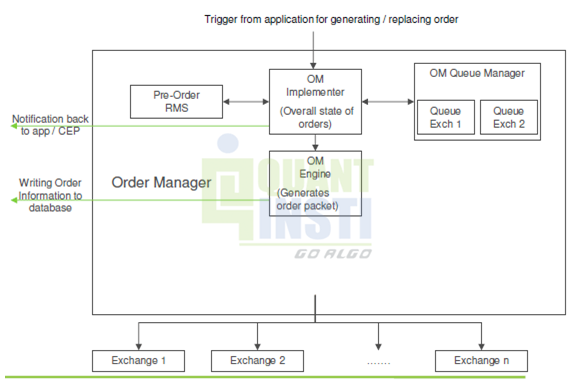

The Brazilian financial market is recognized for its dynamism and complexity, standing out as a central component in Latin America's economic structure. Centralized electronic trade and securities settlement play crucial roles in enhancing transaction efficiency and security, thereby supporting the integrity of the market. This article aims to examine the development and significance of these systems in Brazil, with a focus on crucial entities such as Cetip and B3, alongside the influence of algorithmic trading.

Cetip and B3 have become pillars of the Brazilian financial architecture, facilitating a range of services that underpin market operations. With the integration of electronic trading platforms, these institutions have strengthened the framework for secure and efficient transactions, addressing the growing demand for transparency and speed in financial dealings.



Algorithmic trading represents another transformative aspect of the Brazilian market, utilizing automated systems to execute transactions at high speed and frequency. This advancement optimizes market efficiency and reflects Brazil's commitment to embracing technological progress in financial operations. By scrutinizing these components, investors and market participants can better navigate and leverage Brazil's evolving financial environment, ultimately enhancing their strategic engagement within this robust market.

## Table of Contents

## Overview of the Brazilian Financial Market

The Brazilian financial market is characterized by a structured and comprehensive regulatory framework that is essential for maintaining market integrity and building investor confidence. This framework is primarily overseen by three key regulatory entities: the Central Bank of Brazil (Banco Central do Brasil, BCB), the Brazilian Securities and Exchanges Commission (Comissão de Valores Mobiliários, CVM), and the National Monetary Council (Conselho Monetário Nacional, CMN). Each of these bodies plays a pivotal role in the supervision, regulation, and stabilization of financial activities within Brazil.

The Central Bank of Brazil is responsible for ensuring financial stability and controlling inflation, while also influencing monetary policy. It governs the adherence to financial regulations and evaluates systemic risk, thus functioning as a cornerstone of the macroeconomic landscape. The BCB's initiatives include managing interest rates, overseeing banking operations, and working to preserve the currency's value, which are crucial activities that directly impact the financial sector's health.

The CVM, on the other hand, supervises the securities market, ensuring that transparency, efficiency, and equitable trading practices are upheld. It works to protect investors by enforcing securities laws and providing a framework for proper financial disclosure from companies. Its regulatory actions help maintain a fair environment in which investments can thrive, promoting the long-term sustainability and growth of the securities market.

The National Monetary Council serves as the chief authority for establishing Brazil's monetary, credit, and fiscal policies. It holds the responsibility of setting guidelines for activities that influence the entire financial system, thus playing an integral role in the economic development strategy of the country.

One of the foundational infrastructures of the Brazilian financial market is B3 (Brasil, Bolsa, Balcão). B3 functions as a central hub for trading, clearing, and settlement services, making it indispensable for financial transactions within the country. It facilitates the trading of various financial products, including equities, debt securities, and derivatives. Its dual role in providing a platform for trade execution and ensuring post-trade processes like clearing and settlement make it a key player in enhancing market [liquidity](/wiki/liquidity-risk-premium) and operational efficiency.

In conclusion, the holistic regulatory environment shaped by BCB, CVM, and CMN, combined with the critical infrastructure provided by B3, creates a secure and efficient platform for financial activities in Brazil. These elements collectively ensure that the Brazilian financial market remains robust, transparent, and conducive to both domestic and international investments.

## Centralized Trade and Securities Settlement

Centralized trade and securities settlement systems are fundamental to enhancing the efficiency and reliability of financial markets. In Brazil, these systems are deeply integrated within the operations of B3 (Brasil, Bolsa, Balcão), the primary stock exchange and financial services company in the country. Acting as the central counterparty clearing house, B3 facilitates the secure exchange of securities by taking the position between buyers and sellers to ensure the smooth execution of trades. This centralization minimizes counterparty risk, which is the possibility that one of the entities involved in the transaction could default on its financial obligations.

The integration of centralized trading and settlement within B3 allows for the immediate capture and recording of trading information. This immediacy is crucial for seamless settlement processes, as it reduces the time between trade execution and final settlement. Efficient settlement mechanisms minimize the risk of settlement failures, thus enhancing overall market stability and investor confidence.

With securities trading becoming increasingly complex, the role of automated and centralized clearing systems is pivotal. These systems ensure that transactions are accurately recorded, validated, and matched in real time, which is vital for maintaining market integrity and operational efficiency. They also provide comprehensive risk management tools that help in managing and mitigating various types of risks associated with trading, such as market risk, credit risk, and liquidity risk.

B3’s role is not limited to simply acting as a clearing house but extends to offering a robust platform that supports a wide array of financial instruments including stocks, derivatives, and foreign exchange. This capability underscores Brazil's commitment to maintaining a transparent and efficient market environment that is attractive to both domestic and international investors.

In summary, the centralized trade and securities settlement systems managed by B3 provide a structured environment that supports a high level of security and swiftly executed transactions, allowing Brazil to uphold its position as a competitive player in the international financial market.

## The Role of Cetip

Cetip, now integrated into B3 (Brasil, Bolsa, Balcão), holds a prominent position as a central depository for over-the-counter (OTC) and private derivatives across Latin America. It is an essential infrastructure component in the Brazilian financial market, with its role extending to custody, settlement, and trading services, managing assets worth over BRL 5 trillion. This expansive reach underscores its strategic importance in the region's financial ecosystem.

Originally established as a mutual organization, Cetip underwent significant transformation to become a publicly traded company, highlighting its growth trajectory and increased influence. This transition reflects a broader trend within financial markets towards greater transparency and efficiency, facilitating enhanced investor access and engagement.

Cetip's operations are vital for the efficient functioning of the market. By serving as a central hub for the recording and settlement of OTC transactions, it minimizes counterparty risk and supports market stability. The robust systems employed by Cetip ensure seamless execution and clearing of trades, which is crucial for maintaining investor confidence and market integrity.

The integration into B3, a leading marketplace for equities and fixed income trading, further amplifies Cetip's capabilities. This merger combines the strengths of both entities, enhancing service delivery while fostering innovation in market operations. Consequently, Cetip significantly contributes to the broader objectives of B3, which aims to position Brazil as a leading financial hub in Latin America.

In conclusion, Cetip's strategic initiatives and its integration into B3's infrastructure play a pivotal role in fortifying the operational framework of the Brazilian financial market. This not only enhances the market's resilience but also sets the stage for future growth and development in the financial sector.

## Algorithmic Trading in the Brazilian Market

Algorithmic trading, often referred to as algo trading, plays a crucial role in the Brazilian financial markets by leveraging sophisticated algorithms and high-speed data processing to automate trading activities. This method of trading uses predefined criteria set by quantitative models to execute trades with minimal human intervention, thereby enhancing market liquidity and efficiency.

The integration of [algorithmic trading](/wiki/algorithmic-trading) in Brazil is facilitated by advanced technological platforms like Cetip Trader. This platform, developed in collaboration with Intercontinental Exchange (ICE), is pivotal in automating trading processes, particularly in over-the-counter (OTC) derivatives markets. By utilizing algorithms, traders are able to execute orders in fractions of a second, capitalize on market opportunities that would otherwise be missed in manual trading, and reduce transaction costs.

A significant advantage of algorithmic trading is its ability to manage large volumes of trades without the typical emotional biases that can affect human traders. This leads to more consistent and objective trading decisions. Moreover, these automated strategies can be back-tested against historical data to evaluate their viability under different market conditions, allowing traders to refine their strategies with greater precision.

Python, a programming language known for its versatility in data analysis and scientific computing, is commonly used in developing algorithms for trading. Here is a simple example of how one might implement a moving average crossover strategy in Python:

```python
import numpy as np
import pandas as pd

def moving_average_crossover(data, short_window, long_window):
    signals = pd.DataFrame(index=data.index)
    signals['price'] = data['price']
    signals['short_mavg'] = data['price'].rolling(window=short_window, min_periods=1).mean()
    signals['long_mavg'] = data['price'].rolling(window=long_window, min_periods=1).mean()
    signals['signal'] = 0.0
    signals['signal'][short_window:] = np.where(signals['short_mavg'][short_window:] 
                                                 > signals['long_mavg'][short_window:], 1.0, 0.0)
    signals['positions'] = signals['signal'].diff()
    return signals

# Assuming 'data' is a DataFrame with a 'price' column filled with historical price data
# Example usage:
# signals = moving_average_crossover(data, short_window=40, long_window=100)
```
This script generates signals for buying and selling based on the crossover of short-term and long-term moving averages. Such algorithmic systems can be expanded to incorporate more complex strategies involving diverse asset classes, thus supporting a broad spectrum of trading activities.

The adoption of algorithmic trading in Brazil is poised for further growth as technological and infrastructural developments continue to evolve. With platforms like Cetip Trader, the Brazilian financial market offers a robust environment for implementing advanced trading strategies, ensuring high levels of market participation and financial innovation.

## Regulatory Considerations

The rapid evolution of trading technologies, including algorithmic trading, has presented new challenges and necessitates robust regulatory oversight in the Brazilian financial market to ensure transparency and stability. The principal regulatory bodies overseeing these activities are the Brazilian Securities and Exchange Commission (CVM) and the Central Bank of Brazil (BCB). Both entities actively monitor and regulate algorithmic trading practices to ensure that they adhere to established market standards, thereby safeguarding investor interests.

The CVM, responsible for overseeing the securities market, has implemented rules to ensure that algorithmic trading does not compromise market integrity. This includes setting guidelines for the deployment of algorithmic trading systems and establishing protocols for risk management and operational resilience. The BCB, on its part, governs the banking and financial systems, playing a crucial role in ensuring systemic stability, particularly concerning the settlement of transactions facilitated by technological advancements in trading.

Recent regulatory reforms in Brazil have been significant in bolstering the legal and operational frameworks that govern the financial markets. These reforms have focused on enhancing the transparency of trading activities, improving risk management protocols, and ensuring that technological advancements in trading do not negatively affect market integrity. One notable aspect of these reforms is the emphasis on real-time surveillance and automated reporting systems, which help regulators swiftly identify and address any irregularities or unfair trading practices.

Furthermore, Brazilian regulators have been proactive in aligning their frameworks with international standards, such as those set by the International Organization of Securities Commissions (IOSCO) and the Basel Committee on Banking Supervision. This alignment ensures that Brazilian markets remain attractive to foreign investors while maintaining robust protective measures for domestic stakeholders.

As trading technologies continue to advance, it is imperative for stakeholders to stay informed about regulatory developments. This vigilance will help them navigate the complexities of compliance while leveraging the potential benefits of modern trading systems. Continued dialogue between regulators, market participants, and technology developers will be essential in adapting to the evolving landscape, ensuring that regulatory policies remain effective and conducive to market growth.

## Future Outlook

The Brazilian financial market is positioned for substantial growth, owing to the continuous evolution of trading technologies and infrastructure enhancements. As the market embraces state-of-the-art technological advances, its capacity to accommodate a broader range of transactions with improved speed and reduced costs is set to expand, making it an attractive destination for foreign investment.

Investments in centralized trading and settlement systems stand to increase market liquidity and reduce transaction risks. Enhanced infrastructure will facilitate smoother operations and provide a reliable framework for market participants, thereby promoting investor confidence. The integration of advanced technologies such as blockchain and [artificial intelligence](/wiki/ai-artificial-intelligence) is expected to further streamline processes, offering improved transparency and efficiency.

Stakeholders are encouraged to stay informed about regulatory changes and technological shifts. The alignment of regulatory practices with international standards aims to protect investor interests while encouraging innovation. As the Brazilian Securities and Exchanges Commission (CVM) and the Central Bank of Brazil (BCB) continue to refine their regulatory frameworks, understanding these changes will be crucial for stakeholders seeking to leverage potential market opportunities.

Moreover, the rise of algorithmic trading and sophisticated data analytics tools will represent key drivers for market growth. These technological advancements can offer strategic advantages, allowing market players to make data-driven decisions in real-time. Firms willing to adapt to these innovations and update their systems accordingly will likely gain a competitive edge.

The continued transformation of Brazil's financial landscape signals a promising future, encouraging both domestic and international participants to engage with the market. By staying abreast of technological and regulatory developments, stakeholders can position themselves favorably to capitalize on the burgeoning opportunities within this dynamic financial environment.

## Conclusion

The intersection of centralized electronic trade and securities settlement with modern trading technologies is fundamentally transforming Brazil's financial landscape. This transformation is largely facilitated by pivotal players like Cetip, now a part of B3, whose continuous innovation bolsters both market safety and efficiency. By focusing on seamlessly integrating advanced trading technologies with secure centralized systems, Cetip plays a critical role in enhancing transactional transparency and minimizing associated risks.

Investors and financial professionals operating within this market are presented with unique opportunities as well as challenges. Understanding these dynamics is crucial for effectively navigating Brazil’s evolving market environment. Familiarity with the mechanisms of centralized systems and the latest advancements in algorithmic trading not only allows stakeholders to optimize their strategies but also ensures alignment with regulatory standards designed to protect market integrity.

Brazil's financial market configuration, with its emphasis on innovation in trade technologies, signals potential for substantial economic growth and increased foreign investment. Stakeholders are encouraged to stay informed about ongoing technological advancements and regulatory developments to fully capitalize on emerging opportunities within this vibrant market.

## References & Further Reading

[1]: ["Central Bank of Brazil (BCB)"](https://www.bcb.gov.br/en), Official website of the Central Bank of Brazil.

[2]: ["Brazilian Securities and Exchange Commission (CVM)"](https://www.gov.br/cvm/en), Official website of the CVM.

[3]: Millar, J. (2017). ["Algorithmic Trading: Winning Strategies and Their Rationale"](https://www.wiley.com/en-us/Algorithmic+Trading%3A+Winning+Strategies+and+Their+Rationale-p-9781118460146). Wiley Trading Series.

[4]: Hull, J. (2017). ["Options, Futures, and Other Derivatives"](https://books.google.com/books/about/Options_Futures_and_Other_Derivatives_eB.html?id=2iopDwAAQBAJ). Pearson Education.

[5]: ["International Organization of Securities Commissions (IOSCO)"](https://www.iosco.org/about/?subsection=about_iosco), Official website of IOSCO. 

[6]: Gomber, P., Arndt, B., Lutat, M., & Uhle, T. (2011). ["High-Frequency Trading"](https://papers.ssrn.com/sol3/papers.cfm?abstract_id=1858626). Goethe University Frankfurt.