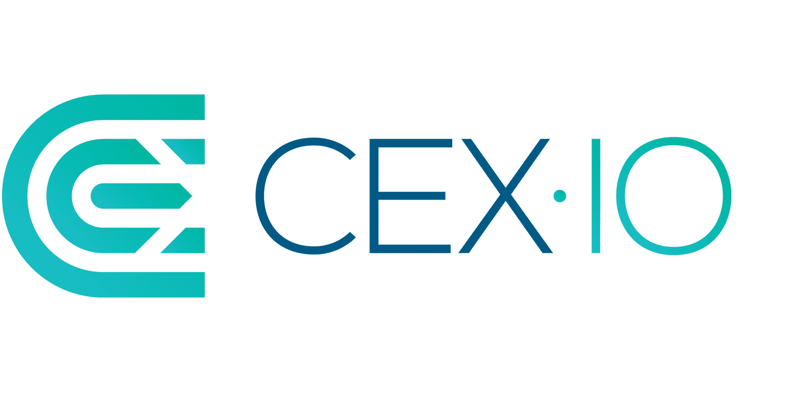

Cryptocurrency exchanges have become crucial tools for traders and investors aiming to buy, sell, or hold digital currencies. With the vast number of platforms available, CEX.IO distinguishes itself as a regulated and reliable option. Established in 2013, CEX.IO has transitioned from its origins as a Bitcoin cloud mining provider into a robust digital currency exchange platform that supports over 200 cryptocurrencies. This transformation exemplifies the platform's adaptation to the rapidly evolving cryptocurrency landscape.

Key aspects of CEX.IO include its extensive range of features and services, designed to cater to both novice and experienced users. From algorithmic trading capabilities to offerings for different needs such as individual, business, and institutional preferences, CEX.IO presents itself as a comprehensive solution for cryptocurrency management.



This article aims to provide a detailed review of CEX.IO, focusing on its features and services, as well as evaluating its advantages and potential drawbacks. It will explore the unique offerings in its algorithmic trading capabilities that set it apart from other platforms. Understanding these nuances is essential for both seasoned traders and newcomers, enabling users to make informed decisions in the dynamic world of cryptocurrency. As the cryptocurrency market continues to evolve, insights into platforms like CEX.IO will be invaluable for navigating this complex environment.

## Table of Contents

## Company Overview

CEX.IO is a prominent cryptocurrency exchange headquartered in Gibraltar, known for its extensive global reach. It operates in 99% of countries and 30 U.S. states, reflecting its commitment to accessibility and compliance. Established in 2013, CEX.IO initially served as a platform for Bitcoin cloud mining and a marketplace for hashing power. Since then, it has undergone significant transformation, evolving into a comprehensive digital currency exchange.

The current service offerings of CEX.IO are extensive and cater to a wide audience, from individual traders and investors to businesses and institutions. This diversification allows CEX.IO to accommodate varying needs and preferences in cryptocurrency management. Key services include not only the trading of a wide array of cryptocurrencies but also earning and borrowing options. For instance, users can engage in staking programs to earn returns or secure crypto-backed loans, providing flexibility and financial utility in their digital asset portfolios.

CEX.IO's ability to offer such a broad spectrum of services is supported by its adherence to regulatory standards, ensuring a secure and reliable platform for its users. Its offerings are tailored to meet the needs of different user groups, helping both novice and experienced users navigate the complex world of cryptocurrency with ease. This adaptability and commitment to user-centric services make CEX.IO a noteworthy entity in the cryptocurrency exchange landscape.

## Pros and Cons

CEX.IO, a prominent [cryptocurrency](/wiki/cryptocurrency) exchange platform, offers a variety of features and distinct advantages that cater to a broad spectrum of users, from retail investors to institutional traders. One of the most significant pros of CEX.IO is its commitment to regulatory compliance. This adherence to strict financial regulations reassures users of the platform's credibility and legal standing in the industry. Globally, it is recognized under regulatory bodies such as FinCEN in the United States and the Gibraltar Financial Services Commission (GFSC), enhancing trust among users concerned with security and regulatory standards.

The platform also supports a wide range of cryptocurrencies, with over 200 digital assets available for trading. This extensive selection includes mainstream cryptocurrencies like Bitcoin and Ethereum, as well as numerous altcoins, allowing users to diversify their investment portfolios effectively. Moreover, CEX.IO provides innovative financial products such as crypto-backed loans and staking programs, giving users the flexibility to leverage their holdings for passive income generation and [liquidity](/wiki/liquidity-risk-premium).

However, CEX.IO presents challenges that may affect the user experience for certain traders. Its comprehensive suite of services and products, while beneficial for seasoned traders seeking advanced features, can be daunting for beginners unfamiliar with complex trading environments. The array of options and trading interfaces could potentially overwhelm those new to cryptocurrency trading, creating a steeper learning curve compared to more straightforward platforms.

Additionally, the liquidity on CEX.IO, although sufficient for most trading activities, is generally lower compared to major exchanges like Binance or Coinbase Pro. Lower liquidity can result in higher trading costs due to potential price slippage, especially when executing large trades. This [factor](/wiki/factor-investing) is crucial for high-frequency and large-[volume](/wiki/volume-trading-strategy) traders who prioritize ease of execution and minimized transaction costs.

In summary, while CEX.IO offers a regulated and feature-rich trading environment with a diverse array of cryptocurrencies and financial products, it may not be the ideal choice for novices due to its complexity and slightly lower liquidity. Prospective users should weigh these pros and cons carefully to determine if the benefits align with their individual investment strategies and risk management preferences.

## Cryptocurrencies and Trading Experience

CEX.IO provides an extensive selection of over 200 digital currencies, catering to both mainstream and emerging segments of the cryptocurrency market. Major cryptocurrencies such as Bitcoin (BTC), Ethereum (ETH), and Litecoin (LTC) are prominently featured, alongside a range of altcoins that appeal to investors interested in diversifying their portfolios. This breadth accommodates various investment strategies, from conservative approaches focusing on well-established currencies, to more aggressive tactics that involve high-risk, high-reward altcoin trading.

The platform distinguishes itself by offering tailored interfaces for different user groups: ‘Everyone’, ‘Traders’, and ‘Businesses’. These interfaces are designed to cater to the specific needs and preferences of each group. The ‘Everyone’ option is user-friendly and focuses on simplicity, making it suitable for casual investors and newcomers. ‘Traders’ is engineered for more experienced users, providing advanced trading features such as spot and margin trading. Spot trading involves the immediate exchange of one cryptocurrency for another at prevailing market conditions. Margin trading, on the other hand, allows traders to borrow funds to increase their market exposure, thus amplifying potential gains and risks.

For businesses, CEX.IO delivers a suite of tools to manage large transactions and integrate cryptocurrency operations with existing financial structures efficiently. This flexibility is particularly advantageous for companies looking to incorporate digital currencies into their financial workflows.

New users benefit from the Instant Buy feature, permitting swift and straightforward purchases. This functionality is especially helpful for those looking to acquire cryptocurrencies without engaging in complex trading activities. The Instant Buy feature simplifies transactions by offering a quick, guided purchasing process that requires minimal user intervention.

In summary, CEX.IO's extensive cryptocurrency support and differentiated user interfaces make it a versatile platform that can serve a wide spectrum of users, from novices to seasoned traders and business entities. This adaptability, combined with the capacity for both spot and margin trading, offers comprehensive tools for engaging with the dynamic cryptocurrency market.

## Advanced Trading Features and Fees

CEX.IO's trading platform is designed to cater to both novice and seasoned traders by providing a sophisticated maker-taker fee structure that promotes cost-effective trading. The maker-taker model functions by charging different fees for makers, who provide liquidity to the market by placing limit orders, and takers, who remove liquidity by placing market orders that are immediately executed. This structure is particularly beneficial for high-volume traders, as it incentivizes them with progressively lower fees as their trading activity increases. For example, trading fees can range from 0.25% for takers with a 30-[day trading](/wiki/day-trading-spy) volume of less than $10,000 to as low as 0.10% or eliminate for those exceeding $10,000,000.

In addition to its straightforward fee structure, CEX.IO offers [algorithmic trading](/wiki/algorithmic-trading) tools which facilitate trading automation. These tools enable traders to define specific rules for their trades based on various market indicators and conditions. By automating trade execution, users can optimize their trading strategies and potentially increase their profitability. Automation tools can handle complex trading strategies that involve trading multiple pairs simultaneously, reacting to rapid market changes faster than a human could.

A simple example of an algorithm that traders might deploy in Python using a platform like CEX.IO could utilize the `ccxt` library for algorithmic trading:

```python
import ccxt
import pandas as pd
from datetime import datetime

# Initialize exchange
exchange = ccxt.cex({
    'apiKey': 'YOUR_API_KEY',
    'secret': 'YOUR_SECRET_KEY',
})

# Define trading strategy (moving average cross)
def should_buy(prices):
    short_window = 10
    long_window = 50
    short_avg = prices[-short_window:].mean()
    long_avg = prices[-long_window:].mean()
    return short_avg > long_avg

# Fetch market data
symbol = 'BTC/USD'
data = exchange.fetch_ohlcv(symbol, timeframe='1h', limit=100)
df = pd.DataFrame(data, columns=['timestamp', 'open', 'high', 'low', 'close', 'volume'])
df['timestamp'] = pd.to_datetime(df['timestamp'], unit='ms')

# Implement trading decision
if should_buy(df['close']):
    order = exchange.create_market_buy_order(symbol, 0.01)  # Example: Buy 0.01 BTC
    print('Order Executed:', order)
else:
    print('No Buy Signal')
```

Such tools not only increase efficiency but also minimize emotional influence in trading decisions. The transparency offered by the maker-taker fee structure, combined with the advanced algorithmic trading capabilities, positions CEX.IO as a competitive platform for traders seeking to enhance their trading performance through strategic fee management and automation.

## Security and Compliance

CEX.IO is committed to providing a secure trading environment for its users by implementing extensive safety measures. One of the primary security features utilized by CEX.IO is the storage of the majority of users' funds in cold wallets. Cold wallets are offline storage devices that are not connected to the internet, significantly reducing the risk of unauthorized access by hackers or other online threats. This approach ensures that the funds are insulated from potential cyber-attacks, providing peace of mind to users regarding the safety of their assets.

In addition to securing user funds, CEX.IO's operations are marked by compliance with financial standards and regulations within the jurisdictions where it operates. The exchange is registered with the U.S. Financial Crimes Enforcement Network (FinCEN), which obligates it to adhere to strict regulations designed to prevent financial crimes such as money laundering and terrorist financing. This registration reinforces CEX.IO's commitment to maintaining stringent security measures and transparency in its operations.

Furthermore, CEX.IO is also compliant with the regulations set forth by the Gibraltar Financial Services Commission (GFSC). Compliance with GFSC regulations signifies that CEX.IO has implemented comprehensive risk management practices, conducts regular audits, and meets high operational standards. These regulatory frameworks are integral in providing a robust foundation for CEX.IO's services, ensuring that the platform operates with integrity and protects its users' interests.

By prioritizing both technical security measures like cold wallet storage and adherence to regulatory compliance with entities such as FinCEN and GFSC, CEX.IO upholds a high standard of trustworthiness and reliability within the cryptocurrency exchange industry. This dual focus on security and compliance not only safeguards user assets but also promotes a transparent and secure trading environment for all users.

## Opening an Account and Customer Support

Registering on CEX.IO is a straightforward process designed to ensure security and compliance with anti-money laundering (AML) regulations. The platform prioritizes user verification to protect against fraudulent activities while maintaining a user-friendly onboarding experience. To create an account, users must provide their email address, create a password, and agree to the platform's terms of use. After completing these steps, CEX.IO requires users to verify their identity, adhering to "Know Your Customer" (KYC) procedures. This involves submitting a government-issued ID and, in some instances, proof of residence, such as a utility bill or bank statement.

CEX.IO excels in customer support by offering various channels, ensuring users can access assistance promptly. The platform provides live chat support, which is available 24/7 to address urgent queries and technical issues. Additionally, users can reach out to customer support via email for more detailed inquiries or concerns. For those seeking immediate assistance, CEX.IO's comprehensive online help center offers a vast array of resources, including FAQs, guides, and tutorials. This self-service repository covers a broad spectrum of topics, from account management to technical troubleshooting, helping users resolve common issues without direct interaction.

By focusing on robust account security measures and diverse support channels, CEX.IO aims to deliver a reliable and efficient service that meets the needs of both novice and experienced cryptocurrency users.

## Conclusion and Final Thoughts

CEX.IO offers a comprehensive solution for cryptocurrency investors interested in leveraging advanced trading features and accessing a diverse portfolio of digital assets. The platform's regulatory compliance and security measures provide an additional layer of trust for experienced traders seeking a reliable exchange. With over 200 cryptocurrencies available, users have ample opportunities to diversify and strategically allocate their investments.

Despite its many strengths, CEX.IO's extensive range of services may be daunting for newcomers. Beginners might find the breadth of options and the complexity of advanced tools challenging to navigate. Therefore, it is crucial for potential users to thoroughly evaluate their trading needs and risk tolerance when considering CEX.IO as their cryptocurrency exchange choice. By balancing these factors, investors can determine whether CEX.IO aligns with their investment strategies, functioning as either a primary platform or a supplementary tool in their digital asset management arsenal.

## References & Further Reading

[1]: Bergstra, J., Bardenet, R., Bengio, Y., & Kégl, B. (2011). ["Algorithms for Hyper-Parameter Optimization."](https://papers.nips.cc/paper/4443-algorithms-for-hyper-parameter-optimization) Advances in Neural Information Processing Systems 24.

[2]: ["Advances in Financial Machine Learning"](https://www.amazon.com/Advances-Financial-Machine-Learning-Marcos/dp/1119482089) by Marcos Lopez de Prado

[3]: ["Evidence-Based Technical Analysis: Applying the Scientific Method and Statistical Inference to Trading Signals"](https://www.amazon.com/Evidence-Based-Technical-Analysis-Scientific-Statistical/dp/0470008741) by David Aronson

[4]: ["Machine Learning for Algorithmic Trading"](https://github.com/stefan-jansen/machine-learning-for-trading) by Stefan Jansen

[5]: ["Quantitative Trading: How to Build Your Own Algorithmic Trading Business"](https://www.amazon.com/Quantitative-Trading-Build-Algorithmic-Business/dp/1119800064) by Ernest P. Chan