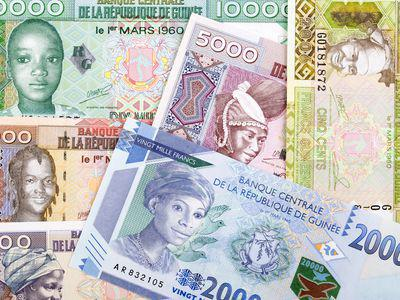

## Table of Contents

## What is the CFA Franc?

The CFA Franc is a currency used in several countries in West and Central Africa. It is divided into two different currencies: the West African CFA Franc, used in eight West African countries, and the Central African CFA Franc, used in six Central African countries. Both types of CFA Francs are tied to the Euro, which means their value is fixed to the Euro's value. This connection helps keep the CFA Franc stable, which can be good for trade and investment.

The CFA Franc was created during the colonial period when France controlled many African countries. After these countries gained independence, they kept using the CFA Franc. France still plays a big role in managing the currency. Some people think this is good because it brings stability and helps with trade. Others believe it limits the freedom of African countries to make their own economic decisions. The debate about the CFA Franc continues, but it remains an important part of the economy in the countries that use it.

## Which countries use the CFA Franc?

The West African CFA Franc is used by eight countries in West Africa. These countries are Benin, Burkina Faso, Ivory Coast, Guinea-Bissau, Mali, Niger, Senegal, and Togo. They all belong to a group called the West African Economic and Monetary Union (WAEMU).

The Central African CFA Franc is used by six countries in Central Africa. These countries are Cameroon, Central African Republic, Chad, Republic of the Congo, Equatorial Guinea, and Gabon. They are part of the Economic and Monetary Community of Central Africa (CEMAC).

Both types of CFA Francs are tied to the Euro, which means their value stays the same compared to the Euro. This helps keep the money stable in these countries.

## What are the two types of CFA Francs?

There are two types of CFA Francs: the West African CFA Franc and the Central African CFA Franc. The West African CFA Franc is used by eight countries in West Africa. These countries are Benin, Burkina Faso, Ivory Coast, Guinea-Bissau, Mali, Niger, Senegal, and Togo. They all belong to the West African Economic and Monetary Union (WAEMU).

The Central African CFA Franc is used by six countries in Central Africa. These countries are Cameroon, Central African Republic, Chad, Republic of the Congo, Equatorial Guinea, and Gabon. They are part of the Economic and Monetary Community of Central Africa (CEMAC).

Both types of CFA Francs are tied to the Euro. This means their value stays the same compared to the Euro, which helps keep the money stable in these countries.

## How is the CFA Franc linked to the Euro?

The CFA Franc is linked to the Euro in a way that keeps its value steady. For every West African CFA Franc, there are about 655.957 CFA Francs to one Euro. For the Central African CFA Franc, it's the same: 655.957 CFA Francs to one Euro. This link means that the CFA Franc's value doesn't change compared to the Euro. This can be good because it makes trade and investment easier since people know the value will stay the same.

The link to the Euro also means that the countries using the CFA Franc need to keep some of their money in France. They have to put at least half of their foreign money reserves into an account at the French Treasury. This is part of the agreement they have with France. Some people think this is a good way to keep the money stable, but others worry that it gives France too much control over their economies.

## What is the historical background of the CFA Franc?

The CFA Franc was created during the time when France ruled over many countries in Africa. It started in 1945, right after World War II. At that time, it was called the "Franc of the French Colonies in Africa." The goal was to make trade easier between France and its colonies. When these African countries became independent in the 1960s, they decided to keep using the CFA Franc. This helped them stay connected to France and the global economy.

Over the years, the CFA Franc has changed a bit. In 1994, its value was cut in half to help the economies of the countries using it. In 1999, when the Euro was introduced, the CFA Franc was linked to the Euro instead of the French Franc. This link to the Euro means that the CFA Franc's value stays the same compared to the Euro. Some people think this is good because it keeps the money stable. Others believe it limits the freedom of African countries to make their own money decisions. The debate about the CFA Franc continues, but it remains an important part of the economy in the countries that use it.

## How does the CFA Franc function as a currency?

The CFA Franc works as a currency in two groups of African countries. There is the West African CFA Franc used by eight countries in West Africa, and the Central African CFA Franc used by six countries in Central Africa. Both types of CFA Francs are tied to the Euro. This means that for every Euro, there are about 655.957 CFA Francs. Because of this link, the value of the CFA Franc stays the same compared to the Euro. This makes trade and investment easier because people know the value will not change.

The CFA Franc was created when France ruled over these African countries. It started after World War II and was meant to make trade easier between France and its colonies. When these countries became independent in the 1960s, they kept using the CFA Franc. This helped them stay connected to France and the global economy. Over time, the CFA Franc has changed, like when its value was cut in half in 1994 to help the economies of the countries using it. Some people think the link to the Euro is good because it keeps the money stable. Others believe it limits the freedom of African countries to make their own money decisions.

## What are the economic implications of using the CFA Franc?

Using the CFA Franc has both good and bad effects on the economies of the countries that use it. One good thing is that it makes their money stable. Because the CFA Franc is tied to the Euro, its value does not change much. This can help with trade and investment because people know the value will stay the same. It also makes it easier for these countries to do business with Europe and other places that use the Euro. This can bring more money into their economies and help them grow.

On the other hand, some people think that using the CFA Franc limits the freedom of these African countries. They have to keep some of their money in France, which means France has a lot of control over their economies. This can make it hard for these countries to make their own money decisions. Some people worry that this link to the Euro might not be good for their economies in the long run. It could make it harder for them to grow and develop on their own terms. The debate about the CFA Franc continues, but it remains an important part of the economy in the countries that use it.

## How has the CFA Franc evolved over time?

The CFA Franc was first created in 1945, right after World War II, when France still ruled over many African countries. It was called the "Franc of the French Colonies in Africa" and was meant to make trade easier between France and its colonies. When these African countries became independent in the 1960s, they chose to keep using the CFA Franc. This helped them stay connected to France and the global economy. The CFA Franc was originally tied to the French Franc, which was the money used in France at that time.

Over the years, the CFA Franc has changed in some important ways. In 1994, its value was cut in half to help the economies of the countries using it. This made their products cheaper and easier to sell. In 1999, when the Euro was introduced, the CFA Franc was linked to the Euro instead of the French Franc. This link means that the value of the CFA Franc stays the same compared to the Euro. Some people think this is good because it keeps the money stable. Others believe it limits the freedom of African countries to make their own money decisions. The debate about the CFA Franc continues, but it remains an important part of the economy in the countries that use it.

## What are the criticisms and controversies surrounding the CFA Franc?

Some people think the CFA Franc is bad because it gives France too much control over the money in African countries. These countries have to keep some of their money in France, which means France can influence their economies. Critics say this stops African countries from making their own money decisions. They think it makes it harder for these countries to grow and develop on their own. Some also say that being tied to the Euro makes their money too strong, which can hurt their ability to sell things to other countries.

Others argue that the CFA Franc is good because it keeps the money stable. Because the CFA Franc is linked to the Euro, its value stays the same. This makes trade and investment easier because people know the value will not change. It can bring more money into the economies of the countries that use it and help them grow. Supporters believe that the link to the Euro is a good thing because it helps these countries stay connected to Europe and the global economy.

The debate about the CFA Franc continues, with strong opinions on both sides. Some African leaders and groups want to change or get rid of the CFA Franc to have more control over their own economies. Others believe that the benefits of stability and trade are worth keeping the current system. The future of the CFA Franc will depend on how these arguments play out and what choices African countries make.

## How does the CFA Franc impact trade within and outside the African continent?

The CFA Franc helps make trade easier within the African countries that use it. Because the West African CFA Franc and the Central African CFA Franc are used in different groups of countries, it's simple for them to buy and sell things with each other. The money is the same, so they don't have to worry about changing it. This can help businesses grow and make more jobs in these countries. Also, because the CFA Franc is tied to the Euro, it's easier for these countries to trade with Europe and other places that use the Euro. They know the value of their money will stay the same, which makes trade more predictable and less risky.

However, some people think the CFA Franc can make trade harder, especially with countries outside Africa that don't use the Euro. Because the CFA Franc is linked to the Euro, its value can be too strong compared to other currencies. This might make it harder for African countries to sell their things to other places because their products can be more expensive. Critics say this can hurt their economies and make it harder for them to grow. The debate about whether the CFA Franc helps or hurts trade continues, but it's clear that it has a big impact on how these African countries do business with the rest of the world.

## What are the potential future reforms or alternatives to the CFA Franc?

Some people think that the CFA Franc should change or be replaced with a new kind of money. One idea is to make a new currency that is not tied to the Euro. This would give African countries more control over their own money and let them make decisions that are best for their economies. Another idea is to join a bigger group of African countries and use a common currency, like the African Union's plan for an African Monetary Union. This could help trade between African countries and make their economies stronger together.

Other people think that the CFA Franc should stay but be changed a little. For example, they might want to lower the amount of money that has to be kept in France. This would give African countries more freedom to use their money how they want. Some also think that the CFA Franc should be tied to a basket of different currencies instead of just the Euro. This could make the money more stable and less dependent on what happens in Europe. The future of the CFA Franc will depend on what African countries decide is best for them.

## How does the CFA Franc compare to other regional currencies in Africa?

The CFA Franc is different from other regional currencies in Africa because it is tied to the Euro. This means its value stays the same compared to the Euro, which can make trade easier with Europe. Other regional currencies, like the South African Rand or the Kenyan Shilling, are not tied to any other currency. Their values can go up and down, which can make trade more risky but also gives these countries more freedom to make their own money decisions.

Another regional currency in Africa is the East African Community (EAC) planning to use a common currency called the East African Shilling. This is similar to the CFA Franc because it aims to make trade easier between countries in the EAC. But unlike the CFA Franc, the East African Shilling is not tied to the Euro. This means the EAC countries would have more control over their money. The CFA Franc and other regional currencies show the different ways African countries are trying to make their economies stronger and work better together.

## References & Further Reading

[1]: Sylla, N. S. (2019). ["The CFA Franc: French Monetary Imperialism in Africa."](https://www.academia.edu/67271755/The_CFA_Franc_French_monetary_imperialism_in_Africa) Review of African Political Economy.

[2]: Masson, P. R., & Pattillo, C. A. (2004). ["The Monetary Geography of Africa."](https://archive.org/details/monetarygeograph0000mass) Brookings Institution Press.

[3]: Martin, G. (1986). ["The CFA Franc Zone in Africa: A Less Endearing Legacy of French Colonialism."](https://www.jstor.org/stable/3991568) African Affairs, 85(341), 421-442.

[4]: Stiglitz, J. E., & Greenwald, B. C. (2003). ["Towards a New Paradigm in Monetary Economics."](https://www.researchgate.net/publication/227390118_Towards_a_New_Paradigm_in_Monetary_Economics) Cambridge University Press.

[5]: ["The CFA Franc and its Crisis, African Currency Adjustments since 1945"](https://www.jstor.org/stable/j.ctv1g6q8w3) by Nicolas van de Walle