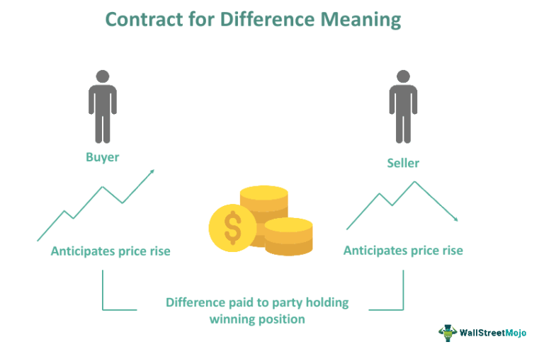

Algorithmic trading has dramatically transformed the landscape of financial markets by leveraging sophisticated automated systems to execute trades with speed and precision. These systems rely on pre-programmed algorithms to make trading decisions, minimizing human error and emotional influence. A critical instrument intertwined with algorithmic trading is Contracts for Difference (CFDs). CFDs enable traders to speculate on price movements of various financial instruments without direct ownership of the underlying assets. This unique trading methodology offers the potential for profit in both rising and falling markets, expanding opportunities for traders to capitalize on market fluctuations.

The integration of CFD trading with algorithmic strategies can augment trading performance by targeting market inefficiencies with enhanced accuracy. This synergy provides traders the ability to systematically exploit price movements while optimizing entry and exit points based on data-driven decisions. The automated nature of algorithmic trading enables seamless execution across multiple asset classes and market conditions, facilitating diversified trading strategies.



This article aims to unfold multiple CFD trading strategies within algorithmic trading, examining the benefits and inherent challenges. By understanding the fusion of these two complex fields, traders can potentially navigate the dynamic financial markets more effectively, achieving better trading outcomes.

## Table of Contents

## Understanding CFD Trading in the Context of Algo Trading

Contracts for Difference (CFD) trading offers a unique mechanism for speculators to gain exposure to price movements of an underlying asset without the necessity of owning the asset itself. This financial derivative allows traders to speculate on price differences, often with leverage, which amplifies both potential gains and losses. Essentially, a CFD contract is an agreement between a buyer and a seller to exchange the difference in the value of an asset between the time the contract opens and closes.

Algorithmic trading enhances CFD trading by deploying predefined trading instructions driven by data analytics to achieve operational efficacy in trade execution. This type of trading leverages sophisticated algorithms that process vast amounts of market data to identify trading opportunities based on set criteria. Algorithms can execute trades at speeds and frequencies that are impossible for human traders, reducing latency and optimizing trade execution.

In the realm of CFD trading, these algorithms play a crucial role in determining optimal entry and [exit](/wiki/exit-strategy) points. Such precision is achieved through the algorithms' ability to analyze real-time market data, historical patterns, and statistical indicators, thus identifying potential trends or reversals in the market. For example, a moving average crossover strategy could be implemented where the algorithm buys when a short-term moving average crosses above a long-term moving average and sells in the opposite scenario. The code snippet below illustrates a simple moving average crossover strategy using Python and the `pandas` library:

```python
import pandas as pd

# Sample data: DataFrame with 'price' column
data = pd.DataFrame({'price': [100, 101, 102, 103, 104, 105, 106, 102, 101, 100]})

# Calculate moving averages
data['short_ma'] = data['price'].rolling(window=3).mean()
data['long_ma'] = data['price'].rolling(window=5).mean()

# Generate trading signals
data['signal'] = 0  # 0 for no position, 1 for buy, -1 for sell
data.loc[data['short_ma'] > data['long_ma'], 'signal'] = 1
data.loc[data['short_ma'] < data['long_ma'], 'signal'] = -1

print(data)
```

Moreover, [algorithmic trading](/wiki/algorithmic-trading) in the context of CFDs minimizes human errors and reduces emotional biases, often inherent in manual trading. Emotional decisions, such as fear-driven sales or greed-induced purchases, are mitigated as algorithms strictly adhere to their coded strategies. This reduces the likelihood of inconsistent trading behavior and enhances overall decision-making objectivity.

Overall, the integration of algorithmic trading strategies within CFD trading frameworks provides a highly efficient mechanism to capitalize on market movements while minimizing potential pitfalls associated with human trading behaviors.

## Benefits of Using Algorithmic Strategies for CFD Trading

Algorithmic trading in Contracts for Difference (CFD) trading presents numerous advantages, primarily due to its speed and precision. By leveraging computer algorithms, trades can be executed within milliseconds, a significant improvement over manual trading methods. This speed is crucial in financial markets, where price movements can happen in fractions of a second, enabling traders to capitalize on short-lived opportunities and price discrepancies.

One of the primary benefits of algorithmic trading is the removal of emotional influences from the decision-making process. Trading decisions are derived solely from data-driven insights predetermined by the algorithm's code, enhancing objectivity. Human emotions, such as fear and greed, often lead to irrational trading decisions. By automating the trading process, algorithms ensure consistent, logical, and unbiased execution of trades, potentially increasing profitability and reducing risk.

Algorithms also bring the ability to monitor and execute multiple trading strategies across various asset classes and markets simultaneously. This capability facilitates diversification, spreading risk across different trades and markets to reduce the impact of negative performances from a single trade or asset. For example, a single algorithmic trading system can be set to follow a trend in the stock market, capitalize on mean reversion in the commodities market, and exploit [arbitrage](/wiki/arbitrage) opportunities in the foreign exchange market, all at the same time.

Moreover, algorithmic trading allows for the implementation of complex strategies that would be difficult, if not impossible, to execute manually. By analyzing large datasets quickly and identifying patterns or inefficiencies, algorithms can make instantaneous trading decisions based on sophisticated and nuanced trading rules. This capacity enables traders to implement high-frequency trading strategies that rely on the ability to execute large volumes of trades at very high speeds, further enhancing their trading arsenal.

In summary, the utilization of algorithmic strategies in CFD trading offers substantial benefits, including heightened speed and accuracy, emotion-free trading execution, and the ability to manage multiple strategies concurrently. These advantages contribute to potential improvements in trading performance and risk management.

## Popular CFD Trading Strategies in Algo Trading

Algorithmic trading has made significant advancements in financial markets, and CFD trading is no exception. Several algorithmic strategies have gained popularity for trading CFDs, each with distinct approaches to exploiting market conditions.

### Trend-Following Strategies

Trend-following strategies are designed to capitalize on the [momentum](/wiki/momentum) of an asset's price movement. Algorithms in this category are programmed to identify and act upon trends by analyzing various forms of data, such as moving averages and momentum indicators. A typical approach might involve setting moving averages of different lengths (e.g., Moving Average Convergence Divergence or MACD) to detect when a short-term average crosses above a long-term average, signaling a buy, or vice versa for a sell. 

### Mean Reversion Strategies

Mean reversion strategies are based on the premise that asset prices tend to revert to their historical average over time. These algorithms search for discrepancies between the current price and the long-term average, aiming to profit from the correction. This can be mathematically represented by:

$$

z = \frac{x - \mu}{\sigma} 
$$

where $z$ is the z-score, $x$ is the current price, $\mu$ is the mean of historical prices, and $\sigma$ is the standard deviation. A high absolute z-score indicates a deviation from the mean, suggesting a potential trade opportunity for reversion.

### Arbitrage Opportunities

Arbitrage strategies exploit price differences of the same asset across different markets or platforms. Algorithms can efficiently and rapidly perform numerous calculations to detect discrepancies, including latency arbitrage, where they leverage slight delays in price updates across exchanges. Implementing arbitrage can be computationally intensive, necessitating advanced software and hardware capable of performing these transactions at high speed to secure profits. For example, a simple arbitrage condition can be coded as:

```python
def arbitrage_opportunity(price_exchange1, price_exchange2, transaction_cost):
    if price_exchange1 - price_exchange2 > transaction_cost:
        # Buy from exchange 2 and sell on exchange 1
        return "Arbitrage: Buy on Exchange 2, Sell on Exchange 1"
    elif price_exchange2 - price_exchange1 > transaction_cost:
        # Buy from exchange 1 and sell on exchange 2
        return "Arbitrage: Buy on Exchange 1, Sell on Exchange 2"
    else:
        return "No Arbitrage Opportunity"
```

### Breakout Strategies

Breakout strategies identify significant levels where the price of an asset is likely to break through after periods of consolidation. These strategies utilize indicators such as support and resistance levels, Bollinger Bands, or Price Channels to determine potential [breakout](/wiki/breakout-trading) points. The goal is to enter trades as the price moves beyond these predetermined levels, capturing the surge that often follows a breakout. An algorithm might automatically buy when the price exceeds a resistance level or sell when it falls below a support level, adjusting the strategy based on historical [volatility](/wiki/volatility-trading-strategies).

These algorithmic strategies, when applied to CFD trading, offer diverse pathways to identifying and exploiting different market conditions. Traders must meticulously configure and test their algorithms to ensure they function optimally within the dynamic conditions of CFD markets.

## Technical and Data Requirements for Algo Trading in CFDs

For algorithmic trading in Contracts for Difference (CFDs), several technical and data requirements are fundamental to achieving optimal performance and effectiveness. 

**Data Integrity**

Data integrity is paramount, as the success of algorithmic trading systems depends significantly on the accuracy and timeliness of the data utilized. High-quality data provides a solid foundation for algorithmic strategies, helping them to make informed decisions. Inconsistencies or lag in data can lead to erroneous trade signals and potentially costly errors. Therefore, ensuring access to reliable, real-time market data is crucial. Real-time data enables traders to react swiftly to market changes, optimizing decision-making processes to enhance profitability. 

**Robust Infrastructure**

A dependable IT infrastructure is vital to support the demands of algorithmic trading, especially in the context of CFDs. This infrastructure must support low latency and high-frequency trading, as speed is a crucial advantage of algorithmic systems. Low latency refers to the minimized delay between a trade signal generation and its execution in the market. High-frequency trading, which involves executing a large number of trades in a fraction of a second, requires a robust infrastructure to maintain system performance and minimize downtime. Features such as co-location services, where trading servers are placed in proximity to exchange servers, can further reduce latency issues.

**Backtesting Capabilities**

Before deployment in live market conditions, algorithmic strategies must be rigorously tested using historical data, a process known as [backtesting](/wiki/backtesting). Backtesting assesses the viability of a trading strategy by evaluating its performance over past market conditions, providing insights into potential profitability and risk factors. An effective backtesting process must involve large datasets to ensure statistical significance and account for various market scenarios. Furthermore, incorporating transaction costs, slippage, and other real-world trading considerations can improve the accuracy of backtesting results. Python's libraries, such as `pandas` and `[backtrader](/wiki/backtrader)`, offer efficient tools for conducting backtests, as demonstrated in the following example:

```python
import pandas as pd
import backtrader as bt

class MyStrategy(bt.Strategy):
    def __init__(self):
        self.sma = bt.indicators.SimpleMovingAverage(self.data, period=15)

    def next(self):
        if self.data.close > self.sma:
            self.buy()
        elif self.data.close < self.sma:
            self.sell()

data = bt.feeds.YahooFinanceData(dataname='AAPL', fromdate=pd.Timestamp(2020, 1, 1), todate=pd.Timestamp(2021, 1, 1))
cerebro = bt.Cerebro()
cerebro.addstrategy(MyStrategy)
cerebro.adddata(data)
cerebro.run()
```

This Python snippet defines a simple moving average strategy using historical data from Yahoo Finance. The strategy buys when the closing price exceeds the moving average and sells when it's lower, showcasing a basic yet effective backtesting method.

## Challenges and Risks in CFD Algo Trading

Algorithmic trading in Contracts for Difference (CFD) exposes traders to unique challenges and risks, reflecting both the inherent characteristics of the financial instruments and the technological complexities of algorithm-based trading.

Market Volatility: Market volatility poses a significant challenge in CFD algorithmic trading. Sudden changes in market conditions can lead to slippage, a situation where the execution price of a trade differs from its expected price. This discrepancy occurs because algorithms execute trades based on predefined parameters that may not align with rapid market movements. For instance, if a news event causes a swift price change, an algorithm might execute a trade at a less favorable price due to latency between the market's response and the algorithm's execution.

Overfitting: Overfitting is a common pitfall in developing algorithmic trading strategies. It occurs when a strategy is excessively tailored to historical data, capturing noise rather than underlying market trends. While such strategies may perform exceptionally well in backtests, they often fail in real-time trading. Ensuring robust model validation and employing techniques like cross-validation can mitigate overfitting. Additionally, incorporating regularization methods can help create more generalizable models. For example, a Python snippet to detect overfitting might include:

```python
from sklearn.model_selection import cross_val_score
from sklearn.linear_model import Ridge

model = Ridge(alpha=1.0)
cross_val_scores = cross_val_score(model, X_train, y_train, cv=5)

print("Cross-validation scores: ", cross_val_scores)
```

Regulatory Considerations: Regulatory landscapes vary significantly across jurisdictions, impacting the use of algorithmic trading in CFDs. Some regions impose stringent regulations to mitigate risks associated with high-frequency trading, including circuit breakers and minimum resting times for orders. Traders must ensure compliance with such regulations to avoid legal repercussions. Moreover, ongoing regulatory scrutiny highlights the need for transparent and ethical trading practices, necessitating that traders stay informed about any regulatory changes that may affect their strategic operations.

In conclusion, while algorithmic trading in CFDs offers significant opportunities for profit, it also comes with substantial risks that require careful management. Understanding market dynamics, avoiding overfitting, and adhering to regulatory requirements are essential aspects for traders aiming to succeed in this competitive environment.

## Conclusion

Combining Contracts for Difference (CFD) trading with algorithmic strategies offers a significant advantage in terms of execution precision and potential profitability. By leveraging computer algorithms, traders can operate at speeds unattainable for human traders, executing trades in milliseconds to capitalize on fleeting market inefficiencies. However, traders need to be acutely aware of the challenges posed by technological, market, and regulatory frameworks inherent to algorithmic trading. 

Technologically, the need for robust infrastructure remains paramount. Ensuring minimal latency and secure, real-time data feeds can make the difference between a profitable trade and an unsuccessful one. On the market front, volatility can create unpredictable conditions, requiring strategies that are not only robust in normal but also extreme conditions. Furthermore, overfitting—an excessive tailoring of strategies to historical data—can lead to poor performance in evolving market dynamics.

Regulatory considerations must also be taken into account, as different jurisdictions impose varied rules on algorithmic trading. Non-compliance can lead to substantial penalties or restrictions, making it critical for traders to stay abreast of regulatory changes.

Continuous evaluation and adaptation of strategies are indispensable for sustaining long-term success in CFD algorithmic trading. By regularly backtesting strategies against historical data and applying [machine learning](/wiki/machine-learning) techniques for strategy optimization, traders can adapt to changing market conditions. This dynamic adjustment can involve re-calibrating algorithms, adopting new data sources, or modifying execution tactics. Maintaining a disciplined approach to these adjustments enables traders to refine performance, mitigate risks, and exploit new opportunities for profitability in the ever-evolving financial markets.

## References & Further Reading

[1]: Bergstra, J., Bardenet, R., Bengio, Y., & Kégl, B. (2011). ["Algorithms for Hyper-Parameter Optimization."](https://papers.nips.cc/paper/4443-algorithms-for-hyper-parameter-optimization) Advances in Neural Information Processing Systems 24.

[2]: ["Advances in Financial Machine Learning"](https://www.amazon.com/Advances-Financial-Machine-Learning-Marcos/dp/1119482089) by Marcos Lopez de Prado

[3]: ["Evidence-Based Technical Analysis: Applying the Scientific Method and Statistical Inference to Trading Signals"](https://www.amazon.com/Evidence-Based-Technical-Analysis-Scientific-Statistical/dp/0470008741) by David Aronson

[4]: ["Machine Learning for Algorithmic Trading"](https://github.com/PacktPublishing/Machine-Learning-for-Algorithmic-Trading-Second-Edition) by Stefan Jansen

[5]: ["Quantitative Trading: How to Build Your Own Algorithmic Trading Business"](https://books.google.com/books/about/Quantitative_Trading.html?id=j70yEAAAQBAJ) by Ernest P. Chan