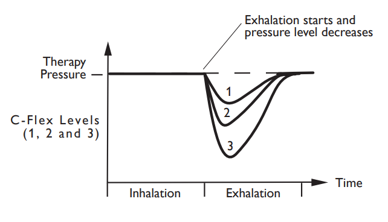

In algorithmic trading, technology plays a crucial role in boosting efficiency and supporting complex trading strategies. A leading technology in this domain is CFLEX, an electronic trading platform specifically designed for customized options. CFLEX facilitates the trading of options contracts with non-standard terms, enabling traders to tailor their investment strategies to specific market conditions. With its introduction, the landscape of options trading has been significantly transformed, offering traders enhanced flexibility and versatility. This article explores the CFLEX platform's definition, features, and significance for traders, explaining its operational mechanics and the distinct benefits it provides in the options market.

## Table of Contents

## What is CFLEX Technology?

CFLEX, which stands for Customized Flexible Options Exchange, is an electronic trading platform operated by the Cboe Options Exchange. It was launched in 2007 to cater specifically to the trading of customized options contracts, which deviate from standard specifications such as expiration dates, strike prices, and contract sizes. Unlike standardized options that trade on regulated exchanges with fixed terms, CFLEX facilitates the trading of bespoke options agreements, providing a level of customization necessary for certain trading strategies and market demands.

The platform's ability to process trades electronically and anonymously marks a significant advancement over traditional methods. Traders can execute complex derivatives trades without disclosing their intentions, thereby maintaining strategic confidentiality. This functionality is particularly crucial for large institutional investors seeking to manage risk or exploit arbitrage opportunities without alerting other market participants.

CFLEX achieves this by leveraging technology to match buy and sell orders seamlessly, ensuring that the trades comply with the terms set by the traders while maintaining market integrity and efficiency. The introduction of CFLEX has thus enabled even the most intricate options contracts to be traded with ease, offering a specialized avenue within the broader securities exchange landscape.

## Understanding CFLEX

CFLEX is an advanced platform developed as an extension of the original FLEX (Flexible Exchange Options) system by the Cboe Options Exchange. Initially, the FLEX system was introduced in 1993 to accommodate trades involving options contracts with unique and non-standardized terms. These contracts were initially managed through manual processes because their bespoke nature did not fit within the confines of standardized trading venues.

The development of CFLEX marks a significant improvement by providing an electronic infrastructure to facilitate these unique transactions. This change enhances operational efficiency by automating processes that were previously handled manually, thereby reducing the room for human error and increasing the speed at which trades can be executed. Moreover, it mitigates counterparty risks, as the electronic system can help ensure that counterparties fulfill their obligations, thus promoting trust among market participants.

An integral component of CFLEX's ability to enhance security and reliability is its partnership with the Options Clearing Corporation (OCC). The OCC acts as a guarantor for trades executed on CFLEX, ensuring that both sides of a transaction are upheld. This clearing mechanism adds an essential layer of security to the trades, safeguarding against defaults and providing stability to the options market.

In summary, CFLEX represents a significant technological evolution from its predecessor, emphasizing electronic facilitation, efficiency, and reduced trading risks through robust clearing protocols provided by the OCC. These advancements make CFLEX a crucial tool for traders dealing with customized options contracts.

## Key Features and Benefits

Traders utilizing CFLEX technology have the capability to tailor options contracts by adjusting a variety of parameters. These include expiration dates, exercise prices, and contract sizes, providing significant flexibility compared to standardized options. This customization enables traders to design options that align precisely with specific investment strategies or risk profiles.

One notable feature of CFLEX is its capacity for anonymous trading. By allowing trades to be executed without disclosing the identities of the participants, CFLEX enables traders to [carry](/wiki/carry-trading) out strategies without alerting the market to their intentions. This can be particularly advantageous for institutional traders and hedge funds that require privacy to prevent market impact or front-running.

CFLEX also supports a real-time price-time matching algorithm, which ensures that trades are executed at the best possible prices available at the given time. This is crucial in fast-paced trading environments where milliseconds can determine the profitability of transactions. The efficiency of this algorithm helps maximize trading opportunities and enhances [liquidity](/wiki/liquidity-risk-premium).

Another significant benefit of CFLEX is its facilitation of a secondary market where contract amendments can be handled efficiently. This feature allows for post-trade adjustments, providing traders with the flexibility to adapt to changing market conditions or strategies. Such adaptability is vital for sophisticated investors who need to continuously fine-tune their positions in response to market dynamics.

Overall, the design and capabilities of the CFLEX platform cater specifically to the needs of sophisticated investors seeking precise control over their options trading strategies. By offering an environment that supports anonymity, real-time execution, and customizable contract terms, CFLEX presents a powerful toolset for navigating the complexities of the financial markets efficiently.

## CFLEX in Algorithmic Trading

Algorithmic trading involves the use of automated systems to execute trades at optimal prices and speeds, and CFLEX technology is well-suited to enhance these strategies. The platform's electronic nature allows for seamless integration with [algorithmic trading](/wiki/algorithmic-trading) frameworks, thereby facilitating the execution of complex trading strategies with speed and precision. CFLEX stands out in the landscape of algorithmic trading by enabling the automatic management of customized options, which is a significant feature that caters to the nuanced requirements of sophisticated trading algorithms.

The customization capabilities of CFLEX mean that it can handle non-standardized options contracts, making it especially beneficial for algorithmic traders who develop strategies tailored to specific market conditions. For instance, traders can fine-tune parameters like expiration dates, exercise prices, and contract sizes, allowing them to align trading strategies closely with current market trends and forecasts. This level of customization can be instrumental in identifying and exploiting market inefficiencies, a key objective in algorithmic trading.

The ability of CFLEX to facilitate anonymous trading further enhances its appeal for algorithmic strategies. By allowing automated systems to operate without disclosing trade intentions, CFLEX supports the development of non-disruptive trading algorithms that can operate efficiently without alerting other market participants to their strategies. This characteristic is critical for maintaining strategic confidentiality and protecting edge in competitive markets.

Moreover, CFLEX supports a real-time price-time matching algorithm, a feature that is crucial for algorithmic trading systems seeking to capitalize on fleeting market opportunities. This capability ensures that trades are executed at the most favorable moments, optimizing the balance between timing and pricing. The electronic and automated nature of CFLEX aligns perfectly with the goals of algorithmic trading: to achieve the highest level of efficiency and the best possible trade execution outcomes.

In summary, CFLEX represents a significant advancement for traders focused on algorithmic strategies, providing the tools necessary to design, test, and execute algorithms that make use of flexible, customized options. Its features facilitate more dynamic risk management and strategy execution, enhancing the ability of traders to respond swiftly to market changes and ultimately gain an edge in trading performance.

## Conclusion

CFLEX represents a significant technological advancement in the trading of customized options by offering a sophisticated electronic platform that supports flexibility and efficiency in executing complex financial strategies. Its seamless integration into algorithmic trading systems enhances operational efficiency, allowing for rapid and precise execution of trades tailored to specific market conditions. This capability provides traders with unique strategic advantages, such as the ability to customize options contracts with specific parameters including expiration dates, exercise prices, and contract sizes, without sacrificing speed or anonymity in the marketplace.

As the trading landscape continues to evolve, CFLEX stands out as a powerful tool for traders seeking to navigate the complexities of the options market with precision. By accommodating the sophisticated needs of institutional investors and other market participants, CFLEX facilitates the development of bespoke strategies that can exploit market inefficiencies effectively. The electronic nature of the platform ensures a robust environment for executing trades, minimizing counterparty risk, and providing an additional layer of security through the Options Clearing Corporation's guarantees.

The ongoing development and adoption of electronic trading platforms like CFLEX will continue to shape the future of financial markets. As these technologies become increasingly sophisticated, they will likely spur innovation in trading strategies and contribute to the evolution of more integrated and efficient market ecosystems. Consequently, CFLEX not only improves current trading practices but also lays a foundational role in the future growth and transformation of financial markets, ensuring they are more adaptable in responding to changing economic conditions and technological advancements.

## References & Further Reading

[1]: Cboe Global Markets. (n.d.). ["CFLEX and FLEX Options."](https://www.cboe.com/tradable_products/equity_indices/flex_options/) Retrieved from Cboe official website.

[2]: Options Clearing Corporation. (n.d.). ["The Role of the OCC."](https://www.theocc.com/) Retrieved from OCC official website.

[3]: Black, F., & Scholes, M. (1973). ["The Pricing of Options and Corporate Liabilities."](https://www.cs.princeton.edu/courses/archive/fall09/cos323/papers/black_scholes73.pdf) Journal of Political Economy, 81(3), 637-654.

[4]: Hull, J. C. (2018). ["Options, Futures, and Other Derivatives (10th Edition)."](https://www.amazon.com/Options-Futures-Other-Derivatives-10th/dp/013447208X) Pearson.

[5]: Jorion, P. (2007). ["Value at Risk: The New Benchmark for Managing Financial Risk (3rd Edition)."](https://link.springer.com/article/10.1007/s11408-007-0057-3) McGraw-Hill Education.