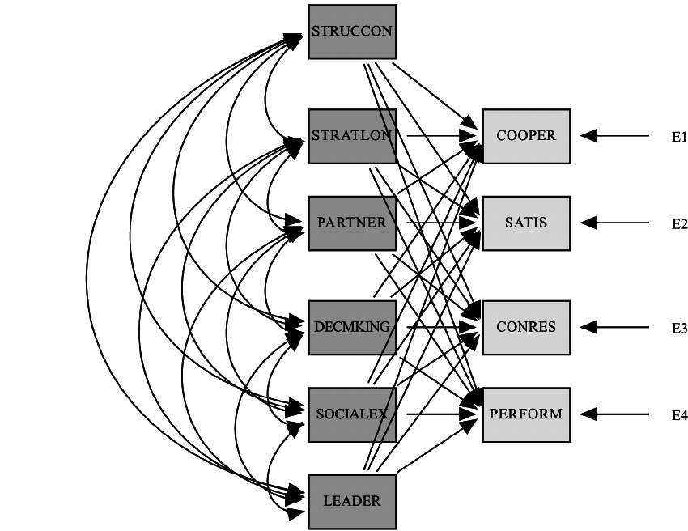

## Table of Contents

## What is a chaebol?

A chaebol is a type of large, family-owned business group in South Korea. These conglomerates have a lot of power and influence in the country's economy. They are involved in many different industries, like electronics, cars, and construction. Samsung and Hyundai are examples of chaebols.

Chaebols started growing after the Korean War when the government helped them to rebuild the economy. They got special loans and support to expand their businesses. Over time, they became very big and important. Today, they still have a big impact on South Korea's economy and sometimes face criticism for having too much power.

## How did chaebols originate in South Korea?

Chaebols started in South Korea after the Korean War in the 1950s. The country was poor and needed to rebuild. The government wanted to grow the economy fast, so it helped some big families start businesses. These families got special loans and support from the government. This helped them grow their companies into big groups that worked in many different areas like electronics, cars, and building things.

Over time, these family businesses became very powerful and important in South Korea. They are called chaebols. They helped the country's economy grow a lot. Today, chaebols like Samsung and Hyundai are known all over the world. But some people think they have too much power and that this can cause problems.

## What are the main characteristics of a chaebol?

A chaebol is a big family business in South Korea that works in many different areas like electronics, cars, and building things. They are very powerful and important in the country's economy. The families that own chaebols have a lot of control over how the businesses are run. They often pass the business down from one generation to the next.

Chaebols started after the Korean War when the government helped some families start businesses to help the country grow. They got special loans and support, which helped them become very big and important. Today, chaebols like Samsung and Hyundai are known all over the world, but some people think they have too much power and that can cause problems.

## Can you name some of the largest chaebols in South Korea?

Some of the biggest chaebols in South Korea are Samsung, Hyundai, LG, and SK. These companies are very important to the country's economy. They work in many different areas like electronics, cars, and chemicals. Samsung is famous for its phones and TVs. Hyundai makes cars that people all over the world drive.

These chaebols started growing after the Korean War. The government helped them by giving them special loans and support. This helped them become big and powerful. Today, they still have a big impact on South Korea's economy. They are known around the world, but sometimes people think they have too much power and that can cause problems.

## How do chaebols influence the South Korean economy?

Chaebols have a big impact on South Korea's economy. They make a lot of money and help the country grow. They work in many different areas like electronics, cars, and building things. This means they create a lot of jobs for people. When chaebols do well, the whole country's economy does well too. They also help South Korea be known around the world because of their products like Samsung phones and Hyundai cars.

Sometimes, chaebols can cause problems because they have so much power. They can affect the government and how it makes decisions. This can make it hard for smaller businesses to grow. People worry that chaebols might not always follow the rules because they are so big and important. But, even with these problems, chaebols are still a big part of why South Korea's economy is strong.

## What is the typical corporate structure of a chaebol?

A chaebol usually has a big family at the top that owns it. The family members often run the business and make the big decisions. They have a lot of power over how the chaebol works. The chaebol is made up of many different companies that work in different areas like electronics, cars, and building things. These companies are all connected and work together, but they are also separate businesses.

The family at the top of the chaebol passes it down from one generation to the next. This means the same family can control the chaebol for a long time. They use a holding company to own shares in all the different companies in the chaebol. This helps them keep control over everything. The holding company is like the boss of all the other companies in the chaebol.

## How do chaebols manage their succession and leadership transitions?

Chaebols manage their succession and leadership transitions by keeping the business in the family. The family at the top of the chaebol chooses who will be the next leader. This is usually someone from the next generation, like a son or daughter. They start preparing the chosen person early, giving them important jobs in the company so they can learn how to run it. This way, when the time comes, the new leader is ready to take over.

Sometimes, this process can cause problems. If there are many family members who want to be the leader, it can lead to fights and disagreements. The family has to work hard to make sure everyone is happy with the choice. Also, the new leader needs to be good at running the business. If they are not, it can hurt the chaebol. But when it goes well, the chaebol keeps growing and stays strong under new leadership.

## What role does the government play in regulating chaebols?

The government in South Korea plays a big role in trying to keep chaebols in check. They make rules and laws to make sure chaebols don't get too powerful and to make sure they follow the rules. For example, the government can stop chaebols from doing things that hurt smaller businesses. They also check to make sure chaebols are not cheating or breaking the law. This is important because chaebols are so big and important to the economy.

Sometimes, the government and chaebols work together. After the Korean War, the government helped chaebols grow by giving them special loans and support. This helped the country's economy grow a lot. But it also means the government has to be careful. They need to make sure they are not letting chaebols get too much power. Balancing help and control is a big challenge for the government.

## How have chaebols adapted to global economic changes?

Chaebols have had to change a lot because the world's economy keeps changing. They started by focusing on making things like electronics and cars in South Korea. But now, they sell their products all over the world. To do this, they opened factories and offices in other countries. This helps them make things closer to where people buy them and save money. They also learned to make new kinds of products that people want, like smartphones and electric cars.

Another big change for chaebols is how they work with other companies. They used to do everything themselves, but now they work with other businesses around the world. This helps them get new ideas and technology. They also have to follow rules in different countries, which can be hard. But by working together and being flexible, chaebols can keep growing and staying strong, even when the world's economy changes.

## What are the criticisms and controversies surrounding chaebols?

People often criticize chaebols because they have a lot of power and influence in South Korea. Some say that chaebols can control the government and make it hard for smaller businesses to grow. They worry that chaebols might not always follow the rules because they are so big and important. This can make it unfair for everyone else. For example, chaebols have been accused of using their power to get special favors from the government, like loans or support that smaller businesses can't get.

Another big issue with chaebols is how they handle their family business. When the family at the top of the chaebol passes it down to the next generation, it can cause problems. If the new leader is not good at running the business, it can hurt the chaebol and the economy. Also, fights between family members over who should be the next leader can make things messy. Sometimes, these family issues lead to scandals and bad publicity for the chaebol, which can damage its reputation and trust with the public.

## How do chaebols impact South Korean society and culture?

Chaebols have a big impact on South Korean society and culture. They are seen as symbols of success and power. Many people in South Korea dream of working for a chaebol because they offer good jobs and high salaries. This makes chaebols very important in people's lives. They also help make South Korea known around the world because of their products like Samsung phones and Hyundai cars. This makes people feel proud of their country.

But chaebols also cause some problems in society. Some people think chaebols have too much power and can affect the government's decisions. This can make it hard for smaller businesses to grow and can make life unfair for people who don't work for chaebols. Also, when chaebols have family fights or scandals, it can make people lose trust in them. This can affect how people see their society and culture, making them feel worried about the future.

## What future challenges and opportunities do chaebols face in the global market?

Chaebols face many challenges in the global market. One big challenge is competition from other big companies around the world. These companies are also trying to sell electronics, cars, and other products. Chaebols need to keep making new and better products to stay ahead. Another challenge is following the rules in different countries. Each country has its own laws, and chaebols have to make sure they follow them all. This can be hard and expensive. Also, changes in the world's economy, like trade wars or pandemics, can make it tough for chaebols to keep growing.

But there are also many opportunities for chaebols. They can keep growing by selling their products in more countries. This means they can reach more people and make more money. Chaebols can also work with other companies around the world to get new ideas and technology. This can help them make even better products. Another opportunity is to focus on new areas like green energy and electric cars. These are growing markets, and chaebols can use their skills to become leaders in these fields. By being smart and flexible, chaebols can keep being successful in the global market.

## References & Further Reading

[1]: ["South Korea's Chaebol Challenge"](https://www.cfr.org/backgrounder/south-koreas-chaebol-challenge) - The Economist

[2]: Woo-Cumings, M. (1999). ["The Developmental State."](https://www.jstor.org/stable/10.7591/j.ctvv411jz) Cornell University Press.

[3]: Kim, S. (2010). ["Korean Financial Crisis of 1997-98: Causes, Policy Response, and Lessons."](https://www.semanticscholar.org/paper/The-1997-98-Korean-financial-crisis-Causes%2C-policy-Kim/aadc988626ddc09aeeb8c0cd9537714a011c19b1) International Monetary Fund.

[4]: Chang, H.-J. (2003). ["Kicking Away the Ladder: Development Strategy in Historical Perspective."](https://www.jstor.org/stable/40722165) Anthem Press.

[5]: ["Algorithmic Trading: Winning Strategies and Their Rationale"](https://www.amazon.com/Algorithmic-Trading-Winning-Strategies-Rationale-ebook/dp/B00CY5HC0U) by Ernest P. Chan

[6]: Jin, H. J., & Lee, S. J. (2017). ["Chaebols and Corporate Governance in Korea."](https://www.sciencedirect.com/science/article/abs/pii/S0927538X20300287) In Corporate Governance in Emerging Markets. 

[7]: Aguilera, R. V., & Kabbach de Castro, L. R. (2016). ["Corporate Governance in Emerging Markets: Insights from Theory and Practice."](https://www.researchgate.net/profile/Ruth-Aguilera/publication/228119803_Corporate_Governance_in_Emerging_Markets/links/09e415118eb8a9b7f4000000/Corporate-Governance-in-Emerging-Markets.pdf?origin=publication_detail) Cambridge University Press.

[8]: ["Chaebol: Korea's Largest Business Groups"](https://businesschief.asia/leadership-and-strategy/top-10-chaebol-chiefs-driving-conglomerates-in-south-korea) - Nikkei Asia