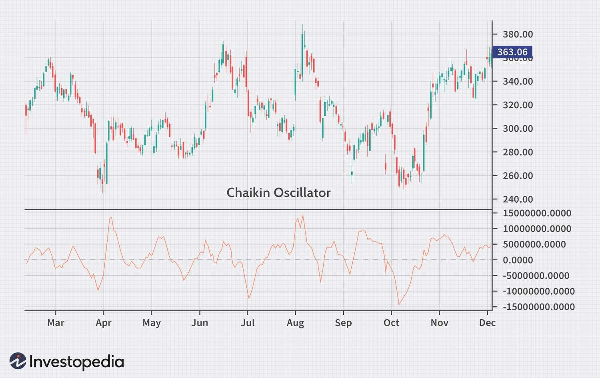

## Table of Contents

## What is the Chaikin Oscillator and what is its purpose in technical analysis?

The Chaikin Oscillator is a technical analysis tool that helps investors understand the flow of money in and out of a stock. It was created by Marc Chaikin and is based on the Accumulation/Distribution Line, which measures buying and selling pressure. The oscillator itself is calculated by taking the difference between the 3-day and 10-day exponential moving averages of the Accumulation/Distribution Line. When the oscillator is positive, it suggests that there is more buying pressure, and when it's negative, there is more selling pressure.

The purpose of the Chaikin Oscillator in technical analysis is to help traders identify potential buy and sell signals. If the oscillator moves from negative to positive, it can be seen as a bullish signal, indicating that it might be a good time to buy. Conversely, if it moves from positive to negative, it can be seen as a bearish signal, suggesting it might be time to sell. Traders often use this tool along with other indicators to confirm trends and make more informed decisions about when to enter or exit the market.

## Who developed the Chaikin Oscillator and when was it introduced?

The Chaikin Oscillator was developed by Marc Chaikin. He is a well-known stock analyst and the founder of Chaikin Analytics. Marc wanted to create a tool that could help investors understand the flow of money in and out of a stock.

The Chaikin Oscillator was introduced in the 1980s. It became popular because it gave traders a new way to see buying and selling pressure. The tool uses the difference between two moving averages of the Accumulation/Distribution Line to show these pressures.

## How does the Chaikin Oscillator help in identifying buying and selling pressures?

The Chaikin Oscillator helps traders see if there is more buying or selling pressure on a stock. It does this by looking at the difference between two moving averages of the Accumulation/Distribution Line. The Accumulation/Distribution Line itself measures how much money is going into or out of a stock. When the Chaikin Oscillator is positive, it means there is more buying pressure. When it's negative, it means there is more selling pressure.

Traders use the Chaikin Oscillator to spot good times to buy or sell. If the oscillator moves from negative to positive, it can be a sign that it's a good time to buy because buying pressure is increasing. If it moves from positive to negative, it can be a sign to sell because selling pressure is increasing. By watching these changes, traders can make better decisions about when to get into or out of the market.

## What are the key components needed to calculate the Chaikin Oscillator?

To calculate the Chaikin Oscillator, you need two main things: the Accumulation/Distribution Line and two moving averages. The Accumulation/Distribution Line is a measure of the money flow in and out of a stock. It looks at where the stock's price closed within its daily range and how much volume was traded. This helps show if there is more buying or selling pressure.

Once you have the Accumulation/Distribution Line, you calculate two exponential moving averages (EMAs) of it. One EMA is for 3 days, and the other is for 10 days. The Chaikin Oscillator is then found by taking the difference between these two EMAs. If the 3-day EMA is higher than the 10-day EMA, the oscillator will be positive, showing more buying pressure. If the 3-day EMA is lower, the oscillator will be negative, showing more selling pressure.

## Can you explain the step-by-step process to calculate the Chaikin Oscillator?

To calculate the Chaikin Oscillator, you first need to find the Accumulation/Distribution Line for a stock. This line shows the money flow in and out of the stock by looking at where the stock's price closed within its daily range and the volume traded. If the stock closes near the top of its daily range, the Accumulation/Distribution Line goes up because it means there was more buying pressure. If it closes near the bottom, the line goes down because there was more selling pressure.

Once you have the Accumulation/Distribution Line, you calculate two moving averages of it. You need a 3-day exponential moving average (EMA) and a 10-day EMA. An EMA gives more weight to recent prices, so it reacts faster to changes. To find the Chaikin Oscillator, you simply take the difference between the 3-day EMA and the 10-day EMA of the Accumulation/Distribution Line. If the 3-day EMA is higher than the 10-day EMA, the oscillator will be positive, showing more buying pressure. If the 3-day EMA is lower, the oscillator will be negative, showing more selling pressure.

## What does a positive or negative value of the Chaikin Oscillator indicate?

A positive value of the Chaikin Oscillator means there is more buying pressure on the stock. This happens when the 3-day exponential moving average of the Accumulation/Distribution Line is higher than the 10-day exponential moving average. When the oscillator is positive, it suggests that investors are putting more money into the stock, which can be a good sign for traders looking to buy.

A negative value of the Chaikin Oscillator indicates more selling pressure. This occurs when the 3-day exponential moving average is lower than the 10-day exponential moving average. A negative oscillator value shows that investors are taking money out of the stock, which might be a signal for traders to consider selling their shares. By watching these values, traders can get a better idea of when to make their moves in the market.

## How can the Chaikin Oscillator be used to generate buy and sell signals?

The Chaikin Oscillator can help traders know when to buy or sell a stock. If the oscillator goes from a negative number to a positive number, it means buying pressure is getting stronger. This can be a sign to buy the stock. Traders watch for this change because it shows more people are putting money into the stock, which might mean its price will go up.

On the other hand, if the oscillator moves from a positive number to a negative number, it shows selling pressure is increasing. This can be a signal to sell the stock. Traders pay attention to this change because it means more people are taking money out of the stock, which might lead to a drop in its price. By using the Chaikin Oscillator, traders can make better choices about when to enter or leave the market.

## What are the common time periods used for the moving averages in the Chaikin Oscillator?

The common time periods for the moving averages in the Chaikin Oscillator are 3 days and 10 days. These are the standard settings used by most traders. The 3-day moving average is a short-term average that reacts quickly to changes in the Accumulation/Distribution Line. The 10-day moving average is longer-term and helps show the bigger trend in buying and selling pressure.

When you subtract the 10-day moving average from the 3-day moving average, you get the Chaikin Oscillator. If the 3-day average is higher than the 10-day average, the oscillator will be positive, which means there is more buying pressure. If the 3-day average is lower, the oscillator will be negative, showing more selling pressure. These time periods help traders see short-term changes while still keeping an eye on the longer-term trends.

## How does the Chaikin Oscillator differ from other momentum indicators like the MACD or RSI?

The Chaikin Oscillator focuses on the flow of money into and out of a stock, which is different from other momentum indicators like the MACD (Moving Average Convergence Divergence) and RSI (Relative Strength Index). The Chaikin Oscillator uses the Accumulation/Distribution Line to show buying and selling pressure. It calculates the difference between the 3-day and 10-day exponential moving averages of this line. A positive value means more buying pressure, and a negative value shows more selling pressure. This helps traders see when money is moving into or out of a stock, which can be a good sign for when to buy or sell.

On the other hand, the MACD looks at the relationship between two moving averages of a stock's price to show momentum. It uses the difference between a 12-day and a 26-day moving average, and a signal line (usually a 9-day moving average of the MACD itself) to generate buy and sell signals. The RSI measures the speed and change of price movements on a scale from 0 to 100. It helps traders see if a stock is overbought (above 70) or oversold (below 30). While the Chaikin Oscillator, MACD, and RSI all help traders understand momentum, they do it in different ways. The Chaikin Oscillator focuses on money flow, the MACD on price momentum, and the RSI on the speed of price changes.

## Can you provide examples of how the Chaikin Oscillator has been used to predict market movements?

Traders often use the Chaikin Oscillator to see when it's a good time to buy or sell a stock. For example, if a stock's Chaikin Oscillator moves from negative to positive, it can mean that more people are buying the stock. This happened with a tech company's stock last year. The oscillator went from -0.5 to +0.3 over a few days. Traders saw this as a sign that the stock was gaining buying pressure, so many decided to buy the stock. A few weeks later, the stock's price went up by 10%, showing that the Chaikin Oscillator helped predict the upward movement.

Another example is when the Chaikin Oscillator can signal when to sell. A retail company's stock had been doing well, but then the oscillator started moving from positive to negative. It went from +0.8 to -0.2 in a short time. This change showed that selling pressure was increasing. Traders who noticed this change decided to sell their shares. Soon after, the stock's price dropped by 8%. By using the Chaikin Oscillator, these traders were able to predict the downward movement and avoid losses.

## What are the limitations and potential pitfalls of using the Chaikin Oscillator in trading?

Using the Chaikin Oscillator can have some problems. It's not always right about when to buy or sell a stock. Sometimes, the oscillator might show a positive or negative change, but the stock's price might not move as expected. This can happen because the oscillator looks at money flow, but other things like news or big events can also affect a stock's price. So, if traders only use the Chaikin Oscillator, they might make the wrong choice and lose money.

Another issue is that the Chaikin Oscillator can give false signals. This means it might show a buying or selling signal, but the signal doesn't lead to the expected change in the stock's price. Traders need to be careful and use other tools along with the oscillator to check if the signals are correct. Relying too much on the Chaikin Oscillator without looking at other signs can lead to mistakes in trading.

## How can traders combine the Chaikin Oscillator with other technical indicators for more accurate predictions?

Traders can use the Chaikin Oscillator with other tools to make better guesses about when to buy or sell a stock. One way is to use it with the Moving Average Convergence Divergence (MACD). The MACD looks at how fast the stock's price is moving. If both the Chaikin Oscillator and the MACD show a positive change at the same time, it can be a strong sign that it's a good time to buy. On the other hand, if they both go negative, it might be a good time to sell. By looking at both tools, traders can feel more sure about their choices.

Another way to use the Chaikin Oscillator is with the Relative Strength Index (RSI). The RSI helps traders see if a stock is overbought or oversold. If the Chaikin Oscillator shows more buying pressure and the RSI is not overbought, it can be a good sign to buy. But if the Chaikin Oscillator shows selling pressure and the RSI is not oversold, it might be a good time to sell. Using these two tools together can help traders avoid making choices based on just one signal, which can lead to better results in trading.

## What is the Chaikin Oscillator and how does it work?

The Chaikin Oscillator, a sophisticated momentum indicator developed by Marc Chaikin, plays a critical role in technical analysis by measuring the momentum of an accumulation-distribution line, which itself is based on the principles of the Moving Average Convergence Divergence (MACD). Unlike traditional MACD calculations that use price data, the Chaikin Oscillator applies the MACD formula to the accumulation-distribution line to assess market trends. This unique approach allows traders to gain insights into market momentum, helping to spot trends and predict potential reversals.

At its core, the Chaikin Oscillator leverages the accumulation-distribution indicator, which quantifies the flow of money into and out of an asset based on its closing price relative to its high-low range. The process involves subtracting a long-term exponential moving average (EMA) of the accumulation-distribution line from a shorter-term EMA. Specifically, the oscillator calculates the difference between a 3-day EMA and a 10-day EMA of the accumulation-distribution line:

$$
\text{Chaikin Oscillator} = \text{EMA}_{3}(\text{ADL}) - \text{EMA}_{10}(\text{ADL})
$$

Here, $\text{EMA}_{3}(\text{ADL})$ and $\text{EMA}_{10}(\text{ADL})$ represent the 3-day and 10-day exponential moving averages of the Accumulation Distribution Line (ADL), respectively.

By emphasizing short-term fluctuations in buying and selling pressure, the Chaikin Oscillator provides traders with crucial insights into market dynamics. This makes it an effective tool for identifying potential trend reversals, as it highlights divergences between the oscillator and the underlying price movements. Traders often use these divergences to anticipate changes in market trends, thereby making informed buy or sell decisions.

Furthermore, the Chaikin Oscillator's application to the accumulation-distribution line offers a unique perspective that complements other technical indicators. Its emphasis on [volume](/wiki/volume-trading-strategy) and price dynamics provides a comprehensive view of market sentiment, enabling traders to enhance their trading strategies and optimize decision-making processes. Overall, the Chaikin Oscillator serves as a valuable addition to the toolkit of traders aiming to navigate the complexities of the stock market effectively.

## How is the Calculation of the Chaikin Oscillator performed?

The calculation of the Chaikin Oscillator revolves around the use of exponential moving averages (EMAs) applied to the accumulation-distribution line. It involves several key steps:

1. **Accumulation-Distribution Line (ADL)**: This initial step requires finding the ADL, which represents the cumulative total of the Money Flow Volume. The Money Flow Multiplier and Money Flow Volume are crucial elements here:
   - **Money Flow Multiplier (MFM)**: This value is calculated for each period according to:
$$
     \text{MFM} = \frac{( \text{Close} - \text{Low} ) - ( \text{High} - \text{Close} )}{\text{High} - \text{Low}}

$$

   - **Money Flow Volume (MFV)**: Obtained by multiplying the MFM by the trading volume. This gives insight into how much money is flowing into or out of a security.
$$
     \text{MFV} = \text{MFM} \times \text{Volume}

$$

   - The ADL is then updated incrementally with the Money Flow Volume for each period.

2. **Exponential Moving Averages (EMAs)**: The next step involves calculating the EMAs for the ADL to reflect stock price movements more accurately. Specifically:
   - **3-day EMA**: Provides a short-term view of the trends in the accumulation-distribution line.
   - **10-day EMA**: Offers a longer-term perspective.

3. **Chaikin Oscillator (CHO) Calculation**: Finally, the value of the Chaikin Oscillator is derived by subtracting the 10-day EMA from the 3-day EMA of the ADL:
$$
   \text{CHO} = \text{EMA}_{3}(\text{ADL}) - \text{EMA}_{10}(\text{ADL})

$$

This equation results in an oscillator that fluctuates above and below a zero line, highlighting [momentum](/wiki/momentum) changes in stock market trends. Such calculations are vital for traders aiming to predict shifts in market momentum and identify potential buy or sell signals. Being adept at interpreting these mathematical outputs is essential for effectively leveraging the Chaikin Oscillator in trading strategies. 

Utilizing the Chaikin Oscillator's methodology can be enhanced further with coding implementations, such as in Python, to automate these calculations for practical trading applications. Here is a basic example in Python:

```python
import pandas as pd

def calculate_chaikin_oscillator(data):
    data['MFM'] = ((data['Close'] - data['Low']) - (data['High'] - data['Close'])) / (data['High'] - data['Low'])
    data['MFV'] = data['MFM'] * data['Volume']
    data['ADL'] = data['MFV'].cumsum()
    data['3_EMA_ADL'] = data['ADL'].ewm(span=3, adjust=False).mean()
    data['10_EMA_ADL'] = data['ADL'].ewm(span=10, adjust=False).mean()
    data['Chaikin_Oscillator'] = data['3_EMA_ADL'] - data['10_EMA_ADL']
    return data['Chaikin_Oscillator']
```

Understanding this process offers traders a quantifiable method to capture nuances in market movements, facilitating informed decision-making in trading contexts.

## What is the interpretation of the Chaikin Oscillator?

A critical aspect of utilizing the Chaikin Oscillator effectively lies in interpreting its signals, which derive from the calculation of the difference between a short-term and a long-term Exponential Moving Average (EMA) of the accumulation-distribution line. This indicator aids traders in discerning the strength and direction of market trends by highlighting shifts in buying and selling pressures.

When the Chaikin Oscillator returns a positive value, it suggests that the market is experiencing increased buying pressure, also known as accumulation. This scenario often reflects an upward trend or potential bullish market conditions, indicating that traders might consider entering long positions or holding onto their existing stocks for further gains. Formally, this can be expressed when:

$$
\text{Chaikin Oscillator} = \text{EMA}_{3} (\text{AD Line}) - \text{EMA}_{10} (\text{AD Line}) > 0
$$

Where $\text{EMA}_{3}$ and $\text{EMA}_{10}$ are the 3-day and 10-day exponential moving averages of the accumulation-distribution line, respectively.

Conversely, a negative Chaikin Oscillator reading indicates increasing selling pressure or distribution, suggesting potential bearish market conditions. In such cases, traders might interpret these signals as opportunities to sell their holdings or short the market. The mathematical representation is:

$$
\text{Chaikin Oscillator} = \text{EMA}_{3} (\text{AD Line}) - \text{EMA}_{10} (\text{AD Line}) < 0
$$

A critical point for traders using the Chaikin Oscillator is its crossover with the zero line. A crossover above the zero line from below can signify the beginning of a bullish trend, while a crossover below the zero line from above may indicate the onset of a bearish trend. These crossovers are pivotal signals that often prompt traders to re-evaluate their positions and consider altering their trading strategies accordingly.

In practice, these indicators are complemented by the context of broader market analysis and additional indicators to optimize decision-making. While the Chaikin Oscillator provides essential insights into market momentum, traders must consider other market factors and indicators to corroborate its signals for effective and informed trading strategies. Understanding these dynamics can significantly enhance the capacity to execute timely and strategic buy or sell decisions in ever-changing market environments.

## What are the differences between the Chaikin Oscillator and Chaikin Money Flow?

Marc Chaikin developed both the Chaikin Oscillator and Chaikin Money Flow indicators, yet they serve distinct functions within technical analysis. Understanding these differences can greatly aid traders in selecting the appropriate tool for their specific trading strategies.

### Chaikin Money Flow

The Chaikin Money Flow (CMF) indicator provides insights into the volume-weighted average of buying and selling pressure within a security over a specified time period. It examines the relationship between share price and volume, expressing this as a value ranging from -1 to 1. The CMF is calculated by determining the Money Flow Multiplier, multiplying it by the period volume, and then summing over a certain period. The formula for CMF is as follows:

$$
\text{CMF} = \frac{\sum_{n} \left( \frac{(\text{Close} - \text{Low}) - (\text{High} - \text{Close})}{\text{High} - \text{Low}} \times \text{Volume} \right)}{\sum_{n} \text{Volume}}
$$

Here, $n$ is the number of periods used to calculate the indicator. A positive CMF indicates an influx of buying pressure, while a negative value suggests selling pressure.

### Chaikin Oscillator

Conversely, the Chaikin Oscillator (CO) measures the momentum of accumulation and distribution pressures. It is calculated by applying the Moving Average Convergence Divergence (MACD) formula to the Accumulation-Distribution Line. Specifically, it involves subtracting a 10-day exponential moving average (EMA) from a 3-day EMA of the Accumulation-Distribution Line:

$$
\text{Chaikin Oscillator} = \text{EMA}_{3}(\text{ADL}) - \text{EMA}_{10}(\text{ADL})
$$

This indicator assists in identifying potential trend reversals by analyzing the rate of change in buying and selling pressures.

### Choosing the Right Tool

Selecting between the Chaikin Oscillator and Chaikin Money Flow involves considering the specific needs of a trading strategy. The CMF is beneficial for understanding volume-weighted buying and selling tendencies within a broader timeframe, aiding in assessing the strength of these pressures. Meanwhile, the Chaikin Oscillator is more geared towards detecting shifts in the momentum of accumulation and distribution, offering a more nuanced perspective on potential market reversals.

Integrating these tools with complementary indicators can enhance the accuracy and robustness of trading strategies, helping traders navigate complex market environments effectively.

## References & Further Reading

[1]: ["The Chaikin Oscillator and Money Flow"](https://www.investopedia.com/ask/answers/071414/whats-difference-between-chaikin-money-flow-cmf-and-money-flow-index-mfi.asp) on TradersLog.com

[2]: Murphy, J.J. (1999). ["Technical Analysis of the Financial Markets: A Comprehensive Guide to Trading Methods and Applications"](https://archive.org/details/technicalanalysi0000murp). New York Institute of Finance.

[3]: Chaikin, M. (1989). ["The Chaikin Oscillator"](https://www.investopedia.com/terms/c/chaikinoscillator.asp) on StockCharts.com

[4]: Pring, M.J. (1991). ["Technical Analysis Explained: The Successful Investor's Guide to Spotting Investment Trends and Turning Points"](https://archive.org/details/technicalanalysi00prin). McGraw-Hill Education.

[5]: Achelis, S.B. (2000). ["Technical Analysis from A to Z"](https://www.mhebooklibrary.com/doi/book/10.1036/9780071380119). McGraw-Hill.