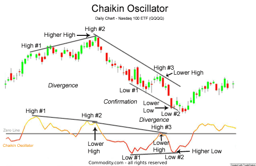

The Chaikin Oscillator is a trading indicator developed by Marc Chaikin in the 1980s. Despite advancements in technology and the emergence of numerous sophisticated indicators, the Chaikin Oscillator remains an area of interest among algorithmic traders. This ongoing interest can be attributed to its unique approach in assessing the momentum of a security through the analysis of accumulation and distribution patterns. The indicator's ability to provide insights into buying or selling pressure makes it a valuable component in the toolkit of traders who rely on algorithmic strategies.

This article will explore the Chaikin Oscillator's application within algorithmic trading, covering its definition, calculation, and use cases. The step-by-step breakdown of its computation will highlight its practical relevance in developing trading strategies. Specific attention will be given to different methods of applying the Chaikin Oscillator, particularly in anticipating price movements by leveraging market momentum signals.



Furthermore, we will examine insights from various backtests conducted using the Chaikin Oscillator. Although results from these backtests often exhibit limited profitability, they shed light on how the oscillator can be effectively integrated into broader trading strategies. By analyzing its performance in scenarios such as crossing above or below the zero line, we gain a better understanding of its strengths and limitations.

Overall, the Chaikin Oscillator stands out for its unique methodology, and while not a standalone predictive tool, it complements other indicators to form a comprehensive trading strategy.

## Table of Contents

## Understanding the Chaikin Oscillator

The Chaikin Oscillator is a technical analysis indicator that measures the momentum of a security's price movements by tracking the accumulation or distribution of trades. Unlike the Chaikin Money Flow (CMF) indicator, which is used to track money flow volume over a specific period, the Chaikin Oscillator focuses on the momentum aspect derived from the accumulation/distribution line. 

The oscillator is founded on the premise that price movements are often preceded by changes in the volume and buying/selling pressure. To quantify this, it calculates the difference between two exponential moving averages (EMA) of the accumulation/distribution line (ADL), which serves as the core of the indicator. By doing so, the Chaikin Oscillator offers a visualization of whether the buying or selling pressure is increasing or decreasing. 

The accumulation/distribution line itself is a cumulative tally, constructed by adding or subtracting each period's Money Flow Volume to or from the previous cumulative total. The Money Flow Multiplier is critical in this calculation, as it provides a weighted dimension based on the close price's relative position between the high and low. This calculation can be expressed as:

$$
\text{Money Flow Multiplier} = \frac{(Close - Low) - (High - Close)}{High - Low}
$$

Subsequently, the Money Flow Volume is computed by multiplying this multiplier by the period's [volume](/wiki/volume-trading-strategy):

$$
\text{Money Flow Volume} = \text{Money Flow Multiplier} \times \text{Volume}
$$

The aggregated value is then used to form the Accumulation/Distribution Line, which is smoothed by short-term and long-term EMAs to derive the Chaikin Oscillator. This fluctuation around its zero line is indicative of a shift in buying (positive values) or selling (negative values) pressure.

The value of the Chaikin Oscillator's reading offers traders insights into potential market conditions. A crossing of the zero line signifies a change in [momentum](/wiki/momentum), which traders may interpret as a signal of strengthening buying or selling trends. Consequently, the oscillator helps traders identify bullish or bearish environments, making it a valuable tool for detecting directional changes in market sentiment.

## Calculation of the Chaikin Oscillator

The Chaikin Oscillator is a momentum indicator that is calculated through a four-step process involving the Money Flow Multiplier, Money Flow Volume, Accumulation/Distribution Line (ADL), and the difference between short-term and long-term exponential moving averages (EMA) of the ADL. Understanding these calculation steps is vital for applying the oscillator effectively in trading strategies.

1. **Money Flow Multiplier (MFM):** The Money Flow Multiplier quantifies the closing price position relative to its high-low range in a given time period. It is calculated as follows:
$$
   \text{MFM} = \frac{(\text{Close} - \text{Low}) - (\text{High} - \text{Close})}{\text{High} - \text{Low}}

$$

   The MFM ranges between -1 and +1, where a value close to +1 indicates strong buying pressure, and a value near -1 indicates strong selling pressure.

2. **Money Flow Volume (MFV):** This step calculates the Money Flow Volume by multiplying the Money Flow Multiplier (MFM) by the volume for the period:
$$
   \text{MFV} = \text{MFM} \times \text{Volume}

$$

   The MFV represents the dollar value of traded volumes that can be attributed to either accumulation (buying) or distribution (selling) pressures.

3. **Accumulation/Distribution Line (ADL):** The Accumulation/Distribution Line is a cumulative total of the Money Flow Volume values. It reflects the aggregate impact of buy and sell pressures and is updated for each trading period as:
$$
   \text{ADL} = \text{ADL}_{\text{prev}} + \text{MFV}

$$

   The ADL serves as the basis for calculating the Chaikin Oscillator, capturing the cumulative effect of Money Flow Volume over time.

4. **Chaikin Oscillator Calculation:** The final step involves determining the Chaikin Oscillator itself, which is calculated as the difference between a short-term EMA and a long-term EMA of the Accumulation/Distribution Line:
$$
   \text{Chaikin Oscillator} = \text{EMA}_{\text{short-term}}(\text{ADL}) - \text{EMA}_{\text{long-term}}(\text{ADL})

$$

   Typically, a 3-day EMA is used for the short-term, and a 10-day EMA for the long-term, but these periods can be adjusted based on specific trading strategies or market conditions.

By following these steps, traders can evaluate buying and selling pressures through the Chaikin Oscillator and discern potential momentum shifts in the market. The oscillator's fluctuations around the zero line are pivotal for identifying transitions from accumulation to distribution phases and vice versa. Understanding these calculations allows traders to incorporate the oscillator effectively within broader [algorithmic trading](/wiki/algorithmic-trading) systems.

## Application in Algo Trading

Algorithmic trading incorporates the Chaikin Oscillator to harness market momentum signals for predicting price movements. The indicator is particularly valuable for detecting bullish or bearish divergences and signals when it crosses the zero line, which are critical elements of trading strategies within algorithmic frameworks.

The Chaikin Oscillator is calculated based on the difference between two exponential moving averages (EMAs) applied on the Accumulation/Distribution Line (ADL). This feature renders it quite sensitive to shifts in market momentum, providing algorithmic traders the ability to gauge real-time buying or selling pressures. For instance, a cross above the zero line suggests increasing buying pressure, hinting at potential upward price movement. Conversely, a cross below zero indicates selling pressure, suggesting possible declines.

In algorithmic trading systems, the detection of these zero-crossings can be implemented using Python. The following code snippet demonstrates a simple algorithmic trading strategy using the Chaikin Oscillator:

```python
import pandas as pd
import numpy as np

# Sample function for Chaikin Oscillator calculation
def calculate_chaikin_oscillator(df, short_window=3, long_window=10):
    # Calculate the Money Flow Multiplier
    df['Money Flow Multiplier'] = ((df['Close'] - df['Low']) - (df['High'] - df['Close'])) / (df['High'] - df['Low'])

    # Calculate Money Flow Volume
    df['Money Flow Volume'] = df['Money Flow Multiplier'] * df['Volume']

    # Calculate Accumulation/Distribution Line
    df['ADL'] = df['Money Flow Volume'].cumsum()

    # Short-term EMA of ADL
    short_ema = df['ADL'].ewm(span=short_window, adjust=False).mean()

    # Long-term EMA of ADL
    long_ema = df['ADL'].ewm(span=long_window, adjust=False).mean()

    # Chaikin Oscillator
    df['Chaikin Oscillator'] = short_ema - long_ema

    return df

# Usage on OHLC data
ohlc_data = pd.DataFrame({
    'Close': np.random.random(100) * 100,
    'Low': np.random.random(100) * 100,
    'High': np.random.random(100) * 100,
    'Volume': np.random.randint(100, 1000, size=100)
})

chaikin_oscillator_df = calculate_chaikin_oscillator(ohlc_data)

# Determine buy/sell signals
chaikin_oscillator_df['Signal'] = 0
chaikin_oscillator_df['Signal'][chaikin_oscillator_df['Chaikin Oscillator'] > 0] = 1  # Buy
chaikin_oscillator_df['Signal'][chaikin_oscillator_df['Chaikin Oscillator'] < 0] = -1  # Sell
```

In this Python code, traders implement a basic approach where a positive Chaikin Oscillator initiates a buy signal and a negative oscillator triggers a sell. However, this simple strategy can be further enhanced by incorporating additional metrics or indicators for robust decision-making.

Algorithmic traders capitalize on the Chaikin Oscillator by embedding it within more complex trading algorithms. While quantifying momentum shifts effectively, it can be paired with other technical indicators to filter out noise and increase the reliability of trading signals. This integration allows the oscillator to be part of a larger algorithmic trading toolkit designed to optimize trade executions and return outcomes.

## Backtested Trading Strategies Using Chaikin Oscillator

Several strategies employing the Chaikin Oscillator have been subjected to [backtesting](/wiki/backtesting), particularly focusing on its behavior when crossing above or below the zero line. This zero line crossover is often interpreted by traders as a signal for potential buying or selling opportunities. When the Chaikin Oscillator crosses above the zero line, it typically indicates growing buying pressure, suggesting a potential buy signal. Conversely, a cross below the zero line may signal increasing selling pressure, suggesting a potential sell signal.

Backtests conducted on various datasets and financial indices, such as the S&P 500, have provided mixed results regarding the profitability of these strategies. While the Chaikin Oscillator can highlight momentum shifts, its predictive value in isolation tends to be limited. Nevertheless, the indicator can be a useful component of a more comprehensive trading strategy.

In practice, traders often enhance the effectiveness of the Chaikin Oscillator by combining it with other technical indicators or trading rules to reduce the likelihood of false signals. For example, confirming signals with trendline analysis or incorporating filters such as volume thresholds might improve the reliability of trades based on the Chaikin Oscillator.

Python is frequently used to backtest these trading strategies. Using libraries such as Pandas for data manipulation and talib for technical indicators, a typical backtest setup might follow this structure:

```python
import pandas as pd
import talib

# Assuming `data` is a DataFrame with 'Close', 'High', 'Low', and 'Volume' columns
data['ADL'] = talib.AD(data['High'], data['Low'], data['Close'], data['Volume'])
data['Chaikin'] = talib.EMA(data['ADL'], timeperiod=3) - talib.EMA(data['ADL'], timeperiod=10)

# Define trading strategy
def chaikin_strategy(data):
    buy_signals = []
    sell_signals = []
    position = None

    for i in range(1, len(data)):
        if data['Chaikin'].iloc[i] > 0 and data['Chaikin'].iloc[i - 1] <= 0 and position != 'long':
            buy_signals.append(i)
            position = 'long'
        elif data['Chaikin'].iloc[i] < 0 and data['Chaikin'].iloc[i - 1] >= 0 and position != 'short':
            sell_signals.append(i)
            position = 'short'

    return buy_signals, sell_signals

buy_signals, sell_signals = chaikin_strategy(data)
```

Despite varying returns, tests show that the Chaikin Oscillator can offer useful insights into momentum changes, especially when used in combination with other indicators. However, it is crucial for traders to continuously test different configurations and adjustments to adapt to changing market conditions. This approach helps in maximizing the utility of the Chaikin Oscillator within a robust and diversified trading system.

## Enhancing with Complementary Indicators

Pairing the Chaikin Oscillator with other technical indicators, such as the Relative Strength Index (RSI), can enhance the effectiveness of trading strategies by offering more robust confirmations. This multi-indicator approach can help reduce false signals, providing a more reliable basis for trading decisions.

The Chaikin Oscillator primarily focuses on the momentum indicated by the accumulation or distribution of a security, fluctuating around a zero line to suggest buying or selling pressure. However, used in isolation, it may sometimes provide misleading signals due to market noise or abrupt reversals.

In contrast, the RSI measures the speed and change of price movements, providing insights into whether a security is overbought or oversold based on user-defined parameters. By combining the Chaikin Oscillator with the RSI, traders can cross-reference signals to validate potential market moves. For instance, when the Chaikin Oscillator crosses above the zero line, indicating buying pressure, a concurrent RSI reading above 50 could strengthen the bullish signal. Conversely, if the RSI signals an overbought condition when the Chaikin Oscillator suggests ongoing buying pressure, traders might consider watching for a potential reversal.

Using Python, traders can implement this combined strategy efficiently. The powerful libraries such as `pandas` and `ta` (Technical Analysis library) can be leveraged to compute and analyze these indicators. Here's a simplified example of how such a strategy might be coded:

```python
import pandas as pd
import ta

# Assuming 'df' is a pandas DataFrame containing your stock data with 'close', 'high', and 'low' price columns

# Calculate Chaikin Oscillator
df['High_Low_Exchange'] = ((df['close'] - df['low']) - (df['high'] - df['close'])) / (df['high'] - df['low'])
df['MFV'] = df['High_Low_Exchange'] * df['close'].diff()
df['ADL'] = df['MFV'].cumsum()
df['Chaikin'] = ta.momentum.chaikin_oscillator(df['high'], df['low'], df['close'])

# Calculate RSI
df['RSI'] = ta.momentum.RSIIndicator(df['close']).rsi()

# Strategy: Buy when Chaikin crosses above zero and RSI > 50
df['Signal'] = ((df['Chaikin'] > 0) & (df['RSI'] > 50)).astype(int)

# Export signals for further analysis
signals = df[df['Signal'] == 1]
```

By implementing such a combined strategy, traders can refine their approach, utilizing the strengths of both indicators to confirm signals more effectively and reduce the likelihood of false positives. The integration of multiple indicators allows for a comprehensive analysis, accommodating the nuanced nature of market dynamics.

## Pros and Cons of Using the Chaikin Oscillator

The Chaikin Oscillator, while providing valuable market momentum insights, possesses both advantages and drawbacks that traders must consider in the context of algorithmic trading.

**Advantages:**
1. **Momentum Indication**: The primary advantage of the Chaikin Oscillator is its ability to indicate changes in market momentum. By measuring the momentum of a security, it allows traders to anticipate potential shifts in price direction, which can be crucial for timing trades effectively. This utility is particularly beneficial for identifying emerging bullish or bearish trends.

2. **Zero Line Crossover Signals**: The oscillator provides clear signals through zero line crossovers, which are relatively simple to interpret. A crossover above the zero line indicates increasing buying pressure, while a crossover below suggests growing selling pressure. This feature aids traders in making swift and decisive trading actions.

3. **Utility in Divergence Detection**: The Chaikin Oscillator is effective in spotting divergences between price movement and oscillator behavior, which can serve as precursors to price reversals. This capability enhances its role in verifying trading signals generated by other indicators.

**Disadvantages:**
1. **Limited Standalone Predictive Power**: One of the significant limitations of the Chaikin Oscillator is its reduced predictive power when used in isolation. It often requires supplementary indicators to filter out false signals. As a result, relying solely on the Chaikin Oscillator for trading decisions may increase the risk of inaccurate predictions.

2. **Sensitivity to Market Noise**: The oscillator can be sensitive to short-term market fluctuations, sometimes leading to whipsaws where rapid movements result in false signals. This sensitivity may necessitate adjustments in parameter settings or the incorporation of filters to improve signal reliability.

3. **Dependency on Parameters**: The effectiveness of the Chaikin Oscillator can heavily depend on the chosen parameters for the moving averages (e.g., the periods for short-term and long-term EMAs). Traders must experiment with these parameters to suit the specific characteristics of the asset or market condition being analyzed.

Overall, while the Chaikin Oscillator can be a beneficial tool for assessing market momentum, its limitations highlight the importance of using it alongside other technical indicators to enhance decision-making processes. This complementary approach can help mitigate risks and improve the accuracy of trading strategies.

## Conclusion

The Chaikin Oscillator is a valuable tool for traders engaged in technical analysis and algorithmic trading. It offers insights into market momentum through the evaluation of accumulation and distribution activities. While backtesting results have shown varying levels of success, its real potential is often realized when used as part of a diversified trading approach. As a standalone indicator, the Chaikin Oscillator might not consistently deliver profitable signals, but it can effectively complement other indicators to form a more robust strategy.

Traders are advised to experiment with the Chaikin Oscillator's settings and test its performance in different market conditions. By adjusting parameters such as the short-term and long-term exponential moving averages and combining it with complementary indicators, like the Relative Strength Index (RSI), its effectiveness can be enhanced. Iterative experimentation can help in discovering specific market scenarios where the Chaikin Oscillator performs optimally, thus aiding in informed decision-making.

In summary, while the Chaikin Oscillator may not be the ultimate solution for predicting market movements on its own, integrating it within a broader trading system could unlock its potential and contribute to a comprehensive trading strategy.

## FAQs

### FAQs

**How is the Chaikin Oscillator calculated?**

The Chaikin Oscillator is calculated through a series of steps involving multiple financial metrics. The process begins with the calculation of the Money Flow Multiplier (MFM) for each trading period:

$$
\text{MFM} = \frac{(\text{Close} - \text{Low}) - (\text{High} - \text{Close})}{\text{High} - \text{Low}}
$$

This multiplier is then used to compute the Money Flow Volume (MFV):

$$
\text{MFV} = \text{MFM} \times \text{Volume}
$$

Following this, the Accumulation/Distribution Line (ADL) is determined as a cumulative measure:

$$
\text{ADL}_{\text{current}} = \text{ADL}_{\text{previous}} + \text{MFV}
$$

Finally, the Chaikin Oscillator itself is the difference between a short-term (usually 3-period) and a long-term (typically 10-period) exponential moving average (EMA) of the ADL:

$$
\text{Chaikin Oscillator} = \text{EMA}_{\text{short}}(\text{ADL}) - \text{EMA}_{\text{long}}(\text{ADL})
$$

**Does the Chaikin Oscillator have predictive value?**

The predictive value of the Chaikin Oscillator is often debated within the trading community. While some studies and anecdotal evidence suggest that it can indicate momentum shifts and potential reversals by identifying divergences and zero-line crossings, it is not universally reliable as a standalone predictor. Its effectiveness varies across different time frames and market conditions. Consequently, many traders incorporate it into broader strategies or combine it with other indicators to enhance predictive accuracy and reduce false signals.

**What are some successful strategies using the Chaikin Oscillator?**

Successful strategies involving the Chaikin Oscillator typically leverage its ability to detect momentum changes. One common approach is to buy when the oscillator crosses above the zero line and sell when it crosses below, indicating potential buying and selling pressure, respectively. Another strategy includes identifying divergences between the price and the oscillator to predict potential reversals. However, these strategies often yield variable results and are generally more effective when corroborated by other technical indicators or analysis methods.

**How does the Chaikin Oscillator compare to MACD?**

The Chaikin Oscillator is similar to the Moving Average Convergence Divergence (MACD) in that both are momentum indicators that use EMAs to ascertain the momentum and direction of market trends. However, while the MACD is based on the difference between two price-based EMAs, the Chaikin Oscillator focuses on the rate of change of the Accumulation/Distribution Line, which incorporates both price and volume information. This distinction makes the Chaikin Oscillator potentially more sensitive to volume changes, providing an additional layer of insight in some trading scenarios. Nonetheless, both indicators can suffer from similar limitations, including lag and susceptibility to false signals, emphasizing the need for them to be part of a comprehensive trading strategy.

## References & Further Reading

[1]: Chaikin, M. (1988). ["Chaikin's Volatility Indicator."](https://www.morpher.com/blog/understanding-chaikin-volatility) 

[2]: Murphy, J. J. (1999). ["Technical Analysis of the Financial Markets: A Comprehensive Guide to Trading Methods and Applications"](https://www.amazon.com/Technical-Analysis-Financial-Markets-Comprehensive/dp/0735200661) by John J. Murphy.

[3]: Elder, A. (2006). ["Come Into My Trading Room: A Complete Guide to Trading."](https://www.amazon.com/Come-Into-My-Trading-Room/dp/0471225347) Wiley Trading.

[4]: Schwager, J. D. (2017). ["Unknown Market Wizards: The Best Traders You've Never Heard Of."](https://www.amazon.com/Market-Wizards-traders-youve-never/dp/0857198696) Harriman House.

[5]: Kaufman, P. J. (2013). ["Trading Systems and Methods (5th ed.)."](https://www.amazon.com/Trading-Systems-Methods-Website-Wiley/dp/1118043561) Wiley Trading.