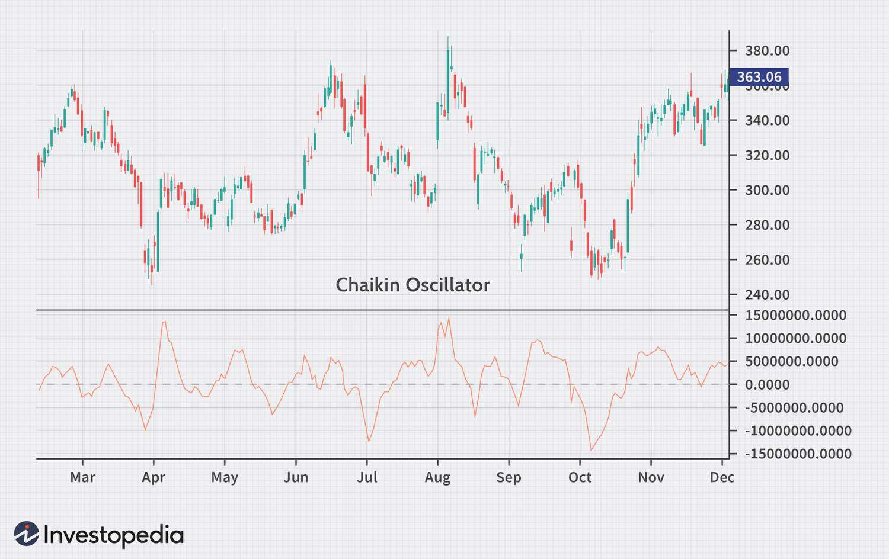

In the world of stock trading, understanding technical indicators is key to making informed decisions. Among these indicators, the Chaikin Oscillator stands out as a tool with the potential to enhance trading strategies. This oscillator, known for its application in stock analysis, integrates seamlessly into algorithmic trading systems, offering precise insights into market trends.

The Chaikin Oscillator is rooted in the principles of the Accumulation/Distribution Line and Moving Averages, designed to measure the momentum of the Accumulation/Distribution Line over a given period. By doing so, it aids traders in identifying underlying market trends, detecting potential reversals, and confirming price movements. This makes it a valuable asset for understanding market dynamics.



Both novice and seasoned traders can leverage the Chaikin Oscillator to gain a competitive edge. Its integration into algorithmic trading allows for automated processes that mitigate emotional biases and human error. This adaptability is crucial in a landscape where swift decision-making is essential.

This introduction provides a foundation for exploring the broader domain of stock analysis and technical indicators. Delving into the intricacies of the Chaikin Oscillator can significantly augment one's trading arsenal, whether employed in manual or algorithmic strategies. Understanding its application could be the difference between guesswork and an informed trading approach, setting the stage for a comprehensive exploration of technical analysis tools.

## Table of Contents

## Understanding Technical Indicators

Technical indicators are essential tools in stock trading, providing traders with insights into market trends and potential price movements. These indicators are derived from mathematical calculations based on price, volume, or open interest data, and they enable traders to make informed decisions by analyzing historical data. In essence, technical indicators help transform raw data into visual or numerical forms, simplifying complex market information into actionable insights.

Technical indicators can be broadly classified into two categories: leading indicators and lagging indicators. Leading indicators aim to predict future price movements by providing signals before new trends or reversals occur. Examples of popular leading indicators include the Relative Strength Index (RSI) and the Stochastic Oscillator. These indicators are particularly valuable for identifying potential entry and exit points in the market, making them instrumental in short-term trading strategies.

Conversely, lagging indicators are designed to confirm existing trends rather than predict future movements. They typically follow price action and provide signals after a trend has begun. Common lagging indicators include moving averages, such as the Simple Moving Average (SMA) and the Exponential Moving Average (EMA), as well as the Moving Average Convergence Divergence (MACD) indicator. The strengths of lagging indicators lie in their ability to validate trends and filter out market noise, making them suitable for long-term trend-following strategies.

Traders across various levels of expertise rely on these indicators to identify trading opportunities and manage risks effectively. By analyzing the patterns and trends depicted through technical indicators, traders can forecast potential price movements and develop strategic trading plans. Moreover, a comprehensive understanding of technical indicators aids in recognizing market entry and [exit](/wiki/exit-strategy) points, enhancing the precision and timing of trades.

Incorporating technical indicators into the trading process enhances decision-making in both manual and [algorithmic trading](/wiki/algorithmic-trading) environments. Algorithmic trading, in particular, benefits significantly from these indicators, as algorithms can process vast amounts of data and execute trades based on predefined criteria without human intervention. This automation leads to increased efficiency and often results in more consistent trading outcomes.

Technical indicators serve as vital components of the trading decision-making process, offering traders a structured approach to analyzing market behavior. Whether utilizing leading indicators for predictive insights or lagging indicators for confirmation, traders can devise more robust strategies that align with their risk tolerance and trading objectives. By combining various indicators, traders can develop a multifaceted analysis approach, mitigating risks and maximizing potential returns.

## Introducing the Chaikin Oscillator

Developed by Marc Chaikin, the Chaikin Oscillator is a technical indicator that provides traders with insights into market [momentum](/wiki/momentum) by combining the principles of the Accumulation/Distribution Line with Moving Averages. The primary function of the Chaikin Oscillator is to measure the momentum of the Accumulation/Distribution Line over a specified period, offering a vital tool for identifying trends, potential reversals, and confirming price movements.

### Formula and Composition

The Chaikin Oscillator is calculated as the difference between a short-term Exponential Moving Average (EMA) and a long-term EMA of the Accumulation/Distribution Line. The formula for the oscillator is represented as:

$$
\text{Chaikin Oscillator} = \text{EMA}_{\text{short}}(\text{ADL}) - \text{EMA}_{\text{long}}(\text{ADL})
$$

Here, the Accumulation/Distribution Line (ADL) is itself a composite indicator calculated by:

$$
\text{ADL} = \sum_{i=1}^{n} \left( \frac{(C_i - L_i) - (H_i - C_i)}{H_i - L_i} \cdot V_i \right)
$$

Where:
- $C_i$ is the closing price for the period.
- $L_i$ is the low price for the period.
- $H_i$ is the high price for the period.
- $V_i$ represents the volume for the period.

The short-term and long-term moving averages usually correspond to a 3-day and 10-day period, although these can be adjusted based on trading strategy and market conditions.

### Historical Context and Popularity

The Chaikin Oscillator gained traction among traders due to its ability to visualize changes and deviations in market accumulation and distribution laws quickly. When applied accurately, it assists traders in foreseeing shifts in buying and selling pressures, thereby offering clues to upcoming price movements. Its growing acceptance in the trading community is attributed to its straightforward calculation and the substantial insights it provides into market dynamics.

The oscillator's popularity surged further with the advent of algorithmic trading systems. By integrating this indicator into algorithmic frameworks, traders can enhance their models' predictive capacity to anticipate future market trends and reversals more effectively. This widespread adoption across trading platforms underscores its value in both manual and automated trading environments. 

The Chaikin Oscillator's ability to identify momentum changes in financial markets makes it a staple among traders, providing an additional layer of analysis that complements other technical indicators.

## Incorporating the Chaikin Oscillator in Algo Trading

Algorithmic trading, also known as algo trading, leverages automated systems to execute trades based on predefined criteria and strategies. The integration of the Chaikin Oscillator into these systems facilitates the automation of analysis and trading, enhancing decision-making processes with speed and precision. The oscillator, by measuring the momentum of the Accumulation/Distribution Line through moving averages, is well-suited for identifying trends and potential reversals, which are essential for algorithmic trading strategies aiming for optimal entry and exit points.

### Benefits of the Chaikin Oscillator in Algorithmic Strategies

When incorporated into algorithmic trading, the Chaikin Oscillator provides several notable benefits:

1. **Increased Efficiency**: By automating the analysis, the oscillator allows traders to process large volumes of data quickly and effectively. This increases trading efficiency, enabling systems to react to market conditions in real-time.

2. **Reduced Emotional Impact**: Trading decisions made by algorithms reduce the influence of emotional biases. The mathematical foundations of the Chaikin Oscillator provide objective signals, which can help in maintaining consistency in trading strategies.

3. **Early Identification of Trends**: The oscillator excels in detecting shifts in momentum, allowing algorithms to potentially spot emerging trends before they become apparent to the broader market.

### Technical Aspects of Programming the Chaikin Oscillator

Programming the Chaikin Oscillator into an algorithmic trading system involves computing two exponential moving averages (EMAs)—typically of 3 and 10-day periods— of the Accumulation/Distribution Line and then taking the difference between these EMAs. 

Here is a basic example of how one might implement the Chaikin Oscillator in Python:

```python
import pandas as pd

def calculate_adl(df):
    clv = ((df['Close'] - df['Low']) - (df['High'] - df['Close'])) / (df['High'] - df['Low'])
    adl = (clv * df['Volume']).cumsum()
    return adl

def chaikin_oscillator(df, short_window=3, long_window=10):
    adl = calculate_adl(df)
    ema_short = adl.ewm(span=short_window, adjust=False).mean()
    ema_long = adl.ewm(span=long_window, adjust=False).mean()
    chaikin_osc = ema_short - ema_long
    return chaikin_osc

# Example usage
data = pd.read_csv('stock_data.csv')  # Assumed CSV file containing stock price data with columns: 'Date', 'Open', 'High', 'Low', 'Close', and 'Volume'
data['Chaikin Oscillator'] = chaikin_oscillator(data)
```

### Real-World Applications

Several case studies and examples underscore the efficacy of automating the Chaikin Oscillator within trading systems. For instance, quantitative hedge funds and proprietary trading firms often integrate technical indicators like the Chaikin Oscillator to enhance strategy models. These models can dynamically adjust to market [volatility](/wiki/volatility-trading-strategies), allowing the algorithms to remain aligned with prevailing market trends and making timely buy or sell decisions.

In practice, examples of successful application include market makers who employ the oscillator to adjust pricing models based on detected momentum shifts, and portfolio managers who utilize it to manage asset allocations by confirming trend reversals in broader market indices.

While incorporating the Chaikin Oscillator into algorithmic trading systems entails a learning curve and requires ongoing strategy refinement, its potential benefits in terms of efficiency, reduced emotional bias, and improved signal interpretation make it a valuable tool for traders wishing to enhance their automated trading frameworks.

## Advantages and Limitations of the Chaikin Oscillator

The Chaikin Oscillator is a widely recognized technical indicator used by traders to analyze and predict market dynamics. Its advantages and limitations play a significant role in its application within stock analysis and trading strategies.

One of the primary advantages of the Chaikin Oscillator is its ability to predict trend reversals. By measuring the momentum of the Accumulation/Distribution Line, it offers insights into underlying market strengths or weaknesses. This is crucial for traders looking to enter or exit positions based on anticipated shifts in trends. The oscillator's composition makes it adept at confirming market trends, offering a double-check mechanism for traders who aim to validate signals from other indicators.

Despite its strengths, the Chaikin Oscillator is not without limitations. It can sometimes produce false signals, leading traders to make potentially misguided decisions. These false signals arise from the complexities of market dynamics that the oscillator might not capture completely. Moreover, its reliance on accurate data input is critical. Any discrepancies in the underlying [volume](/wiki/volume-trading-strategy) or price data can significantly impact the oscillator's output, leading to erroneous interpretations.

To mitigate these limitations, it's advisable for traders to use the Chaikin Oscillator alongside other technical indicators. By integrating multiple analytical tools, traders can achieve a more comprehensive view of the market, enhancing the reliability of trading decisions. Techniques such as moving averages, Relative Strength Index (RSI), or the Moving Average Convergence Divergence (MACD) can complement the Chaikin Oscillator, providing more robust analysis frameworks.

In summary, while the Chaikin Oscillator is a powerful tool for stock analysis, understanding its advantages and limitations is crucial for its effective use. Incorporating it into a broader strategy that includes multiple indicators allows traders to maximize its potential and reduce the risk of errors in decision-making.

## Conclusion and Final Thoughts

The Chaikin Oscillator remains a valuable tool in the toolkit of technical analysis for stock traders. Its relevance in today's fast-paced trading environment is marked by its ability to seamlessly integrate with algorithmic trading frameworks. This integration offers modern traders a significant advantage in the highly competitive market, facilitating automated decision-making processes that are both efficient and effective.

To leverage the full potential of the Chaikin Oscillator, it is crucial for traders to continually learn and adapt their trading strategies based on the ever-changing market conditions. The financial markets are dynamic, and strategies that once were effective may not hold the same potential over time. Thus, staying updated on market trends and advancements in technical analysis can be the difference between success and missed opportunities.

Incorporating the Chaikin Oscillator into trading approaches requires practice and fine-tuning. Traders must be willing to invest time in understanding the nuances of this indicator, ensuring it is effectively aligned with their specific trading goals and methods. The potential rewards for diligently refining these strategies can be substantial, enhancing both profitability and strategic foresight.

Encouraging experimentation and [backtesting](/wiki/backtesting) strategies cannot be overstated. Such practices enable traders to test hypotheses and tweak their approaches in a risk-managed way, ultimately leading to more robust and reliable trading systems. By remaining informed about the latest developments in technical analysis and algorithmic trading, traders can bolster their decision-making processes and maintain a competitive edge in the market.

## References & Further Reading

[1]: Chaikin, M. (1998). ["Chaikin Power Tools: Super Charge Your Portfolio!"](https://www.chaikinanalytics.com/) Chaikin Analytics.

[2]: Achelis, S. B. (2001). ["Technical Analysis from A to Z"](https://archive.org/details/technicalanalysi00ache) (2nd ed.). McGraw-Hill.

[3]: Elder, A. (2002). ["Come Into My Trading Room: A Complete Guide to Trading"](https://www.amazon.com/Come-Into-My-Trading-Room/dp/0471225347) John Wiley & Sons.

[4]: Murphy, J. J. (1999). ["Technical Analysis of the Financial Markets"](https://archive.org/details/technicalanalysi0000murp) New York Institute of Finance.

[5]: Pring, M. J. (2014). ["Technical Analysis Explained, Fifth Edition: The Successful Investor's Guide to Spotting Investment Trends and Turning Points"](https://www.amazon.com/Technical-Analysis-Explained-Fifth-Successful/dp/0071825177) McGraw-Hill Education.