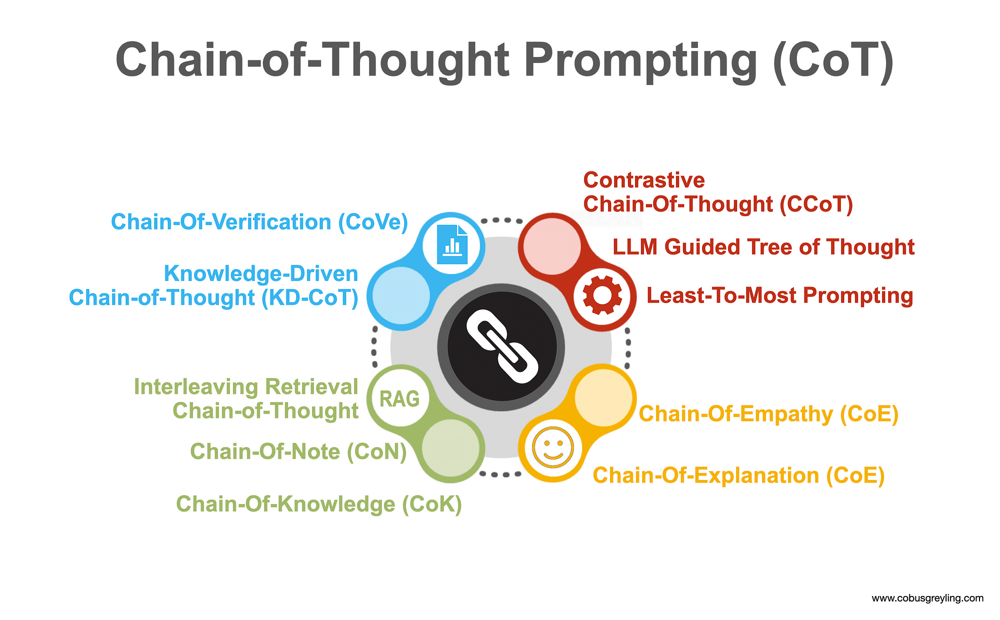

## Table of Contents

## What is Chain-of-Thought (CoT) prompting in machine learning?

Chain-of-Thought (CoT) prompting is a technique used in machine learning to help models solve complex problems by breaking them down into simpler steps. Imagine you're trying to solve a math problem. Instead of just giving the final answer, you write down each step you take to get there. CoT prompting works the same way for AI models. By showing the model how to think through a problem step-by-step, it can better understand and solve similar problems in the future.

This method is especially useful for large language models, which can sometimes struggle with tasks that require multiple reasoning steps. For example, if you ask a model to solve a multi-step math problem, it might get confused. But if you show it how to break the problem into smaller parts and solve each part one at a time, the model can follow along and arrive at the correct answer. CoT prompting helps these models improve their reasoning abilities, making them more reliable and effective at handling complex tasks.

## How does Chain-of-Thought prompting differ from traditional prompting methods?

Chain-of-Thought prompting is different from traditional prompting because it guides the model through a series of steps to solve a problem, rather than just asking for a direct answer. Traditional prompting might ask a model a question like "What is 5 + 3?" and expect the answer "8". But with Chain-of-Thought prompting, you would show the model how to think through the problem, like "First, I need to add 5 and 3. So, 5 + 3 equals 8." This way, the model learns to break down complex problems into simpler steps, which helps it understand and solve similar problems better.

This method is especially useful for tasks that require multiple steps or reasoning. For example, if you want the model to solve a math problem like $$2 \times (3 + 4)$$, traditional prompting might just ask for the final answer. But with Chain-of-Thought prompting, you would guide the model through the process: "First, solve inside the parentheses: 3 + 4 equals 7. Then, multiply by 2: 2 \times 7 equals 14." By showing the model how to think through each step, it can learn to handle more complex problems and improve its overall reasoning skills.

## What are the key components of a Chain-of-Thought prompt?

A Chain-of-Thought prompt has a few important parts that help the model solve problems step-by-step. First, it includes a clear statement of the problem. This is important because it tells the model what to solve. For example, if the problem is $$2 \times (3 + 4)$$, the prompt will start by stating this problem clearly. Second, the prompt breaks the problem into smaller steps. Each step is explained in simple language, showing the model how to solve each part of the problem. For the example above, the prompt might say, "First, solve inside the parentheses: 3 + 4 equals 7. Then, multiply by 2: 2 \times 7 equals 14."

The final part of a Chain-of-Thought prompt is the reasoning process. This part explains why each step is taken and how it leads to the next step. It helps the model understand the logic behind the solution. For example, the prompt might explain, "We solve the inside of the parentheses first because of the order of operations. After getting 7, we multiply by 2 to get the final answer." By including these components, a Chain-of-Thought prompt helps the model learn how to solve complex problems by breaking them down into simpler, understandable steps.

## Can you explain a simple example of Chain-of-Thought prompting in action?

Let's say you want to teach a model how to solve the problem $$5 + 3 \times 2$$. With Chain-of-Thought prompting, you would guide the model through the steps. You would start by stating the problem clearly: "Solve $$5 + 3 \times 2$$." Then, you would break it down into smaller steps, explaining each part. You might say, "First, we need to do the multiplication because it comes before addition in the order of operations. So, $$3 \times 2$$ equals 6. Next, we add 5 to that result: $$5 + 6$$ equals 11."

By showing the model each step and explaining why you're doing it, you help it understand how to solve similar problems in the future. The model learns that it needs to follow the order of operations, doing multiplication before addition. This way, when it sees a similar problem later, it can break it down and solve it step-by-step, just like it was taught. Chain-of-Thought prompting helps the model improve its reasoning skills by showing it how to think through a problem, making it better at solving complex tasks.

## What types of tasks benefit most from using Chain-of-Thought prompting?

Tasks that benefit most from Chain-of-Thought prompting are those that involve multiple steps or need careful reasoning. Math problems are a great example. If you want to solve $$2 \times (3 + 4)$$, you need to break it down into smaller parts. Chain-of-Thought prompting helps by showing the model how to do this, step-by-step. It explains that you solve inside the parentheses first, then multiply. This way, the model learns how to handle complex math problems better.

Another type of task that benefits from Chain-of-Thought prompting is logical reasoning. For example, if you need to figure out a puzzle or a sequence, like "What comes next after 2, 4, 6, 8?", Chain-of-Thought prompting can guide the model through the pattern recognition process. It shows the model how to think about the pattern, saying things like "The numbers are increasing by 2 each time, so the next number is 10." By breaking down the problem and explaining each step, the model improves its ability to solve similar puzzles in the future.

## How can Chain-of-Thought prompting improve the performance of language models?

Chain-of-Thought prompting helps language models get better at solving hard problems by showing them how to break these problems into smaller, easier steps. For example, if you want a model to solve $$2 \times (3 + 4)$$, you can guide it through the process: first, solve inside the parentheses, then multiply. By doing this, the model learns the order of operations and how to handle complex math problems. It's like teaching a student how to solve a problem by showing them each step, which helps them understand and remember how to do it next time.

This method also improves the model's reasoning skills. When you use Chain-of-Thought prompting for tasks like puzzles or logical sequences, like figuring out what comes next after 2, 4, 6, 8, you help the model see the pattern. You explain, "The numbers go up by 2 each time, so the next number is 10." By breaking down the problem and showing the model how to think through each step, it gets better at solving similar problems in the future. This makes the model more reliable and effective at handling tasks that need careful thinking.

## What are the challenges and limitations of implementing Chain-of-Thought prompting?

One challenge of using Chain-of-Thought prompting is that it can be hard to create good prompts. You need to break down the problem into simple steps and explain each part clearly. This takes time and skill. If the steps are not clear or if you miss important parts, the model might get confused and give the wrong answer. For example, if you want the model to solve $$2 \times (3 + 4)$$, you need to explain that you solve inside the parentheses first, then multiply. If you don't explain this well, the model might not understand how to solve it correctly.

Another limitation is that Chain-of-Thought prompting might not work well for all types of tasks. It is very helpful for math problems and logical puzzles, but it might not be as useful for tasks that need quick, simple answers. For example, if you ask the model to translate a short phrase, breaking it into steps might not help and could even make the process slower. Also, not all models can use Chain-of-Thought prompting well. Some models might struggle to follow the steps, especially if they are not designed to handle complex reasoning tasks.

## How does the length and complexity of a Chain-of-Thought prompt affect model performance?

The length and complexity of a Chain-of-Thought prompt can really change how well a model does its job. If the prompt is too long, the model might get confused and have a harder time understanding what to do. For example, if you want to solve a math problem like $$2 \times (3 + 4)$$, a long prompt with lots of steps might make it harder for the model to follow. On the other hand, if the prompt is too short and doesn't explain the steps well, the model might miss important parts of the problem and give the wrong answer. So, finding the right balance in the length and complexity of the prompt is important to help the model solve the problem correctly.

When a prompt gets more complex, it can be good for helping the model learn how to solve hard problems. For example, if you're trying to solve a puzzle or a sequence like "What comes next after 2, 4, 6, 8?", a more detailed prompt can show the model how to think through the pattern step-by-step. But if the prompt is too complex, it might overwhelm the model, especially if it's not designed to handle such detailed reasoning. So, while a complex prompt can help with learning, it's important to make sure it's not too hard for the model to follow, or else it might not perform as well as it could.

## What are some best practices for designing effective Chain-of-Thought prompts?

When designing effective Chain-of-Thought prompts, it's important to keep the steps clear and simple. Start by stating the problem clearly, like "Solve $$2 \times (3 + 4)$$." Then, break the problem into smaller steps and explain each one. For example, you might say, "First, solve inside the parentheses: $$3 + 4$$ equals 7. Then, multiply by 2: $$2 \times 7$$ equals 14." Make sure each step is easy to understand and follows logically from the last one. This helps the model learn how to solve similar problems by showing it the thought process.

It's also important to find the right balance in the length and complexity of your prompt. If the prompt is too long or too complex, it might confuse the model. For instance, if you're helping the model solve a puzzle like "What comes next after 2, 4, 6, 8?", you need to explain the pattern clearly without overwhelming it. Say something like, "The numbers increase by 2 each time, so the next number is 10." Keep the prompt as simple as possible while still covering all the important steps. This way, the model can follow along and improve its reasoning skills without getting lost in too much detail.

## How can Chain-of-Thought prompting be evaluated and compared to other prompting techniques?

To evaluate Chain-of-Thought prompting and compare it to other prompting techniques, you can look at how well the model solves different problems. For example, you might give the model a math problem like $$2 \times (3 + 4)$$ and see if it can solve it correctly using Chain-of-Thought prompting. Then, you can try the same problem with a traditional prompt that just asks for the answer. By comparing the results, you can see if Chain-of-Thought prompting helps the model solve the problem better. You can also look at how the model explains its reasoning step-by-step, which is something Chain-of-Thought prompting encourages.

Another way to compare these techniques is by looking at the model's performance on tasks that need careful thinking, like puzzles or logical sequences. For instance, if you ask the model to figure out what comes next after 2, 4, 6, 8, you can use Chain-of-Thought prompting to guide it through the pattern recognition process. Then, you can try the same task with a different prompting method and see which one helps the model find the correct answer more often. This helps you understand if Chain-of-Thought prompting is better at teaching the model how to think through complex problems.

## What recent advancements have been made in Chain-of-Thought prompting research?

Recent advancements in Chain-of-Thought prompting research have focused on making models even better at solving complex problems. Researchers have found that by using a technique called "self-consistency," models can improve their accuracy. Self-consistency means the model tries different ways to solve a problem and picks the answer that most of the ways agree on. For example, if you want to solve $$2 \times (3 + 4)$$, the model might try different paths but will choose the answer that comes up most often. This method helps the model be more reliable and get better results.

Another advancement is the use of "zero-shot Chain-of-Thought" prompting. This means the model can solve new types of problems without being shown examples first. It uses its understanding of how to break down problems into steps to figure out solutions on its own. For instance, if you ask the model to solve a new kind of puzzle, it can use Chain-of-Thought prompting to work through it step-by-step, even if it hasn't seen that exact puzzle before. This makes the model more flexible and able to handle a wider range of tasks.

## How might Chain-of-Thought prompting evolve with future developments in AI and machine learning?

As AI and [machine learning](/wiki/machine-learning) keep growing, Chain-of-Thought prompting might get even better at helping models solve hard problems. One way it could evolve is by becoming more automatic. Right now, people have to write the steps for the model, but in the future, models might learn to break down problems into steps all by themselves. For example, if you ask a model to solve $$2 \times (3 + 4)$$, it could figure out on its own to first solve inside the parentheses and then multiply. This would make the models smarter and able to handle new types of problems without needing as much help from people.

Another way Chain-of-Thought prompting could change is by working with other new AI methods. For example, it might combine with "few-shot learning," where the model can learn from just a few examples. This could help the model solve new problems even faster by using Chain-of-Thought steps and a few examples to guide its thinking. As these technologies keep improving, Chain-of-Thought prompting will likely become a key tool for making AI models better at understanding and solving complex tasks step-by-step.

## References & Further Reading

[1]: Wei, J., Wang, X., Schuurmans, D., Bosma, M., Ichter, B., Cao, Y., ... & Le, Q. V. (2022). ["Chain of Thought Prompting Elicits Reasoning in Large Language Models."](https://arxiv.org/abs/2201.11903) arXiv preprint arXiv:2201.11903.

[2]: Kojima, T., Gu, S. S., Reid, M., Matsuo, Y., & Iwasawa, Y. (2022). ["Large Language Models are Zero-Shot Reasoners."](https://arxiv.org/abs/2205.11916) arXiv preprint arXiv:2205.11916.

[3]: Nye, M., Andreassen, A., Liu, X., Choudhury, S., Tesauro, G., & Campbell, M. (2021). ["Show Your Work: Scratchpads for Intermediate Computation with Language Models."](https://arxiv.org/abs/2112.00114) arXiv preprint arXiv:2112.00114.

[4]: Xie, S. M., Sun, C. J., Li, M., & Li, R. (2021). ["Unsupervised learning of multiple arithmetic tasks for large-scale pre-trained language models."](https://scholar.google.com/citations?user=qx8CplYAAAAJ&hl=en) arXiv preprint arXiv:2109.02312.

[5]: Brown, T. B., Mann, B., Ryder, N., Subbiah, M., Kaplan, J., Dhariwal, P., ... & Amodei, D. (2020). ["Language Models are Few-Shot Learners."](https://arxiv.org/abs/2005.14165) arXiv preprint arXiv:2005.14165.