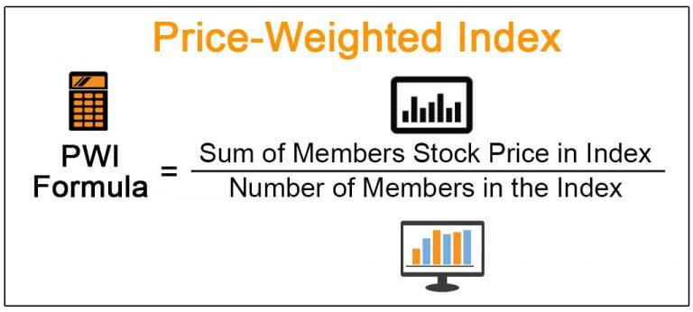

The Chain-Weighted Consumer Price Index (CPI) represents a crucial advancement in economic measurement, providing a dynamic approach to tracking changes in the cost of living. Unlike the traditional CPI, which employs a fixed-weight methodology, the chain-weighted CPI adjusts to consumer spending patterns more fluidly. This adaptability makes it a valuable tool for economists who seek a more accurate reflection of inflation as it responds to shifts in consumer preferences and product innovations.

In contrast to its traditional counterpart, the chain-weighted CPI incorporates the substitution effect by allowing the index to adjust when consumers opt for cheaper alternatives in response to price changes. This feature enhances its accuracy, offering a more precise measure of how inflation affects consumer purchasing power. As such, it becomes an essential component in setting federal tax brackets, influencing economic policies, and providing a clearer picture of economic health.



Moreover, the chain-weighted CPI has significant implications for algorithmic trading. Traders and financial institutions leverage economic indicators like the CPI to inform their strategies. Understanding and predicting CPI-related market shifts can be instrumental in decision-making processes for trading assets. The responsiveness of chain-weighted CPI data can influence trading algorithms, which are developed to capitalize on economic releases by adjusting strategies based on updated inflation metrics. By integrating CPI data, these algorithms can enhance their prediction accuracy and trading outcomes.

The intersection of economics and financial trading is apparent in how CPI influences trading decisions. Economic metrics like the CPI serve as critical inputs for economic forecasts used by traders. These forecasts guide investment strategies, with the potential to affect interest rates, market sentiment, and ultimately, asset value movements.

Through the exploration of the chain-weighted CPI, its economic significance, and its integration into trading strategies, this article aims to highlight the indispensable role of dynamic economic indicators in modern financial markets.

## Table of Contents

## Understanding Chain-Weighted CPI

The Chain-Weighted Consumer Price Index (CPI) is an economic metric designed to measure changes in the cost of living by accounting for variations in consumer spending patterns. Unlike the traditional fixed-weighted CPI, which uses a fixed basket of goods and services to calculate inflation, the chain-weighted CPI reflects the dynamic nature of consumer preferences and the substitutability of products.

The fundamental difference between the traditional and chain-weighted CPI lies in their treatment of consumer behavior. The traditional CPI assesses price changes based on a constant mix of items, leading to potential inaccuracies when consumer preferences shift. For example, if beef prices rise significantly, consumers might switch to chicken, but the fixed-weighted CPI would not account for this substitution effect, potentially overstating the cost of living increases.

In contrast, the chain-weighted CPI adjusts the weights of items in the consumer basket more frequently, specifically on a monthly basis. This adjustment process reflects changes in what consumers are purchasing, thus capturing the substitution effect and other shifts in consumption patterns. The measure employs a geometric mean formula that compares prices and quantities from one period to the next, effectively creating a "chain" of index numbers that form a comprehensive picture of price changes over time.

The Bureau of Labor Statistics (BLS) is responsible for publishing chain-weighted CPI data, updating it monthly to maintain a current representation of consumer behavior. By incorporating the latest purchasing data, the BLS ensures that the chain-weighted CPI accurately reflects the evolving marketplace. This ongoing process involves analyzing consumption data across a wide range of sectors to determine how shifts in spending are influenced by price fluctuations.

For example, if technological advancements lead to a steep price drop in electronics, the associated changes in consumer spending would be reflected in the next update of the chain-weighted CPI. By capturing such shifts, the chain-weighted CPI provides a more nuanced view of economic conditions and aids policymakers, economists, and traders in making informed decisions based on accurate and timely inflation data.

## Significance of Chain-Weighted CPI in Economic Analysis

The chain-weighted Consumer Price Index (CPI) is acknowledged for its greater accuracy in reflecting the cost of living because it accounts for changes in consumer behavior and product substitution over time. Unlike the traditional CPI, which uses a fixed basket of goods, the chain-weighted CPI continuously updates this basket, adapting to the shifting consumption patterns and preferences. This dynamic adjustment makes it a superior measure of inflation for accurately depicting consumer expenses and economic shifts.

One significant application of the chain-weighted CPI is in setting federal tax brackets. The government uses this index to adjust tax brackets for inflation, thereby preventing bracket creep, which occurs when inflation pushes taxpayers into higher income brackets without a real increase in purchasing power. This ensures that tax liabilities are more closely aligned with actual income changes, avoiding unintended tax burden increases solely due to inflation.

Moreover, the chain-weighted CPI influences governmental policy planning and economic forecasting. Policymakers and economists rely on this index to gain insights into real changes in the economy, guiding monetary policy decisions, budgeting, and resource allocation. For instance, a more accurate measure of inflation ensures that social security benefits and other government entitlements are adjusted to maintain their real value, preserving the purchasing power of recipients. This aids in crafting policies that better mirror economic realities and address citizen needs effectively.

In terms of economic health and stability, the chain-weighted CPI is a crucial tool for monitoring. By reflecting the true cost of living adjustments, it provides a reliable gauge for assessing inflationary pressures within the economy. This allows for preemptive actions to stabilize the economy, such as [interest rate](/wiki/interest-rate-trading-strategies) adjustments by central banks to curb inflation or stimulate growth as necessary. Additionally, by providing a clear depiction of inflation trends, it assists in reducing uncertainty in economic decision-making, thereby fostering a stable economic environment conducive to growth.

The chain-weighted CPI's comprehensive approach to inflation measurement supports its role as a pivotal economic indicator that not only impacts individual fiscal outcomes but also shapes broader economic policies and stability assessments.

## Impact of Economic Metrics on Trading

Economic metrics such as the Consumer Price Index (CPI) are crucial in shaping market behavior and trader decisions. The CPI measures inflation by tracking the change in prices paid by consumers for goods and services over time. This data serves as an essential indicator for traders, influencing their strategies and decisions.

### Relationship Between CPI Data and Monetary Policy Shifts

The CPI is integral to monetary policy decisions made by central banks, particularly the Federal Reserve in the United States. A rising CPI signals increasing inflation, prompting central banks to consider tightening monetary policy to control inflationary pressure. This usually involves increasing interest rates, which can affect the availability of credit and the levels of investment risk perceived by traders. Conversely, a falling or stable CPI may lead to looser monetary policies, with potential rate cuts designed to spur economic activity.

The formula for calculating the inflation rate using the CPI is:

$$

\text{Inflation Rate} = \frac{\text{CPI}_{\text{current year}} - \text{CPI}_{\text{previous year}}}{\text{CPI}_{\text{previous year}}} \times 100 
$$

Traders closely monitor these shifts, as changes in monetary policy directly impact currency values, bond yields, and equity markets.

### Influence of CPI on Interest Rates and Consumer Purchasing Power

Interest rates are one of the primary mechanisms through which the CPI exerts influence on the economy. High inflation, as indicated by rising CPI values, often results in higher interest rates. This relationship affects consumer behavior by altering borrowing costs and disposable income levels. For instance, higher interest rates increase loan repayment costs which can decrease consumer spending and borrowing.

Traders anticipate these changes in consumer purchasing power and interest rates, adjusting their portfolios accordingly. For example, if CPI data indicates increasing inflation leading to potential interest rate hikes, traders may shift investments from interest-sensitive stocks to those less affected by rate changes.

### Additional Economic Indicators Influencing Trading Strategies

Beyond the CPI, other economic indicators like Gross Domestic Product (GDP) and employment rates significantly influence trading strategies. GDP, representing the total economic output, helps traders gauge economic health. A growing GDP often indicates a robust economy which can lead to a bullish market trend, while a contracting GDP may signal economic challenges and lead to bearish sentiments.

Employment rates, particularly non-farm payroll data, provide insights into economic stability and consumer confidence. High employment rates generally lead to increased consumer spending and investment activity, prompting traders to adopt more aggressive strategies. Conversely, rising unemployment may caution traders toward defensive investment approaches, such as focusing on stable, less volatile assets.

Together, these economic metrics form a comprehensive framework that influences trading strategies, helping traders make informed decisions by providing insights into economic conditions and market sentiment. By understanding and anticipating changes in these metrics, traders can better manage risk and optimize their investment portfolios in an ever-evolving economic landscape.

## Incorporating CPI Data into Algorithmic Trading

Algorithmic trading, a method of executing orders using automated pre-programmed trading instructions, often integrates economic data like the Consumer Price Index (CPI) to make informed trading decisions. Utilizing CPI data allows traders to anticipate market movements based on inflation-related insights, which can influence interest rates, consumer purchasing power, and overall economic health.

Algorithmic strategies using CPI data typically involve pre-release positioning, immediate execution post-announcement, and risk management adjustments. Pre-release positioning requires algorithms to assess anticipated CPI data and adjust positions accordingly, often using predictive models and historical data patterns to inform these decisions. This strategy focuses on securing advantageous positions before the official CPI announcement.

Immediate execution post-announcement capitalizes on the [volatility](/wiki/volatility-trading-strategies) following the release of new CPI data. Algorithms are programmed to quickly process this information and execute trades to exploit price movements. This approach demands high-speed data processing and low-latency execution systems to be effective.

Risk management adjustments are made in anticipation of, or in response to, CPI-induced market changes. Algorithms may recalibrate parameters such as stop-loss levels, position sizes, and portfolio diversification based on the latest inflation data to mitigate potential risks.

Backtesting plays a vital role in developing robust [algorithmic trading](/wiki/algorithmic-trading) strategies. By analyzing historical CPI data against past market performance, traders can validate their algorithms and refine their models to enhance predictive capabilities. This process helps identify potential flaws or inefficiencies in their trading systems before deploying them in live markets.

Below is a Python code example demonstrating a basic CPI-based trading strategy. This script illustrates a simple decision-making process based on CPI movements:

```python
import pandas as pd
import numpy as np

# Load historical CPI data
cpi_data = pd.read_csv('historical_cpi.csv')

# Load historical market data (e.g., S&P 500 index)
market_data = pd.read_csv('historical_market.csv')

# Define a simple strategy: Buy if CPI increase is less than 0.2%, else Sell
def cpi_trading_strategy(cpi_change, threshold=0.002):
    if cpi_change < threshold:
        return "Buy"
    else:
        return "Sell"

# Calculate CPI change
cpi_data['CPI_Change'] = cpi_data['CPI'].pct_change()

# Apply trading strategy
market_data['Signal'] = cpi_data['CPI_Change'].apply(cpi_trading_strategy)

# Output the strategy signals
print(market_data[['Date', 'Signal']])
```

In this example, the algorithm decides to buy if the CPI increase is less than 0.2% and sell otherwise. It illustrates a simple yet effective decision-making process based on CPI data, highlighting the importance of leveraging economic indicators within algorithmic trading strategies. The emphasis on [backtesting](/wiki/backtesting) and historical data ensures that the strategy is both reliable and adaptive to changing market conditions.

## Case Studies and Real-World Examples

### Case Studies and Real-World Examples

The integration of Chain-Weighted Consumer Price Index (CPI) data into trading strategies has demonstrated significant potential in enhancing trading outcomes. Several strategies leverage the nuances of CPI data, resulting in diverse approaches such as trend-following, pairs trading, and mean reversion, each adapted to exploit specific market conditions triggered by CPI releases.

**Trend-Following Strategies**

Trend-following strategies are predicated on the assumption that once a price trend is established, it is likely to continue in the same direction. Following CPI announcements, markets often experience volatility as investors react to the updated inflation data. A successful case study involves utilizing a simple moving average (SMA) crossover system to gauge market sentiment and directionality post-CPI release. For instance, traders may use a combination of short-term and long-term SMAs, such as a 10-day and a 50-day SMA, to identify bullish or bearish trends immediately after the CPI data is announced. If the short-term average crosses above the long-term average, it signals a buying opportunity, whereas the opposite indicates a sell signal. Historical data reveals that such a strategy, tuned with appropriate parameters, has often resulted in profitable trades following CPI releases due to the strong directional moves prompted by inflation-related information.

**Pairs Trading Strategies**

Pairs trading strategies exploit discrepancies in the relative performance of correlated assets. These strategies are particularly effective during periods of inflation changes, as measured by CPI, which may cause assets that are typically correlated to deviate from their historical pricing relationship. A notable example can be seen in the equity markets, where a trader might identify a pair of stocks in the same sector or industry that usually move together. If a CPI release indicates unexpected inflationary pressure, one stock might react more aggressively than the other due to differing sensitivities to inflation. By constructing a market-neutral position, buying the undervalued stock and shorting the overvalued one, traders can capitalize on the subsequent convergence of their values. Empirical evidence shows that pairs exposed to inflation-sensitive sectors, such as consumer goods and utilities, often present lucrative opportunities post-CPI data due to their varied inflation elasticity.

**Mean Reversion Strategies**

Mean reversion strategies hinge on the idea that asset prices will revert to their historical mean or average over time, particularly after a short-term change. CPI releases frequently result in immediate fluctuations in asset prices, providing a fertile ground for mean reversion strategies. For instance, a trader might observe that the price of a financial instrument deviates significantly from its historical average in reaction to new CPI data. By using Bollinger Bands, which plot standard deviations around a moving average, traders can identify overbought or oversold conditions following CPI announcements. If the price moves outside the bands, a reversion strategy might involve initiating trades opposite to the direction of the move, expecting the price to move back within the bands. Historical backtesting has shown that mean reversion strategies following CPI releases can be effective, especially when combined with robust risk management and stop-loss orders to mitigate potential adverse price movements.

These case studies underscore the efficacy of incorporating chain-weighted CPI data into various trading strategies, highlighting the importance of tailoring approaches to exploit specific market dynamics associated with inflationary changes. Such strategies not only enhance the precision of trading models but also allow traders to better navigate the complexities of financial markets influenced by economic metrics.

## Conclusion

The Chain-Weighted Consumer Price Index (CPI) serves as a dynamic economic measurement tool that offers a more nuanced understanding of inflation compared to the traditional CPI. By incorporating changes in consumer preferences and patterns, it reflects real-world spending adjustments and substitution effects, ensuring a more accurate depiction of cost-of-living changes. This sophistication makes it a vital instrument in financial markets, where accurate inflation measurements can significantly impact trading decisions and strategies.

In algorithmic trading, the agility of the chain-weighted CPI to mirror rapid market changes is particularly valuable. Traders leverage this data to refine strategies, manage risk, and seek opportunities that align with current economic conditions. The integration of CPI data into trading algorithms, particularly through rigorous backtesting, allows for informed decision-making and strategy optimization. 

However, the landscape of economic metrics and financial markets is ever-evolving. Traders and economists must continuously adapt to new data interpretations and integrate updated CPI metrics effectively. Staying informed on variations in consumer price data is crucial for maintaining the relevance and effectiveness of trading strategies.

Ongoing exploration and understanding of economic metrics are essential for enhancing trading outcomes. Adopting a forward-thinking approach and recognizing the implications of CPI data in trading scenarios can provide critical insights and the competitive edge necessary for success in the financial markets.

## Further Resources

For those interested in exploring the Chain-Weighted Consumer Price Index (CPI) further, a variety of resources offer insights into its economic significance and applications:

1. **Chain-Weighted CPI and Economic Analysis**:
   - *U.S. Bureau of Labor Statistics*: The official source provides detailed explanations on the methodology and updates related to the CPI. Visit [bls.gov](https://www.bls.gov/) for comprehensive reports and data.
   - *Federal Reserve Economic Data (FRED)*: Access historical CPI data and analysis tools offered by the Federal Reserve Bank of St. Louis at [fred.stlouisfed.org](https://fred.stlouisfed.org/). This platform is essential for economists and researchers looking to conduct data-driven studies on economic indicators.
   - *Research Papers and Journals*: Academic journals such as the *Journal of Economic Perspectives* and *Economic Modelling* frequently publish papers on CPI and inflation metrics. These resources provide theoretical and empirical studies that highlight the evolving nature of the CPI and its impact on economic policy.

2. **Algorithmic Trading and Economic Data Integration**:
   - *Books*: "Algorithmic Trading: Winning Strategies and Their Rationale" by Ernest Chan provides foundational strategies and insights on using economic indicators like CPI in trading algorithms. This book is a practical guide for traders interested in quantitative strategies.
   - *Online Courses*: Platforms like Coursera and edX offer courses focused on algorithmic trading and data analysis. Courses such as "Financial Engineering and Risk Management" and "Algorithmic Trading Strategies" cover essential skills for incorporating economic data like CPI into trading models.
   - *Web Resources*: Websites like QuantStart and QuantInsti provide tutorials and articles on algorithmic trading strategies. These resources help traders integrate various economic indicators into trading algorithms effectively.

3. **Platforms for Backtesting Trading Strategies**:
   - *QuantConnect*: This cloud-based platform offers a comprehensive environment for developing, testing, and executing trading strategies. It supports a wide range of data, including economic metrics like CPI, thereby aiding in robust backtesting. Visit [quantconnect.com](https://www.quantconnect.com/) to explore its offerings.
   - *TradingView*: Known for its user-friendly interface, TradingView allows traders to perform backtesting using a plethora of economic data. It provides tools for creating custom scripts and visualizing their effects on trading strategies.
   - *MetaTrader 5*: Popular among retail traders, MetaTrader 5 offers advanced backtesting capabilities with script writing in MQL5. While primarily used for forex trading, it allows integration of economic indicators to simulate trading scenarios based on CPI data.

These resources collectively provide a solid foundation for understanding and using the Chain-Weighted CPI in both academic and trading contexts. For those seeking to enhance their knowledge and application of economic metrics, accessing these platforms and materials will be invaluable.

## References & Further Reading

[1]: U.S. Bureau of Labor Statistics. ["Consumer Price Indexes (CPI)."](https://www.bls.gov/cpi/) Available from the official website of the U.S. Bureau of Labor Statistics.

[2]: Federal Reserve Bank of St. Louis. ["Economic Research: FRED Graph Observations with the Consumer Price Index."](https://fred.stlouisfed.org/) Access datasets and analysis tools relevant for inflation studies.

[3]: Chan, Ernest P. ["Algorithmic Trading: Winning Strategies and Their Rationale."](https://github.com/ftvision/quant_trading_echan_book) Hoboken, NJ: Wiley, 2013.

[4]: Lopez de Prado, Marcos. ["Advances in Financial Machine Learning."](https://www.amazon.com/Advances-Financial-Machine-Learning-Marcos/dp/1119482089) New York: Wiley, 2018.

[5]: ["Journal of Economic Perspectives."](https://www.aeaweb.org/journals/jep) American Economic Association. A scholarly journal publishing research related to economic insights and inflation measures. 

[6]: QuantConnect. ["Algorithmic Trading and Quantitative Strategies Platform."](https://www.quantconnect.com/) Explore tools for developing and backtesting trading strategies with economic data integrations.

[7]: TradingView. ["Backtesting and Technical Analysis."](https://www.financialtechwiz.com/post/tradingview-backtesting/) Provides charting and backtesting services with access to a wide range of economic indicators.