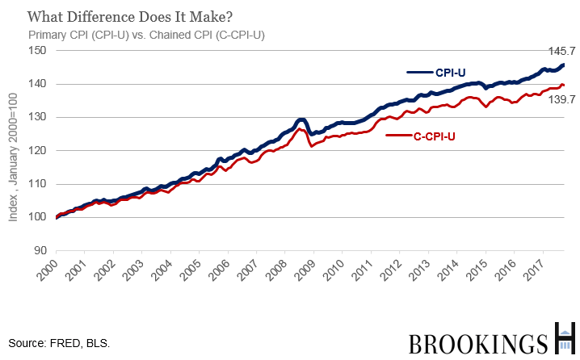

## Table of Contents

## What is a Consumer Price Index (CPI)?

The Consumer Price Index, or CPI, is a measure that shows how the prices of goods and services that people buy change over time. It's like a big list that tracks the cost of things like food, clothes, housing, and other everyday items. By comparing the CPI from one time to another, we can see if prices are going up, which is called inflation, or if they are going down, which is called deflation.

Governments and economists use the CPI to understand how the economy is doing. If the CPI goes up a lot, it means that people need to spend more money to buy the same things they used to buy for less. This can affect how much money people have left over after buying what they need, and it can also influence decisions about wages, interest rates, and government policies. The CPI is an important tool because it helps everyone from shoppers to policymakers understand and respond to changes in the cost of living.

## What is the Chain-Weighted Consumer Price Index?

The Chain-Weighted Consumer Price Index, or Chain-Weighted CPI, is a newer way to measure how prices change over time. It's different from the regular CPI because it takes into account how people change what they buy when prices go up or down. For example, if the price of apples goes up, people might buy more oranges instead. The Chain-Weighted CPI tries to capture these changes to give a more accurate picture of how prices affect what people buy.

This method updates the basket of goods and services more often than the traditional CPI. By doing this, the Chain-Weighted CPI can better reflect the real changes in spending patterns and give a more up-to-date view of inflation. Because it's more accurate, some people think it should be used more often to help make better economic decisions, like setting interest rates or adjusting social security payments.

## How does the Chain-Weighted CPI differ from the traditional CPI?

The Chain-Weighted CPI and the traditional CPI both measure how prices change over time, but they do it in different ways. The traditional CPI uses a fixed basket of goods and services, which means it looks at the same list of items every time it's calculated. This can be a problem because it doesn't account for how people change what they buy when prices go up or down. For example, if the price of beef goes up, people might start buying more chicken. The traditional CPI wouldn't reflect this shift in buying habits.

On the other hand, the Chain-Weighted CPI is more flexible. It updates the basket of goods and services more often to better match what people are actually buying. This method tries to capture the real changes in spending patterns, making it a more accurate measure of inflation. By doing this, the Chain-Weighted CPI can give a better picture of how price changes affect people's everyday lives and help policymakers make more informed decisions about things like interest rates and social security adjustments.

## Why was the Chain-Weighted CPI developed?

The Chain-Weighted CPI was developed because people wanted a better way to measure how prices change over time. The old way, called the traditional CPI, used a fixed list of things to check prices. But this didn't work well because people change what they buy when prices go up or down. For example, if apples get too expensive, people might buy more oranges. The traditional CPI didn't show these changes, so it wasn't always accurate.

To fix this problem, economists came up with the Chain-Weighted CPI. This new method updates the list of things it checks more often, so it can better show what people are really buying. By doing this, the Chain-Weighted CPI gives a more accurate picture of inflation and how price changes affect people's lives. This helps everyone from shoppers to policymakers make better decisions based on what's really happening in the economy.

## What are the advantages of using the Chain-Weighted CPI?

The Chain-Weighted CPI has a big advantage because it's more accurate than the traditional CPI. It does this by updating the list of things it checks more often. This way, it can see how people change what they buy when prices go up or down. For example, if the price of beef goes up, people might buy more chicken. The Chain-Weighted CPI can show this change, so it gives a better picture of how prices really affect what people buy and how much they spend.

Another advantage of the Chain-Weighted CPI is that it helps make better decisions about the economy. Because it's more accurate, it can give a clearer view of inflation. This helps people who make rules about things like interest rates or social security payments. When they have a better understanding of how prices are changing, they can make choices that help everyone, from shoppers to businesses, deal with those changes more easily.

## What are the potential drawbacks or criticisms of the Chain-Weighted CPI?

Some people think the Chain-Weighted CPI is too complicated. It keeps changing what it looks at, so it can be hard to understand and use. This can make it tricky for regular people to see how prices are changing in a way that's easy to follow. Also, because it's always updating, it might not be as good for comparing prices over a long time, like years or decades.

Another criticism is that the Chain-Weighted CPI might make inflation look smaller than it really is. Because it changes what it looks at, it can miss big price jumps in certain things. For example, if the price of medicine goes up a lot, but people start buying less of it, the Chain-Weighted CPI might not show how much the price really went up. This can be a problem for people who need to know the real cost of living, like those on fixed incomes or planning their budgets.

## How is the Chain-Weighted CPI calculated?

The Chain-Weighted CPI is calculated by looking at how people change what they buy when prices go up or down. It starts with a list of things people usually buy, like food, clothes, and other stuff. But instead of keeping the same list all the time like the traditional CPI, the Chain-Weighted CPI updates this list more often. It does this by using something called a "chain index," which connects short periods together to see how spending changes from one time to the next. This way, it can show how people switch to different things when prices change.

For example, if the price of apples goes up, people might buy more oranges instead. The Chain-Weighted CPI will notice this change and adjust its calculations to reflect what people are actually buying. It does this every time it updates, which makes it more accurate than the traditional CPI. By constantly updating the basket of goods and services, the Chain-Weighted CPI gives a better picture of how inflation affects people's everyday lives.

## What data sources are used in calculating the Chain-Weighted CPI?

The Chain-Weighted CPI uses a lot of different data to figure out how prices are changing. It starts by looking at what people buy, using information from places like stores, where they can see what items are being sold and at what prices. They also use surveys to ask people about what they spend their money on. This helps them understand how people change what they buy when prices go up or down.

Another important source of data for the Chain-Weighted CPI comes from government records. These records give information about things like housing costs, healthcare, and other services that people use. By combining all this data, the Chain-Weighted CPI can update its list of goods and services more often, making sure it reflects what people are really buying and how much they're spending.

## How frequently is the Chain-Weighted CPI updated?

The Chain-Weighted CPI is updated every month. This means that every month, it looks at new data to see how prices have changed and what people are buying. By doing this every month, the Chain-Weighted CPI can give a more accurate picture of how inflation is affecting people's everyday lives.

Updating the Chain-Weighted CPI every month helps it stay current with what people are actually spending their money on. This is different from the traditional CPI, which might not change its list of goods and services as often. Because the Chain-Weighted CPI updates more frequently, it can better show how people switch to different things when prices go up or down.

## What impact does the Chain-Weighted CPI have on economic policy?

The Chain-Weighted CPI helps people who make rules about the economy because it gives a better picture of how prices are changing. When they know how much things cost and how people are spending their money, they can make better choices about things like interest rates. If the Chain-Weighted CPI shows that prices are going up a lot, the people in charge might decide to raise interest rates to slow down spending and keep prices from going up too fast.

This way of measuring prices also affects decisions about things like social security payments. If the Chain-Weighted CPI shows that prices are going up, the government might decide to give people more money to help them keep up with the cost of living. By using the Chain-Weighted CPI, the government can make sure that the money they give out matches what people really need to spend. This helps everyone, from people on fixed incomes to those planning their budgets, deal with changes in prices more easily.

## How does the Chain-Weighted CPI affect inflation measurements and adjustments?

The Chain-Weighted CPI helps measure inflation better because it looks at what people are really buying. When prices go up or down, people change what they buy. For example, if apples get too expensive, people might buy more oranges. The Chain-Weighted CPI updates its list of things it checks every month, so it can see these changes and give a more accurate picture of how prices are changing. This means it can show how inflation is affecting people's everyday lives more clearly than the traditional CPI.

Because the Chain-Weighted CPI gives a better view of inflation, it helps people who make rules about the economy make better decisions. If the Chain-Weighted CPI shows that prices are going up a lot, the government might decide to raise interest rates to slow down spending and keep prices from going up too fast. It also affects things like social security payments. If the Chain-Weighted CPI shows that prices are going up, the government might give people more money to help them keep up with the cost of living. This way, the Chain-Weighted CPI helps make sure that economic policies match what people really need.

## What are some real-world applications and case studies of the Chain-Weighted CPI?

One real-world application of the Chain-Weighted CPI is in the United States, where it's used to help adjust social security payments. Every year, the government looks at the Chain-Weighted CPI to see how much prices have gone up. If the CPI shows that prices have increased a lot, the government might give people on social security more money to help them keep up with the cost of living. This way, the Chain-Weighted CPI helps make sure that people who rely on these payments can still afford the things they need.

Another example is how the Chain-Weighted CPI is used by the Federal Reserve to set interest rates. The Federal Reserve looks at the Chain-Weighted CPI to see if prices are going up too fast, which is called inflation. If the CPI shows high inflation, the Federal Reserve might decide to raise interest rates to slow down spending and keep prices from going up too quickly. By using the Chain-Weighted CPI, the Federal Reserve can make better decisions about how to keep the economy stable and help people manage their money.

## What is the Impact of Economic Metrics on Trading?

Economic metrics such as the Consumer Price Index (CPI) are crucial in shaping market behavior and trader decisions. The CPI measures inflation by tracking the change in prices paid by consumers for goods and services over time. This data serves as an essential indicator for traders, influencing their strategies and decisions.

### Relationship Between CPI Data and Monetary Policy Shifts

The CPI is integral to monetary policy decisions made by central banks, particularly the Federal Reserve in the United States. A rising CPI signals increasing inflation, prompting central banks to consider tightening monetary policy to control inflationary pressure. This usually involves increasing interest rates, which can affect the availability of credit and the levels of investment risk perceived by traders. Conversely, a falling or stable CPI may lead to looser monetary policies, with potential rate cuts designed to spur economic activity.

The formula for calculating the inflation rate using the CPI is:

$$

\text{Inflation Rate} = \frac{\text{CPI}_{\text{current year}} - \text{CPI}_{\text{previous year}}}{\text{CPI}_{\text{previous year}}} \times 100 
$$

Traders closely monitor these shifts, as changes in monetary policy directly impact currency values, bond yields, and equity markets.

### Influence of CPI on Interest Rates and Consumer Purchasing Power

Interest rates are one of the primary mechanisms through which the CPI exerts influence on the economy. High inflation, as indicated by rising CPI values, often results in higher interest rates. This relationship affects consumer behavior by altering borrowing costs and disposable income levels. For instance, higher interest rates increase loan repayment costs which can decrease consumer spending and borrowing.

Traders anticipate these changes in consumer purchasing power and interest rates, adjusting their portfolios accordingly. For example, if CPI data indicates increasing inflation leading to potential interest rate hikes, traders may shift investments from interest-sensitive stocks to those less affected by rate changes.

### Additional Economic Indicators Influencing Trading Strategies

Beyond the CPI, other economic indicators like Gross Domestic Product (GDP) and employment rates significantly influence trading strategies. GDP, representing the total economic output, helps traders gauge economic health. A growing GDP often indicates a robust economy which can lead to a bullish market trend, while a contracting GDP may signal economic challenges and lead to bearish sentiments.

Employment rates, particularly non-farm payroll data, provide insights into economic stability and consumer confidence. High employment rates generally lead to increased consumer spending and investment activity, prompting traders to adopt more aggressive strategies. Conversely, rising unemployment may caution traders toward defensive investment approaches, such as focusing on stable, less volatile assets.

Together, these economic metrics form a comprehensive framework that influences trading strategies, helping traders make informed decisions by providing insights into economic conditions and market sentiment. By understanding and anticipating changes in these metrics, traders can better manage risk and optimize their investment portfolios in an ever-evolving economic landscape.

## References & Further Reading

[1]: U.S. Bureau of Labor Statistics. ["Consumer Price Indexes (CPI)."](https://www.bls.gov/cpi/) Available from the official website of the U.S. Bureau of Labor Statistics.

[2]: Federal Reserve Bank of St. Louis. ["Economic Research: FRED Graph Observations with the Consumer Price Index."](https://fred.stlouisfed.org/) Access datasets and analysis tools relevant for inflation studies.

[3]: Chan, Ernest P. ["Algorithmic Trading: Winning Strategies and Their Rationale."](https://github.com/ftvision/quant_trading_echan_book) Hoboken, NJ: Wiley, 2013.

[4]: Lopez de Prado, Marcos. ["Advances in Financial Machine Learning."](https://www.amazon.com/Advances-Financial-Machine-Learning-Marcos/dp/1119482089) New York: Wiley, 2018.

[5]: ["Journal of Economic Perspectives."](https://www.aeaweb.org/journals/jep) American Economic Association. A scholarly journal publishing research related to economic insights and inflation measures. 

[6]: QuantConnect. ["Algorithmic Trading and Quantitative Strategies Platform."](https://www.quantconnect.com/) Explore tools for developing and backtesting trading strategies with economic data integrations.

[7]: TradingView. ["Backtesting and Technical Analysis."](https://www.financialtechwiz.com/post/tradingview-backtesting/) Provides charting and backtesting services with access to a wide range of economic indicators.