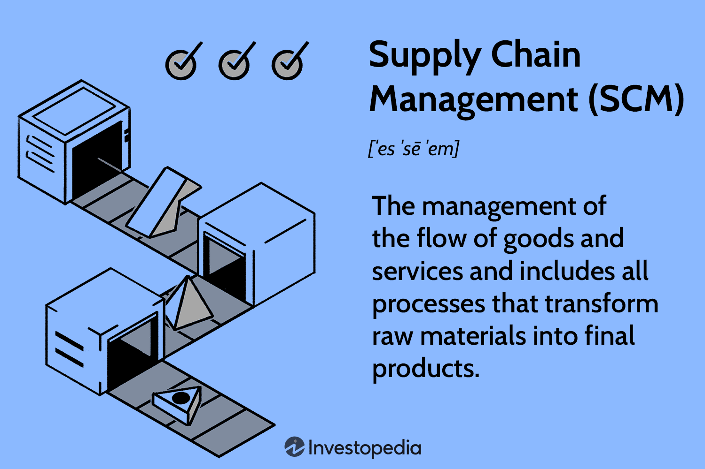

Chainlink is a decentralized oracle network that significantly impacts the blockchain environment by enabling smart contracts to securely access real-world data. This innovation has overcome a fundamental limitation of blockchain technology — the inability of smart contracts to communicate with resources outside their respective networks. Chainlink facilitates this communication by acting as a bridge, employing a network of nodes, or oracles, to retrieve and feed external data into the blockchain in a decentralized manner.

The development of Chainlink has brought transformative changes to blockchain usage, particularly through the interaction of smart contracts with external datasets, which were previously beyond reach. This capability opens up a multitude of applications across different sectors, notably in algorithmic trading, where the need for timely and reliable data is paramount for decision-making and executing trades.

In this context, the article will outline the specifics of how Chainlink integrates with algorithmic trading platforms, providing traders with enhanced tools for developing automated trading strategies that tap into real-world data. This integration not only promises improved financial outcomes but also ensures increased trust and reliability through decentralization, reducing dependencies on traditional, centralized data sources.

Furthermore, Chainlink's architecture supports hybrid smart contracts, combining on-chain and off-chain data to execute more complex transactions, a feature highly beneficial to algorithmic trading. It ensures that the information powering financial models and strategies is both accurate and verifiable, which in turn helps optimize trading operations and reduce risk.

The exploration of these developments highlights the profound impact Chainlink has on both blockchain-based smart contracts and the financial industry as a whole, offering new possibilities for innovation and efficiency in trading practices.

## Table of Contents

## Understanding Chainlink and Its Components

Chainlink is a decentralized oracle network designed to connect blockchain applications with external data sources, a solution to what is commonly known as the 'oracle problem'. This problem arises from the inherent nature of blockchains to remain isolated from external systems in order to maintain consensus and integrity. Oracles serve as an intermediary, providing a secure way for smart contracts on the blockchain to access off-chain data necessary for their execution. Chainlink’s decentralized approach ensures that oracles do not act as a single point of failure or source of truth, enhancing the reliability and resilience of the data provided.

At its core, Chainlink's decentralized oracles retrieve and feed real-world data to blockchain systems, making them indispensable for various applications such as finance, insurance, and supply chain management. These oracles converge data inputs from multiple sources and use a system of reputation and validation to ensure the accuracy and trustworthiness of the information delivered to smart contracts. This feature is critical in scenarios where accurate data is a prerequisite for the execution of automated contracts, such as in [algorithmic trading](/wiki/algorithmic-trading) or automated payment systems.

The economic model of Chainlink is powered by LINK tokens, which function as incentives within the network. LINK tokens are the means of payment for node operators who provide data feeds and perform computations. These operators are selected based on their history of reliability and performance, contributing to a competitive environment that consistently enhances service quality. The use of LINK tokens aligns the incentives of data providers with the overall integrity and efficiency of the network.

Chainlink is built on top of the Ethereum blockchain, utilizing its smart contract capabilities and various blockchain protocols, including proof-of-stake. This foundation provides a robust and secure environment for the operation of Chainlink nodes and ensures seamless integration with Ethereum's extensive ecosystem. By operating on Ethereum, Chainlink leverages a mature and secure blockchain infrastructure which benefits from consistent development and widespread adoption.

The support for decentralized data is another cornerstone of Chainlink's technology. By ensuring that data used by smart contracts is accurate and tamper-proof, Chainlink enhances the trustworthiness of blockchain-based systems. The decentralized nature of its oracle network minimizes the risk of single points of failure or manipulation, which can occur with centralized systems. This quality is paramount, especially in contexts demanding high levels of transparency and auditability, such as automated trading and decentralized finance (DeFi).

In summary, Chainlink addresses the oracle problem by providing a secure bridge between blockchain smart contracts and the real world. Through its decentralized oracle network, powered by LINK tokens and built on Ethereum, Chainlink offers a robust platform for delivering accurate and reliable data, thereby enhancing the functionality and integrity of blockchain applications.

## How Chainlink Enhances Smart Contracts

Smart contracts are autonomous scripts deployed on a blockchain, designed to execute predefined actions automatically when specific conditions are met. Chainlink significantly enhances the functionality and versatility of these smart contracts by enabling them to access real-time data from the outside world. Through its decentralized oracle network, Chainlink serves as a conduit, bridging the gap between blockchain systems and external data sources.

One of the primary advantages of Chainlink is its ability to provide smart contracts with real-time data feeds. Traditional blockchains are inherently isolated, relying solely on the information available within the network. This limitation restricts smart contracts from interacting with external, off-chain data, thereby curbing their potential functionality. Chainlink addresses this gap by utilizing a decentralized network of oracles, which supply precise and timely data from various sources. For example, a smart contract responsible for executing a financial transaction based on fluctuating market prices can utilize Chainlink to obtain real-time price feeds from trusted financial data providers.

Chainlink's decentralized architecture is crucial in reducing the risk of data tampering. In centralized systems, a single point of failure or malicious manipulation could compromise the integrity of the data and, consequently, the smart contracts relying on such data. By leveraging multiple oracles, Chainlink ensures redundancy and cross-verification, wherein multiple data inputs can be aggregated to produce a tamper-proof consensus. This decentralized approach enhances the reliability and trustworthiness of smart contracts, making them more robust against external threats.

Moreover, Chainlink introduces advanced functionalities like verifiable randomness and cross-blockchain interoperability. Verifiable randomness is particularly useful in applications such as gaming, lotteries, and NFTs, where unpredictability is essential. Chainlink provides a Verifiable Random Function (VRF), enabling smart contracts to generate random numbers with cryptographic proof, assuring participants that the process is fair and unbiased.

Furthermore, Chainlink supports cross-blockchain interoperability, an essential capability in a multi-chain environment. By facilitating communication between different blockchain networks, Chainlink expands the reach and utility of smart contracts. This interoperability allows applications to leverage the strengths of various blockchains, creating more comprehensive and efficient solutions.

In summary, Chainlink elevates the potential of smart contracts by enabling access to real-time data, enhancing security through decentralization, and introducing features like verifiable randomness and cross-chain interoperability. These enhancements empower smart contracts to perform complex and sophisticated functions, paving the way for more innovative and reliable blockchain applications.

## Chainlink in Algorithmic Trading

Algorithmic trading is a process that uses computerized systems to execute trading strategies based on pre-set criteria. This method relies heavily on real-time data to make precise trading decisions and is prevalent in both cryptocurrencies and traditional finance markets. Chainlink plays a crucial role in this domain by providing decentralized oracles that supply reliable and secure data feeds to automated trading algorithms. 

Chainlink's decentralized oracles stand out because they address the "oracle problem" by ensuring that the external data fed into the blockchain is accurate and trustworthy. In algorithmic trading, this reliability is essential, as trading decisions are made based on the integrity of data such as asset prices, market indices, or event updates. By decentralizing data sources, Chainlink minimizes the risk of data manipulation, providing a layer of security that is vital for maintaining the efficiency and effectiveness of trading algorithms.

Traders can automate strategies that require constant market monitoring by integrating Chainlink's oracles into their systems. For example, consider an algorithm designed to execute a buy order when an asset's price drops below a certain threshold. By utilizing Chainlink's real-time price feeds, the algorithm can promptly execute trades with minimal latency, a critical [factor](/wiki/factor-investing) that can impact trading outcomes. This prompt execution helps traders capitalize on brief market opportunities that may not be accessible without rapid data access.

Moreover, Chainlink's infrastructure allows for the automation of smart contracts that execute trades. These smart contracts can react to market conditions as reported by Chainlink's oracles, ensuring that trades occur at the most opportune times. This level of automation diminishes human error, enhances trading precision, and ensures timely market operations. 

Chainlink also helps reduce latency in trading systems. In high-frequency trading scenarios, even millisecond delays can result in losses. By providing rapid data updates, Chainlink enables traders to keep their operations efficient, responding nearly instantaneously to market changes. This attribute is particularly advantageous in volatile markets, where swift reactions can lead to significant profit margins.

Overall, Chainlink's automation services and decentralized data feeds equip algorithmic traders with the tools necessary to enhance their strategies, guaranteeing both efficiency and reliability. The implications for trading are profound, with potential for improved financial outcomes through the seamless integration of secure, real-time data into trading algorithms.

## Advantages of Using Chainlink for Crypto and Traditional Markets

Chainlink's system provides traders with access to off-chain data, enabling them to execute trades based on real-time global market trends. This capability significantly broadens the scope of opportunities available in both [cryptocurrency](/wiki/cryptocurrency) and traditional financial markets. By functioning as a bridge between blockchain and external data sources, Chainlink ensures that the smart contracts embedded within decentralized applications can access timely and relevant information, which is crucial for informed decision-making.

The versatility of Chainlink’s framework allows it to seamlessly integrate with various market environments. This compatibility is a significant advantage, as it provides a comprehensive solution applicable to both digital assets and conventional financial instruments like stocks, commodities, and currencies. Consequently, Chainlink can cater to diverse trading strategies, from high-frequency trading to long-term investment plans, by providing access to accurate and diverse datasets.

Moreover, the decentralized nature of Chainlink ensures that the data it provides is generally free from biases and inaccuracies, which addresses a common concern in the financial industry. Centralized data providers may introduce errors or biases due to technical failures, manipulation, or misinterpretation. Chainlink mitigates these risks by distributing the data-gathering process across a vast network of independent nodes. This decentralized structure reduces the likelihood of single points of failure and enhances data integrity.

Chainlink greatly supports the development of more robust and trustworthy trading algorithms. By providing a steady flow of reliable, verified data, Chainlink enables algorithmic trading systems to operate with heightened precision and less uncertainty. This enhances strategies involving [machine learning](/wiki/machine-learning) models, which depend heavily on the quality and reliability of input data to generate predictive analytics and execute trades.

Furthermore, integrating Chainlink into trading platforms mitigates risks typically associated with conventional, centralized data feeds. In a centralized system, any disruption can lead to significant data outages or manipulation, potentially resulting in erroneous trading decisions. By leveraging Chainlink, traders can bypass these pitfalls, as the decentralized oracle network provides more resilient data transmission, which is critical for maintaining continuous market operations. This technological advantage ensures operational reliability, an essential feature for platforms that engage in complex trading activities across multiple markets.

## Future Prospects and Challenges

The future of Chainlink holds significant promise, particularly as blockchain technology continues to gain traction across various industries. Chainlink's adaptability is evident in its potential to expand support to additional blockchain environments, broadening its utility beyond its current scope. This expansion is critical as it enables Chainlink to become more integrated with diverse blockchain platforms, thereby increasing its relevance and providing more avenues for implementing its technology.

One of the key developments expected in Chainlink's future is the enhancement and increased use of hybrid smart contracts. These contracts, which operate partly on-chain and partly off-chain, leverage Chainlink's capabilities to access reliable external data. As more industries adopt blockchain solutions, the demand for these hybrid smart contracts is set to rise, pushing Chainlink to innovate and refine its technology to cater to complex, real-world applications.

Despite its promising potential, Chainlink faces several challenges that could impact its trajectory. Scalability remains a prominent issue; as the network grows, ensuring that data remains accessible and transactions are processed efficiently becomes more complex. This requires ongoing advancements in network infrastructure to maintain performance and reliability.

Security is another crucial challenge for Chainlink. With the increasing sophistication of cyber threats, maintaining the integrity and security of data feeds is paramount. Chainlink must continuously bolster its security measures to safeguard against potential attacks and ensure the tamper-proof nature of the information it provides to smart contracts.

As demand for decentralized financial services increases, Chainlink's potential applications in broader markets expand beyond traditional boundaries. Its decentralized nature and ability to provide accurate, bias-free data make it a valuable asset for businesses seeking transparency and efficiency in trading solutions.

Overall, Chainlink is well-positioned to become a foundational technology for businesses aiming for innovative and transparent trading strategies. The network's continuous innovation and adaptation to emerging challenges will be critical to its sustained success and the broader growth of the blockchain industry. By navigating these future prospects and challenges, Chainlink is likely to remain at the forefront of advancements in smart contract capabilities and decentralized applications.

## Conclusion

Chainlink has fundamentally changed the blockchain ecosystem by facilitating the interaction between smart contracts and real-world data. This innovation is crucial because it enhances the functionality and applicability of smart contracts, which were previously limited to on-chain data. With Chainlink, it is possible to gather data from a variety of off-chain sources, securely and reliably integrate it into blockchain applications, and allow for more dynamic contract outcomes.

The integration of Chainlink with algorithmic trading systems offers a dependable solution for automating trading strategies. Chainlink’s decentralized oracle network ensures that the data driving these strategies is both accurate and timely, providing critical improvements to the performance and reliability of automated trading. This capacity for real-time data acquisition and execution not only supports algorithmic traders in optimizing their trading operations but also contributes to reducing the risks associated with inaccurate data or data latency.

Financial markets are likely to benefit significantly from Chainlink's technology through unprecedented levels of transparency and efficiency. By ensuring that data exchanged is verifiable and secure, Chainlink reduces potential points of failure commonly associated with data handling in market operations. This high level of data integrity can lead to more informed decision-making processes and potentially more stable financial environments.

The trajectory of Chainlink’s development indicates that continued innovation will be crucial for its sustained success and its role in the continued maturation of the blockchain industry. As the technology evolves, it presents new possibilities for expanding the capabilities of smart contracts, including enhancing cross-chain compatibility and supporting more sophisticated contract terms.

Investors and developers should pay close attention to Chainlink’s advancements, as its pioneering role in enabling smart contract interactivity with real-world data positions it as a crucial component in the broader landscape of blockchain technologies. Chainlink is not merely pushing the boundaries of what smart contracts can achieve— it is redefining them for more efficient and transparent markets.

## References & Further Reading

[1]: Peterson, S. (2020). ["Chainlink: A Decentralized Oracle Network."](https://chain.link/whitepaper) Blockgeeks.

[2]: Nazarov, S., & Ellis, A. (2017). ["ChainLink: A Decentralized Oracle Network."](https://research.chain.link/whitepaper-v2.pdf) Chainlink Whitepaper.

[3]: Lopez de Prado, M. (2018). ["Advances in Financial Machine Learning"](https://www.amazon.com/Advances-Financial-Machine-Learning-Marcos/dp/1119482089). Wiley.

[4]: Johnson, M. (2021). ["The Crypto Trader: How Anyone Can Make Money Trading Bitcoin and Other Cryptocurrencies"](https://www.goodreads.com/book/show/45894991-the-crypto-trader). Wiley.

[5]: Antonopoulos, A. M., & Wood, G. (2018). ["Mastering Ethereum: Building Smart Contracts and DApps"](https://www.amazon.com/Mastering-Ethereum-Building-Smart-Contracts/dp/1491971940). O'Reilly Media.

[6]: The Chainlink Blog. (n.d.). ["Chainlink Verifiable Random Function (VRF)."](https://blog.chain.link/chainlink-vrf-on-chain-verifiable-randomness/) Chainlink.

[7]: Nazarov, S. (2019). ["Smart Contracts and Oracle Problem."](https://decrypt.co/5813/chainlink-ceo-exclusive-blockchain-oracle-smart-contracts-town-crier) Chainlink.

[8]: Chan, E. (2008). ["Quantitative Trading: How to Build Your Own Algorithmic Trading Business"](https://github.com/ftvision/quant_trading_echan_book). Wiley.