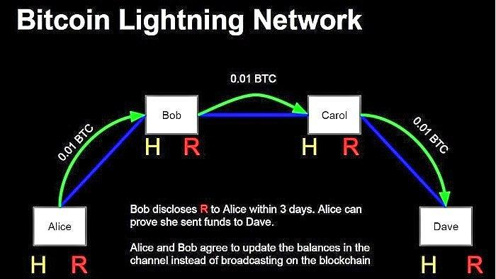

## Table of Contents

## What is the Lightning Network and how does it relate to Bitcoin?

The Lightning Network is a special system that helps make Bitcoin transactions faster and cheaper. It works like a network of tiny roads that connect people directly, so they can send Bitcoin to each other without always using the main Bitcoin road, which can be slow and expensive. By using these smaller roads, people can make many small payments quickly and at a lower cost.

This system is important for Bitcoin because it solves some big problems. Bitcoin can sometimes be slow and costly to use for small, everyday purchases. The Lightning Network makes it easier for people to use Bitcoin for things like buying a cup of coffee or paying for a bus ride. It helps Bitcoin become more useful for everyday life, making it a better tool for people all around the world.

## Why was the Lightning Network created and what problems does it aim to solve?

The Lightning Network was created to make Bitcoin easier and cheaper to use for everyday transactions. Bitcoin's main network can be slow and expensive, especially for small payments. Imagine trying to buy a candy bar with Bitcoin; it might take a long time and cost more in fees than the candy itself. The Lightning Network solves this by creating a way for people to send Bitcoin to each other quickly and at a lower cost, without always using the main Bitcoin network.

This system aims to solve the problem of scalability, which means making Bitcoin work better for more people at the same time. When lots of people want to use Bitcoin, the main network can get crowded and slow down. The Lightning Network helps by taking some of the traffic off the main road and moving it onto smaller, faster paths. This way, more people can use Bitcoin without the system getting bogged down, making it a more practical choice for everyday use.

## What are the basic requirements for using the Lightning Network?

To use the Lightning Network, you need a few things. First, you need a wallet that supports the Lightning Network. This is like a special kind of bank account that can use the Lightning Network's fast roads. You can find these wallets on your computer or phone. Second, you need some Bitcoin to put into your Lightning Network wallet. This is because the Lightning Network uses Bitcoin to make payments.

Once you have a Lightning Network wallet and some Bitcoin, you're ready to go. You can open what's called a "channel" with someone else who also uses the Lightning Network. Think of a channel like a direct road between you and the other person. You can send Bitcoin back and forth on this road as many times as you want, and it will be quick and cheap. When you're done, you can close the channel and settle everything back on the main Bitcoin network.

## How does the Lightning Network improve transaction speed and cost?

The Lightning Network makes Bitcoin transactions faster by creating special paths, called channels, between people. Instead of sending Bitcoin through the main Bitcoin network, which can be slow, you send it through these channels. It's like using a shortcut instead of a busy highway. When you use a channel, your payment can go through almost instantly, making it much quicker than waiting for the main Bitcoin network to process your transaction.

It also makes transactions cheaper. On the main Bitcoin network, every transaction has a fee, and these fees can add up, especially for small payments. The Lightning Network lets you make many small payments through a channel without paying a fee each time. You only pay a small fee when you open and close the channel. This means you can buy things like a coffee or a snack without worrying about high fees, making Bitcoin more useful for everyday purchases.

## What are the main challenges faced by users when setting up a Lightning Network node?

Setting up a Lightning Network node can be tricky because it requires some technical know-how. You need to understand how to run a Bitcoin node first, which means setting up and maintaining a computer that keeps a full copy of the Bitcoin blockchain. Then, you have to install and configure the Lightning Network software, which can be complicated. There are many settings to tweak, and if you make a mistake, your node might not work properly. It's a bit like putting together a complicated puzzle where all the pieces need to fit just right.

Another challenge is keeping your node online and secure. Your Lightning Network node needs to be running all the time to handle transactions smoothly. If it goes offline, it can cause problems with the channels you have open with others. Plus, you have to make sure your node is safe from hackers. This means setting up strong security measures, like firewalls and encryption, to protect your Bitcoin. It's a bit like guarding a treasure chest; you have to be careful and always on the lookout for trouble.

## How does the Lightning Network handle security and what are the potential risks?

The Lightning Network uses special tricks to keep your Bitcoin safe. When you open a channel with someone, you both agree on the rules for sending Bitcoin back and forth. These rules are locked in place with something called a smart contract, which is like a promise that the Bitcoin network can check. If someone tries to cheat, the smart contract can stop them and make sure everyone gets their Bitcoin back. Plus, you can use extra security like multi-signature wallets, where more than one person needs to agree before moving the Bitcoin, making it even harder for thieves to steal.

But there are some risks to watch out for. One big worry is if your Lightning Network node goes offline. If that happens, you might not be able to stop someone from cheating you out of your Bitcoin. Another risk is if the person you're trading with tries to trick you. They might try to close the channel and take more Bitcoin than they should. That's why it's important to choose who you open channels with carefully and keep your node running smoothly. It's like playing a game where you need to trust your teammates and stay alert to win.

## What are the scalability issues associated with the Lightning Network?

The Lightning Network helps make Bitcoin transactions faster and cheaper, but it has some challenges when it comes to handling a lot of users at once. One big problem is that the network can get complicated as more people join. Imagine a big spider web where each line is a channel between people. As more people add more lines, it can be hard to find the quickest path from one person to another. This can slow things down and make it harder to use the network smoothly.

Another issue is that the Lightning Network needs a lot of Bitcoin locked up in channels to work well. If everyone wants to use the network at the same time, there might not be enough Bitcoin available to open new channels. This is like trying to build more roads but running out of money to buy the materials. It can limit how many people can use the Lightning Network at once, making it less helpful for everyone.

## How does the Lightning Network affect Bitcoin's decentralization?

The Lightning Network can help keep Bitcoin decentralized by making it easier for more people to use Bitcoin without relying on big companies. When people use the Lightning Network, they can send Bitcoin to each other directly, without needing a bank or other middleman. This means more people can take part in the Bitcoin network, which helps keep it spread out and controlled by many different people instead of just a few.

But there are some worries that the Lightning Network might make Bitcoin less decentralized in some ways. For example, setting up a Lightning Network node can be hard, so some people might end up using services run by big companies instead. If too many people use these big services, it could mean that a few companies end up having a lot of control over the Lightning Network. This could make Bitcoin less decentralized if these companies start to act like the middlemen that Bitcoin was trying to avoid in the first place.

## What are the current limitations of the Lightning Network in terms of adoption and usability?

The Lightning Network still has some hurdles to overcome before it becomes widely used. One big challenge is that it can be hard to set up and use. You need a special wallet that works with the Lightning Network, and setting up your own node can be tricky. Not everyone knows how to do this, so they might have to rely on services run by others, which can be a problem if those services aren't trustworthy. Also, finding someone to open a channel with can be tough, especially if you want to make a payment to someone who isn't already on the Lightning Network.

Another limitation is that the Lightning Network can be a bit unpredictable. Sometimes, finding a good path for your payment can take longer than expected, and there's a chance your payment might not go through at all. This can be frustrating if you're trying to buy something quickly. Plus, if you don't use your channels often, you might have to pay fees to keep them open, which can add up. These issues make the Lightning Network less user-friendly and can slow down its adoption.

## How do routing and liquidity issues impact the effectiveness of the Lightning Network?

Routing and liquidity issues can make the Lightning Network less effective. When you want to send Bitcoin using the Lightning Network, your payment needs to find a path from your wallet to the person you're paying. If the path is hard to find or takes a long time, your payment can get delayed or even fail. This is like trying to find your way through a maze where some paths are blocked or very crowded. It can be frustrating and make the Lightning Network less reliable for quick payments.

Liquidity is another big challenge. To send Bitcoin through the Lightning Network, there needs to be enough Bitcoin in the channels along the way. If there isn't enough, your payment can't go through. Imagine trying to fill a bucket from a well, but the well is almost dry. You might not be able to get enough water. Similarly, if there isn't enough Bitcoin in the channels, people can't use the Lightning Network as much as they want. This can limit how many people can use it and make it less useful for everyday transactions.

## What are the advanced technical challenges in maintaining and upgrading the Lightning Network?

Keeping the Lightning Network running smoothly and making it better can be really hard. One big challenge is making sure the software stays up to date. As more people use the Lightning Network, the people who make the software have to fix bugs and add new features. This means they need to write new code and test it carefully to make sure it works well with the old code. If they make a mistake, it could break the whole network, so they have to be very careful and take their time.

Another challenge is making the Lightning Network work well with other parts of the Bitcoin system. The Lightning Network is like a special road that runs alongside the main Bitcoin road. They need to work together smoothly, but sometimes changes to one can mess up the other. The people who work on the Lightning Network have to talk a lot with the people who work on Bitcoin to make sure everything fits together nicely. It's like trying to build a new wing on a house without breaking the old part.

## What future developments are expected to address the current challenges of the Lightning Network?

People are working hard to make the Lightning Network better. One big thing they're trying to do is make it easier to set up and use. They want to create simpler wallets and tools so that anyone can use the Lightning Network without needing to be a computer expert. They're also working on ways to make sure payments always find the best path quickly, so you don't have to wait or worry about your payment not going through. This will make the Lightning Network more reliable and easier for everyone to use.

Another important goal is to make sure there's always enough Bitcoin in the channels so that payments can go through smoothly. They're coming up with new ways to move Bitcoin around the network more easily, so there's always enough to go around. This will help fix the problem of not having enough Bitcoin, or liquidity, in the channels. By solving these problems, the Lightning Network will become a better tool for people to use Bitcoin every day, making it faster, cheaper, and more user-friendly.

## What is the Understanding of the Lightning Network?

The Lightning Network is a pioneering solution created to address the scalability issues inherent in the Bitcoin blockchain. As a second-layer protocol, it operates by establishing off-chain payment channels between two participants. These channels enable multiple transactions to occur instantaneously and securely, without the need for each individual transaction to be recorded directly on the Bitcoin blockchain. This process not only accelerates transaction times but also markedly diminishes transaction fees, which are substantial challenges in the Bitcoin network.

The mechanism of the Lightning Network begins with two parties opening a payment channel by creating a multi-signature wallet, where both parties deposit Bitcoin. The initial state of the channel is documented on the Bitcoin blockchain. Once the channel is open, the parties can transfer funds between each other an unlimited number of times off-chain. These transactions are made using what's known as "off-chain commitment transactions," which reflect changes in the balance of the wallet but are not immediately broadcast to the Bitcoin network.

The primary technical advantage of this off-chain process is in how it manages transaction capacity. By maintaining the bulk of micro-transactions off the main blockchain, the Lightning Network mitigates network congestion, lessening delays and costs, which are the main focuses for users seeking swift and economical transfers. It is at the point of channel closure, or when the parties agree to record the final state on the blockchain, that the net balance is written to the Bitcoin ledger, closing the channel and reflecting the updated distribution of funds.

From a mathematical perspective, consider a simplified transaction formula within a channel, where Alice and Bob wish to transact:

1. Initial State: 
$$
   \text{Alice's balance} = a_0

$$
$$
   \text{Bob's balance} = b_0

$$

2. After several off-chain transactions between Alice and Bob, the balances might alter as:
$$
   \text{Alice's new balance} = a_f

$$
$$
   \text{Bob's new balance} = b_f

$$

3. The sum remains constant:
$$
   a_0 + b_0 = a_f + b_f

$$

This ensures that the integrity of the initial blockchain-deposited funds is preserved throughout the off-chain interactions until they are finally committed back to the blockchain when the channel is closed.

The advantages of the Lightning Network over traditional transaction methods include the notable reduction in transaction costs and delays, making microtransactions viable in Bitcoin. By implementing this network, the Bitcoin blockchain is less burdened with minor transactions, thus preserving its decentralization and security while enhancing its scalability.

## References & Further Reading

[1]: Poon, J., & Dryja, T. (2016). ["The Bitcoin Lightning Network: Scalable Off-Chain Instant Payments."](https://lightning.network/lightning-network-paper.pdf) Technical Report.

[2]: Antonopoulos, A. M. (2017). ["Mastering Bitcoin"](https://www.amazon.com/Mastering-Bitcoin-Programming-Open-Blockchain/dp/1491954388) (2nd Edition). O'Reilly Media.

[3]: Narayanan, A., Bonneau, J., Felten, E., Miller, A., & Goldfeder, S. (2016). ["Bitcoin and Cryptocurrency Technologies"](https://press.princeton.edu/books/hardcover/9780691171692/bitcoin-and-cryptocurrency-technologies). Princeton University Press.

[4]: Lopez de Prado, M. (2018). ["Advances in Financial Machine Learning"](https://www.amazon.com/Advances-Financial-Machine-Learning-Marcos/dp/1119482089). Wiley.

[5]: Chan, E. (2013). ["Algorithmic Trading: Winning Strategies and Their Rationale"](https://github.com/hudson-and-thames/arbitragelab/blob/master/docs/source/cointegration_approach/cointegration_tests.rst). Wiley Trading.

[6]: Duffy, S. (2021). ["The Lightning Network: From White Paper to Real-World Adoption."](https://get.earthnetworks.com/hubfs/2021%20US%20Lightning%20Report/US%20Lightning%20Report_2021_Final.pdf). CoinDesk.