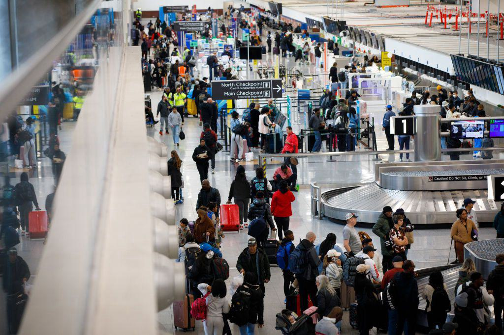

## Table of Contents

## What are the basic operational challenges faced by airlines?

Airlines face many operational challenges that can make running their business difficult. One major challenge is dealing with unpredictable events like bad weather, which can delay or cancel flights. This not only affects the airline's schedule but also frustrates passengers. Another challenge is the high cost of fuel, which can change a lot and affect the airline's profits. Airlines need to find ways to save money and still provide good service to their customers.

Another big issue is managing the complex schedules of flights, crew, and aircraft. Airlines have to make sure that planes and crew are in the right place at the right time, which can be very hard to do. If something goes wrong, like a plane needing repairs, it can cause a lot of problems and delays. Keeping everything running smoothly takes a lot of planning and quick thinking.

Lastly, competition among airlines can be tough. Airlines need to offer competitive prices and good service to attract passengers. This can lead to lower profits and the need to find new ways to make money, like charging for extra services. Keeping customers happy while also making enough money to stay in business is a constant challenge for airlines.

## How do fluctuating fuel prices impact airline operations?

Fluctuating fuel prices can have a big impact on airline operations. When fuel prices go up, it costs more for airlines to fly their planes. This means that the money they make from selling tickets might not be enough to cover their costs. Airlines might need to raise ticket prices to make up for the higher fuel costs, but this can make customers unhappy and choose to fly with other airlines that have lower prices.

To deal with these changes in fuel prices, airlines often try to find ways to save money. They might use planes that use less fuel or change their flight routes to be more efficient. Sometimes, they buy fuel in advance when prices are low, hoping to save money if prices go up later. But even with these strategies, fluctuating fuel prices can still make it hard for airlines to plan and stay profitable.

## What role do government regulations play in the challenges faced by airlines?

Government regulations can make things harder for airlines. Rules about safety, the environment, and how airlines can run their business can add to the costs of flying. For example, airlines might need to spend more money to make sure their planes meet safety standards or to reduce the pollution they create. These rules can also limit where and when airlines can fly, which can make it harder for them to make money.

On the other hand, government regulations can also help airlines. Rules that control how many airlines can fly certain routes can reduce competition, which might help airlines make more money. Also, governments sometimes give money to airlines to help them during tough times, like when there's a big drop in the number of people flying. So, while regulations can create challenges, they can also provide some support to airlines.

## How does competition affect the profitability and operations of airlines?

Competition among airlines can make it hard for them to make money. When there are many airlines flying the same routes, they have to lower their ticket prices to attract passengers. This can lead to less profit for each airline. To stay competitive, airlines might also need to offer better services or more flights, which can cost a lot of money. If an airline can't keep up with the competition, it might lose customers and struggle to stay in business.

On the other hand, competition can push airlines to work more efficiently. They might find new ways to save money, like using planes that use less fuel or improving how they schedule flights. This can help them offer lower prices and still make a profit. But even with these efforts, the pressure from other airlines can make it a constant challenge to keep profits up and operations running smoothly.

## What are the challenges related to maintaining and updating an airline's fleet?

Keeping an airline's fleet in good shape and up to date can be tough. Planes need regular checks and repairs to make sure they are safe to fly. This can be expensive and take a lot of time. If a plane needs a big fix, it might have to stop flying for a while. This can mess up the airline's schedule and make it hard to keep flights on time. Also, as planes get older, they might not work as well as newer models. This can make them use more fuel and cost more to fly.

Updating the fleet with new planes can help solve some of these problems. New planes often use less fuel and need fewer repairs. But buying new planes is very expensive. Airlines have to think carefully about when to buy new planes and how to pay for them. They might need to borrow money or use their profits to buy new planes. If they wait too long to update their fleet, they might lose customers to airlines with newer, more efficient planes. So, keeping the fleet up to date is a big challenge that airlines always have to think about.

## How do airlines manage the complexities of route planning and scheduling?

Airlines have to think a lot about where and when their planes should fly. They need to make sure that planes are flying to places where people want to go, and at times that are good for passengers. This means looking at things like how many people want to fly certain routes, what times of day are busiest, and what other airlines are doing. They also have to think about things like airport rules and how long it takes to get from one place to another. All of this information helps them make a schedule that works well for everyone.

Making a good schedule is hard because things can change all the time. If a plane is late or needs repairs, it can mess up the whole plan. Airlines use special computer programs to help them figure out the best way to handle these changes. They also need to make sure that their crew members are in the right places at the right times, which can be tricky because there are rules about how long pilots and flight attendants can work. By planning carefully and using technology, airlines try to keep everything running smoothly even when things don't go as planned.

## What are the security concerns that airlines must address?

Airlines have to deal with a lot of security worries. They need to keep their passengers and crew safe from things like terrorism and hijacking. To do this, they work with government agencies and use strict security measures. For example, they check passengers and their bags before they get on the plane. They also train their staff to spot anything that looks suspicious and to know what to do in an emergency.

Another big security concern is protecting their computer systems. Airlines use a lot of technology to manage flights and passenger information. If hackers get into these systems, they could cause big problems, like messing up flight schedules or stealing personal information. To stop this from happening, airlines use strong security software and make sure their staff know how to keep things safe. Keeping everything secure is a big job, but it's really important for keeping everyone safe and the airline running smoothly.

## How do airlines handle customer service and satisfaction challenges?

Airlines work hard to make their customers happy, but it can be tough. When flights get delayed or canceled, passengers can get upset. Airlines try to help by giving out food vouchers, hotel stays, or even money back. They also train their staff to be friendly and helpful, so they can answer questions and solve problems quickly. But even with all this, it's hard to keep everyone happy all the time, especially when things go wrong that the airline can't control, like bad weather.

Another big part of customer service is listening to what passengers want. Airlines use surveys and feedback to learn how they can do better. They might add more flights to popular places, offer better food, or make it easier to check in. But making changes can be expensive and take time. Airlines have to balance what customers want with what they can afford to do. Keeping customers happy is a big challenge, but it's important for getting people to fly with them again and again.

## What are the financial challenges specific to the airline industry?

Airlines have a lot of money problems because flying planes is very expensive. They have to pay for fuel, which can change a lot and make it hard to plan. They also have to spend money on their planes, like fixing them when they break or buying new ones. On top of that, airports charge airlines to use their runways and gates. All these costs add up, and if ticket prices are not high enough, airlines might lose money.

Competition makes it even harder for airlines to make money. When there are a lot of airlines flying the same routes, they have to lower their prices to get people to fly with them. This can lead to less profit for everyone. Sometimes, airlines try to make more money by charging for extra things, like checked bags or better seats. But even with these extra fees, it's still a challenge to keep the business going and make enough money to stay in business.

## How do global events, such as pandemics, affect airline operations?

Global events like pandemics can really hurt airlines. When a big health crisis happens, people stop traveling because they are worried about getting sick. This means fewer passengers on flights, and airlines lose a lot of money. To try to stop the spread of the disease, governments might tell airlines to stop flying to certain places or limit how many people can be on a plane. These rules can make it even harder for airlines to make money and keep their schedules going.

Airlines have to find ways to keep going during tough times like a pandemic. They might cut down on the number of flights they have or park some of their planes to save money. Sometimes, they get help from the government, like loans or money to help them stay in business. But even with these efforts, it's a big challenge to keep everything running smoothly and make sure they can start flying normally again when things get better.

## What technological advancements are required to overcome current airline challenges?

To deal with the challenges airlines face, they need to use new technology to make their operations better. One big help is using computer programs to plan flights and schedules. These programs can quickly change plans if something goes wrong, like a delay or a plane needing repairs. They also help airlines use less fuel by finding the best routes to fly. Another important technology is better security systems to keep planes and passengers safe. This includes things like better ways to check bags and passengers, and strong computer security to stop hackers from causing trouble.

Airlines also need technology to make customers happier. For example, they can use apps that let people check in and pick their seats easily. These apps can also send updates about flight changes, so passengers know what's going on. Another way technology helps is by using data to understand what passengers want. Airlines can look at this data to make better decisions about where and when to fly, and what services to offer. By using these new technologies, airlines can work more smoothly, save money, and keep their customers happy, even when things get tough.

## How can airlines implement sustainable practices to meet environmental regulations and public expectations?

Airlines can use more green practices to follow environmental rules and meet what people expect. One way is by using planes that use less fuel. These planes help cut down on the pollution that comes from flying. Airlines can also fly in a way that saves fuel, like taking shorter routes or flying at the right speed. Another way is to use more biofuels, which are better for the environment than regular jet fuel. By making these changes, airlines can help the planet and also follow the rules set by governments.

Another important thing airlines can do is to manage their waste better. They can recycle more and use less plastic on flights. This helps reduce the trash that ends up in landfills. Airlines can also work on making their airports more eco-friendly, like using solar power or other green energy. By showing that they care about the environment, airlines can make passengers happier and meet what people want from them. It's a big challenge, but by making these changes, airlines can be more sustainable and still run their business well.

## References & Further Reading

[1]: Marcos Lopez de Prado. ["Advances in Financial Machine Learning"](https://www.amazon.com/Advances-Financial-Machine-Learning-Marcos/dp/1119482089). John Wiley & Sons, 2018.

[2]: David Aronson. ["Evidence-Based Technical Analysis: Applying the Scientific Method and Statistical Inference to Trading Signals"](https://www.amazon.com/Evidence-Based-Technical-Analysis-Scientific-Statistical/dp/0470008741). John Wiley & Sons, 2006.

[3]: Stefan Jansen. ["Machine Learning for Algorithmic Trading: Predictive Models to Extract Signals from Market and Alternative Data for Systematic Trading Strategies with Python"](https://github.com/stefan-jansen/machine-learning-for-trading). Packt Publishing, 2018.

[4]: Ernest P. Chan. ["Quantitative Trading: How to Build Your Own Algorithmic Trading Business"](https://www.amazon.com/Quantitative-Trading-Build-Algorithmic-Business/dp/0470284889). John Wiley & Sons, 2008.

[5]: Joel Hasbrouck. ["Trading Costs"](https://people.stern.nyu.edu/jhasbrou/Research/GibbsCurrent/HasbrouckJF.pdf). Journal of Economic Literature, 2006.

[6]: John Hull. ["Options, Futures, and Other Derivatives"](https://www.amazon.com/Options-Futures-Other-Derivatives-6th/dp/0131499084). Pearson, 2017.