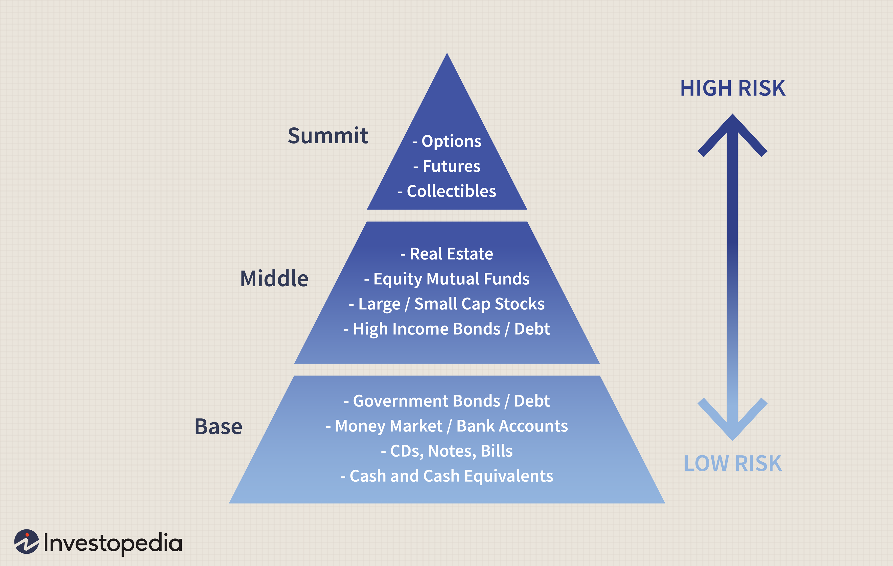

## Table of Contents

## What are the basic types of modern investments?

Modern investments can be broadly categorized into three main types: stocks, bonds, and cash equivalents. Stocks represent ownership in a company and are considered higher risk because their value can fluctuate greatly based on the company's performance and market conditions. When you buy stocks, you're hoping the company will grow and increase the value of your shares. Bonds, on the other hand, are loans you give to a government or corporation. They are generally seen as less risky than stocks because they provide regular interest payments and return your initial investment at the end of a set period. Cash equivalents include things like savings accounts and money market funds, which are very safe but usually offer lower returns.

In addition to these basic types, there are also more complex investment vehicles like mutual funds and exchange-traded funds (ETFs). Mutual funds pool money from many investors to buy a diversified portfolio of stocks, bonds, or other assets. This diversification can reduce risk. ETFs are similar but are traded on stock exchanges like individual stocks. They often track a specific index, like the S&P 500, and can be a cost-effective way to invest in a broad market segment. Real estate and commodities, like gold or oil, are other investment options that can diversify a portfolio and potentially hedge against inflation.

Choosing the right mix of investments depends on your financial goals, risk tolerance, and time horizon. Younger investors might lean more towards stocks for long-term growth, while those closer to retirement might prefer the stability of bonds and cash equivalents. It's important to regularly review and adjust your investment strategy to align with your changing needs and market conditions.

## How does inflation impact investment returns?

Inflation can affect investment returns in several ways. When inflation goes up, the value of money goes down. This means the same amount of money can buy fewer things. If your investments don't grow faster than inflation, you might actually lose money in terms of what you can buy with it. For example, if inflation is at 3% and your investment only grows by 2%, you're losing 1% in real terms.

Different types of investments react differently to inflation. Stocks can sometimes be a good hedge against inflation because companies might raise prices to keep up with inflation, which can lead to higher profits and higher stock prices. On the other hand, bonds can be hurt by inflation because the fixed interest payments they give you lose value as inflation rises. Cash and savings accounts are also hit hard by inflation because they usually have low interest rates that don't keep up with rising prices.

## What are the risks associated with stock market investments?

Investing in the stock market can be risky because the value of stocks can go up and down a lot. If a company does not do well, its stock price can drop, and you might lose money. This is called market risk. There are also risks that affect the whole market, like economic downturns or big world events. These can make stock prices fall even if the companies are doing okay. Another risk is that you might not have all your money spread out across different types of investments. If all your money is in one company or one type of stock, and something goes wrong, you could lose a lot.

Another risk is something called [liquidity](/wiki/liquidity-risk-premium) risk. This means you might not be able to sell your stocks quickly or at the price you want. If a lot of people want to sell their stocks at the same time, the price can drop fast. There's also the risk of not knowing enough about the companies you're investing in. If you don't do your homework, you might pick stocks that don't do well. Lastly, there can be risks from things like fraud or mistakes in how the company reports its finances. These can make the stock price drop suddenly if they come to light.

## How can diversification help manage investment risks?

Diversification helps manage investment risks by spreading your money across different types of investments. Instead of putting all your money into one stock or one type of investment, you can invest in many different things. This way, if one investment goes down in value, the others might go up or stay the same, which can help balance out your losses. It's like not putting all your eggs in one basket. If you drop one basket, you still have other baskets with eggs in them.

By diversifying, you can reduce the impact of any single investment doing badly. For example, if you have some money in stocks, some in bonds, and some in real estate, a drop in the stock market won't hurt your whole portfolio as much. Diversification can help protect you from big losses and make your investments more stable over time. It's a way to play it safe while still trying to grow your money.

## What role do cryptocurrencies play in modern investment portfolios?

Cryptocurrencies like Bitcoin and Ethereum have become a new option for people looking to grow their money. They are different from traditional investments like stocks and bonds because they are not controlled by banks or governments. Some people see cryptocurrencies as a way to make a lot of money quickly because their prices can go up a lot. But they can also go down a lot, so they are very risky. Because of this, many people only put a small part of their money into cryptocurrencies.

Adding cryptocurrencies to a modern investment portfolio can help spread out risk, but it's important to be careful. Since cryptocurrencies can be very unpredictable, they are usually seen as a high-risk, high-reward part of a portfolio. If you decide to invest in them, it's a good idea to only use money you can afford to lose and to keep most of your money in safer investments like stocks, bonds, and cash. This way, you can try to benefit from the growth of cryptocurrencies while still protecting your overall investments.

## How do interest rates affect different types of investments?

Interest rates can have a big effect on different types of investments. When interest rates go up, it usually means that borrowing money becomes more expensive. This can slow down the economy because people and businesses might not want to borrow as much. Stocks can be hurt by this because companies might make less money if people are buying less stuff. On the other hand, when interest rates go down, borrowing becomes cheaper, which can help the economy grow. This can be good for stocks because companies might make more money and their stock prices might go up.

Bonds are also affected by interest rates. When interest rates go up, the price of existing bonds usually goes down. This is because new bonds will be issued with higher interest rates, making the older bonds with lower rates less attractive. So, if you want to sell your old bonds, you might have to sell them for less money. On the flip side, when interest rates go down, the price of existing bonds usually goes up because they have higher interest rates than new bonds being issued. Cash and savings accounts can benefit from higher interest rates because they can earn more money from the interest, but they might not grow as fast as other investments when rates are low.

## What are the tax implications of various investment vehicles?

Different types of investments have different tax rules. When you invest in stocks, you might have to pay taxes on any profits you make when you sell them. If you hold the stocks for more than a year, you usually pay a lower tax rate on your profits, which is called a long-term capital gains tax. If you sell them in less than a year, you pay a higher tax rate, which is called a short-term capital gains tax. Dividends from stocks are also taxed, but sometimes at a lower rate if they are qualified dividends. 

Bonds have their own tax rules. If you buy bonds from the government, like Treasury bonds, the interest you earn is usually only taxed at the federal level, not at the state or local level. But if you buy bonds from a corporation, the interest you earn is taxed at both the federal and state levels. Some bonds, like municipal bonds, might be tax-free if they are used for certain public projects. This means you don't have to pay federal taxes on the interest, and sometimes state and local taxes too, depending on where you live.

Other investments like real estate and mutual funds also have unique tax considerations. If you own real estate, you might be able to deduct certain expenses like mortgage interest and property taxes from your income. When you sell real estate, you might have to pay capital gains tax on any profit you make. Mutual funds can be a bit tricky because they can generate capital gains that are passed on to you even if you don't sell your shares. These gains are taxed, and you'll get a form at the end of the year telling you how much to report on your taxes.

## How can one assess the performance of an investment fund?

To assess the performance of an investment fund, you need to look at a few key things. One important thing is the fund's returns over time. You can compare these returns to a benchmark, like the S&P 500 for stock funds, to see if the fund is doing better or worse than the market. Another thing to look at is the fund's risk level. You can do this by checking its [volatility](/wiki/volatility-trading-strategies), which is how much the fund's value goes up and down. A fund with high returns might be taking more risks, so you need to decide if you're okay with that.

Another way to assess a fund's performance is by looking at its expense ratio, which is how much it costs to manage the fund. Lower expense ratios are usually better because they mean more of your money stays in the fund and can grow over time. You should also check the fund manager's track record to see if they have a good history of making smart investment choices. All these things together can help you understand how well an investment fund is doing and if it's a good fit for your goals.

## What are the challenges of investing in emerging markets?

Investing in emerging markets can be exciting because these countries are growing fast and their economies are getting bigger. But it can also be risky. One big challenge is that these markets can be more unpredictable than developed markets. The stock prices can go up and down a lot because of things like political changes or economic problems. For example, if a new government comes in and changes a lot of rules, it can affect businesses and make stock prices drop.

Another challenge is that it can be harder to get good information about companies in emerging markets. In developed countries, companies have to share a lot of information about how they are doing, but this might not be the case in emerging markets. This makes it harder to know if a company is a good investment. Also, the rules about investing might not be as clear or as well enforced, which can lead to more problems and risks.

Lastly, there can be issues with getting your money in and out of these markets. Sometimes, governments in emerging markets put limits on how much money can move in and out of the country. This can make it hard to sell your investments and get your money back when you need it. So, while investing in emerging markets can offer big rewards, it's important to be aware of these challenges and maybe not put all your money into them.

## How do geopolitical events influence investment strategies?

Geopolitical events like wars, elections, and trade agreements can have a big impact on investment strategies. When something big happens in the world, it can change how people feel about the economy and make stock prices go up or down. For example, if two countries start fighting, investors might worry that it will hurt businesses and the economy. This can make them sell their stocks and move their money to safer investments like bonds or gold. On the other hand, if countries sign a new trade deal, it can make investors feel more confident and lead to more money going into stocks.

Because of these changes, investors need to keep an eye on what's happening around the world and be ready to change their plans. If they think a geopolitical event will hurt their investments, they might decide to sell some of their stocks or move money into different types of investments that are less risky. It's all about trying to protect their money and maybe even find new opportunities. For example, if a country is doing well because of a new government policy, investors might want to put more money into that country's stocks. Keeping up with the news and understanding how it might affect the markets is a big part of making smart investment choices.

## What advanced strategies can be used to hedge against market volatility?

One advanced strategy to hedge against market volatility is using options. Options are like contracts that give you the right to buy or sell a stock at a certain price by a certain date. If you think the market might go down, you can buy a "put option" that lets you sell a stock at a higher price than it might be worth later. This can help you make money or lose less money if the stock price drops. Another option is a "call option," which you can use if you think the market will go up. It lets you buy a stock at a lower price than it might be worth later. Using options can be tricky and needs a lot of understanding, but it can be a good way to protect your money from big ups and downs in the market.

Another strategy is investing in assets that don't move the same way as the stock market. This is called diversification, but on a more advanced level. For example, you might invest in commodities like gold or oil, or even in currencies from different countries. These things often don't go up and down with the stock market, so if the stock market goes down, these other investments might stay the same or even go up. This can help balance out your losses. You can also use something called inverse ETFs, which are designed to go up when the market goes down. These can be a good way to make money or lose less money when the market is volatile, but they can also be risky and complicated.

Lastly, some investors use a strategy called dollar-cost averaging to manage market volatility. Instead of putting all your money into the market at once, you spread it out over time. You invest a fixed amount of money at regular intervals, like every month. This way, you buy more shares when prices are low and fewer shares when prices are high. Over time, this can help you pay a lower average price for your investments and reduce the impact of big ups and downs in the market. It's a simple but effective way to manage risk and keep your investment strategy steady no matter what's happening in the market.

## How can artificial intelligence and machine learning be utilized to optimize investment decisions?

Artificial intelligence (AI) and [machine learning](/wiki/machine-learning) can help make better investment choices by looking at a lot of data really fast. These technologies can find patterns and trends that people might miss. For example, AI can go through news articles, financial reports, and social media posts to see how people feel about a company. If a lot of people are talking positively about a company, AI might suggest buying its stock. It can also look at past stock prices and predict how they might change in the future. This can help investors decide when to buy or sell their investments to make more money.

Another way AI and machine learning can help is by making investment portfolios better. They can figure out the best mix of stocks, bonds, and other investments based on what an investor wants and how much risk they are okay with. AI can keep an eye on the market all the time and change the portfolio to keep it in line with the investor's goals. This can help the portfolio do better over time. Also, AI can help with things like setting prices for stocks and figuring out how much risk is in an investment. By using these tools, investors can make smarter choices and maybe make more money.

## References & Further Reading

[1]: Jordan, M. I., & Mitchell, T. M. (2015). ["Machine learning: Trends, perspectives, and prospects."](https://pubmed.ncbi.nlm.nih.gov/26185243/) Science, 349(6245), 255-260.

[2]: Kirilenko, A. A., Kyle, A. S., Samadi, M., & Tuzun, T. (2017). ["The flash crash: High‐frequency trading in an electronic market."](https://www.jstor.org/stable/26652722) The Journal of Finance, 72(3), 967-998.

[3]: Preskill, J. (2018). ["Quantum computing in the NISQ era and beyond."](https://arxiv.org/abs/1801.00862) Quantum, 2, 79.

[4]: ["Advances in Financial Machine Learning"](https://www.amazon.com/Advances-Financial-Machine-Learning-Marcos/dp/1119482089) by Marcos Lopez de Prado

[5]: ["Quantitative Trading: How to Build Your Own Algorithmic Trading Business"](https://www.amazon.com/Quantitative-Trading-Build-Algorithmic-Business/dp/1119800064) by Ernest P. Chan

[6]: Aldridge, I. (2013). ["High-Frequency Trading: A Practical Guide to Algorithmic Strategies and Trading Systems."](https://books.google.com/books/about/High_Frequency_Trading.html?id=6l0DDQAAQBAJ) John Wiley & Sons.

[7]: Narang, R. (2013). ["Inside the Black Box: A Simple Guide to Quantitative and High Frequency Trading."](https://onlinelibrary.wiley.com/doi/book/10.1002/9781118662717) John Wiley & Sons.

[8]: "The Handbook of High Frequency Trading" by Greg N. Gregoriou (Ed.), Academic Press (2015).

[9]: "Algorithmic and High-Frequency Trading" by Álvaro Cartea, Sebastian Jaimungal, and José Penalva (2015), Cambridge University Press.