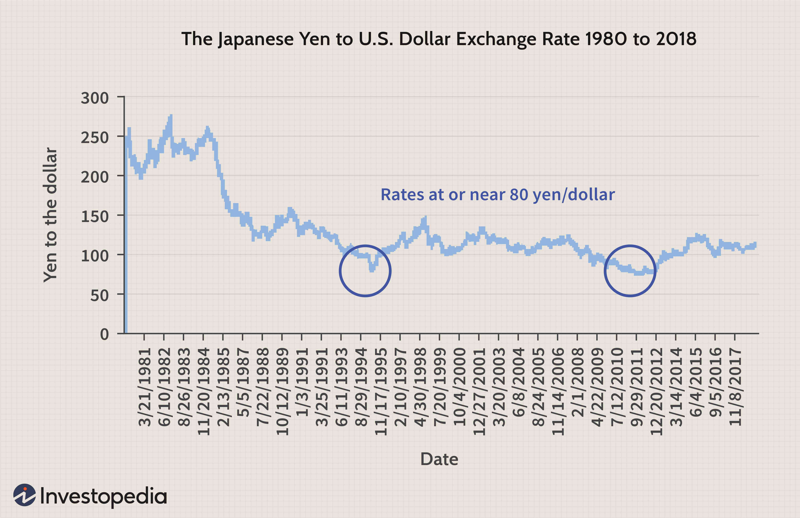

Understanding the unique economic strategies of different countries offers valuable insights into global financial dynamics. Japan, a significant player in the world economy, has employed negative interest rates as a core component of its monetary policy. This approach reflects Japan's efforts to stimulate economic activity and counter persistent deflationary pressures. 

The introduction of negative interest rates marks a significant step in Japan's attempt to revitalize its economy. Unlike conventional interest rate policies, which typically use positive rates to influence economic activity, negative interest rates aim to encourage banks to lend more freely by charging them interest on excess reserves. This, in theory, should spur consumer spending and business investment, thus driving economic growth.



However, implementing negative interest rates is not without challenges. Among the questions it raises are the implications for the profitability of financial institutions and the potential disruptions in the financial markets. Furthermore, as algorithmic trading becomes increasingly prevalent, the interplay between these advanced trading strategies and negative interest rate policies presents another layer of complexity. Analyzing Japan’s approach to negative interest rates offers critical insights not only into the country's monetary policy but also into the broader dynamics of its financial system and global economic relations.

## Table of Contents

## Understanding Negative Interest Rates

Negative interest rates represent a distinctive monetary policy instrument whereby central banks set nominal interest rates below zero. This unconventional measure aims to stimulate economic activity by discouraging the accumulation of funds in savings and promoting spending and investment. The theoretical foundation of negative interest rates is that when returns on deposits are negative, financial institutions are incentivized to lend more freely, businesses are encouraged to invest in growth, and consumers are motivated to spend, all of which contribute to economic expansion.

In traditional scenarios, depositors earn interest on their deposits. However, under a negative interest rate policy, depositors, including commercial banks holding reserves at the central bank, effectively pay to park their funds. This creates a financial environment where saving is less attractive, nudging economic participants toward more active utilization of their capital within the economy.

Japan's decision to introduce negative interest rates in January 2016 was a response to persistent economic stagnation and deflationary pressures. The Bank of Japan (BOJ) aimed to revitalize the economy by increasing inflation rates towards its target and stimulating growth. The negative interest rate adopted by Japan added a distinct layer to its monetary policy framework, complementing existing asset purchase programs and forward guidance initiatives. This was in line with a broader strategy to push inflation upwards and revive a languishing economy that had struggled with economic stagnation since the 1990s.

By adopting a negative [interest rate](/wiki/interest-rate-trading-strategies) policy, Japan was joining other economies, notably within the European context, that had embarked on similar paths to address deflationary challenges and suboptimal economic growth.

The implications of such a policy are complex. In theory, it seeks to disrupt a prolonged period where economic saving outweighs investment, thus injecting dynamism into the economy. By doing so, the policy aims to alleviate deflationary trends that can be detrimental to economic development, hinder wage growth, and create an adverse cycle of economic contraction.

Despite the theoretical motivations underpinning negative interest rates, the practical outcomes can be varied, and the effectiveness of such strategies might depend highly on the existing economic conditions and the interplay with other monetary and fiscal policies. Moreover, the long-term sustainability and potential side effects on financial stability and sectoral health, such as banking sector profitability, remain vital considerations for policymakers.

## Historical Context of Japan's Economy

Japan's economic history is marked by a series of significant transformations, particularly following the burst of its asset price bubble in the early 1990s. This burst precipitated what is commonly referred to as the 'Lost Decade', a period of stagnation characterized by sluggish economic growth and deflation. During the late 1980s, speculative asset price inflation led to artificially high land and stock prices. When the bubble burst, it resulted in a devastating impact on the financial and real estate sectors, with widespread bankruptcies and a sharp decline in consumer wealth.

The Japanese government responded to this economic downturn with a mix of fiscal stimulus and monetary policies aimed at revitalizing the economy. However, these measures often proved to be insufficient in generating sustainable economic growth. The immediate response involved large-scale public spending to mitigate the impacts of the recession. Despite these efforts, the economy struggled with persistent deflationary pressures and an appreciating yen, which adversely affected export competitiveness.

This prolonged economic malaise extended beyond the initial decade, partly due to structural challenges such as an aging population, a declining workforce, and rigid corporate practices. Successive administrations implemented various reforms and initiatives, including banking sector restructuring and deregulation, to encourage economic dynamism. Nonetheless, the lack of significant progress led to an exploration of unconventional monetary tools in subsequent years.

In 2016, the Bank of Japan introduced negative interest rates, marking a significant shift in its monetary policy approach. This move aimed to break away from the cycle of stagnation by encouraging borrowing and spending, rather than saving. By charging interest on reserves held by commercial banks at the central bank, the intention was to spur lending and inject [liquidity](/wiki/liquidity-risk-premium) into the economy. Despite the initial optimism surrounding this policy, its effectiveness in overcoming the deep-seated economic issues remained limited and continues to be the subject of intense debate.

## Impact of Negative Interest Rates on the Japanese Economy

Negative interest rates, implemented by the Bank of Japan (BOJ) since 2016, were aimed at reinvigorating Japan's sluggish economic growth and counteracting deflationary trends. However, the efficacy of these negative rates in stimulating economic expansion and achieving inflation targets has sparked debate among economists and policymakers.

Despite their introduction, Japan has experienced limited success in achieving robust economic growth. The anticipated increase in borrowing and spending by businesses and consumers has not materialized to the extent expected. Consequently, the inflation rate remains below the BOJ's target of 2%, suggesting that negative rates alone may not suffice in addressing underlying economic issues.

The policy's impact on the banking sector has been significant. Negative rates have squeezed the profitability of financial institutions, as traditional models of [earning](/wiki/earning-announcement) through interest rate spreads on loans and deposits have been undermined. Banks are compelled to either absorb the costs associated with holding reserves at the central bank or pass them on to customers, both of which have detrimental effects. Such conditions can impede banks' ability to lend, paradoxically stifling the economic activity the policy was meant to stimulate.

In the government bond market, negative interest rates have introduced challenges. With yields on Japanese Government Bonds (JGBs) falling below zero, the traditional appeal of these securities as safe investment vehicles has diminished. Investors seeking returns are pushed towards riskier assets, potentially destabilizing markets. Additionally, the central bank's extensive buying of JGBs, part of its quantitative easing strategy, has reduced market liquidity and distorted yield curves, complicating future fiscal management.

These unintended consequences highlight the complexity of monetary interventions and signal the potential need for complementary fiscal measures and structural reforms to achieve desired economic outcomes. Japan’s experience with negative interest rates underscores the necessity of a multifaceted approach in navigating macroeconomic challenges.

## Quantitative Easing and Its Role

Quantitative easing (QE) has played a pivotal role in Japan's economic strategy, particularly in conjunction with its negative interest rate policy. This monetary policy instrument involves the large-scale purchase of financial assets by the Bank of Japan (BoJ) to inject liquidity directly into the economy, thus promoting lending and investment. The BoJ's QE program, one of the most extensive globally, was initiated in response to persistent economic stagnation and deflationary pressures.

The mechanics of QE in Japan involve the BoJ purchasing government bonds, corporate bonds, and other securities. By doing so, the central bank aims to lower long-term interest rates beyond what traditional monetary policy might achieve. This influx of liquidity is intended to increase spending by businesses and consumers, thereby spurring economic growth. In theory, as central banks purchase securities, their increased demand raises the prices of these assets, which inversely affects yields, making borrowing cheaper and more attractive.

Despite these efforts, Japan's experience with QE has highlighted several limitations. Primarily, the anticipated revival of economic growth and the achievement of inflation targets have remained elusive. Economic indicators suggest that while QE has succeeded in maintaining lower long-term interest rates, it has not substantially driven economic expansion. Various factors contribute to this outcome:

1. **Demand-Side Limitations**: Japan's aging population and cultural propensity to save rather than spend have curtailed the potential impact of QE-driven lower interest rates on consumer behavior.

2. **Investment Hesitancy**: Despite lower borrowing costs, Japanese businesses have exhibited caution in expanding investments, possibly due to uncertainties in global markets or domestic demographic challenges.

3. **Liquidity Trap Concerns**: Critics argue that Japan's economy is in a liquidity trap, where despite increased money supply, economic activity does not pick up significantly because the interest rates are already near zero, reducing the traditional efficacy of monetary policy.

The practical repercussions of QE have also stressed the financial sector. Banks face compressed profit margins due to the flattening of the yield curve, which diminishes the traditional profit spread between long-term lending rates and short-term borrowing costs.

The limited success of QE in Japan underscores the complexity of relying solely on monetary policy to drive economic change. It suggests that while QE can be a powerful tool for mitigating certain financial crises, its effectiveness is contingent on underlying economic conditions and complementary policy measures. Japan's continued commitment to QE, paired with negative interest rates, represents an ongoing experiment with unconventional monetary policy, offering valuable lessons for other economies confronting similar issues.

## Algorithmic Trading in Japan's Financial Markets

Algorithmic trading has established itself as a pivotal facet of Japan's financial markets, mirroring a global trend where technological advancements redefine trading practices. Initially seen in the early 2000s, [algorithmic trading](/wiki/algorithmic-trading) in Japan has since grown, leveraging high-frequency and complex algorithms to capitalize on market movements. The swift computational capabilities of these systems allow them to process vast amounts of data and execute trades at speeds unattainable by human traders.

Japan's adoption of negative interest rates profoundly influences algorithmic trading strategies. By setting nominal interest rates below zero, the Bank of Japan aims to encourage borrowing and spending. For algorithmic traders, such policy shifts require recalibrating models to accommodate altered economic signals. Lower interest rates typically reduce the cost of holding positions, potentially increasing trading volumes as strategies adjust to exploit cost advantages.

Algorithmic adaptation to monetary policy changes, like interest rate adjustments, can be demonstrated through statistical [arbitrage](/wiki/arbitrage) strategies, which aim to profit from pricing inefficiencies between correlated securities. Python, a popular programming language in quantitative finance, is often used to develop these strategies. An example of a simplistic [statistical arbitrage](/wiki/statistical-arbitrage) model, using the `pandas` and `numpy` libraries, is shown below:

```python
import pandas as pd
import numpy as np

def calculate_spread(series1, series2):
    return series1 - series2

def identify_arbitrage_opportunities(spread):
    mean = spread.mean()
    std = spread.std()
    z_score = (spread - mean) / std
    return z_score

# Example time series data
time_series1 = pd.Series(np.random.randn(1000).cumsum())
time_series2 = pd.Series(np.random.randn(1000).cumsum())

# Calculate spread and z-scores
spread = calculate_spread(time_series1, time_series2)
z_scores = identify_arbitrage_opportunities(spread)

# Determine buy and sell signals
buy_signals = z_scores < -1.0
sell_signals = z_scores > 1.0
```

This script calculates the spread and z-score between two correlated financial time series, determining buy and sell signals based on statistical deviations. While simplistic, such models are foundational to more sophisticated algorithmic strategies used in competitive markets.

The impact of negative interest rates extends beyond strategy optimization to broader market liquidity and [volatility](/wiki/volatility-trading-strategies). As algorithms quickly react to policy shifts, they can amplify market movements, contributing to increased volatility. The liquidity provided by algorithms can be beneficial, ensuring tighter spreads and enhancing market efficiency. However, there are challenges, particularly in terms of increased complexity in risk management and potential systemic risks due to rapid and synchronous trading actions, which can exacerbate market uncertainties.

Thus, the interplay between Japan's unconventional monetary policies and algorithmic trading not only underscores the essential role of technology in modern finance but also reveals the challenges traders face in adapting to and thriving under such economic conditions. As financial markets continue to evolve, the relationship between policy decisions and algorithmic trading is expected to grow even more intricate, demanding continuous innovation and strategic agility from traders and institutions alike.

## Challenges and Criticisms of Japan's Monetary Policy

Japan's reliance on unconventional monetary policy tools, such as negative interest rates and quantitative easing (QE), has been met with substantial criticism. One of the primary concerns is that Japan's focus on monetary policy has potentially overshadowed the pressing need for structural reforms within the economy. Structural reforms, such as labor market adjustments, regulatory changes, and enhancements in productivity, are seen as essential components for achieving long-term economic growth and stability. Critics argue that Japan's monetary policy strategies, while adept at providing short-term liquidity and maintaining low borrowing costs, fail to address these underlying structural issues. This emphasis on short-term monetary interventions has created a reliance that could hinder the development of more sustainable, diversified economic strategies.

Furthermore, the disconnect between the intentions of monetary policy and actual economic outcomes raises questions about the efficacy of negative interest rates and QE in revitalizing Japan's economy. While these tools were intended to stimulate economic activity by encouraging investment and spending, the persistence of low growth and inflation rates suggests that these measures alone might be insufficient. The economic theory behind negative interest rates posits that by penalizing banks for holding excess reserves, they would be more inclined to lend capital, thereby stimulating growth; however, the practicality of this approach is challenged when banks face profitability concerns due to the same policy.

Additionally, there are concerns that prolonged use of such monetary policies can lead to asset bubbles and distortions in financial markets. By keeping interest rates artificially low, investors may be driven to seek higher yields in riskier assets, potentially inflating asset prices and creating vulnerabilities in the financial system. Moreover, the impact of these policies on savings behavior and financial institutions adds to the complexity, as negative rates can erode returns on savings, affecting consumer confidence and spending.

The need for a comprehensive strategy that integrates both monetary and structural reforms becomes evident when analyzing these criticisms. While Japan's continued innovation in monetary policy is noteworthy, the overarching lesson is the importance of a balanced approach. By combining these monetary measures with structural changes aimed at improving productivity, fostering innovation, and enhancing competitiveness, Japan could potentially achieve a more robust and sustainable economic trajectory.

## Future Prospects for Japan's Economy and Monetary Policy

Japan's monetary policy landscape, characterized by sustained negative interest rates and ongoing quantitative easing (QE), suggests a potential need for reevaluation in the face of limited success in achieving robust economic growth. Despite the intentions behind these measures, Japan has not met its inflation targets or stimulated significant economic transformation. This situation calls for consideration of alternative policies or adjustments that might yield more substantial economic benefits. 

One possible shift involves gradually phasing out the negative interest rate policy, thereby reducing stress on the banking sector and restoring conventional means of economic control. The prolonged period of exceptionally low interest rates has burdened banks with narrow profit margins, leading to concerns about financial sector stability. Adjusting interest rates incrementally upward could alleviate such pressures while still promoting growth and investment. 

Additionally, exploring structural reforms in conjunction with monetary adjustments could address the challenges in Japan’s economic landscape. Structural reforms might include labor market enhancements, technological innovations, and regulatory adjustments, fostering an environment conducive to sustainable growth. Implementing these changes could enhance productivity and competitiveness, providing a complementary strategy to monetary policy reforms.

The implications of Japan’s monetary policy adjustments are significant both domestically and globally. Domestically, any shift could redefine consumer and corporate behaviors, impacting investment strategies and savings rates. A change in policy could influence currency valuation, export dynamics, and foreign investment influx, affecting Japan's trade relationships and economic standing in the region.

Globally, Japan’s approach serves as a reference for other economies assessing similar economic challenges. Economists and policymakers worldwide closely observe Japan's policies, offering critical insights into the dynamics and potential efficacy of unconventional monetary strategies. Understanding Japan’s potential policy pivot helps inform global economic discourse, particularly for countries navigating low growth and deflationary pressures.

As Japan evaluates the efficacy of its monetary policies, integrating these economic considerations will be crucial for future strategic planning. Policymakers must balance the short-term needs of economic stimulation with the long-term goals of financial stability and sustainable growth, keeping in mind the intertwined effects on domestic welfare and international economic relations.

## Conclusion

Japan's implementation of negative interest rates stands as a significant case study in the exploration of unconventional monetary policies. By setting nominal target interest rates below zero, the Bank of Japan aimed to break free from an enduring cycle of economic stagnation and deflation, a pattern persistent since the early 1990s following the burst of its asset price bubble. Although designed to encourage consumption and investment over saving, the outcomes of this policy have been mixed.

The primary challenge of this approach lies in its complex and often limited effectiveness. While negative interest rates are intended to motivate banks to lend more aggressively and for consumers and businesses to borrow, spend, and invest, the results have not always aligned with these objectives. Japan's economic growth and inflation targets have remained elusive, suggesting that negative rates alone are insufficient in driving significant economic transformation.

Moreover, the unintended consequences of such a policy have surfaced, particularly regarding the banking sector. Financial institutions have experienced diminished profitability due to squeezed interest margins, raising concerns about the long-term viability of relying solely on monetary policy for economic revitalization. These institutions struggle to maintain profitability without charging customers for deposits, which could further dissuade saving and ironically, spending and investment as well.

Furthermore, negative rates have exerted pressure on the government bond market, complicating the overall economic stability. The interaction of these dynamics illustrates the intricate balancing act required when employing negative interest rates, where potential benefits must be carefully weighed against possible financial sector risks and broader economic repercussions.

Japan's experience underscores a broader lesson for other nations considering similar strategies: monetary policy tools like negative interest rates and quantitative easing are not panaceas. While they offer innovative mechanisms to stimulate economies, they often necessitate complementary fiscal policies and structural reforms to foster sustainable growth. This case highlights the need for a multi-faceted approach that integrates various economic strategies, addressing structural and fundamental issues within economies to achieve comprehensive and resilient economic health.

In contemplating future policy directions, Japan's journey serves as a pivotal reference point, emphasizing the importance of flexibility and the readiness to adapt strategies in response to evolving economic landscapes. This adaptability is crucial not only for Japan but also for any economy maneuvering through the complexities of modern financial challenges.

## References & Further Reading

[1]: Shirai, Sayuri. ["Monetary Policy and the Japanese Financial System."](https://www.bis.org/review/r130924c.pdf) Bank of Japan Review, 2019.

[2]: Eggertsson, Gauti B., Juelsrud, Ragnar E., Summers, Lawrence H., & Wold, Ella Getz. ["Negative Nominal Interest Rates and the Bank Lending Channel."](https://www.nber.org/papers/w25416) National Bureau of Economic Research, 2018.

[3]: Bernanke, Ben S. ["The Courage to Act: A Memoir of a Crisis and Its Aftermath."](https://www.amazon.com/Courage-Act-Memoir-Crisis-Aftermath/dp/0393353990) W. W. Norton & Company, 2015.

[4]: Fujita, Shin-ichi, & Fujiwara, Ippei. ["Japan’s Folly? The Introduction of Negative Interest Rates and the Impact on Inflation Expectations."](https://archive.org/details/final-fantasy-vii-remake-original-soundtrack-special-edit-version-sqex-10768) Economic Policy, 2018.

[5]: Claessens, Stijn, Coleman, Nicholas, & Donnelly, Michael. ["‘Low-for-long’ interest rates and banks’ interest margins and profitability: Cross-country evidence."](https://www.sciencedirect.com/science/article/pii/S1042957317300372) Bank for International Settlements, 2019.