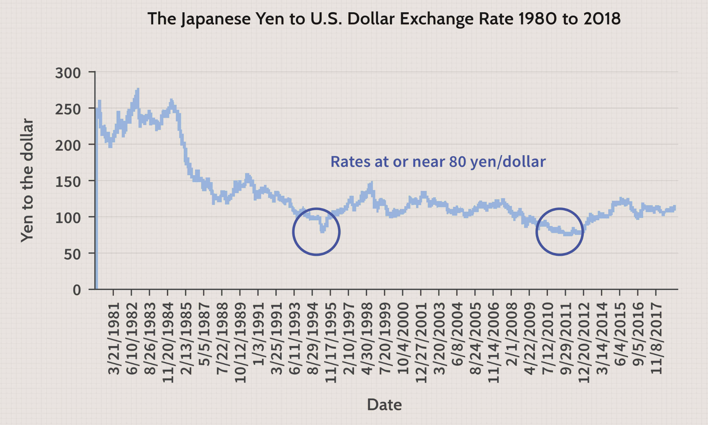

## Table of Contents

## What are negative interest rates?

Negative interest rates are when banks have to pay to keep their money in the central bank, instead of earning interest. This is done to encourage banks to lend more money to businesses and people, which can help the economy grow. When interest rates are negative, it means that money loses value over time if it's just sitting in the bank.

This policy is used by central banks when they want to fight against very low inflation or even deflation, which is when prices go down. By making it costly for banks to hold onto money, central banks hope to push more money into circulation. This can lead to more spending and investment, which might help increase prices and stimulate the economy. However, negative interest rates can also have some downsides, like affecting bank profits and possibly causing people to save less.

## Why did Japan implement negative interest rates?

Japan started using negative interest rates in 2016 because it wanted to help its economy grow. For a long time, Japan had a problem where prices were not going up much, and sometimes they even went down. This is called deflation, and it can make people not want to spend money because they think things will be cheaper later. By making interest rates negative, the Bank of Japan hoped that banks would lend more money to people and businesses. More lending could lead to more spending and investment, which might help prices go up a little and make the economy stronger.

However, using negative interest rates also has some problems. It can make it harder for banks to make money, because they have to pay to keep their money at the central bank. This might make banks less willing to lend, which could slow down the economy instead of helping it. Also, if people know they will lose money by keeping it in the bank, they might choose to keep their money at home instead. This can make it harder for the policy to work as planned. So, while negative interest rates were meant to help Japan's economy, they also brought some challenges.

## How do negative interest rates affect savers in Japan?

Negative interest rates in Japan mean that savers are actually losing a little bit of money if they keep their money in the bank. Normally, when you put money in a savings account, the bank pays you interest, which is like a reward for letting them use your money. But with negative interest rates, instead of getting paid, you have to pay the bank a small fee to keep your money there. This makes people think twice about saving money in the bank because they don't want to lose any of it.

Because of this, some people in Japan might decide to take their money out of the bank and keep it at home or spend it instead of saving. If lots of people do this, it can make it harder for the negative [interest rate](/wiki/interest-rate-trading-strategies) policy to work, because the goal is to get more money moving around in the economy. But if people are scared of losing money, they might not spend it or invest it, which could make the policy less effective.

## What impact do negative interest rates have on Japanese banks?

Negative interest rates make it hard for Japanese banks to make money. Usually, banks earn money by keeping some of it at the central bank and getting interest. But with negative rates, banks have to pay to keep their money there. This means less profit for the banks. If banks are making less money, they might not want to lend as much to people and businesses, which is the opposite of what the central bank wants.

Also, when banks have to pay to keep money at the central bank, they might try to find other ways to make money. They could charge customers fees for keeping money in the bank, but this might make people unhappy and take their money out. Banks could also try to lend more, but if people are worried about the economy, they might not want to borrow. So, negative interest rates can create a tricky situation for Japanese banks, trying to balance making money and helping the economy grow.

## How have negative interest rates influenced consumer spending in Japan?

Negative interest rates in Japan were meant to make people spend more money. The idea was that if people knew they would lose a little money by keeping it in the bank, they might choose to spend it instead. This could help the economy grow because more spending means more business for shops and companies. However, it hasn't worked out exactly as planned. Many people in Japan are still very careful with their money and prefer to save it, even if it means losing a little bit.

One reason people keep saving is because they are worried about the future. Japan's economy has been slow for a long time, and many people want to be ready for any problems that might come up. Also, because of negative interest rates, some people take their money out of the bank and keep it at home. This means less money is moving around in the economy, which can make it harder for the policy to help. So, while negative interest rates were supposed to encourage spending, they haven't changed how most Japanese people use their money very much.

## What are the effects of negative interest rates on the Japanese yen?

Negative interest rates can make the Japanese yen weaker. When interest rates are low or negative, people and businesses might move their money to other countries where they can earn more interest. This means there's less demand for the yen, which can make it worth less compared to other currencies. A weaker yen can help Japanese products be cheaper in other countries, which might help exports and the economy.

However, a weaker yen also has some downsides. If the yen gets too weak, it can make things that Japan needs to import, like oil and food, more expensive. This can make life harder for people in Japan because their money doesn't go as far. So, while negative interest rates might help exports, they can also cause problems by making imports more costly.

## How do negative interest rates impact foreign investment in Japan?

Negative interest rates can make Japan a less attractive place for foreign investors. Usually, people invest in a country because they can earn interest on their money. But with negative rates, they would have to pay to keep their money in Japanese banks. This makes other countries with higher interest rates look better for investing. So, some foreign investors might take their money out of Japan and put it somewhere else where they can earn more.

However, not all foreign investment is about putting money in banks. Some investors look at stocks and bonds, and negative interest rates can make these look more attractive. When interest rates are low, companies can borrow money more cheaply, which can help them grow and make more profits. This might make their stocks and bonds more appealing to investors. So, while negative interest rates might push away some types of foreign investment, they can also draw in other kinds of investors looking for growth opportunities.

## What challenges do negative interest rates pose for Japan's pension system?

Negative interest rates make it harder for Japan's pension system to work well. Pensions are like savings for when people get old, and they usually grow over time with interest. But with negative rates, the money in the pension funds doesn't grow as much, or it might even shrink a little. This means that the pension system has less money to give to people when they retire. It's a big problem because Japan has a lot of older people who need their pensions to live.

To deal with this, the people who run the pension funds might try to invest the money in other ways, like buying stocks or real estate. But these investments can be risky, and if they don't work out, the pension funds could lose even more money. So, negative interest rates push the pension system to take bigger risks just to keep up with the money they need to pay out. This makes it really tough to make sure everyone gets the pension they expect when they retire.

## How effective have negative interest rates been in combating deflation in Japan?

Negative interest rates in Japan were meant to fight deflation, which is when prices keep going down. The idea was that if people had to pay to keep their money in the bank, they would spend it instead. More spending would help prices go up a little, which would be good for the economy. But it hasn't worked out that well. Many people in Japan still prefer to save their money, even if it means losing a little bit. They are worried about the future and want to be ready for any problems that might come up.

So, negative interest rates haven't been very effective in fighting deflation in Japan. People are still careful with their money, and the economy hasn't grown as much as hoped. Also, negative rates have caused other problems, like making it harder for banks and the pension system to work well. Overall, while the policy had good intentions, it hasn't been able to change how most Japanese people use their money or stop prices from going down.

## What are the potential long-term consequences of maintaining negative interest rates in Japan?

Keeping negative interest rates for a long time in Japan could cause some big problems. One problem is that it might make people trust the economy less. If people see that their money loses value in the bank, they might start keeping it at home instead of spending or investing it. This means less money moving around in the economy, which can make it hard for businesses to grow and for the economy to get better. Also, if people keep saving instead of spending, prices might keep going down, which is the opposite of what negative interest rates are supposed to do.

Another problem is that banks and the pension system could struggle a lot. Banks make money from the interest they get from the central bank, but with negative rates, they lose money instead. This can make it hard for banks to lend money to people and businesses, which is important for the economy. The pension system also has a hard time because the money they save for people's retirement doesn't grow as much. They might have to take bigger risks to make up for it, which could lead to even more problems if those risks don't pay off. So, keeping negative interest rates for a long time could make things worse instead of better for Japan's economy.

## How do negative interest rates affect Japan's monetary policy transmission mechanism?

Negative interest rates change how Japan's central bank tries to help the economy. Usually, when the central bank wants to help the economy grow, it makes interest rates lower so that people and businesses borrow more money. But with negative rates, the central bank is trying to push banks to lend even more by making them pay to keep money at the bank. This is supposed to make more money move around in the economy, but it doesn't always work that way. Banks might not want to lend as much because they're losing money, and people might not want to borrow if they're worried about the economy.

This can make it harder for the central bank's policies to work. If banks are careful about lending and people are careful about spending, the money doesn't move around as much as the central bank wants. This means that the central bank's efforts to help the economy might not be as effective. Also, if people start keeping their money at home instead of in the bank, it can make it even harder for the central bank to control how much money is in the economy. So, negative interest rates can make it tricky for the central bank to do its job of helping the economy grow.

## What alternative economic strategies could Japan consider instead of negative interest rates?

Japan could try using something called "quantitative easing" instead of negative interest rates. This means the central bank would buy a lot of bonds and other things to put more money into the economy. The idea is that more money would help prices go up a little and make people spend more. It's different from negative interest rates because it doesn't make people pay to keep their money in the bank. But it can still have problems, like making the value of the yen go down too much, which can make things Japan needs to buy from other countries more expensive.

Another thing Japan could do is focus on making its economy grow in other ways, like helping businesses start up and grow. The government could give money or other help to new companies, especially ones that use new ideas and technology. This could create more jobs and make the economy stronger. It's a different approach because it doesn't just try to change how people use their money, but it tries to make the economy bigger by supporting businesses. This way, Japan could try to grow its economy without using negative interest rates.

## References & Further Reading

[1]: Shirai, Sayuri. ["Monetary Policy and the Japanese Financial System."](https://www.bis.org/review/r130924c.pdf) Bank of Japan Review, 2019.

[2]: Eggertsson, Gauti B., Juelsrud, Ragnar E., Summers, Lawrence H., & Wold, Ella Getz. ["Negative Nominal Interest Rates and the Bank Lending Channel."](https://www.nber.org/papers/w25416) National Bureau of Economic Research, 2018.

[3]: Bernanke, Ben S. ["The Courage to Act: A Memoir of a Crisis and Its Aftermath."](https://www.amazon.com/Courage-Act-Memoir-Crisis-Aftermath/dp/0393353990) W. W. Norton & Company, 2015.

[4]: Fujita, Shin-ichi, & Fujiwara, Ippei. ["Japan’s Folly? The Introduction of Negative Interest Rates and the Impact on Inflation Expectations."](https://archive.org/details/final-fantasy-vii-remake-original-soundtrack-special-edit-version-sqex-10768) Economic Policy, 2018.

[5]: Claessens, Stijn, Coleman, Nicholas, & Donnelly, Michael. ["‘Low-for-long’ interest rates and banks’ interest margins and profitability: Cross-country evidence."](https://www.sciencedirect.com/science/article/pii/S1042957317300372) Bank for International Settlements, 2019.