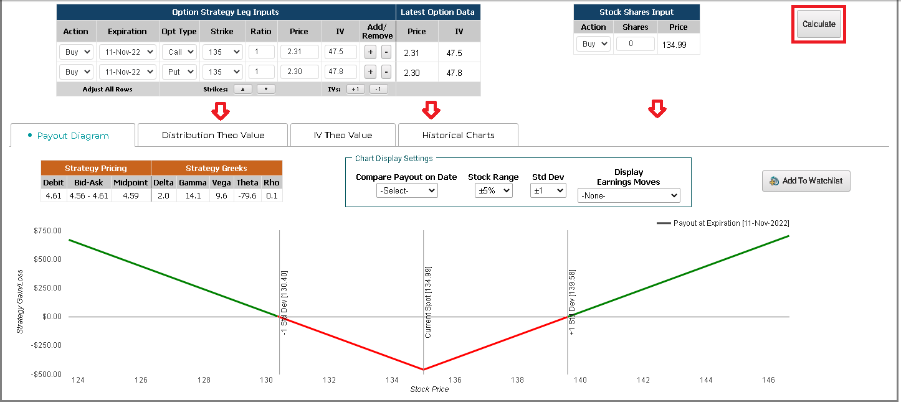

## Table of Contents

## What is a Chameleon Option?

A Chameleon Option is a type of financial option that can change its characteristics based on certain conditions. This means that the option can switch from one type to another, like from a call option to a put option, or change its strike price or expiration date. This flexibility makes it useful for investors who want to adjust their investment strategies as market conditions change.

These options are not very common and can be complex to understand and use. They are usually used by experienced investors who know how to handle the risks involved. Because they can change, they can be more valuable than regular options, but they also come with more uncertainty and potential for loss.

## How does a Chameleon Option differ from other types of options?

A Chameleon Option is different from other options because it can change its features. Regular options, like call or put options, have fixed terms. They have a set strike price and expiration date that don't change. But a Chameleon Option can switch from a call to a put, or change its strike price or expiration date based on certain conditions. This makes it more flexible but also more complicated.

Because Chameleon Options can change, they can be more valuable than regular options. If the market changes in a way that makes the original option less useful, a Chameleon Option can adapt to become more useful. However, this flexibility also adds more risk and uncertainty. It's harder to predict how valuable a Chameleon Option will be because its features can change. This is why they are usually used by experienced investors who understand the risks.

## What are the key features of a Chameleon Option?

A Chameleon Option is special because it can change its features. Unlike regular options, which stay the same once you buy them, a Chameleon Option can switch from a call option to a put option, or change its strike price or expiration date. This makes it very flexible. If the market changes, a Chameleon Option can adapt to be more useful.

This flexibility can make a Chameleon Option more valuable than a regular option. If the market goes in a different direction than expected, the option can change to fit the new situation. However, this also makes it more complicated and risky. It's hard to predict exactly how valuable a Chameleon Option will be because its features can change. That's why they are usually used by experienced investors who understand the risks involved.

## Who can benefit from using Chameleon Options?

Chameleon Options can be really useful for experienced investors who know a lot about the market. These investors can use the option's ability to change to their advantage. If the market goes up or down unexpectedly, they can switch the option to fit the new situation. This means they can keep making money or reduce their losses even when the market changes a lot.

However, Chameleon Options are not for everyone. They are very complicated and risky. People who are new to investing or don't understand these options well should not use them. It's important to know what you're doing because the option's value can change a lot, and you could lose money if you're not careful.

## What are the risks associated with Chameleon Options?

Chameleon Options can be risky because they can change. If you buy one, it might switch from a call option to a put option, or its strike price or expiration date might change. This means you could end up with an option that's not what you wanted. If the market moves in a way you didn't expect, the option might change in a way that makes it less valuable or even worthless.

Another risk is that Chameleon Options are hard to understand. They are very complicated, and if you don't know what you're doing, you could make big mistakes. Even if you think you understand them, the option might change in a way that surprises you. This uncertainty can lead to big losses if you're not careful. That's why only experienced investors who understand the risks should use them.

## How are Chameleon Options priced?

Chameleon Options are priced differently from regular options because they can change. Their price depends on many things, like how likely it is that the option will change, and what it might change into. If there's a good chance the option will become more valuable after it changes, it will cost more. But if it's likely to become less valuable, it will cost less. The price also depends on the usual things that affect option prices, like the price of the underlying asset, how much the price moves around, and how long until the option expires.

Because Chameleon Options can change, it's hard to predict exactly what they will be worth. This makes them riskier and can make their price go up and down a lot. People who price these options have to think about all the different ways the option might change and how that would affect its value. This makes pricing Chameleon Options a complicated job that needs a lot of math and understanding of the market.

## What strategies can be used with Chameleon Options?

Experienced investors can use Chameleon Options to make money even when the market changes a lot. If they think the market might go up or down, they can buy a Chameleon Option that can switch from a call to a put or change its strike price. This way, if the market moves in a way they didn't expect, the option can change to fit the new situation. This flexibility can help them make more money or lose less money than they would with a regular option.

However, using Chameleon Options is risky and complicated. Investors need to understand how these options work and what might make them change. They should have a plan for what to do if the option switches from a call to a put or if its strike price changes. This means they need to keep a close eye on the market and be ready to act quickly. Only investors who know a lot about options and the market should use Chameleon Options because they can be hard to predict and manage.

## Can you explain the mechanics of how a Chameleon Option converts?

A Chameleon Option can change its features based on certain conditions in the market. For example, it might start as a call option, which gives you the right to buy a stock at a certain price. But if the stock price goes down a lot, the Chameleon Option can switch to a put option, which gives you the right to sell the stock at that price instead. This change happens automatically when the conditions set in the option's contract are met, like if the stock price reaches a certain level or if a certain amount of time passes.

The option can also change its strike price or its expiration date. If the stock price moves a lot, the strike price might change to a new level that makes the option more useful. Or if the market is very uncertain, the expiration date might be pushed back to give the investor more time to use the option. These changes are all written into the option's contract, so everyone knows what can happen. But because the option can change, it's hard to predict exactly what it will be worth, which makes it riskier to use.

## What are some real-world examples of Chameleon Options?

Imagine a farmer who grows wheat. He buys a Chameleon Option to protect against falling wheat prices. The option starts as a put option, giving him the right to sell his wheat at a set price. But if wheat prices suddenly go up, the option can change into a call option, letting him buy more wheat at a lower price to sell at the higher market price. This way, the farmer can make money whether wheat prices go up or down.

Another example is a tech company that's about to launch a new product. They buy a Chameleon Option to hedge against stock price changes. The option begins as a call option, allowing them to buy their stock at a set price if it goes up. But if the product launch fails and the stock price drops, the option can switch to a put option, letting them sell their stock at the set price to minimize losses. This flexibility helps the company manage risk better in an uncertain market.

## How do regulatory environments affect Chameleon Options?

Regulatory environments can have a big impact on Chameleon Options. Different countries have different rules about what kinds of options can be traded and who can trade them. In some places, Chameleon Options might be allowed and easy to use, while in other places, they might be banned or have strict rules. This means that investors need to know the rules in their country before they can use these options. If the rules change, it could make Chameleon Options more or less popular, or even stop them from being used at all.

Regulators worry about Chameleon Options because they are complicated and risky. They want to make sure that only people who understand the risks can use them. This might mean that investors have to pass tests or meet certain requirements before they can trade Chameleon Options. Regulators might also keep a close eye on how these options are used to make sure no one is cheating or doing anything wrong. All of these rules can affect how easy it is to use Chameleon Options and how valuable they are.

## What advanced mathematical models are used to value Chameleon Options?

Valuing Chameleon Options is tricky because they can change. To figure out what they're worth, people use advanced math models like the binomial model or the Monte Carlo simulation. The binomial model breaks down the option's life into small steps and figures out what could happen at each step. It looks at how the option might change and what that would do to its value. The Monte Carlo simulation, on the other hand, runs lots of different scenarios to see what might happen to the option's value. It uses random numbers to guess how the market might move and then figures out what the option would be worth in each case.

These models need to think about all the different ways the Chameleon Option could change. They have to guess how likely it is that the option will switch from a call to a put, or that its strike price or expiration date will change. This means the models need a lot of information about the market and the option's rules. Because Chameleon Options are so complicated, the models that value them are also complicated. They need to be very careful and use a lot of math to make good guesses about what the option will be worth.

## How can Chameleon Options be integrated into a broader investment portfolio?

Chameleon Options can be a useful tool for experienced investors who want to add flexibility to their investment portfolio. Because these options can change from a call to a put or adjust their strike price or expiration date, they can help investors adapt to sudden market changes. For example, if an investor expects the market to go up but it suddenly goes down, a Chameleon Option can switch to a put option, allowing the investor to still make money or minimize losses. This ability to adapt can be a big advantage in a portfolio, especially in times of high market uncertainty.

However, because Chameleon Options are complex and risky, they should only be a small part of a broader investment strategy. Investors need to understand the conditions that could trigger a change in the option and be prepared to act quickly if that happens. It's important to balance the potential benefits of Chameleon Options with other, more stable investments like stocks, bonds, or regular options. By using Chameleon Options carefully and alongside other investments, investors can manage risk while still taking advantage of the options' flexibility.

## References & Further Reading

[1]: Bergstra, J., Bardenet, R., Bengio, Y., & Kégl, B. (2011). ["Algorithms for Hyper-Parameter Optimization."](https://papers.nips.cc/paper/4443-algorithms-for-hyper-parameter-optimization) Advances in Neural Information Processing Systems 24.

[2]: ["Advances in Financial Machine Learning"](https://www.amazon.com/Advances-Financial-Machine-Learning-Marcos/dp/1119482089) by Marcos Lopez de Prado

[3]: ["Evidence-Based Technical Analysis: Applying the Scientific Method and Statistical Inference to Trading Signals"](https://www.amazon.com/Evidence-Based-Technical-Analysis-Scientific-Statistical/dp/0470008741) by David Aronson

[4]: ["Machine Learning for Algorithmic Trading"](https://github.com/stefan-jansen/machine-learning-for-trading) by Stefan Jansen

[5]: ["Quantitative Trading: How to Build Your Own Algorithmic Trading Business"](https://github.com/LucindaYa/quant-resources/blob/master/Quantitative%20Trading%20How%20to%20Build%20Your%20Own%20Algorithmic%20Trading%20Business.pdf) by Ernest P. Chan