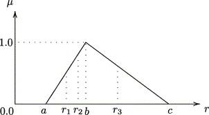

## Table of Contents

## What is a portfolio in the context of finance?

In finance, a portfolio is a collection of different investments that someone owns. These investments can include things like stocks, bonds, mutual funds, and other financial assets. People build portfolios to reach their financial goals, like saving for retirement or buying a house. By spreading their money across various investments, they hope to grow their wealth over time and manage risk.

A good portfolio is usually diverse. This means it includes a mix of different types of investments. If one investment does poorly, others might do well and balance it out. For example, if the stock market goes down, bonds might still be stable. This way, the overall value of the portfolio doesn't depend too much on the performance of just one investment. People often work with financial advisors to create and manage their portfolios to make sure they align with their goals and risk tolerance.

## What does 'portfolio selection' mean?

Portfolio selection is the process of choosing which investments to include in a portfolio. It's like picking the ingredients for a recipe. The goal is to create a mix of investments that will help reach financial goals while managing risk. People consider things like how much risk they're willing to take, how long they plan to invest, and what they want to achieve with their money.

When selecting a portfolio, people often use a theory called Modern Portfolio Theory (MPT). This theory says that it's not just about picking the best individual investments, but about how they work together. By choosing investments that don't all move in the same way, people can reduce risk without giving up too much potential reward. For example, if stocks go down, bonds might stay steady or even go up, helping to balance out the portfolio's performance.

## What is a chance constraint in optimization?

A chance constraint in optimization is a rule that says a certain condition should be met most of the time, but not necessarily all the time. Imagine you're planning a trip and you want to make sure you have enough gas in your car. A chance constraint might say that you should have enough gas to reach your destination at least 95% of the time. This means that it's okay if you run out of gas once in a while, as long as it's rare.

In more technical terms, chance constraints are used in situations where there are uncertainties, like in financial planning or engineering. For example, when managing a portfolio, you might set a chance constraint to limit the risk of losing money. You might say that you want the portfolio's value to stay above a certain level at least 90% of the time. This helps you balance the need to take risks for potential gains with the need to protect against big losses.

## How does chance-constrained portfolio selection differ from traditional portfolio optimization?

Chance-constrained portfolio selection is different from traditional portfolio optimization because it deals with uncertainty in a special way. In traditional portfolio optimization, like Modern Portfolio Theory, the goal is to find the best mix of investments that gives you the highest return for a certain level of risk. You use things like average returns and how much investments move together to make your choices. But in real life, things don't always go as planned, and returns can be unpredictable.

That's where chance-constrained portfolio selection comes in. It adds a new rule that says your portfolio should meet certain goals most of the time, but not necessarily all the time. For example, you might want your portfolio to stay above a certain value at least 90% of the time. This approach helps you plan for the ups and downs of the market, making sure your investments are safe enough even when things get uncertain. By using chance constraints, you can manage risk better and feel more confident about your financial future.

## What are the key components of a chance-constrained portfolio selection model?

A chance-constrained portfolio selection model has a few important parts that help you make smart investment choices. The first part is the objective function, which is like your main goal. You might want to make as much money as possible or keep your risk low. This function helps you figure out the best way to reach your goal. Another key part is the chance constraints. These are rules that say your portfolio should do well most of the time, even if things get unpredictable. For example, you might want your investments to stay above a certain value 90% of the time. This helps you manage risk and feel more secure about your future.

The next part is the uncertainty in the returns of your investments. In real life, it's hard to predict exactly how much money you'll make or lose. Chance-constrained models use things like probabilities and statistics to guess how likely different outcomes are. This helps you plan for the ups and downs of the market. Finally, there are the decision variables, which are the choices you make about how much to invest in each asset. By adjusting these, you can find the best mix of investments that meet your goals and follow the chance constraints. Together, these parts make up a powerful tool for building a strong and safe investment portfolio.

## Can you explain the role of probability in chance-constrained portfolio selection?

Probability plays a big role in chance-constrained portfolio selection. It helps you understand how likely it is that your investments will do what you want them to do. For example, you might want your portfolio to stay above a certain value most of the time. Probability helps you figure out how often that will happen. By using numbers and math, you can guess the chances of different outcomes, like making money or losing money. This way, you can plan for the ups and downs of the market and make smarter choices about where to put your money.

Using probability in chance-constrained portfolio selection also helps you manage risk better. Instead of just hoping for the best, you can set rules that say your portfolio should meet certain goals a certain percentage of the time. This makes your investment plan more realistic and safer. For instance, if you know there's a 90% chance your portfolio will stay above a certain value, you can feel more confident about your financial future. By considering the likelihood of different scenarios, you can build a portfolio that balances the potential for gains with the need to protect against big losses.

## What are the common risk measures used in chance-constrained portfolio selection?

In chance-constrained portfolio selection, people use different ways to measure risk to make sure their investments are safe. One common way is called Value at Risk (VaR). VaR tells you the most money you could lose over a certain time, like a day or a month, with a certain chance, like 5%. It's like saying, "There's a 5% chance I'll lose more than this amount of money." This helps you understand the worst-case scenario and plan for it.

Another measure is Conditional Value at Risk (CVaR), also known as Expected Shortfall. CVaR goes a step further than VaR. It tells you the average loss you might face if things go really bad, beyond the VaR level. So if VaR says you might lose up to $100 with a 5% chance, CVaR would tell you how much you might lose on average if you do lose more than $100. This gives you a better idea of what could happen in the worst cases and helps you make safer investment choices.

Both VaR and CVaR help you manage risk in chance-constrained portfolio selection. They let you set rules that say your portfolio should stay above a certain value most of the time. By using these risk measures, you can balance the chance of making money with the need to protect against big losses, making your investment plan more realistic and secure.

## How do you formulate a chance-constrained optimization problem for portfolio selection?

To set up a chance-constrained optimization problem for picking investments, you start by deciding what you want your portfolio to do. This is called the objective function. You might want to make as much money as possible or keep your risk low. Then, you add rules called chance constraints. These rules say that your portfolio should meet certain goals most of the time, even if things get unpredictable. For example, you might want your investments to stay above a certain value 90% of the time. This helps you manage risk and feel more secure about your future.

Next, you need to think about the uncertainty in how much money you'll make or lose from your investments. You use probability and statistics to guess how likely different outcomes are. This helps you plan for the ups and downs of the market. You also decide how much to invest in each asset, which are called decision variables. By adjusting these, you can find the best mix of investments that meet your goals and follow the chance constraints. Together, these parts help you build a strong and safe investment portfolio.

## What are the computational challenges associated with solving chance-constrained portfolio selection problems?

Solving chance-constrained portfolio selection problems can be tricky because they involve a lot of math and uncertainty. One big challenge is that these problems often need a lot of computer power to solve. The calculations can be very complex, especially when you're trying to figure out the chances of different outcomes for many investments at the same time. This means you might need special software and strong computers to handle all the data and do the math quickly.

Another challenge is that the answers to these problems can be hard to find because of the way chance constraints work. Unlike regular math problems where you can find exact solutions, chance-constrained problems often give you answers that are close but not perfect. This is because you're dealing with probabilities, and it's hard to be 100% sure about what will happen in the future. So, you have to use methods that find good enough answers, which can take a lot of time and effort to get right.

## How can scenario analysis be integrated into chance-constrained portfolio selection?

Scenario analysis can be a great help in chance-constrained portfolio selection by letting you look at different possible futures for your investments. Imagine you're trying to guess how your portfolio might do if the stock market goes up, stays the same, or goes down. By creating these scenarios, you can see how your investments might perform under different conditions. This helps you set up chance constraints that make sure your portfolio stays safe no matter what happens. For example, you might want your investments to stay above a certain value 90% of the time, even if the market crashes.

To use scenario analysis, you start by making a list of different situations that could happen, like a big economic boom or a sudden drop in the market. Then, you use these scenarios to test your portfolio and see how it holds up. By doing this, you can adjust your investments to make sure they meet your goals most of the time. This way, you're not just hoping for the best; you're planning for different possibilities and making smarter choices about where to put your money. Scenario analysis helps you feel more confident about your financial future by showing you how well your portfolio can handle uncertainty.

## What are some advanced techniques for handling non-linear chance constraints in portfolio selection?

Handling non-linear chance constraints in portfolio selection can be tough because they don't follow a straight line. One way to deal with this is by using something called the Monte Carlo simulation. This method involves running a computer program many times to guess how your investments might do in different situations. Each time the program runs, it uses random numbers to create a possible future for your portfolio. By doing this over and over, you can see how likely it is that your investments will stay above a certain value most of the time. This helps you set up chance constraints that are more realistic and take into account the ups and downs of the market.

Another advanced technique is using something called stochastic programming. This method looks at how uncertainty affects your investments and helps you make choices that work well no matter what happens. Stochastic programming can handle non-linear chance constraints by breaking them down into smaller, more manageable pieces. It uses math to find the best way to balance making money with keeping your investments safe. By using this technique, you can create a portfolio that's strong and can handle the twists and turns of the financial world.

## How does chance-constrained portfolio selection adapt to different market conditions and investor preferences?

Chance-constrained portfolio selection is really good at adapting to different market conditions and what investors want. When the market goes up and down, this method helps by setting rules that say your investments should do well most of the time. For example, if the market is very risky, you might set a rule that your portfolio should stay above a certain value 95% of the time. This way, even if the market crashes, your investments have a good chance of staying safe. By using probability and scenario analysis, you can see how your portfolio might do in different situations and make changes to fit the current market.

This approach also works well with different investor preferences. Some people might want to make as much money as possible, while others might want to keep their risk low. Chance-constrained portfolio selection lets you set goals that match what you want. If you're okay with taking more risk for a chance at bigger gains, you can set your chance constraints to allow for more ups and downs. But if you want to be safer, you can set tighter rules to make sure your investments stay stable. By adjusting these rules, you can create a portfolio that feels right for you and helps you reach your financial goals no matter what the market does.

## What is Understanding Chance-Constrained Portfolio Selection?

Chance-constrained portfolio selection represents a sophisticated approach to investment strategy, allowing for more precise management of risk through the use of probabilistic constraints. Unlike conventional models that predominantly use fixed and deterministic inputs, this method enables investors and traders to specify risk levels in probabilistic terms, ultimately allowing for a more nuanced approach to risk management.

The conceptual foundation of chance-constrained programming was laid by Abraham Charnes and William W. Cooper. Their introduction of this methodology revolutionized how potential financial losses are managed by evaluating the probability of returns falling below certain thresholds. This approach contrasts with traditional models by focusing on limiting the probability of undesirable financial outcomes and controlling risk exposure.

The core principle of this strategy is to optimize expected returns while ensuring that the risk of negative outcomes remains within an acceptable range. This feature makes it particularly beneficial for risk-averse investors who prioritize maintaining capital preservation alongside achieving returns. The chance-constrained approach allows these investors to explicitly define and manage acceptable risk thresholds under various market conditions, ensuring that the risk-reward balance aligns with their investment goals.

The implementation of chance-constrained portfolio selection involves the careful formulation of constraints that articulate the acceptability of risk levels. For example, these constraints can be mathematically represented as:

$$
\text{Pr}(R_p \leq \beta) \leq \alpha
$$

where $R_p$ is the portfolio return, $\beta$ is the specified return threshold, and $\alpha$ is the maximum acceptable probability of the return falling below $\beta$. This inequality expresses the idea that the probability of the portfolio's return dropping below a predefined level should not exceed a particular confidence interval, usually set by the investor.

Furthermore, the development and refinement of numerical methods and optimization algorithms are crucial for solving these chance-constrained models. The complexity of these models often necessitates advanced computational techniques to achieve precise and feasible solutions.

In summary, by integrating probabilistic assessments into the investment process, chance-constrained portfolio selection provides a robust and adaptive framework for navigating the uncertainties inherent in financial markets. This methodology empowers investors to manage their risk exposure effectively while pursuing optimal returns.

## What is the Mathematical Formulation and what are the Constraints?

The mathematical formulation of chance-constrained portfolio selection primarily involves creating an objective function intended to maximize expected returns or utility while adhering to probabilistic constraints. This approach is distinct from traditional deterministic models because it controls for the likelihood of undesirable financial outcomes through probability measures embedded within constraints.

To formalize this, consider a portfolio consisting of $n$ assets, where $\mathbf{w}$ represents the vector of asset weights. The expected return $\mathbb{E}[\mathbf{w}^T \mathbf{r}]$, where $\mathbf{r}$ is the vector of returns, is typically maximized subject to certain constraints. The constraints are expressed as inequalities incorporating probability measures, ensuring that the probability of returns falling below a defined threshold does not exceed a specific level. Mathematically, this can be represented as follows:

$$

\text{maximize } \mathbb{E}[\mathbf{w}^T \mathbf{r}] 
$$

subject to:

$$

\Pr(\mathbf{w}^T \mathbf{r} < R_{\text{min}}) \leq \alpha 
$$

where $R_{\text{min}}$ is the minimum acceptable return, and $\alpha$ represents the maximum allowable probability of not meeting this return.

The formulation inherently involves stochastic elements and requires embedding the probability distributions of returns into the optimization problem. Solving such problems involves sophisticated optimization techniques. Numerical methods, such as Monte Carlo simulations or scenario generation, are often employed to estimate these probabilities and solve the constraints effectively.

One of the core challenges in this formulation is the complexity of calculation and computation required to solve the constrained optimization problem. Often, these models necessitate iterative methods and advanced algorithms such as convex optimization or robust optimization techniques to derive optimal portfolio weights. These methods ensure constraints remain satisfied while maximizing the objective function, ultimately balancing the trade-off between risk and return in uncertain market environments. 

Coding implementations can assist in solving chance-constrained problems. Python, for example, offers libraries such as NumPy for numerical calculations and SciPy for optimization, allowing practitioners to model and solve chance-constrained portfolio selection problems efficiently. These tools enable practical and accurate estimation of the constraints and expected outcomes in portfolios, thereby enhancing decision-making processes in finance.

## References & Further Reading

[1]: Charnes, A., & Cooper, W. W. (1959). ["Chance-Constrained Programming."](https://pubsonline.informs.org/doi/10.1287/mnsc.6.1.73) Management Science, 6(1), 73-79.

[2]: Li, D., Sun, X., & Li, S. (2020). ["Chance-Constrained Programming: A Revised Survey."](https://pubs.rsc.org/en/content/articlelanding/2020/cs/c9cs00635d) Annals of Operations Research, 292(1), 591-617.

[3]: Ben-Tal, A., El Ghaoui, L., & Nemirovski, A. (2009). ["Robust Optimization."](https://www.researchgate.net/publication/258222788_Robust_Optimization) Princeton University Press.

[4]: Pagnoncelli, B., Ahmed, S., & Shapiro, A. (2009). ["Sample Average Approximation Method for Chance Constrained Programming: Theory and Applications."](https://link.springer.com/article/10.1007/s10957-009-9523-6) Journal of Optimization Theory and Applications, 142, 399-416.

[5]: Pflug, G. C., & Pichler, A. (2014). ["Multistage Stochastic Optimization."](https://link.springer.com/book/10.1007/978-3-319-08843-3) Springer Series in Operations Research and Financial Engineering.

[6]: Luenberger, D. G., & Ye, Y. (2016). ["Linear and Nonlinear Programming."](https://archive.org/details/springer_10.1007-978-3-319-18842-3) Springer.