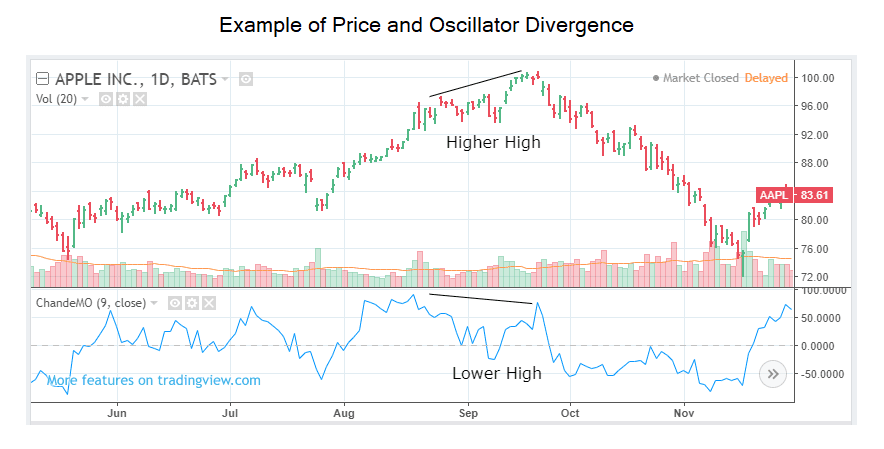

## Table of Contents

## What is the Chande Momentum Oscillator (CMO)?

The Chande Momentum Oscillator (CMO) is a technical analysis tool used by traders to measure the momentum of a stock or other financial instrument. It was developed by Tushar Chande and helps traders understand whether a stock is overbought or oversold. The CMO calculates the difference between the sum of all recent gains and the sum of all recent losses over a specific period, usually 20 days. The result is then divided by the sum of all price changes over the same period, and the final value is scaled to fall between -100 and +100.

Using the CMO, traders can identify potential buy and sell signals. When the CMO value moves above +50, it suggests that the stock might be overbought, meaning it could be a good time to sell. On the other hand, when the CMO value drops below -50, it indicates that the stock might be oversold, suggesting a potential buying opportunity. Traders often use the CMO in combination with other indicators to make more informed trading decisions, as relying on a single indicator can sometimes lead to false signals.

## Who developed the Chande Momentum Oscillator and when?

Tushar Chande developed the Chande Momentum Oscillator. He is a well-known technical analyst and author who has contributed many tools and indicators to the field of trading.

The Chande Momentum Oscillator was introduced in the 1990s. It is a popular tool among traders because it helps them understand the momentum of a stock or other financial instrument in a simple way.

## How is the CMO calculated?

The Chande Momentum Oscillator, or CMO, is calculated over a set period, usually 20 days. To find the CMO, first, you need to look at the price changes for each day in that period. You separate these changes into gains and losses. A gain is when the price goes up from one day to the next, and a loss is when the price goes down.

Next, you add up all the gains and all the losses separately. Then, you find the difference between the total gains and the total losses. You take this difference and divide it by the sum of all the price changes (both gains and losses) over the same period. Finally, you multiply the result by 100 to get a number between -100 and +100. This final number is the CMO value.

So, the CMO formula is: CMO = ((Sum of Gains - Sum of Losses) / (Sum of Gains + Sum of Losses)) * 100. This calculation helps traders see if a stock is moving strongly up or down, making it easier to decide when to buy or sell.

## What is the typical time period used for the CMO?

The typical time period used for the Chande Momentum Oscillator (CMO) is 20 days. This means that when you calculate the CMO, you look at the price changes over the last 20 days to see if the stock is moving up or down strongly.

Using a 20-day period helps traders see the momentum of a stock over a reasonable amount of time. If you use a shorter period, the CMO might change too quickly and be hard to use. If you use a longer period, it might not show changes in the stock's momentum fast enough. So, 20 days is a good balance for most traders.

## How does the CMO differ from other momentum indicators like the RSI?

The Chande Momentum Oscillator (CMO) and the Relative Strength Index (RSI) are both used to measure the momentum of a stock, but they calculate it in slightly different ways. The CMO uses the difference between the sum of all gains and the sum of all losses over a period, usually 20 days, and scales the result to be between -100 and +100. On the other hand, the RSI looks at the average gain and average loss over a period, usually 14 days, and scales the result to be between 0 and 100. This means the CMO can show negative values, which the RSI cannot, giving traders a different perspective on the stock's momentum.

Another difference is how they interpret overbought and oversold conditions. For the CMO, a value above +50 suggests the stock might be overbought, and a value below -50 suggests it might be oversold. For the RSI, a value above 70 is often seen as overbought, and a value below 30 is seen as oversold. These different thresholds can lead to different trading signals. Traders might use the CMO when they want to see if a stock's momentum is strongly positive or negative, while they might use the RSI when they want to see if a stock is in a more extreme overbought or oversold state.

## What does a high CMO value indicate?

A high CMO value, which means a number close to +100, shows that a stock has been going up a lot recently. It means the price has been increasing more than it has been decreasing over the time period you're looking at, usually 20 days. When the CMO gets above +50, it tells traders that the stock might be overbought. This means the price has gone up a lot, and it might be time to think about selling the stock because it could go down soon.

Traders use this high CMO value as a signal to be careful. If everyone is buying the stock and pushing its price up, it might be too high and due for a drop. So, a high CMO value helps traders decide when it might be a good time to take their profits and sell before the price goes down. It's like a warning sign that the stock's upward momentum might be getting too strong and could soon change direction.

## What does a low CMO value indicate?

A low CMO value, which means a number close to -100, shows that a stock has been going down a lot recently. It means the price has been decreasing more than it has been increasing over the time period you're looking at, usually 20 days. When the CMO drops below -50, it tells traders that the stock might be oversold. This means the price has gone down a lot, and it might be time to think about buying the stock because it could go up soon.

Traders use this low CMO value as a signal to look for buying opportunities. If everyone is selling the stock and pushing its price down, it might be too low and due for a rise. So, a low CMO value helps traders decide when it might be a good time to buy before the price goes up. It's like a sign that the stock's downward momentum might be getting too strong and could soon change direction.

## How can traders use the CMO to identify overbought and oversold conditions?

Traders use the Chande Momentum Oscillator (CMO) to figure out if a stock is overbought or oversold. When the CMO value goes above +50, it means the stock might be overbought. This happens when the stock's price has been going up a lot and might be too high. Traders see this as a warning that the price could soon go down, so it might be a good time to sell the stock and take their profits.

On the other hand, when the CMO value drops below -50, it means the stock might be oversold. This happens when the stock's price has been going down a lot and might be too low. Traders see this as a sign that the price could soon go up, so it might be a good time to buy the stock before it starts to rise again. By watching the CMO, traders can make better decisions about when to buy or sell based on the stock's momentum.

## Can the CMO be used to generate buy and sell signals? If so, how?

Yes, the CMO can be used to generate buy and sell signals. When the CMO value goes above +50, it suggests that the stock might be overbought. This means the stock's price has been going up a lot and might be too high. Traders see this as a signal to sell the stock because they think the price could soon start to go down. So, they take their profits before the price drops.

On the other hand, when the CMO value drops below -50, it suggests that the stock might be oversold. This means the stock's price has been going down a lot and might be too low. Traders see this as a signal to buy the stock because they think the price could soon start to go up. They buy the stock at a low price hoping to sell it later at a higher price. By watching the CMO, traders can make decisions about when to buy or sell based on the stock's momentum.

## What are the limitations of using the CMO in trading?

Using the CMO in trading has some limits that traders should know about. One big problem is that the CMO can give false signals. This means it might tell you to buy or sell a stock, but then the price doesn't do what you expected. This can happen because the CMO is based on past price changes, and the future might not follow the same pattern. Also, the CMO might not work well in markets that don't have clear trends. If a stock's price is moving up and down a lot without a clear direction, the CMO can be confusing and hard to use.

Another limit of the CMO is that it doesn't tell you everything about a stock. It only looks at how the price has been moving recently, but there are other things that can affect a stock's price, like news about the company, the economy, or what other investors are doing. So, using the CMO by itself might not give you the full picture. That's why many traders use the CMO along with other tools and indicators to make better trading decisions. By combining the CMO with other information, traders can get a more complete view of what might happen to a stock's price.

## How can the CMO be combined with other technical indicators for better results?

Traders often use the CMO along with other technical indicators to get better results. One common way is to use the CMO with the Moving Average Convergence Divergence (MACD). The MACD helps show the strength and direction of a stock's trend. When the CMO shows that a stock is overbought or oversold, traders can look at the MACD to see if the trend is likely to continue or change. If the CMO says a stock is overbought and the MACD shows the trend might be weakening, it could be a good time to sell. If the CMO says a stock is oversold and the MACD shows the trend might be getting stronger, it could be a good time to buy.

Another useful combination is using the CMO with the Relative Strength Index (RSI). Both the CMO and RSI measure momentum, but they do it a bit differently. The RSI can help confirm what the CMO is showing. For example, if the CMO says a stock is overbought and the RSI is also above 70, it gives traders more confidence that the stock might be due for a price drop. If the CMO says a stock is oversold and the RSI is below 30, it gives traders more confidence that the stock might be due for a price rise. By using both indicators together, traders can make more informed decisions about when to buy or sell a stock.

## Are there any advanced techniques or variations of the CMO that expert traders use?

Expert traders sometimes use advanced techniques with the CMO to get even better results. One technique is to use different time periods for the CMO. Instead of the usual 20 days, they might use a shorter period like 10 days to see quicker changes in momentum, or a longer period like 30 days to see slower, more stable trends. By comparing the CMO values from different time periods, traders can get a better idea of whether a stock's momentum is changing quickly or slowly. This can help them decide if a trend is strong enough to keep going or if it might be about to change direction.

Another advanced technique is to use the CMO with other tools like Bollinger Bands. Bollinger Bands show how much a stock's price is moving around its average price. When the CMO shows a stock is overbought or oversold, traders can look at the Bollinger Bands to see if the price is also near the top or bottom of its usual range. If the CMO says a stock is overbought and the price is near the top of the Bollinger Bands, it might be a good time to sell. If the CMO says a stock is oversold and the price is near the bottom of the Bollinger Bands, it might be a good time to buy. Using the CMO with Bollinger Bands can give traders more confidence in their buy and sell decisions.

## What is the Chande Momentum Oscillator?

The Chande Momentum Oscillator (CMO) was introduced by Tushar Chande in 1994 as a technical indicator specifically designed to assess market momentum. This indicator differentiates itself from traditional oscillators such as the Relative Strength Index (RSI) by having a range between +100 and -100, instead of the conventional 0 to 100 range. This distinct range enables the CMO to effectively identify potential overbought or oversold conditions, offering a balanced perspective on market dynamics.

The CMO evaluates momentum by considering the sum of recent gains and losses over a predefined period. Unlike many other indicators, the CMO assigns equal weight to both upward and downward movements. This balanced approach offers traders an unbiased tool for analyzing comprehensive momentum, enhancing their ability to detect shifts in market trends and potential reversals.

The calculation involves assessing the differences between consecutive closing prices over a chosen period. The formula for the CMO is as follows:

$$
\text{CMO} = 100 \times \left( \frac{\text{Sum of gains over period} - \text{Sum of losses over period}}{\text{Sum of gains} + \text{Sum of losses}} \right)
$$

This mathematical equation facilitates the objective measurement of [momentum](/wiki/momentum) by quantifying periods of market gains against market losses. Consequently, it becomes an essential instrument for traders aiming to perform a detailed and accurate momentum analysis.

## How do you calculate the Chande Momentum Oscillator?

Calculating the Chande Momentum Oscillator (CMO) is a systematic process that revolves around analyzing recent closing prices to assess market momentum. The core formula for the CMO is:

$$
\text{CMO} = 100 \times \frac{(\text{Sum of gains over sum of periods} - \text{Sum of losses over sum of periods})}{(\text{Sum of gains} + \text{Sum of losses})}
$$

To determine the CMO, follow these steps:

1. **Calculate Price Changes**: Begin by determining the change between each pair of consecutive closing prices in your data set. This is achieved by subtracting the previous closing price from the current closing price for each period.

2. **Compute Gains and Losses**: 
   - **Gains**: Sum up all positive changes (where the current closing price is higher than the previous).
   - **Losses**: Take the absolute values of negative changes (where the previous closing price is higher than the current) and sum them up.

3. **Apply the CMO Formula**: 
   - Use the computed sums of gains and losses in the CMO formula to derive the final value. This value represents the momentum strength, oscillating between +100 and -100.

Here's a simple Python code snippet that calculates the CMO:

```python
def calculate_cmo(prices, period):
    gains = 0
    losses = 0

    for i in range(1, period + 1):
        change = prices[i] - prices[i - 1]
        if change > 0:
            gains += change
        else:
            losses += abs(change)

    cmo = 100 * ((gains - losses) / (gains + losses)) if (gains + losses) != 0 else 0
    return cmo

# Example usage
prices = [100, 102, 101, 105, 103]
period = 5
cmo_value = calculate_cmo(prices, period)
print("CMO Value:", cmo_value)
```

By following these steps and using this formula, traders can derive valuable insights into the momentum of a stock, facilitating informed decision-making.

## References & Further Reading

[1]: Chande, T. S. (1997). ["The New Technical Trader: Boost Your Profit by Plugging into the Latest Indicators"](https://www.amazon.com/New-Technical-Trader-Plugging-Indicators/dp/0471597805). Wiley.

[2]: Wilder, J. W. (1978). ["New Concepts in Technical Trading Systems"](https://archive.org/details/newconceptsintec00wild). Trend Research. 

[3]: Murphy, J. J. (1999). ["Technical Analysis of the Financial Markets: A Comprehensive Guide to Trading Methods and Applications"](https://archive.org/details/technicalanalysi0000murp). New York Institute of Finance.

[4]: Kaufman, P. J. (2013). ["Trading Systems and Methods"](https://onlinelibrary.wiley.com/doi/book/10.1002/9781119202561). Wiley.

[5]: GitHub Repository on Trading Algorithms using Python. ["Backtrader Documentation."](https://github.com/thomasmbarrick/Algorithmic-Trading-Strategy-Development)

[6]: Colby, R. W. (2002). ["The Encyclopedia of Technical Market Indicators, Second Edition"](https://www.amazon.com/Encyclopedia-Technical-Market-Indicators-Second/dp/0070120579). McGraw-Hill.