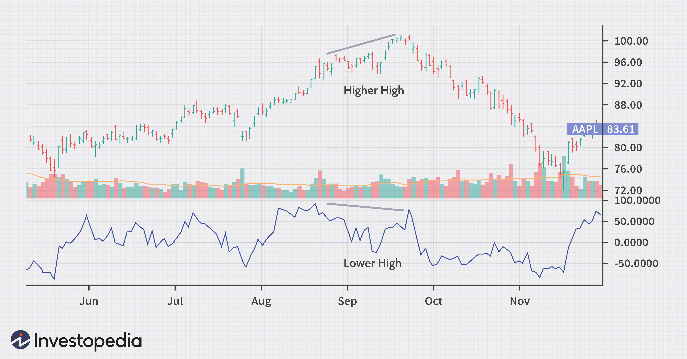

The world of technical analysis is rich with indicators, each offering unique insights into market dynamics. These tools assist traders in predicting future price movements based on historical data. Among these indicators, the Chande Momentum Oscillator (CMO) stands out for its balanced approach to measuring momentum, providing insights that are both comprehensive and versatile. Developed by Tushar Chande in 1994, the CMO is a momentum indicator used extensively in both technical analysis and algorithmic trading to capture shifts in market momentum.

The Chande Momentum Oscillator offers traders a method to quantitatively assess price momentum, differentiating it from more traditional oscillators such as the Relative Strength Index (RSI). While the RSI ranges from 0 to 100, the CMO oscillates between +100 and -100. This variation in scale helps traders identify potential overbought or oversold conditions, enhancing their ability to make informed trading decisions. The CMO's calculation considers recent gains and losses over a designated period, treating upward and downward movements with equal weight. This balanced perspective provides traders with a more impartial view of market momentum, facilitating a comprehensive analysis.



In this article, the focus will be on exploring the Chande Momentum Oscillator in its entirety. The discussion will encompass its definition, how it can be calculated, and its potential benefits to traders. Additionally, its application within trading strategies will be highlighted, showcasing its relevance in enhancing decision-making processes. Whether you're a novice trader seeking foundational knowledge or an experienced professional aiming to refine your strategies, understanding the CMO promises to be a valuable addition to your trading toolkit.

## Table of Contents

## What is the Chande Momentum Oscillator?

The Chande Momentum Oscillator (CMO) was introduced by Tushar Chande in 1994 as a technical indicator specifically designed to assess market momentum. This indicator differentiates itself from traditional oscillators such as the Relative Strength Index (RSI) by having a range between +100 and -100, instead of the conventional 0 to 100 range. This distinct range enables the CMO to effectively identify potential overbought or oversold conditions, offering a balanced perspective on market dynamics.

The CMO evaluates momentum by considering the sum of recent gains and losses over a predefined period. Unlike many other indicators, the CMO assigns equal weight to both upward and downward movements. This balanced approach offers traders an unbiased tool for analyzing comprehensive momentum, enhancing their ability to detect shifts in market trends and potential reversals.

The calculation involves assessing the differences between consecutive closing prices over a chosen period. The formula for the CMO is as follows:

$$
\text{CMO} = 100 \times \left( \frac{\text{Sum of gains over period} - \text{Sum of losses over period}}{\text{Sum of gains} + \text{Sum of losses}} \right)
$$

This mathematical equation facilitates the objective measurement of [momentum](/wiki/momentum) by quantifying periods of market gains against market losses. Consequently, it becomes an essential instrument for traders aiming to perform a detailed and accurate momentum analysis.

## How to Calculate the Chande Momentum Oscillator

Calculating the Chande Momentum Oscillator (CMO) is a systematic process that revolves around analyzing recent closing prices to assess market momentum. The core formula for the CMO is:

$$
\text{CMO} = 100 \times \frac{(\text{Sum of gains over sum of periods} - \text{Sum of losses over sum of periods})}{(\text{Sum of gains} + \text{Sum of losses})}
$$

To determine the CMO, follow these steps:

1. **Calculate Price Changes**: Begin by determining the change between each pair of consecutive closing prices in your data set. This is achieved by subtracting the previous closing price from the current closing price for each period.

2. **Compute Gains and Losses**: 
   - **Gains**: Sum up all positive changes (where the current closing price is higher than the previous).
   - **Losses**: Take the absolute values of negative changes (where the previous closing price is higher than the current) and sum them up.

3. **Apply the CMO Formula**: 
   - Use the computed sums of gains and losses in the CMO formula to derive the final value. This value represents the momentum strength, oscillating between +100 and -100.

Here's a simple Python code snippet that calculates the CMO:

```python
def calculate_cmo(prices, period):
    gains = 0
    losses = 0

    for i in range(1, period + 1):
        change = prices[i] - prices[i - 1]
        if change > 0:
            gains += change
        else:
            losses += abs(change)

    cmo = 100 * ((gains - losses) / (gains + losses)) if (gains + losses) != 0 else 0
    return cmo

# Example usage
prices = [100, 102, 101, 105, 103]
period = 5
cmo_value = calculate_cmo(prices, period)
print("CMO Value:", cmo_value)
```

By following these steps and using this formula, traders can derive valuable insights into the momentum of a stock, facilitating informed decision-making.

## Interpreting Chande Momentum Oscillator Values

CMO values offer insights into potential price reversals and trend continuations, guiding traders in decision-making processes. A CMO reading above +50 generally signals an overbought condition. This often indicates that the asset's price may face a downward correction as the buying momentum is likely unsustainable at such high levels. Conversely, a value below -50 points to an oversold condition, where the asset might experience an upward rebound as the selling pressure may be excessive.

Traders closely monitor zero-line crossovers of the CMO. When the CMO value crosses above zero, it signifies a shift towards increasing bullish momentum, suggesting that it might be a suitable time to consider buying or continuing to hold long positions. On the other hand, crossing below zero indicates bearish momentum, which might be a cue for selling or preparing to [exit](/wiki/exit-strategy) long positions.

Additionally, divergences between the CMO and actual price movements can provide further clues about potential market trend shifts. For instance, if the asset's price continues to rise while the CMO falls, this bearish divergence might signal a weakening upward trend, hinting at a potential reversal. Similarly, a bullish divergence occurs when the price falls but the CMO begins to rise, suggesting a possible turnaround in sentiment towards upward momentum. These divergence patterns can serve as valuable indicators of changing market dynamics, aiding traders in anticipating trend changes.

## Advantages of Using the Chande Momentum Oscillator

The Chande Momentum Oscillator (CMO) presents several advantages that make it an attractive choice for traders seeking to analyze market momentum effectively. 

One of its primary advantages is its balanced momentum perspective. The CMO achieves this by equally weighing gains and losses in its calculation, which contrasts with many other momentum indicators that might place disproportionate emphasis on one over the other. This balanced approach ensures an unbiased view of market movements, enabling traders to identify true momentum shifts without the distortion that can arise from skewed data interpretations.

Another significant benefit is the versatility of the CMO. It is applicable across various market conditions and adaptable to different timeframes. This flexibility makes it a suitable tool for traders with varying strategies and objectives, whether they are day traders looking for short-term gains or long-term investors seeking sustained trends.

The simplicity of using the CMO further adds to its appeal. Traders can easily calculate and interpret the CMO values, facilitating quick decision-making processes. Its straightforward integration with existing trading setups allows traders to combine the CMO with other technical tools, enhancing the comprehensiveness of their strategies. This combinatory potential can result in a more robust trading approach, as the CMO can complement other indicators to provide a more cohesive view of market dynamics.

Lastly, the CMO's ability to deliver detailed momentum data enhances its value in identifying trading opportunities. By clearly indicating overbought or oversold conditions and potential trend reversals, the CMO assists traders in pinpointing optimal entry and exit points. This detailed insight into momentum fluctuations is crucial for traders aiming to capitalize on market inefficiencies and achieve better trading outcomes. 

Overall, the Chande Momentum Oscillator's balanced methodology, versatility, ease of use, and detailed momentum insights make it a powerful tool in a trader's arsenal, aiding in the construction of effective and informed trading strategies.

## Limitations and Common Mistakes

Before relying on the Chande Momentum Oscillator (CMO) exclusively, traders should consider its several limitations and common pitfalls. One primary limitation is that the CMO is a lagging indicator, which means it is based on historical data. Consequently, it may deliver signals after a market movement has already commenced. This delay can lead traders to act on information that is no longer relevant, potentially resulting in suboptimal trading decisions.

The CMO may also generate false signals in choppy or sideways markets. In such conditions, the frequent and abrupt shifts in market prices can lead to misleading indications of momentum, which may not correspond to any genuine market trends. Traders relying solely on the CMO in these environments risk executing trades based on inaccurate readings, thereby increasing the potential for financial losses.

To mitigate these challenges, it is prudent for traders to combine the CMO with other technical indicators or confirmation tools. For example, integrating trend-following indicators like moving averages or tools like the Relative Strength Index (RSI) can provide a broader perspective on market dynamics. This diversification of indicators can help filter out noise from indecisive market movements, thereby allowing traders to make more informed decisions.

Here's a simple Python script that can be used to calculate the CMO and combine it with a moving average for confirmation:

```python
import pandas as pd

def calculate_cmo(data, period):
    data['Change'] = data['Close'].diff()
    data['Gain'] = data['Change'].apply(lambda x: x if x > 0 else 0)
    data['Loss'] = data['Change'].apply(lambda x: abs(x) if x < 0 else 0)

    data['Sum of Gains'] = data['Gain'].rolling(window=period).sum()
    data['Sum of Losses'] = data['Loss'].rolling(window=period).sum()

    data['CMO'] = 100 * ((data['Sum of Gains'] - data['Sum of Losses']) /
                         (data['Sum of Gains'] + data['Sum of Losses']))
    return data['CMO']

def strategy(data, cmo_period, ma_period):
    data['CMO'] = calculate_cmo(data, cmo_period)
    data['MA'] = data['Close'].rolling(window=ma_period).mean()

    # Entry condition: CMO crosses above 0 and price is above moving average
    data['Buy'] = (data['CMO'] > 0) & (data['Close'] > data['MA'])
    # Exit condition: CMO crosses below 0 or price falls below moving average
    data['Sell'] = (data['CMO'] < 0) | (data['Close'] < data['MA'])

    return data[['Close', 'CMO', 'MA', 'Buy', 'Sell']]

# Example usage
# data = pd.DataFrame(...) # Load your data frame with a 'Close' price column
# output = strategy(data, cmo_period=14, ma_period=20)
```

This code demonstrates how to combine the CMO with a moving average to identify potential trading signals. Implementing such strategies allows traders to enhance the CMO's reliability by confirming momentum signals with trend indicators, reducing the likelihood of false entries and exits.

## Chande Momentum Oscillator in Algorithmic Trading

Algorithmic traders can leverage the Chande Momentum Oscillator (CMO) to develop automated trading strategies that capitalize on momentum shifts within the market. The structured framework of [algorithmic trading](/wiki/algorithmic-trading) allows for the precise definition of entry and exit rules based on CMO readings, leading to efficient trade execution.

To employ the CMO effectively in algorithmic trading, traders often set specific thresholds as entry and exit signals. For instance, an algorithm might initiate a buy order when the CMO crosses above -50, indicating a shift from oversold conditions, and trigger a sell order when the CMO falls below +50, suggesting overbought conditions. These threshold values can be adjusted based on the trader's risk appetite and the asset class being traded.

Backtesting is a crucial step in refining these automated strategies. By running historical price data through the algorithm, traders can evaluate the effectiveness of CMO-based strategies and make necessary adjustments. For instance, traders can test various timeframes or integrate additional indicators, such as moving averages, to filter out false signals and improve strategy robustness.

Here is a simple Python example to calculate CMO and implement basic entry and exit rules using historical data:

```python
import pandas as pd

def calculate_cmo(prices, period=14):
    changes = prices.diff()
    gains = changes.where(changes > 0, 0).rolling(window=period).sum()
    losses = -changes.where(changes < 0, 0).rolling(window=period).sum()
    cmo = 100 * (gains - losses) / (gains + losses)
    return cmo

def signal_generation(cmo, buy_threshold=-50, sell_threshold=50):
    signals = pd.Series(index=cmo.index)
    signals[cmo > sell_threshold] = -1  # Sell signal
    signals[cmo < buy_threshold] = 1   # Buy signal
    return signals

# Assuming 'data' is a DataFrame containing historical price data with a 'Close' column
data['CMO'] = calculate_cmo(data['Close'])
data['Signal'] = signal_generation(data['CMO'])
```

CMO can be further enhanced by integrating it with other indicators like the Moving Average Convergence Divergence (MACD) or the Average True Range (ATR), enhancing trading accuracy and profitability. These composite systems can detect complex market scenarios and react to varying conditions more effectively than a single indicator approach.

Ultimately, the implementation of CMO in algorithmic trading not only provides traders with a systematic method to interpret momentum shifts but also empowers them to refine strategies through rigorous [backtesting](/wiki/backtesting) and indicator integration.

## Conclusion

The Chande Momentum Oscillator (CMO) serves as a robust instrument for traders aiming to evaluate market momentum. By employing a balanced formula that takes into account both recent gains and losses, the CMO helps provide significant insights into potential trading opportunities across diverse market conditions. This equilibrium in calculation distinguishes it from other momentum indicators, allowing traders to obtain an unbiased view of market dynamics, and making it a valuable asset for informed decision-making.

Although the CMO is effective when utilized independently, its true potential is realized when integrated with other technical indicators. By combining the CMO with other tools, such as moving averages or trend lines, traders can develop a more comprehensive trading strategy, thereby improving the accuracy and reliability of market predictions. 

In trading, the thoughtful application and understanding of the CMO can substantially enhance market analysis and strategy execution. Traders who integrate the CMO into their trading toolkit and refine its use through practice and experience can potentially improve their trading outcomes, positioning themselves to capitalize on market momentum with greater confidence and precision.

## References & Further Reading

[1]: Chande, T. S. (1997). ["The New Technical Trader: Boost Your Profit by Plugging into the Latest Indicators"](https://www.amazon.com/New-Technical-Trader-Plugging-Indicators/dp/0471597805). Wiley.

[2]: Wilder, J. W. (1978). ["New Concepts in Technical Trading Systems"](https://archive.org/details/newconceptsintec00wild). Trend Research. 

[3]: Murphy, J. J. (1999). ["Technical Analysis of the Financial Markets: A Comprehensive Guide to Trading Methods and Applications"](https://archive.org/details/technicalanalysi0000murp). New York Institute of Finance.

[4]: Kaufman, P. J. (2013). ["Trading Systems and Methods"](https://onlinelibrary.wiley.com/doi/book/10.1002/9781119202561). Wiley.

[5]: GitHub Repository on Trading Algorithms using Python. ["Backtrader Documentation."](https://github.com/thomasmbarrick/Algorithmic-Trading-Strategy-Development)

[6]: Colby, R. W. (2002). ["The Encyclopedia of Technical Market Indicators, Second Edition"](https://www.amazon.com/Encyclopedia-Technical-Market-Indicators-Second/dp/0070120579). McGraw-Hill.