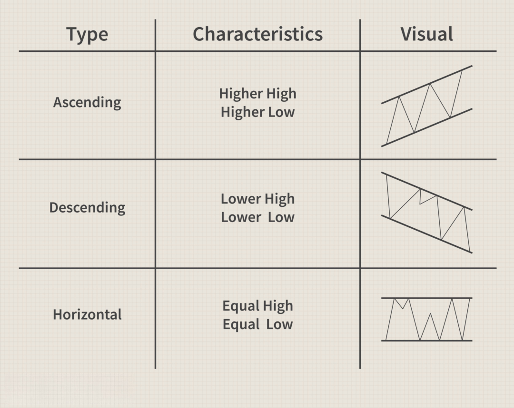

## Table of Contents

## What is a channel in trading?

A channel in trading is a way to see how a stock or other thing you can trade moves in price over time. It's like drawing two lines on a chart: one line goes along the highest prices and the other along the lowest prices. When these lines are pretty much parallel and the price stays between them, you have a channel. Traders use channels to guess where the price might go next.

Channels help traders make choices about buying or selling. If the price keeps hitting the top of the channel and then going back down, traders might think it's a good time to sell when it gets near the top again. If the price keeps bouncing off the bottom of the channel and going back up, traders might see it as a good time to buy when it gets near the bottom. But, it's important to remember that channels are just a tool and not always right, so traders need to be careful and use other information too.

## How does a channel help in identifying trading opportunities?

A channel helps traders spot good times to buy or sell by showing a clear path that the price of a stock or other tradeable item follows. Imagine the channel as two parallel lines on a chart. The top line touches the highest prices, and the bottom line touches the lowest prices. When the price moves between these lines, it creates a pattern. Traders watch this pattern to see if the price is likely to keep going up when it hits the bottom of the channel or if it's likely to go down when it reaches the top.

Using channels, traders can make better guesses about future price movements. For example, if the price always bounces back up after touching the bottom line, a trader might decide to buy when the price gets close to that line again, hoping to profit as the price rises. On the other hand, if the price tends to drop after hitting the top line, a trader might sell or short sell when the price nears the top, expecting it to fall. Channels are not perfect, so traders often use them along with other tools to make more informed decisions.

## What are the basic types of channels used in trading?

There are three basic types of channels used in trading: ascending, descending, and horizontal. An ascending channel is formed when the price moves up over time, with the top and bottom lines both sloping upwards. Traders see this as a sign that the price might keep going up, so they might look for chances to buy when the price touches the lower line. A descending channel is the opposite, with both lines sloping downwards. This suggests the price might keep falling, so traders might look for chances to sell or short sell when the price touches the upper line.

A horizontal channel happens when the price stays about the same over time, with both the top and bottom lines flat. This shows that the price is in a range and not really going up or down much. Traders might buy when the price gets to the lower line and sell when it gets to the upper line, hoping to make money from the price moving back and forth within the channel. Each type of channel helps traders see patterns and make guesses about where the price might go next.

## How do you draw an ascending channel on a price chart?

To draw an ascending channel on a price chart, you start by looking at the price movement over time. Find at least two points where the price has made a low and draw a straight line that touches these low points. This line should slope upwards because you're looking for an ascending channel. Then, find at least two points where the price has made a high and draw another straight line that touches these high points. This second line should also slope upwards and be parallel to the first line you drew. The space between these two lines is your ascending channel.

Once you have your ascending channel drawn, you can use it to spot trading opportunities. If the price keeps touching the bottom line of the channel and then going up, you might see it as a good time to buy when the price gets close to that line again. If the price touches the top line and then starts to go down, you might think it's a good time to sell or wait for a better buying opportunity. Remember, though, that no tool is perfect, so it's always a good idea to use other tools and information to help you make your trading decisions.

## What is the significance of a descending channel in market analysis?

A descending channel in market analysis is important because it shows that the price of a stock or other tradeable item is going down over time. You can see this on a chart where both the top and bottom lines of the channel are sloping downwards. This pattern tells traders that the price might keep falling, which can be a signal to sell or avoid buying. When the price touches the top line of the descending channel, traders often think it's a good time to sell because the price might go down again.

Traders use descending channels to make smart choices about when to get out of a trade. If the price keeps hitting the top of the channel and then dropping, a trader might decide to sell when the price gets close to that top line again. This can help them avoid bigger losses if the price keeps falling. But it's important to remember that channels are just one tool, and they don't always predict the future perfectly. Traders should use other tools and information too, to make the best decisions possible.

## Can you explain how to identify a horizontal channel?

A horizontal channel is easy to spot on a price chart. It looks like two straight lines that are flat and parallel to each other. The top line touches the highest prices, and the bottom line touches the lowest prices. When you see the price moving up and down between these two lines without going up or down a lot over time, you've found a horizontal channel. It's like the price is stuck in a range and not really going anywhere.

Traders use horizontal channels to find good times to buy and sell. If the price keeps bouncing off the bottom line and going back up, a trader might decide to buy when the price gets close to that bottom line again. They hope to make money as the price goes up to the top line. On the other hand, if the price keeps hitting the top line and then dropping back down, a trader might sell when the price gets near the top line, expecting it to fall back to the bottom. Horizontal channels help traders make these kinds of decisions, but they should also use other tools to make sure they're making the best choices.

## What are the key differences between a trend channel and a consolidation channel?

A trend channel shows that the price of something is going up or down over time. It has two lines that slope the same way. If the lines are going up, it's an ascending trend channel, and if they're going down, it's a descending trend channel. Traders use trend channels to guess where the price might go next. For example, if the price keeps going up when it touches the bottom line of an ascending trend channel, a trader might buy when it gets close to that line again. Trend channels help traders see if the price is in a strong move and make choices based on that.

A consolidation channel, on the other hand, shows that the price is not going up or down much. It's like the price is taking a break and moving sideways. This channel has two flat lines that are parallel to each other. When the price stays between these lines, it's called a horizontal or consolidation channel. Traders might buy when the price gets to the bottom line and sell when it gets to the top line, hoping to make money from the price moving back and forth. Consolidation channels help traders see when the price is not in a strong trend and plan their trades around that.

## How do traders use channels to set stop-loss and take-profit levels?

Traders use channels to help them decide where to set stop-loss and take-profit levels. A stop-loss is a point where a trader decides to sell to stop losing more money if the price goes down. A take-profit is a point where a trader decides to sell to make a profit. In an ascending channel, a trader might set the stop-loss just below the bottom line of the channel. This way, if the price drops out of the channel, the trader can get out of the trade before losing too much. For the take-profit, the trader might set it near the top line of the channel, hoping to sell and make a profit when the price reaches that high again.

In a descending channel, traders do the opposite. They might set the stop-loss just above the top line of the channel. If the price goes up and breaks out of the channel, the trader can cut their losses. The take-profit could be set near the bottom line, where the trader hopes to sell and make a profit as the price falls to that low again. In a horizontal or consolidation channel, traders might set the stop-loss just outside the channel, either above the top line or below the bottom line. The take-profit could be set near the opposite line of the channel, hoping to make money as the price moves back and forth within the channel.

## What technical indicators are commonly used in conjunction with channel trading?

Traders often use other technical indicators along with channels to make better trading decisions. One common indicator is the Moving Average, which helps smooth out price changes over time. If the price is above the Moving Average in an ascending channel, it might mean the trend is strong and could keep going up. Another popular indicator is the Relative Strength Index (RSI), which shows if a stock is overbought or oversold. If the RSI is high when the price is near the top of an ascending channel, it might be a good time to sell because the price could be ready to drop.

Another useful tool is the Bollinger Bands, which are like channels themselves but based on how much the price moves around. When the price hits the upper Bollinger Band near the top of an ascending channel, it might be a sign to sell. On the other hand, if the price touches the lower Bollinger Band near the bottom of the channel, it could be a good time to buy. Traders also use the MACD (Moving Average Convergence Divergence) to spot changes in momentum. If the MACD line crosses above the signal line while the price is in an ascending channel, it might mean the price will keep going up, so it could be a good time to buy. By combining these indicators with channels, traders can get a better picture of what might happen next with the price.

## How can one validate the reliability of a channel before trading?

Before trading based on a channel, it's important to check if the channel is reliable. One way to do this is by looking at how long the channel has been in place. A channel that has been around for a long time and has had the price touching both the top and bottom lines many times is more likely to be reliable. Another way is to see if the channel fits well with the price movements. If the price keeps bouncing off the lines without breaking out too often, it's a good sign that the channel is strong.

Traders can also use other tools to help validate the channel. For example, if the price is in an ascending channel and the Moving Average is also going up, it can make the channel seem more trustworthy. The Relative Strength Index (RSI) can also help; if the RSI is not too high or too low when the price is in the channel, it might mean the channel is reliable. By looking at these things together, traders can feel more confident that the channel they see on the chart is a good one to use for making trading decisions.

## What are some advanced strategies for trading breakouts from channels?

When the price of a stock or other thing you can trade breaks out of a channel, it can mean big changes are coming. A breakout happens when the price goes above the top line of an ascending or horizontal channel, or below the bottom line of a descending or horizontal channel. Traders often look for breakouts because they can signal that the price is about to go up or down a lot. One advanced strategy is to wait for the price to break out and then go back to touch the channel line it broke from, called a "retest." If the price bounces off that line and keeps going in the direction of the breakout, it can be a good time to trade. But if the price goes back into the channel, the breakout might not be real, and it's better to wait and see.

Another strategy is to use other tools to check if the breakout is strong. For example, if the price breaks out of an ascending channel and the volume of trades goes up a lot, it can mean more people believe in the new direction of the price. Also, if other signs like the Moving Average or the Relative Strength Index (RSI) show that the price is likely to keep going in the breakout direction, it can make the breakout seem more reliable. Traders might decide to buy or sell right after a breakout if these other tools agree with the channel breakout. But it's always smart to be careful and not jump into a trade too quickly, because sometimes breakouts can be fake and the price can go back to where it was before.

## How do you adapt channel trading strategies to different market conditions?

In a strong trend market, where the price is clearly going up or down, traders can use ascending or descending channels to make their trading choices. If the price is in an ascending channel, traders might buy when the price touches the bottom line and sell or take profits near the top line. They can also use other tools like the Moving Average to check if the trend is strong. If the Moving Average is also going up, it can make traders feel more sure about buying when the price is near the bottom of the channel. In a descending channel, traders might do the opposite: sell or short sell when the price touches the top line and maybe buy back or cover their shorts near the bottom line. Using other tools like the Relative Strength Index (RSI) can help traders decide if the price is overbought or oversold, which can be useful for setting stop-loss and take-profit levels.

In a market that's not moving much, called a sideways or consolidating market, a horizontal channel can be helpful. Traders might buy when the price gets to the bottom line of the channel and sell when it reaches the top line. They can use tools like Bollinger Bands to see if the price is likely to stay in the channel or break out. If the price touches the lower Bollinger Band near the bottom of the channel, it might be a good time to buy. If it touches the upper Bollinger Band near the top, it might be a good time to sell. Traders can also watch for breakouts from the channel. If the price breaks out of a horizontal channel and other signs like volume or the MACD support the breakout, it might mean the market is about to start trending again, so traders can adjust their strategies to follow the new trend.

## References & Further Reading

[1]: Bollinger, J. (2002). ["Bollinger on Bollinger Bands."](https://archive.org/download/BollingerOnBollingerBands/Bollinger%20On%20Bollinger%20Bands.pdf) McGraw Hill.

[2]: Lopez de Prado, M. (2018). ["Advances in Financial Machine Learning."](https://www.amazon.com/Advances-Financial-Machine-Learning-Marcos/dp/1119482089) Wiley.

[3]: Aronson, D. R. (2006). ["Evidence-Based Technical Analysis: Applying the Scientific Method and Statistical Inference to Trading Signals."](https://www.amazon.com/Evidence-Based-Technical-Analysis-Scientific-Statistical/dp/0470008741) Wiley.

[4]: Donchian, R. D. (1934). ["Channel Breakout Strategy."](https://trendspider.com/learning-center/donchian-channels-a-comprehensive-guide-for-trend-following-traders/)

[5]: Chan, E. P. (2008). ["Quantitative Trading: How to Build Your Own Algorithmic Trading Business."](https://github.com/ftvision/quant_trading_echan_book) Wiley.

[6]: Jansen, S. (2020). ["Machine Learning for Algorithmic Trading."](https://github.com/stefan-jansen/machine-learning-for-trading) Packt Publishing.