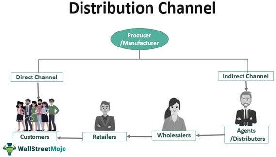

Algorithmic trading, often referred to as "algo trading," has significantly reshaped the landscape of financial markets. This type of trading uses computer algorithms to execute orders based on pre-defined criteria, efficiently executing trades at speeds and frequencies that would be impossible for a human trader. The appeal of algorithmic trading is largely due to its ability to remove emotional biases from trading decisions, ensure consistent strategy execution, and capitalize on small price discrepancies in the market typically through high-frequency trading. 

In recent years, algorithmic trading has surged in popularity, becoming a cornerstone of modern financial markets. Estimates suggest that algorithmic trading accounts for approximately 60-73% of all trading activity in the United States equities markets. This rise is driven by the rapid advancements in technology and the increasing complexity of financial products, enabling traders to leverage sophisticated algorithms for strategic market participation.



Within algorithmic trading, understanding trading channels is vital. Trading channels are patterns on price charts that indicate trends, with the upper and lower boundaries marking potential price resistances and supports. Conceptually, these channels help traders identify and predict potential points for entering or exiting trades, thereby optimizing trading strategies. They play a crucial role in algo trading by providing a framework within which price movements can be assessed accurately, facilitating a disciplined approach to market speculation.

This article aims to provide a detailed exploration of trading channels in algorithmic trading. It will cover what trading channels are and their historical significance, how they function within algorithmic strategies, the types of channels utilized, their implementation in trading algorithms, the tools and platforms that support these strategies, and real-world examples illustrating their effectiveness. By the end of this comprehensive exploration, readers will gain a robust understanding of how integrating channel strategies can enhance algorithmic trading performance, encouraging further experimentation and adaptation to evolving market conditions.

## Table of Contents

## What are Trading Channels?

Trading channels are essential analytical tools in financial markets, used predominantly to identify and forecast price movement trajectories. A trading channel is typically defined by two parallel lines, which encapsulate a financial instrument's price movements, creating a range within which the price tends to oscillate over time. These channels help traders recognize trends and potential reversal points, thereby forming critical components of various trading strategies.

Historically, trading channels have been fundamental to technical analysis, with their origins tracing back to the early development of quantitative investment strategies. Renowned traders like Charles Dow, one of the pioneers of modern technical analysis, laid the foundations for identifying price patterns and trends, which later evolved into more structured forms such as channels. Over decades, traders and analysts have employed channels to encapsulate price data, visualizing potential **support and resistance** levels. These levels form due to the inherent propensity of prices to rebound within the channel's boundaries.

There are multiple ways channels manifest in trading strategies, each variant offering insights into potential price trends and reversals. Channels are most commonly divided into **ascending, descending, and horizontal channels**:

1. **Ascending Channels**: Characterized by higher highs and higher lows, suggesting a bullish market sentiment. The slope of the channel aligns with a positive trend, indicating prices are generally moving upwards. An example of an ascending channel can be seen in the function of time and price, represented as $p(t) = mt + b$ where $m > 0$.

2. **Descending Channels**: They exhibit lower highs and lower lows, indicating bearish market conditions. The downward slope of the channel serves as a visual cue for traders that price might continue to decline. Mathematically, it can be represented similarly but with $m < 0$.

3. **Horizontal Channels**: These occur when the price oscillates between relatively stable levels of support and resistance, offering indications of market consolidation. A typical formula could be seen as constant $b$, reflecting stability or a neutral trend.

The strategic advantage of using channels lies in their capacity to provide precise entry and [exit](/wiki/exit-strategy) points linked to the channel's boundaries. When the price nears the upper boundary, it signals a potential resistance zone, whereas the lower boundary indicates a possible support zone. This understanding aids traders in executing buy near support or sell near resistance, capitalizing on the expected reversals or continuations within the confines of the channel.

Channels are not limited to traditional straight-line paths; advanced techniques incorporate complex channel forms influenced by **Bollinger Bands**, **Keltner Channels**, and other statistical boundaries which account for [volatility](/wiki/volatility-trading-strategies). Here, data analysis and computational tools help refine these methods, using moving averages and standard deviation metrics to optimize the channel's adaptability to shifting market landscapes.

Overall, trading channels represent a fundamental aspect of technical analysis in financial markets. Their historical application and continuous evolution underscore their significance in providing a clearer perspective on financial price dynamics. As trading strategies and technologies advance, the interpretation and construction of trading channels continue to be tailored to meet the complex needs of modern [algorithmic trading](/wiki/algorithmic-trading) systems.

## How Channels Work in Algo Trading

Algorithmic trading relies on the systematic application of quantitative methods to execute trades based on predefined strategies. Among these strategies, trading channels are especially valuable for their capacity to track market trends and potential price reversals. Trading channels in algorithmic strategies involve the automated identification and use of price channels to guide trading decisions.

### Mechanics of Channels in Algorithmic Strategies

**Channels and Boundaries**  
Trading channels are defined by two parallel lines that form a boundary containing the price action of a financial instrument. These boundaries are typically established using technical indicators that analyze past price movements and forecast future trends. Traders use the upper boundary, or resistance line, as a potential sell zone, while the lower boundary, or support line, is considered a potential buy zone.

**Technical Indicators for Defining Boundaries**  
Several technical indicators can be employed to define the boundaries of trading channels. One common approach is the use of moving averages, such as the Simple Moving Average (SMA) or Exponential Moving Average (EMA), to create dynamic support and resistance levels. The Bollinger Bands indicator, which includes a middle band and two outer bands derived from standard deviations, is another popular tool for creating adaptive channel boundaries.

The Relative Strength Index (RSI) and Average True Range (ATR) are also frequently utilized to adjust channel parameters based on market volatility. For example, a higher ATR value might signify the need for wider channel boundaries to accommodate increased price movement.

**Popular Algorithms Using Channel Strategies**  
Algorithms that incorporate channel strategies typically involve executing trades when the price breaches these established boundaries. One example is the "Channel Breakout" algorithm, which triggers a buy signal when the price exceeds the upper channel boundary, anticipating a continuation of the trend. Conversely, a sell signal is initiated if the price falls below the lower boundary.

Another example is the "Mean Reversion" strategy, which assumes that the price will revert to its mean after reaching the channel edges. In this strategy, traders open a position opposite to the price movement—buying near the lower boundary or selling near the upper boundary—expecting a reversal toward the channel's median line.

**Python Example for a Simple Channel Strategy**  

```python
import pandas as pd
import numpy as np

# Simple Moving Average Channel Strategy
def channel_strategy(signals):
    short_window = signals['Close'].rolling(window=20, min_periods=1).mean() # Short-term SMA
    long_window = signals['Close'].rolling(window=50, min_periods=1).mean() # Long-term SMA

    signals['Signal'] = 0.0
    signals['Short_MA'] = short_window
    signals['Long_MA'] = long_window

    signals['Signal'][20:] = np.where(signals['Short_MA'][20:] > signals['Long_MA'][20:], 1.0, 0.0) 
    signals['Positions'] = signals['Signal'].diff()

    return signals

# Load financial data
data = pd.read_csv('financial_data.csv')  # Ensure the CSV is loaded correctly with the 'Close' column
signals = pd.DataFrame(index=data.index)
signals['Close'] = data['Close']

# Apply the channel strategy
signals = channel_strategy(signals)
```

This python script exemplifies a basic channel strategy using short and long-term moving averages. It flags buy and sell signals when the short-term SMA exceeds or dips below the long-term SMA, respectively.

Algorithms leveraging channel strategies aim to take advantage of the predictive power of channel boundaries, constantly adjusting using technical indicators to maintain robustness in various market conditions. This dynamic approach aids in diminishing risks, optimizing entry and exit points, and potentially enhancing overall trading performance.

## Types of Channels in Algorithmic Trading

Algorithmic trading channels are a pivotal element in constructing systematic trading strategies, facilitating decision-making by providing signals about potential market trends and reversals. These channels can be categorized into several distinct types, each with unique characteristics and applications in financial markets.

### Linear Channels

Linear channels are formed by two parallel lines that encapsulate the price movements of an asset over a specific period. These lines are typically determined using linear regression, which fits a straight line to the price data points to minimize the distance between the points and the line itself.

**Pros:**  
- Simplicity: Easy to implement and understand.
- Real-time adaptability: Can be recalculated with minimal computational cost.

**Cons:**  
- Assumes a linear relationship, which may not capture more complex market dynamics.
- May require frequent adjustments in volatile markets.

A Python function for calculating a linear regression channel might employ the `numpy` library to perform regression analysis:

```python
import numpy as np

def linear_regression_channel(prices):
    x = np.arange(len(prices))
    coef = np.polyfit(x, prices, 1)
    trend_line = np.polyval(coef, x)
    return trend_line, coef
```

### Polynomial Channels

Polynomial channels extend the concept of linear channels by using higher-degree polynomials to fit the price data. This allows the model to capture more complex, non-linear relationships within the data.

**Pros:**  
- Flexible: Can model more complex patterns with greater precision.
- Better fit: Provides a better approximation in turbulent markets where linear models fail.

**Cons:**  
- Overfitting: Higher-degree polynomials can lead to overfitting, capturing noise instead of signal.
- Computationally intensive: Requires more resources for calculation and implementation.

An example of polynomial fitting in Python:

```python
def polynomial_channel(prices, degree=2):
    x = np.arange(len(prices))
    coef = np.polyfit(x, prices, degree)
    trend_line = np.polyval(coef, x)
    return trend_line, coef
```

### Multilinear Channels

Multilinear channels involve the use of multiple linear regressions over segmented periods of data. This method helps capture different trends and behaviors over varying market conditions.

**Pros:**  
- Versatility: Can account for shifts in market trends over different periods.
- Customizable: Parameters can be adjusted to fit specific market conditions or asset types.

**Cons:**  
- Complexity: More complex to implement and optimize than simple linear or polynomial models.
- Dependence on segmentation: Effectiveness is heavily reliant on appropriate data segmentation.

### Fixed-Width vs. Dynamic Channels

Fixed-width channels maintain a constant separation between the boundary lines, making them straightforward to implement. However, they can lack responsiveness to drastic changes in market volatility. Dynamic channels, conversely, adjust their width in response to market volatility, providing more flexibility and real-time adaptability. For instance, the Average True Range (ATR) is often employed to calculate dynamic channel widths.

**Pros of Fixed-Width Channels:**  
- Simplicity: Easier to implement and visualize.

**Cons of Fixed-Width Channels:**  
- Rigidity: Not adaptable to changing market conditions.

**Pros of Dynamic Channels:**  
- Adaptability: Better handles periods of increased volatility.

**Cons of Dynamic Channels:**  
- Complexity: Requires sophisticated algorithms to adjust channel widths in real-time.

In summary, each channel type offers unique advantages and presents specific challenges depending on the market conditions. Traders should assess these factors when incorporating channels into their algorithmic trading strategies.

## Implementing Channel Strategies in Algorithms

Implementing channel strategies in trading algorithms involves a structured approach that integrates the logic of identifying and utilizing channel patterns within an automated trading framework. Trading channels are essentially horizontal or sloped bands that confine price movements, allowing traders to determine potential entry and exit points based on the predictable oscillation between these boundaries.

### Step-by-Step Guide to Integrating Channel Logic

1. **Defining Channel Boundaries**: The first step is to define the channel boundaries. This can be done using technical indicators such as moving averages or Bollinger Bands. For example, a simple moving average can be used to define the central line of the channel, while adding or subtracting a fixed percentage or number of standard deviations can determine the upper and lower boundaries.

   ```python
   import pandas as pd
   import numpy as np

   def calculate_moving_average_channel(data, window):
       data['SMA'] = data['Close'].rolling(window=window).mean()
       data['Upper_Channel'] = data['SMA'] + 2 * data['Close'].rolling(window=window).std()
       data['Lower_Channel'] = data['SMA'] - 2 * data['Close'].rolling(window=window).std()
       return data
   ```

2. **Signal Generation**: Once the channel is established, the next step is generating trading signals. A basic rule could be to buy when the price touches the lower boundary and sell when it touches the upper boundary. Additionally, incorporating filters like volume or RSI (Relative Strength Index) can enhance signal reliability.

3. **Integration into Algorithm**: This logic is then coded into a trading algorithm that can execute trades automatically. The algorithm checks continuously for conditions where the asset price interacts with channel boundaries and triggers buy/sell orders accordingly.

4. **Backtesting and Optimization**: Backtesting is crucial to validate the channel strategy against historical data. It involves running the algorithm on past data to analyze performance metrics such as profitability, drawdown, and win/loss ratio. Optimization helps refine parameters like channel width or the specific moving average period to improve strategy performance.

   ```python
   def backtest_strategy(data):
       # Sample backtesting logic here
       # Possible enhancements include analyzing performance metrics
       pass
   ```

### Importance of Backtesting and Optimization

Backtesting serves multiple roles in validating channel strategies. It provides a statistical foundation to assess the viability of the strategy and helps in identifying unforeseen market conditions where the strategy may fail. Optimization allows traders to adjust parameters to better suit market dynamics, thus increasing the robustness of the strategy.

### Challenges and Considerations

Implementing channel strategies comes with several challenges:

- **Market Conditions**: Channels work well in ranging markets but may generate false signals during strong trends. Algorithms need condition checks or alternate strategies for trending markets.

- **Overfitting**: There's a risk that backtesting optimization leads to overfitting, where the algorithm performs well on historical data but poorly in live trades. To mitigate this, one should use out-of-sample data for validation.

- **Latency and Execution**: Automated trading requires minimizing latency to ensure prompt order execution. Using reliable APIs and low-latency trading platforms plays a crucial role here.

Understanding these challenges and meticulously integrating channel strategies enhances the efficiency and effectiveness of algorithmic trading systems.

## Tools and Platforms for Channel-Based Algo Trading

Algorithmic trading has become a crucial component of the financial markets, and the use of trading channels represents a key strategy in this domain. Various platforms facilitate the implementation of channel-based strategies, offering a range of features tailored to the needs of algorithmic traders.

### Review of Popular Platforms

1. **MetaTrader 4/5**: Known for its versatility, MetaTrader offers comprehensive tools to implement channel strategies. With built-in technical indicators and the capability for custom scripting via MQL4/MQL5, traders can develop sophisticated algorithms that incorporate channel analysis.

2. **QuantConnect**: An open-source algorithmic trading platform that supports multiple asset classes and complex strategies. Its cloud-based service allows for the smooth integration of data feeds and execution services. QuantConnect supports several programming languages, including Python and C#, providing flexibility in developing channel-based algorithms.

3. **TradingView**: While primarily a charting platform, TradingView offers powerful scripting through Pine Script. Traders can create custom indicators and strategies, including those based on trading channels, to test and backtest directly on the platform’s extensive datasets.

4. **NinjaTrader**: This platform provides powerful analytical tools, along with the ability to automate trading strategies. NinjaTrader supports custom development through NinjaScript, which enables traders to define and execute precise channel strategies.

### Features to Look for in a Trading Platform

When selecting a trading platform, several features are paramount for implementing effective channel strategies:

- **Custom Scripting Language**: A platform should support a robust scripting environment (such as Python or MQL) to develop bespoke channel indicators and strategies.

- **Backtesting Capabilities**: Comprehensive backtesting tools are essential. They allow traders to evaluate the performance of channel strategies against historical market data, optimizing parameters before live deployment.

- **Technical Indicators**: Built-in technical indicators, such as Bollinger Bands or Donchian Channels, provide a foundation for defining channel boundaries.

- **Data Integration**: Seamless integration with multiple data providers ensures that algorithms are informed by accurate and timely market information.

- **User-Friendly Interface**: A clear and intuitive interface enhances the efficiency of developing and modifying channel-based strategies.

### Enhancing Trading Capabilities with APIs and Custom Scripts

Application Programming Interfaces (APIs) and custom scripts are vital for enhancing the functionality and adaptability of trading platforms:

- **APIs**: These allow for direct interaction with the trading platform, enabling the automation of data acquisition, order execution, and management functions. An effective API can significantly accelerate the development of channel strategies by providing real-time data access and streamlined execution processes.

- **Custom Scripts**: Custom scripting enables the creation of proprietary indicators and strategies. For instance, traders can code algorithms to dynamically adjust channel boundaries based on volatility conditions. Python, being versatile and widely adopted, is often used for such tasks. Below is a simple example of how a trader might use Python to define dynamic channel boundaries:

```python
import numpy as np
import pandas as pd

def calculate_channels(prices, window_size=20, num_std_dev=2):
    rolling_mean = prices.rolling(window=window_size).mean()
    rolling_std = prices.rolling(window=window_size).std()

    upper_channel = rolling_mean + (rolling_std * num_std_dev)
    lower_channel = rolling_mean - (rolling_std * num_std_dev)

    return upper_channel, lower_channel

# Example Data
prices = pd.Series([110, 112, 115, 117, 120, 118, 115, 117, 122, 120])

# Calculate Channels
upper, lower = calculate_channels(prices)
print(upper, lower)
```

This script calculates dynamic upper and lower channel boundaries based on a simple moving average and standard deviation, illustrating how custom scripts can be used to implement sophisticated trading strategies.

In summary, the choice of platform and utilization of APIs and custom scripts play a crucial role in the effectiveness of channel-based algorithmic trading strategies. These tools offer the flexibility needed to adapt to changing market dynamics and optimize trading performance.

## Case Studies and Examples

Case studies provide valuable insights into the practical application of channel strategies in algorithmic trading. This section explores several notable examples where trading channels were effectively employed, offering a comprehensive understanding of their utility in financial markets. By analyzing successful trades and strategies, as well as lessons learned, traders can better appreciate the advantages and potential pitfalls of using channel strategies in automated systems.

One prominent case study involved the use of Bollinger Bands in a mean-reversion strategy. A trading firm implemented this approach by deploying an algorithm that identified overbought and oversold conditions based on the price movement relative to the upper and lower bands. The algorithm executed trades by entering a position when the price crossed the lower band, anticipating a reversal as the price returned to the mean. The strategy's success was largely attributed to the accurate detection of volatility, enabling timely entries and exits. The key lesson from this case was the importance of adjusting the bands' parameters to suit different market conditions, underscoring the dynamic nature of financial markets (Bollinger, J. (2002). Bollinger on Bollinger Bands. McGraw Hill).

Another example is the Adaptive Moving Average (AMA) channel used by a quantitative [hedge fund](/wiki/hedge-fund-trading-strategies). The AMA channel adapts its width based on recent market volatility, offering a more responsive solution compared to fixed-width channels. During a period of high market turbulence, the adaptive nature of the channel allowed the algorithm to capture trend reversals effectively, avoiding false signals that plagued static channels. This case highlighted the significance of flexibility within channel strategies, emphasizing the need for algorithms to evolve with changing market dynamics (Chauvet, M., & Piger, J. M. (2008). Dynamic Risk Management Systems. Wiley).

A third case involved the implementation of the Donchian Channel by a prop trading desk. This channel identifies [breakout](/wiki/breakout-trading) opportunities by tracking the highest high and lowest low over a predetermined period. The strategy capitalized on sustained price movements by entering trades when the price breached the channel boundaries. Historically, this approach proved advantageous in trending markets, delivering substantial returns during prolonged rallies or declines. However, during sideways markets, the strategy experienced whipsaws, leading to losses. The lesson learned was the critical importance of market condition assessment and the potential benefits of incorporating additional filters to avoid false breakouts (Donchian, R. D. (1934). Channel Breakout Strategy).

Python code can be used to illustrate the implementation of a simple trading channel strategy. Below is an example of a Donchian Channel algorithm:

```python
import pandas as pd
import numpy as np

# Load your data
data = pd.read_csv('market_data.csv')

# Define Donchian Channel function
def donchian_channel(data, period=20):
    data['Upper_Band'] = data['High'].rolling(window=period).max()
    data['Lower_Band'] = data['Low'].rolling(window=period).min()
    return data

# Applying the Donchian Channel
data = donchian_channel(data)

# Example trade signals based on channel
data['Signal'] = np.where(data['Close'] > data['Upper_Band'], 'Buy', 
                          np.where(data['Close'] < data['Lower_Band'], 'Sell', 'Hold'))

# View the signals
print(data[['Date', 'Close', 'Upper_Band', 'Lower_Band', 'Signal']])
```

This Python code snippet demonstrates a basic implementation of a Donchian Channel strategy. By applying such strategies in a [backtesting](/wiki/backtesting) environment, traders can better understand the nuances of channel trading, optimizing parameters specific to their trading objectives.

In conclusion, these case studies illustrate the practical applications of trading channels, highlighting their adaptability and effectiveness in various market scenarios. The key takeaways include the necessity to adjust channel parameters dynamically, the requirement to assess prevailing market conditions, and the benefit of incorporating additional confirmation mechanisms in trading algorithms.

## Conclusion

In algorithmic trading, the use of trading channels offers significant advantages by providing a structured approach to identifying price trends and potential reversals. These channels serve as a crucial tool in modeling price movements, which can enhance the accuracy of trade predictions and the overall profitability of trading strategies. By effectively utilizing channels, traders can gain insights into market dynamics, identifying optimal entry and exit points with greater precision. 

One of the primary benefits of using channels in algorithmic trading is their ability to adapt to different market conditions. This flexibility allows traders to customize their approach based on individual trading goals and market environments. The inherent adaptability of channel strategies encourages traders to experiment and refine their methods continuously. By doing so, traders can develop robust strategies that are tailored to their specific needs, thereby increasing their potential for success in the markets.

Looking ahead, the future of channel implementation in automated trading is promising. As trading algorithms continue to evolve, the integration of more sophisticated channel models is expected to enhance their predictive capabilities. Advances in [artificial intelligence](/wiki/ai-artificial-intelligence) and [machine learning](/wiki/machine-learning) present new opportunities for developing dynamic channel strategies that can process vast amounts of data in real-time, offering unparalleled insights into market behavior. This progression is likely to lead to more efficient and effective trading systems that can thrive in diverse and rapidly changing market conditions.

In conclusion, trading channels are an invaluable component of algorithmic trading systems. By bridging the gap between technical analysis and quantitative computing, they empower traders to make informed decisions that can significantly improve their trading outcomes. As technological innovations continue to transform the trading landscape, the role of channels in automated trading is set to expand, unlocking new possibilities for traders to explore and capitalize on.

## References & Further Reading

[1]: Bollinger, J. (2002). ["Bollinger on Bollinger Bands."](https://archive.org/download/BollingerOnBollingerBands/Bollinger%20On%20Bollinger%20Bands.pdf) McGraw Hill.

[2]: Lopez de Prado, M. (2018). ["Advances in Financial Machine Learning."](https://www.amazon.com/Advances-Financial-Machine-Learning-Marcos/dp/1119482089) Wiley.

[3]: Aronson, D. R. (2006). ["Evidence-Based Technical Analysis: Applying the Scientific Method and Statistical Inference to Trading Signals."](https://www.amazon.com/Evidence-Based-Technical-Analysis-Scientific-Statistical/dp/0470008741) Wiley.

[4]: Donchian, R. D. (1934). ["Channel Breakout Strategy."](https://trendspider.com/learning-center/donchian-channels-a-comprehensive-guide-for-trend-following-traders/)

[5]: Chan, E. P. (2008). ["Quantitative Trading: How to Build Your Own Algorithmic Trading Business."](https://github.com/ftvision/quant_trading_echan_book) Wiley.

[6]: Jansen, S. (2020). ["Machine Learning for Algorithmic Trading."](https://github.com/stefan-jansen/machine-learning-for-trading) Packt Publishing.