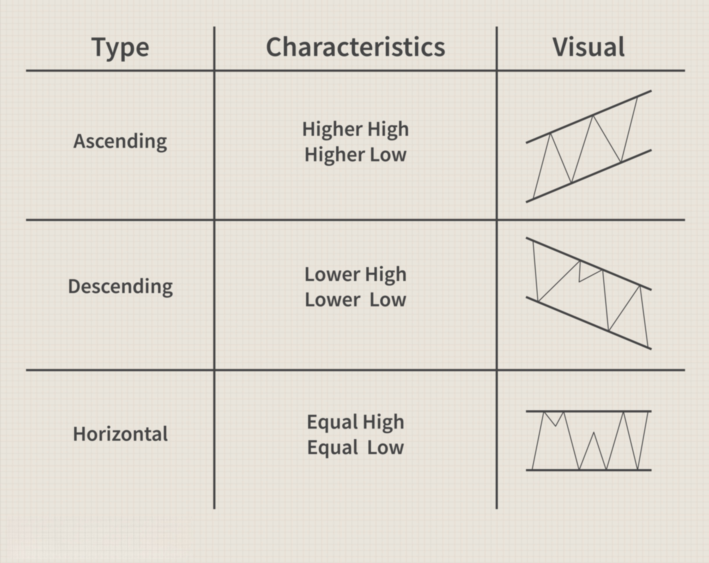

## Table of Contents

## What is channel trading and why is it important?

Channel trading is a way of trading where you buy and sell things, like stocks or currency, within a certain price range. This range is called a channel. Traders watch the price of something go up and down between the top and bottom of the channel. When the price gets close to the bottom, they might buy it, hoping it will go back up. When the price gets close to the top, they might sell it, hoping it will go back down.

Channel trading is important because it helps traders make decisions based on clear patterns. It can make trading less risky because you have a plan for when to buy and sell. By sticking to the channel, traders can avoid big losses if the price suddenly changes a lot. This method can be used by anyone, from beginners to experts, making it a useful tool in trading.

## How do you identify a trading channel on a chart?

To identify a trading channel on a chart, you need to look at the price movements over time. Start by finding the highest points the price reaches, which we call the resistance, and the lowest points, which we call the support. Draw a straight line connecting the highest points to form the top of the channel, and another straight line connecting the lowest points to form the bottom of the channel. If these lines are parallel and the price keeps bouncing between them, you've found a trading channel.

It's important to use a chart with enough data to see clear patterns. Sometimes, you might need to adjust your lines a bit to make them fit better with the price movements. The more times the price touches both the top and bottom lines without breaking through them, the stronger and more reliable the channel is. Remember, the channel can be horizontal, where the price moves sideways, or it can slope up or down, showing a trend in the price movement.

## What are the different types of trading channels?

There are three main types of trading channels: horizontal, ascending, and descending. A horizontal channel happens when the price moves up and down but stays within a certain range, not going higher or lower. Traders use this to buy near the bottom of the channel and sell near the top. An ascending channel is when the price keeps going up, but within a channel that slopes upward. Here, traders buy when the price touches the bottom line and sell when it reaches the top line, expecting the price to keep going up. A descending channel is the opposite, where the price keeps going down within a downward sloping channel. Traders sell when the price hits the top line and might buy back when it reaches the bottom line, expecting the price to keep falling.

Each type of channel helps traders predict what the price might do next. Horizontal channels are good for steady trading without big changes, while ascending and descending channels show a trend. Knowing which type of channel you're looking at can help you decide when to buy or sell. It's important to watch the price closely to see if it stays within the channel or breaks out, which can change your trading plan.

## How do you draw support and resistance lines for a channel?

To draw support and resistance lines for a channel, you start by looking at a price chart. Find the highest points where the price has stopped going up. These are the resistance points. Draw a straight line connecting these high points. This line is your resistance line. Then, look for the lowest points where the price has stopped going down. These are the support points. Draw another straight line connecting these low points. This line is your support line. Make sure these lines are parallel to each other to form the channel.

Once you have your support and resistance lines, check if the price keeps bouncing between them. The more times the price touches both lines without breaking through, the stronger your channel is. Sometimes, you might need to adjust your lines a bit to make them fit better with the price movements. Remember, the channel can be horizontal, where the price moves sideways, or it can slope up or down, showing a trend. Watching how the price behaves within the channel helps you decide when to buy or sell.

## What are the basic entry and exit rules for channel trading?

In channel trading, you buy when the price touches the bottom of the channel, which is called the support line. This is because you expect the price to go up again. You want to buy low, hoping to sell it later at a higher price. So, when the price gets close to the support line, you enter the trade by buying. You need to be patient and wait for the price to hit that line before you buy.

For exiting the trade, you sell when the price reaches the top of the channel, known as the resistance line. This is because you think the price might start going down after hitting the top. You want to sell high, making a profit from the difference between your buying and selling prices. So, when the price gets close to the resistance line, you exit the trade by selling. Always keep an eye on the price to make sure it stays within the channel before you make your moves.

## How can traders use channel breakouts to their advantage?

Traders can use channel breakouts to make money by watching when the price goes above the top of the channel or below the bottom. If the price breaks out above the top, it might mean the price will keep going up. So, traders can buy when this happens, hoping to sell later at a higher price. If the price breaks out below the bottom, it might mean the price will keep going down. In this case, traders can sell or even short sell, expecting to buy back later at a lower price.

To use channel breakouts well, traders need to be careful and patient. They should wait for the price to clearly break out of the channel before acting. Sometimes, the price might test the breakout by coming back to the channel, so it's good to wait for a strong move. Using other tools like volume or other indicators can help confirm if the breakout is real. This way, traders can make better decisions and increase their chances of making money from channel breakouts.

## What are common indicators used to enhance channel trading strategies?

Traders often use indicators to help them make better decisions when trading within a channel. One common indicator is the Moving Average, which smooths out price data to show the overall trend. By adding a Moving Average to a chart, traders can see if the price is generally going up or down inside the channel. This can help them decide when to buy or sell. Another useful indicator is the Relative Strength Index (RSI), which shows if a stock is overbought or oversold. If the RSI is high, it might be time to sell because the price might go down soon. If it's low, it might be a good time to buy because the price could go up.

Volume is also an important indicator for channel trading. It shows how many people are buying and selling. If the price breaks out of the channel with high volume, it's more likely to be a real breakout. Low volume might mean the breakout is not strong and could be a false signal. Traders also use Bollinger Bands, which are lines drawn above and below the price. These bands help show how much the price is moving around. If the price touches the upper band, it might be time to sell. If it touches the lower band, it might be time to buy. Using these indicators together can help traders make smarter trades and maybe make more money.

## How do you manage risk when trading within channels?

Managing risk when trading within channels is important to protect your money. One way to do this is by setting stop-loss orders. A stop-loss order is like a safety net that tells your broker to sell your trade if the price goes down to a certain level. This can help you avoid big losses if the price suddenly drops below the bottom of the channel. Another way to manage risk is by only risking a small part of your money on each trade. This way, even if you lose on a trade, you won't lose too much of your total money.

It's also smart to keep an eye on the market and be ready to change your plan if things don't go as expected. If the price starts to break out of the channel, you might want to wait and see if it's a real breakout or just a fake move. Using other tools like volume or the Relative Strength Index (RSI) can help you make better decisions. By being careful and using these methods, you can trade within channels more safely and increase your chances of making money.

## What are some advanced techniques for trading channel retracements?

When trading channel retracements, one advanced technique is to use Fibonacci retracement levels. These levels help traders find key points where the price might stop going down and start going up again. After the price hits the top of the channel and starts to fall, you draw Fibonacci lines from the bottom of the channel to the top. The lines show levels like 38.2%, 50%, and 62.8%. If the price stops falling at one of these levels and starts to go back up, it could be a good time to buy. This technique helps traders find better entry points within the channel.

Another technique is to use the concept of trend lines within the channel. You can draw smaller trend lines inside the channel to see short-term trends. For example, if the price is going up within the channel, you can draw a line along the lows of these upward moves. When the price touches this line and starts to go up again, it might be a good time to buy. If the price is going down within the channel, you can draw a line along the highs of these downward moves. When the price touches this line and starts to go down again, it might be a good time to sell. These smaller trend lines help traders find more precise entry and exit points within the larger channel.

## How can volume analysis improve channel trading decisions?

Volume analysis can help traders make better decisions when trading within channels by showing how many people are buying and selling. When the price is moving within a channel, looking at the volume can tell you if the move is strong or weak. If the price is going up and the volume is high, it means a lot of people are buying, which makes the upward move more likely to keep going. On the other hand, if the price is going up but the volume is low, it might not be a strong move, and the price could fall back down soon. By watching the volume, traders can decide if it's a good time to buy or sell based on how many people are in the trade.

Using volume analysis can also help traders spot when the price might break out of the channel. If the price breaks above the top of the channel with high volume, it's a sign that the breakout is strong and the price might keep going up. This could be a good time to buy. If the price breaks below the bottom of the channel with high volume, it's a sign that the breakout is strong and the price might keep going down. This could be a good time to sell or short sell. By paying attention to volume, traders can be more sure about their trading decisions and manage their risks better.

## What are the psychological challenges faced when trading channels?

Trading channels can be hard because it tests a trader's patience and emotions. When you see the price moving up and down within the channel, it can be tough to wait for the right time to buy or sell. You might feel tempted to make a move before the price hits the support or resistance line, but doing this too early can lead to losses. Staying calm and sticking to your plan is important, but it's not easy when you see the price changing all the time.

Another challenge is dealing with fear and greed. When the price gets close to the bottom of the channel, fear might make you think it will keep going down, so you might miss a good chance to buy. On the other hand, when the price is near the top, greed might make you want to hold on too long, hoping for even more profit, but this can lead to big losses if the price suddenly drops. Managing these feelings is key to successful channel trading, and it takes practice and discipline to do it well.

## How can backtesting help refine a channel trading strategy?

Backtesting helps traders test their channel trading strategy by using past data to see how it would have worked. You can pretend to trade using old price charts and see if your plan to buy at the bottom of the channel and sell at the top would have made money. By doing this, you can find out if your strategy needs to be changed or if it's good the way it is. Backtesting also lets you see how your strategy would handle different market conditions, like when the market is going up, down, or staying the same.

Using backtesting, you can find the best places to set your stop-loss orders to protect your money. You can also see how often your strategy works and how much money it could make or lose. This helps you know if the risk is worth it. By trying different things in backtesting, like changing when you buy or sell, you can make your channel trading strategy better and more likely to succeed when you use it for real trading.

## How do you set up a channel trading strategy?

To establish a channel trading strategy in algorithmic trading, it's important first to identify the market's current structure. Determining whether a market is trending or range-bound sets the foundation for selecting the most suitable channel trading techniques. This decision impacts the selection of technical indicators and trendlines used to highlight critical support and resistance areas on price charts.

### Selecting Technical Indicators

Choosing the right technical indicators is paramount in marking support and resistance. Commonly used channels like Bollinger Bands, Keltner Channels, or Donchian Channels provide visual guidance on potential trading zones. Bollinger Bands, for example, utilize a moving average and two standard deviations to form an upper and lower band around the price movement. This can help identify overbought or oversold conditions, crucial for mean-reversion strategies.

Bollinger Bands formula:

$$

B_t = MA_t \pm K \cdot \sigma_t 
$$

where:
- $B_t$ = Band value at time $t$
- $MA_t$ = Moving average at time $t$
- $\sigma_t$ = Standard deviation at time $t$
- $K$ = A factor set by the user (typically 2)

### Defining Trade Setups

The next step involves setting up trade decisions based on specific market conditions. Such setups can incorporate price reversion patterns or rely on oscillators like the Relative Strength Index (RSI) to signal market extremes. A clear definition of entry and exit criteria helps streamline decision-making. For instance, a trader might enter a long position when the price touches the lower band of a Bollinger Band in a range-bound market, anticipating a bounce back to the mean.

### Structured Execution

A well-structured approach ensures effective analysis and execution within the market. By delineating explicit criteria, traders enable algorithmic systems to operate with reduced emotional bias. This consistency in analysis improves the objectivity of trade executions.

### Backtesting

The implementation of a channel trading strategy isn't complete without rigorous backtesting. Utilizing historical data to test the strategy's performance under various market conditions verifies its potential for profitability and robustness. In Python, libraries such as `pandas` and `Backtrader` offer tools for simulating trading strategies:

```python
import backtrader as bt
import pandas as pd

class ChannelStrategy(bt.Strategy):
    def __init__(self):
        self.bband = bt.indicators.BollingerBands(self.data.close)

    def next(self):
        if not self.position:
            if self.data.close < self.bband.lines.bot:
                self.buy()
        elif self.data.close > self.bband.lines.top:
            self.sell()

data = bt.feeds.PandasData(dataname=pd.read_csv('historical_data.csv'))
cerebro = bt.Cerebro()
cerebro.addstrategy(ChannelStrategy)
cerebro.adddata(data)
cerebro.run()
```

In conclusion, a combination of precise market structure identification, thoughtful technical indicator selection, defined trading setups, and comprehensive backtesting ensures that a channel trading strategy is well-prepared for practical implementation in algorithmic trading contexts.

## References & Further Reading

[1]: Bollinger, John. ["Bollinger on Bollinger Bands."](https://www.amazon.com/Bollinger-Bands-John/dp/0071373683) McGraw-Hill Education, 2001.

[2]: Chan, Ernest P. ["Algorithmic Trading: Winning Strategies and Their Rationale."](https://github.com/ftvision/quant_trading_echan_book) Wiley, 2013.

[3]: Keltner, Chester W. ["How to Make Money in Commodities."](https://books.google.com/books/about/How_to_make_money_in_commodities.html?id=omQUAQAAMAAJ) Prentice Hall, 1960.

[4]: Donchian, Richard. ["Donchian's Guidelines for Technical Trading."](https://www.forexfactory.com/thread/1308448-donchian-channel-indicator)

[5]: Pardo, Robert. ["The Evaluation and Optimization of Trading Strategies."](https://onlinelibrary.wiley.com/doi/book/10.1002/9781119196969) Wiley, 2008.