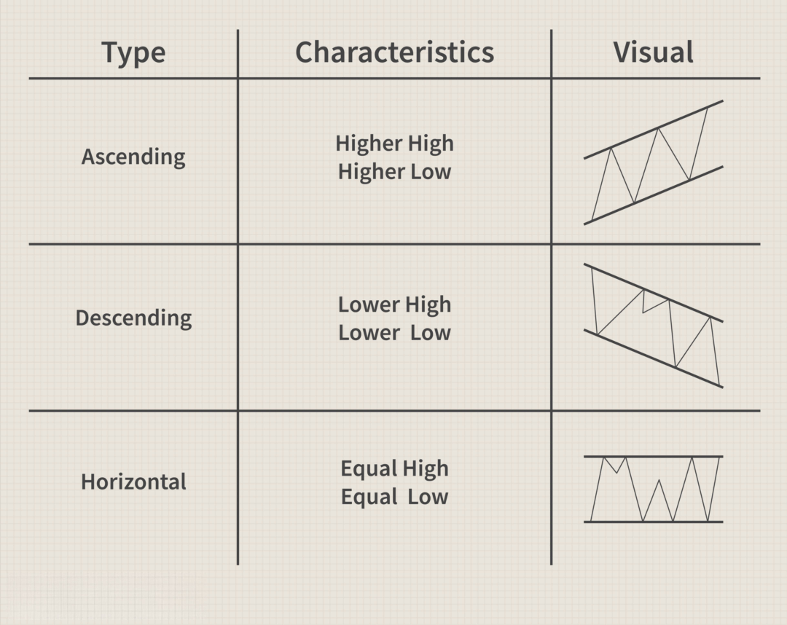

## Table of Contents

## What is channeling in the context of trading?

Channeling in trading is when the price of a stock or other asset moves between two parallel lines on a chart. These lines are called support and resistance. The support line is the bottom line, where the price tends to stop dropping and start going up again. The resistance line is the top line, where the price tends to stop rising and start going down again. When the price stays between these two lines for a while, it's called a channel.

Traders use channels to make decisions about buying and selling. If the price is near the bottom of the channel (the support line), traders might think it's a good time to buy because the price is likely to go up again. If the price is near the top of the channel (the resistance line), traders might think it's a good time to sell because the price is likely to go down again. Channels can help traders predict where the price might go next and make better trading choices.

## How can beginners identify a trading channel on a price chart?

To identify a trading channel on a price chart, beginners should first look for a clear trend in the price movement. This could be an upward trend, where prices are generally going up over time, or a downward trend, where prices are generally going down. Once you see a trend, start by drawing a line along the highs of the price movement. This line is called the resistance line because it's where the price often stops rising and starts to fall again. Next, draw another line along the lows of the price movement. This is called the support line because it's where the price often stops falling and starts to rise again.

Make sure these two lines are parallel to each other. If they are, and the price stays between these lines for a while, you've found a trading channel. It's important to use a longer time frame, like daily or weekly charts, to see the channel more clearly. Sometimes, the price might break out of the channel, but if it keeps coming back between the lines, it's still a valid channel. By practicing on historical data and watching how prices move, beginners can get better at spotting these channels and using them to make trading decisions.

## What are the basic rules for trading within a channel?

When trading within a channel, the basic rule is to buy when the price gets close to the bottom of the channel, which is called the support line. This is because the price often bounces back up from this line. So, if you see the price near the support, it might be a good time to buy. You can set a target to sell when the price reaches the top of the channel, which is called the resistance line. This way, you aim to make a profit as the price moves from the bottom to the top of the channel.

Another rule is to sell when the price gets close to the top of the channel, or the resistance line. This is because the price often starts to drop from this line. So, if you see the price near the resistance, it might be a good time to sell. You can set a target to buy again when the price goes back to the support line. This way, you aim to make a profit as the price moves from the top to the bottom of the channel. Remember, these rules work best when the price stays within the channel, so always keep an eye on the chart to make sure the channel is still valid.

## Can you explain the difference between ascending, descending, and horizontal channels?

An ascending channel is when the price of a stock or asset keeps going up over time. You can see this on a chart where both the support line and the resistance line are going up, but they are still parallel to each other. Traders like to buy when the price touches the bottom line (support) and sell when it reaches the top line (resistance). This way, they can make money as the price keeps climbing within the channel.

A descending channel is the opposite. Here, the price keeps going down over time. On the chart, both the support line and the resistance line are going down, but they are still parallel. Traders will sell when the price touches the top line (resistance) and buy when it reaches the bottom line (support). This strategy helps them make money as the price keeps falling within the channel.

A horizontal channel is when the price stays about the same over time. On the chart, the support and resistance lines are flat and parallel to each other. Traders buy when the price touches the bottom line and sell when it reaches the top line. This way, they can make money as the price moves back and forth within the channel, but it doesn't go up or down much overall.

## What indicators can be used to confirm the validity of a trading channel?

To confirm if a trading channel is valid, you can use a few simple indicators. One useful indicator is the moving average. If the price stays between two moving averages that are parallel to each other, it can show that the channel is strong. Another good indicator is the [volume](/wiki/volume-trading-strategy). If the volume goes up when the price hits the support or resistance lines, it can mean that many traders agree with the channel and it's more likely to be valid.

Another helpful indicator is the Relative Strength Index (RSI). If the RSI stays within a certain range while the price is in the channel, it can confirm that the channel is working well. Also, watching for trend lines can be useful. If the price keeps touching the trend lines that form the channel without breaking them too often, it shows that the channel is still valid. By using these indicators, you can feel more confident about trading within the channel.

## How do you determine the entry and exit points when trading within a channel?

When trading within a channel, you want to buy when the price hits the bottom line, called the support. This is because the price often bounces back up from this line. So, if you see the price near the support, it might be a good time to buy. You can set a target to sell when the price reaches the top line, called the resistance. This way, you aim to make a profit as the price moves from the bottom to the top of the channel. Always look at the chart to make sure the price is still moving within the channel before you make a trade.

On the other hand, you want to sell when the price hits the top line, or the resistance. This is because the price often starts to drop from this line. So, if you see the price near the resistance, it might be a good time to sell. You can set a target to buy again when the price goes back to the support line. This way, you aim to make a profit as the price moves from the top to the bottom of the channel. Remember, these entry and [exit](/wiki/exit-strategy) points work best when the price stays within the channel, so always keep an eye on the chart to make sure the channel is still valid.

## What are common mistakes beginners make when using channeling techniques?

One common mistake beginners make when using channeling techniques is not waiting for the price to actually touch the support or resistance lines before making a trade. They might see the price getting close to the line and think it's a good time to buy or sell, but if the price doesn't reach the line, the trade might not work out as planned. It's important to be patient and wait for the price to hit the line before making a move.

Another mistake is not using stop-loss orders. A stop-loss order helps limit how much money you can lose if the price suddenly breaks out of the channel. Beginners might forget to set these orders, thinking the price will always stay within the channel, but this isn't always true. Using stop-loss orders can protect your money and help you trade more safely.

## How can risk management be integrated into channel trading strategies?

Risk management is important when you're trading within a channel. One way to manage risk is by using stop-loss orders. A stop-loss order is like a safety net that tells your trading platform to sell your stock if the price falls too much. This way, you won't lose too much money if the price suddenly breaks out of the channel. It's also a good idea to only risk a small part of your money on each trade, maybe 1% or 2% of what you have. This way, even if you lose on a trade, it won't hurt your overall money too much.

Another way to manage risk is by not trading too often. Some beginners might want to trade every time the price touches the support or resistance line, but this can lead to more losses. It's better to wait for clear signs that the channel is still valid, like if the price keeps bouncing off the lines and the volume is high. Also, you can use other indicators like moving averages or the RSI to make sure the channel is strong. By being patient and using these tools, you can trade more safely and reduce the risk of losing money.

## What advanced techniques can be used to enhance channel trading performance?

One advanced technique to enhance channel trading performance is using multiple time frames. By looking at charts with different time frames, like daily and weekly, you can get a better idea of whether the channel is strong. If the channel looks good on both time frames, it's more likely to be valid. Another technique is using other indicators along with the channel. For example, you can use the Moving Average Convergence Divergence (MACD) to see if the price is gaining or losing strength. If the MACD shows the price is getting stronger when it hits the support line, it might be a good time to buy.

Another way to improve your channel trading is by using [breakout](/wiki/breakout-trading) strategies. Sometimes, the price might break out of the channel, and if you can spot this early, you can make a lot of money. To do this, watch for high volume when the price is near the resistance or support lines. If the volume is high and the price breaks through the line, it might be a good time to trade in the direction of the breakout. Also, you can use trailing stop-loss orders to lock in profits as the price moves in your favor. This way, you can keep making money even if the price keeps going up or down after breaking out of the channel.

## How do you adapt channeling strategies to different market conditions?

In a strong bull market, where prices are going up a lot, you can use an ascending channel to make money. When the price hits the bottom of the channel, it's a good time to buy because the price will likely keep going up. But, you need to be careful because the price might go up so fast that it breaks out of the channel. If you see this happening, you can adjust your strategy by moving your stop-loss orders higher to lock in profits as the price keeps rising. Also, you might want to use shorter time frames to catch more of the quick moves in the market.

In a bear market, where prices are going down, a descending channel can help you make money. When the price hits the top of the channel, it's a good time to sell or short sell because the price will likely keep going down. You need to watch out for the price breaking out of the channel to the downside, which can happen quickly in a bear market. If you see this, you can adjust by setting your stop-loss orders lower to protect your gains as the price keeps falling. In a sideways market, where prices aren't going up or down much, a horizontal channel works well. Here, you can buy at the bottom and sell at the top of the channel, but make sure the channel is still valid by checking the volume and other indicators.

## Can you discuss the psychological aspects of trading using channeling techniques?

Trading using channeling techniques can be tough on your mind because it makes you feel different emotions. When you see the price hit the bottom of the channel, you might feel excited to buy, hoping it will go up. But if the price doesn't move up right away, you might start to feel worried or scared that you made a bad choice. This can make you want to sell too soon, even if the channel is still valid. It's important to stay calm and not let these feelings make you do things you might regret later.

Another big part of channel trading is having the patience to wait for the right time to buy or sell. It can be hard to wait for the price to actually touch the support or resistance line before making a move. You might feel tempted to trade when the price is just close to the line, but this can lead to mistakes. Staying patient and sticking to your plan, even when the market is moving fast, can help you make better trades. Remember, it's okay to feel these emotions, but the key is to keep them under control and follow your strategy.

## What case studies or real-world examples demonstrate successful channel trading?

One real-world example of successful channel trading is the case of a trader who used a horizontal channel to trade a well-known stock like Apple (AAPL). The trader noticed that over a period of several months, the stock price was moving between a support level of around $120 and a resistance level of around $130. By buying the stock when it hit the support level and selling when it reached the resistance level, the trader was able to make consistent profits. The key to this success was patience and the use of stop-loss orders to manage risk. The trader waited for the price to actually touch the support and resistance lines before making trades and used stop-loss orders to limit potential losses if the price broke out of the channel.

Another example involves a trader who used an ascending channel to trade a [cryptocurrency](/wiki/cryptocurrency) like Bitcoin (BTC). During a bullish market period, the trader identified an ascending channel where the support and resistance lines were both trending upwards. The trader bought Bitcoin when it touched the support line and sold when it reached the resistance line, making profits as the price continued to rise within the channel. This trader also used volume indicators to confirm the strength of the channel and adjusted stop-loss orders to lock in profits as the price moved higher. By adapting to the bullish market conditions and using additional technical indicators, the trader was able to enhance their channel trading performance and achieve significant gains.

## References & Further Reading

[1]: Bergstra, J., Bardenet, R., Bengio, Y., & Kégl, B. (2011). ["Algorithms for Hyper-Parameter Optimization."](https://papers.nips.cc/paper/4443-algorithms-for-hyper-parameter-optimization) Advances in Neural Information Processing Systems 24.

[2]: ["Advances in Financial Machine Learning"](https://www.amazon.com/Advances-Financial-Machine-Learning-Marcos/dp/1119482089) by Marcos Lopez de Prado

[3]: ["Evidence-Based Technical Analysis: Applying the Scientific Method and Statistical Inference to Trading Signals"](https://www.amazon.com/Evidence-Based-Technical-Analysis-Scientific-Statistical/dp/0470008741) by David Aronson

[4]: ["Machine Learning for Algorithmic Trading"](https://github.com/PacktPublishing/Machine-Learning-for-Algorithmic-Trading-Second-Edition) by Stefan Jansen

[5]: ["Quantitative Trading: How to Build Your Own Algorithmic Trading Business"](https://www.amazon.com/Quantitative-Trading-Build-Algorithmic-Business/dp/0470284889) by Ernest P. Chan