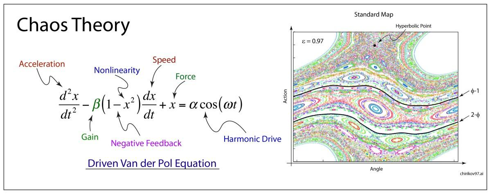

## Table of Contents

## What is Chaos Theory and why is it important?

Chaos Theory is a branch of mathematics that studies how small changes in a system can lead to big and unpredictable results. Imagine you drop a leaf into a stream. Where the leaf ends up can depend on tiny things, like a small ripple or a gust of wind. These small changes can make a big difference in where the leaf goes. This idea is often called the "butterfly effect," where a butterfly flapping its wings in one place might cause a storm somewhere else.

Chaos Theory is important because it helps us understand many things in the world around us, like weather patterns, population growth, and even how our brains work. It shows us that some systems are very sensitive and hard to predict, even if we know a lot about them. By studying chaos, scientists can make better models and predictions, even if they can't be exact. This helps in fields like weather forecasting, where knowing the general pattern can be very useful, even if we can't predict every detail.

## Can you explain the basic concepts of Chaos Theory?

Chaos Theory is all about understanding how small changes can make a big difference in certain systems. Imagine you're playing a game of Jenga. If you pull out one block, it might seem like nothing has changed, but it can make the whole tower fall down later. This is similar to how a tiny change in a weather system, like a small shift in temperature, can lead to a huge storm days later. Scientists call this sensitivity to initial conditions, and it's a key idea in Chaos Theory.

Another important concept is the idea of attractors. Think of an attractor like a magnet that pulls things toward it. In a chaotic system, even though things might seem random, they often follow certain paths or patterns over time. These paths are the attractors. For example, the way water swirls down a drain might look chaotic, but it's actually following a pattern around the drain. Understanding these patterns helps scientists predict how systems will behave, even if they can't predict every little detail.

Lastly, Chaos Theory talks about something called fractal geometry. Fractals are shapes that look the same no matter how much you zoom in or out. Think of a tree branch: the big branch looks a lot like the smaller branches, which look like the twigs. This self-similarity is a big part of chaotic systems. Fractals help us see how chaos can create beautiful and complex patterns in nature, like in clouds, coastlines, or even the stock market.

## What is the Butterfly Effect and how does it relate to Chaos Theory?

The Butterfly Effect is a big idea in Chaos Theory. It says that a small thing, like a butterfly flapping its wings, can cause big changes later on, like a storm far away. This happens because some systems are very sensitive. A tiny change at the start can grow and grow until it makes a huge difference. This idea helps us see why some things in nature, like the weather, can be hard to predict.

The Butterfly Effect is important in Chaos Theory because it shows how sensitive some systems are. In these systems, even if we know a lot about them, small changes can make it hard to predict what will happen. This is why scientists use the Butterfly Effect to explain why some things, like the weather, can change a lot even if we think we know what's going to happen. It helps us understand that even small actions can have big impacts over time.

## How does Chaos Theory differ from traditional predictability in science?

Chaos Theory is different from traditional predictability in science because it shows us that some things can be very hard to predict, even if we know a lot about them. Traditional science often thinks that if you know all the starting conditions and the rules of a system, you can predict what will happen next. But Chaos Theory says that in some systems, tiny changes at the start can lead to big and unexpected results. This is why weather forecasts can be wrong even when we have a lot of information.

In traditional science, we expect things to follow a clear pattern or path. For example, if you drop a ball, you can predict where it will land based on gravity and other forces. But in chaotic systems, like the weather or the stock market, small changes can make the system behave in ways that are hard to predict. Chaos Theory helps us understand that these systems have a lot of sensitivity to small changes, which makes them different from the more predictable systems we study in traditional science.

## Who were the key figures in the development of Chaos Theory?

Edward Lorenz was a big name in the start of Chaos Theory. He was a meteorologist and found out about the Butterfly Effect by accident. In the 1960s, he was working on a computer model of weather and noticed that small changes in the starting numbers made big differences in the results. This showed how sensitive some systems are and helped start the study of chaos.

Another important person was Mitchell Feigenbaum. He worked on something called the Feigenbaum constant, which helps explain how chaotic systems behave. His work showed that even though chaotic systems seem random, they can follow certain patterns. Other scientists like Benoît Mandelbrot also helped with Chaos Theory by studying fractals, which are shapes that look the same no matter how much you zoom in or out. These key figures helped us understand chaos better and showed how it applies to many parts of nature and science.

## What are some historical milestones in the evolution of Chaos Theory?

Chaos Theory started to become important in the 1960s when Edward Lorenz, a meteorologist, found the Butterfly Effect. He was working on a computer model to predict the weather. One day, he changed the starting numbers a tiny bit and saw that it made a huge difference in the weather forecast. This showed that some systems, like the weather, are very sensitive to small changes. Lorenz's discovery was a big step in understanding chaos and how it can make things hard to predict.

In the 1970s and 1980s, more scientists started working on Chaos Theory. Mitchell Feigenbaum found something called the Feigenbaum constant, which helped explain how chaotic systems behave. His work showed that even though chaotic systems can seem random, they often follow certain patterns. Around the same time, Benoît Mandelbrot was studying fractals, which are shapes that look the same no matter how much you zoom in or out. His work helped show how chaos can create beautiful and complex patterns in nature. These discoveries helped make Chaos Theory a big part of science and showed how it applies to many things, like weather, population growth, and even how our brains work.

## How is Chaos Theory applied in different fields such as meteorology and economics?

In meteorology, Chaos Theory helps scientists understand why weather can be so hard to predict. Weather is a chaotic system because tiny changes, like a small shift in temperature or wind, can lead to big differences in weather patterns days later. This is the Butterfly Effect in action. Meteorologists use Chaos Theory to make better weather models. They know they can't predict the weather exactly, but they can see general patterns and trends. This helps them give better forecasts, even if they can't tell you the exact temperature a week from now.

In economics, Chaos Theory is used to understand how markets can be unpredictable. The stock market is a good example of a chaotic system. Small events, like a company's earnings report or a tweet from a CEO, can cause big changes in stock prices. Economists use Chaos Theory to study these patterns and try to make better predictions about the market. They know that small changes can have big effects, so they look for general trends rather than trying to predict every detail. This helps them understand how the economy works and make better decisions.

## What are attractors and how do they function within Chaos Theory?

Attractors are like magnets in Chaos Theory. They pull the behavior of a system towards certain patterns over time. Even though things in a chaotic system can seem random, they often follow these paths or patterns. Imagine a spinning top that wobbles but keeps coming back to a certain way of spinning. That's what an attractor does—it brings the system back to a certain state or pattern, even if it's moving all over the place.

In Chaos Theory, attractors help scientists understand and predict how systems will behave. For example, in weather patterns, even though the weather can change a lot, it often follows certain paths over time. These paths are the attractors. By studying these attractors, scientists can see general trends and make better predictions, even if they can't predict every little detail. Attractors show us that there's some order in chaos, and that's really important for understanding how the world works.

## Can you describe the mathematical foundations of Chaos Theory?

Chaos Theory is built on some important math ideas. One big idea is called "sensitivity to initial conditions." This means that tiny changes at the start of a system can lead to big differences later on. Imagine you're playing a game of billiards. If you hit the cue ball just a little bit differently, it can change where all the balls end up. In math, this is often shown with equations that describe how things change over time. These equations can be simple, but they can lead to very complex and unpredictable results.

Another important part of Chaos Theory is the study of attractors. Attractors are like paths that a system follows over time. Even though a system might seem to move randomly, it often comes back to these paths. Think of a swing that you push. It might swing all over the place, but it keeps coming back to the same arc. In math, attractors are described by equations that show how a system moves towards these paths. By studying these equations, scientists can understand the patterns in chaotic systems, even if they can't predict every detail.

## What are some common misconceptions about Chaos Theory?

One common misconception about Chaos Theory is that it means everything is random and unpredictable. People sometimes think that because small changes can lead to big effects, nothing can be predicted at all. But that's not true. Chaos Theory actually helps us see that while some things are hard to predict exactly, there are still patterns and trends we can understand. Scientists use Chaos Theory to make better guesses about things like the weather, even if they can't tell you the exact temperature a week from now.

Another misconception is that Chaos Theory is only about the Butterfly Effect. While the Butterfly Effect is a big part of Chaos Theory, it's not the whole story. Chaos Theory also includes ideas like attractors and fractals, which help us understand how systems behave over time. The Butterfly Effect is just one way to show how sensitive some systems are, but Chaos Theory is much bigger and helps us understand many different things in nature and science.

## How has Chaos Theory influenced modern scientific research and technology?

Chaos Theory has changed how scientists think about the world. It has shown that some things are very hard to predict, even with a lot of information. This has made scientists better at understanding systems like the weather, where small changes can make a big difference. Instead of trying to predict everything exactly, scientists now look for general patterns and trends. This helps them make better models and predictions, even if they can't be perfect. For example, weather forecasts are more accurate now because scientists use Chaos Theory to understand how tiny changes can affect the weather over time.

Chaos Theory has also influenced technology. It's used in things like computer graphics to make images that look more natural and real. Fractals, which are a big part of Chaos Theory, help create detailed and beautiful patterns in games and movies. In engineering, Chaos Theory helps design better systems that can handle unexpected changes. For example, it's used to make traffic systems that can adapt to changes in traffic flow. Overall, Chaos Theory has helped scientists and engineers think in new ways and create better technology that can deal with the unpredictable nature of the world.

## What are the current challenges and future directions in the study of Chaos Theory?

One big challenge in studying Chaos Theory is figuring out how to predict things better in chaotic systems. These systems, like the weather or the stock market, are very sensitive to small changes. It's hard to know all the tiny details that can affect them. Scientists are working on better computer models and math equations to help with this. They want to find ways to see the big patterns and trends, even if they can't predict every little thing. Another challenge is understanding how chaos works in different fields, like biology or social sciences. Each field has its own special problems and needs new ways to study chaos.

In the future, scientists hope to use Chaos Theory to help with all sorts of things. They want to make better weather forecasts, understand how diseases spread, and even predict how people will act in groups. New technology, like faster computers and better data collection, will help with this. Scientists also want to teach more people about Chaos Theory so they can use it in their own work. As we learn more about chaos, we might find new ways to control or use it to our advantage. This could help us make the world a safer and more predictable place, even with all the chaos around us.

## What is Chaos Theory and how can it be understood?

Chaos theory is a significant branch of mathematics that explores how minute variations in initial conditions can lead to drastically different outcomes. This characteristic is often summarized by the 'butterfly effect,' which proposes that small changes, like the flap of a butterfly's wings, could potentially cause a tornado elsewhere. This tenet underscores that seemingly random systems may possess an intrinsic order, a concept pivotal in understanding complex systems such as weather patterns and financial markets.

The essence of chaos theory lies in its ability to identify patterns and behaviors in complex systems that conventional linear models often overlook. For instance, in financial markets, which are inherently chaotic, prices fluctuate with no apparent regularity, yet historical data reveals patterns and trends that hint at an underlying structure. This nonlinear behavior means that small variations in market conditions or trader sentiment can lead to significant shifts in market dynamics.

Key components of chaos theory include fractals, which are geometric shapes or sets that exhibit self-similarity across different scales. Fractals are instrumental in modeling complex systems because they can represent the infinite intricacies of natural phenomena, from the branching of trees to fluctuating market prices. The Mandelbrot set, perhaps the most well-known [fractal](/wiki/fractal-indicators), represents an infinite boundary of complex numbers and is used to model market behaviors and uncover repeating patterns at various scales.

Despite its potential, the applicability of chaos theory is challenged by its inherent unpredictability. While chaos indicates an ordered structure beneath apparent randomness, predicting specific outcomes remains elusive due to the sensitivity of systems to initial conditions. Traditional models, which assume linear relationships, fail to capture this unpredictability, often leading to inaccurate forecasts.

The formal representation of chaotic systems is often illustrated by differential equations, such as the Lorenz system, which shows how a deterministic system can lead to what appears as random behavior:

$$
\begin{align*}
\frac{dx}{dt} & = \sigma(y - x), \\
\frac{dy}{dt} & = x(\rho - z) - y, \\
\frac{dz}{dt} & = xy - \beta z.
\end{align*}
$$

Where $x, y, z$ represent system states, and $\sigma, \rho, \beta$ are parameters that affect the system's dynamics.

In sum, chaos theory offers a framework to recognize hidden order within complex, seemingly random systems. Through concepts like the butterfly effect and fractals, it contributes to our understanding and modeling of phenomena where traditional approaches prove insufficient. The challenge, however, lies in navigating its unpredictability to apply these insights effectively in real-world scenarios.

## References & Further Reading

- Lorenz, E. N. (1963). "Deterministic Nonperiodic Flow." This seminal paper introduced the concept of chaos theory, demonstrating how deterministic systems can exhibit unpredictable behavior. Lorenz's work laid the foundation for understanding complex systems where small initial differences can lead to vastly different outcomes, exemplified by what is now known as the "butterfly effect."

- Gleick, J. (1987). "Chaos: Making a New Science." This book provides a comprehensive overview of chaos theory, tracing its historical development and exploring its implications across various disciplines. Gleick's work is an accessible entry point for those interested in how chaos has influenced scientific thought and practical applications.

- Benoît B. Mandelbrot (1982). "The Fractal Geometry of Nature." Mandelbrot's exploration of fractals has had profound implications for understanding patterns in chaotic systems. His work on fractal geometry offers insights into the self-similar structures often found in chaotic systems, including financial markets.

- Edward E. Peters (1991). "Chaos and Order in the Capital Markets." Peters applies chaos theory to the financial markets, challenging traditional economic models that assume linearity and predictability. This book emphasizes the potential of nonlinear dynamics and chaos theory to explain market behavior.

- Feigenbaum, M. J. (1980). "The Transition to Aperiodic Behavior in Turbulent Systems." This paper presents Feigenbaum's discoveries regarding universality in the transition to chaos, known as Feigenbaum constants. His findings are pivotal in understanding how systems evolve from order to chaos, relevant to both natural and financial systems.

These works form a substantial basis for understanding how chaos theory, fractals, and nonlinear dynamics can provide deeper insights into financial markets, aiding in the development of advanced [algorithmic trading](/wiki/algorithmic-trading) strategies.

