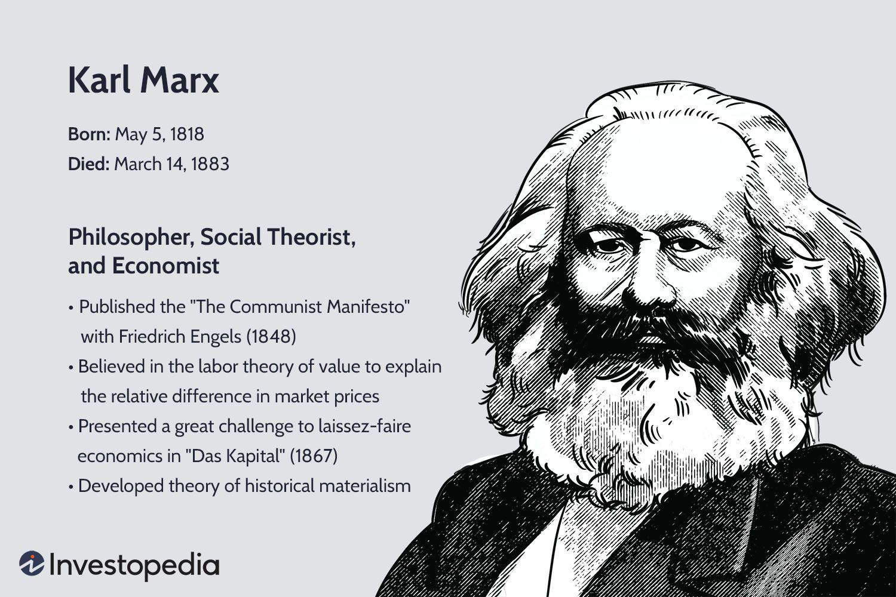

Chaos theory is a captivating branch of mathematics that investigates how minuscule alterations in the initial conditions of complex systems can produce substantial differences in their outcomes. Initially conceptualized in the domains of physics and meteorology, chaos theory has extended its influence across various fields, notably in finance and trading. By studying the intricacies of chaos theory, alongside nonlinear science and dynamical systems, we gain valuable insights into their applications and implications for algorithmic trading (algo trading).

Algorithmic trading involves the use of sophisticated computer algorithms to execute trades at high speeds, often leveraging advanced mathematical models. Traditional financial models typically assume linearity and predictability; however, they often fall short when confronted with the unpredictable nature of real-world markets. Chaos theory challenges these conventional models by demonstrating that financial markets exhibit characteristics of nonlinear dynamical systems, where outputs are not always directly proportional to inputs. This understanding allows traders to identify hidden patterns and make informed decisions, thereby enhancing their trading strategies.



One of the most well-known principles within chaos theory is the "butterfly effect," which suggests that small changes in a system's initial state can lead to disproportionately large effects over time. This concept highlights the sensitivity and unpredictability inherent in complex systems, underscoring the limitations of deterministic models. Despite appearing random at first glance, chaotic systems often contain underlying patterns and structures that can be uncovered through careful analysis. In financial markets, this insight opens the door to developing robust trading strategies that embrace the complexities and uncertainties inherent in market behavior.

As this article explores the history, principles, and applications of chaos theory, particularly within the context of algorithmic trading, it aims to offer a comprehensive understanding of how these mathematical concepts can elucidate the unpredictable nature of financial markets. Join us as we traverse the development of chaos theory, its fundamental tenets, and its impact on the contemporary trading landscape, ultimately demonstrating how chaos theory can be used to navigate the complexities of today's financial systems.

## Table of Contents

## Understanding Chaos Theory and Nonlinear Science

Chaos theory is a specialized field within mathematics that examines the behavior of certain dynamical systems. The unpredictable nature of these systems often arises from their sensitivity to initial conditions, a hallmark of chaos theory. Dynamical systems in this context are described through differential equations that can model the progression of systems over time. In simple terms, even minuscule differences in starting conditions can result in vast disparities in outcomes, a phenomenon highlighted by the iconic 'butterfly effect'. This effect demonstrates how minuscule changes in one area of a system can have significant, far-reaching consequences, such as the analogy of a butterfly flapping its wings leading to a tornado weeks later.

Nonlinear science, which encompasses chaos theory, focuses on examining systems where the relationship between input and output is not directly proportional. This nonlinearity is evident in many real-world phenomena, such as weather patterns or, pertinently, financial markets. Linear systems, by contrast, are ones where changes in input result in predictable and proportionate changes in output, a situation that rarely holds true outside of simplified theoretical contexts.

The core aim of chaos theory is to identify and understand the underlying patterns within systems that initially appear to be random or disordered. This search for order within apparent chaos offers insights into the fundamental behavior of complex systems, suggesting that randomness can often mask deeper levels of determinism and structure.

In the realm of finance, these concepts present a significant challenge to conventional models, which have traditionally relied on assumptions of linearity and predictability. Standard financial models often presume stability and proportionate reactions to economic stimuli, yet the chaotic nature of financial markets often leads to outcomes far more unpredictable than these models can account for.

By applying chaos theory, analysts and traders can attempt to uncover hidden patterns that might be embedded within seemingly erratic market behaviors. For instance, they might use tools like [fractal](/wiki/fractal-indicators) analysis, which utilizes the self-similar properties of fractals to model complex structures, in predicting stock price movements. Such approaches have the potential to provide valuable insights into market dynamics, offering a competitive edge over traditional methods that overlook the nuanced intricacies of non-linear interactions.

Thus, chaos theory and nonlinear science together offer a framework to better understand complex systems by acknowledging and incorporating the unpredictable and interconnected nature of their components. As our understanding of these phenomena continues to evolve, their application in various fields, including finance, promises to provide more robust models for predicting and interpreting the intricacies of the natural and socio-economic world.

## History of Chaos Theory

Chaos theory's roots go back to the 1960s, a period when Edward Lorenz, a meteorologist, made a groundbreaking discovery regarding weather prediction models. While using a rudimentary computer to simulate weather patterns, Lorenz discovered that even infinitesimally small changes in initial conditions could lead to vastly different outcomes. This phenomenon, later known as the "butterfly effect," emphasized the extreme sensitivity of dynamical systems to initial conditions, a core principle of chaos theory.

Lorenz's work was particularly significant because it challenged the prevailing deterministic models that assumed predictability of complex systems like weather. His experiments showed that these models could not account for the inherent unpredictability observed in natural phenomena. Lorenz's pioneering research laid the groundwork for chaos theory as it questioned the assumptions of linearity and predictability that dominated scientific thinking at the time.

The 1980s and 1990s marked a period of broader acceptance and development of chaos theory across various scientific disciplines. This expansion was fueled by advances in computational power, which allowed researchers to model and analyze complex systems in ways previously unimaginable. During this time, mathematician Mitchell Feigenbaum contributed significantly to the field by developing a mathematical framework that quantified the transition from orderly to chaotic behavior in dynamical systems. His discovery of "Feigenbaum constants," which describe bifurcations leading to chaos, provided a quantifiable representation of chaotic systems.

Popular culture also played a role in bringing chaos theory to the public eye. The 1993 movie "Jurassic Park," based on Michael Crichton's novel, introduced chaos theory concepts to a wide audience, using them as a narrative device to explain unpredictable events within the story.

Today, chaos theory continues to be an invaluable tool for understanding and modeling complex, unpredictable phenomena. It offers insights into systems previously thought to be random and remains a vibrant research area with applications ranging from meteorology to finance, as it provides a framework for navigating the inherent uncertainties of real-world systems.

## Dynamical Systems and Chaos Theory

Dynamical systems are mathematical frameworks designed to describe the evolution of complex systems over time. These systems can be categorized as either linear or nonlinear. Linear systems have outputs that are directly proportional to their inputs and are generally more predictable. Nonlinear systems, on the other hand, exhibit complex behaviors where small changes in initial conditions can lead to vastly different outcomes, a characteristic often described as "chaotic behavior."

Chaos theory is integral in studying nonlinear dynamical systems, particularly for its ability to provide analytical tools for examining systems that might initially appear random. Although long-term predictions in such systems are challenging due to their sensitivity to initial conditions, chaos theory aids in identifying patterns and structures that can lead to a better understanding of these complex systems.

Fractals are a key aspect of chaos theory, frequently employed to model the self-similar and intricate structures found within dynamical systems. A fractal is a pattern that repeats itself at different scales, and this property is observed in various natural phenomena. The Mandelbrot Set, one of the most well-known fractals, serves as a quintessential example of chaotic behavior and is defined by the iterative relation:

$$
z_{n+1} = z_n^2 + c
$$

where $z$ is a complex number and $c$ is a constant.

In the context of [algorithmic trading](/wiki/algorithmic-trading), comprehending dynamical systems and their chaotic nature is essential for anticipating market movements. Markets often behave as complex, nonlinear systems where traditional linear models may fall short in predicting changes. By utilizing chaos theory, traders can develop more sophisticated algorithms that take into account the chaotic and fractal nature of market data, potentially gaining insights into hidden patterns that offer a competitive edge.

Understanding these underlying chaotic principles can be transformed into algorithmic strategies using Python, where libraries such as NumPy and SciPy are used to model and analyze complex systems. Here is a simple Python snippet to illustrate the computation of the Mandelbrot Set:

```python
import numpy as np
import matplotlib.pyplot as plt

def mandelbrot(h, w, max_iter):
    # Create a grid of complex numbers
    y, x = np.ogrid[-1.5:1.5:h*1j, -2:1:w*1j]
    c = x + 1j*y

    # Initialize z to zero
    z = c
    div_time = max_iter + np.zeros(z.shape, dtype=int)

    # Apply the iterative process
    for i in range(max_iter):
        z = z*z + c
        diverge = z*np.conj(z) > 4
        div_now = diverge & (div_time==max_iter)
        div_time[div_now] = i
        z[diverge] = 2

    return div_time

if __name__ == "__main__":
    plt.imshow(mandelbrot(400, 400, 20), cmap='twilight_shifted', extent=(-2, 1, -1.5, 1.5))
    plt.colorbar()
    plt.title("Mandelbrot Set")
    plt.show()
```

This code generates a visualization of the Mandelbrot Set, showcasing the chaotic and complex nature of fractals, which parallels the unpredictable yet patterned behavior of financial markets. By leveraging such insights from chaos theory, trading strategies can be both innovative and resilient in the face of market [volatility](/wiki/volatility-trading-strategies).

## Chaos Theory in Algorithmic Trading

Algorithmic trading, often referred to as algo trading, leverages advanced computer programs to execute trades at remarkable speeds. These programs frequently utilize complex mathematical models to analyze markets and make trading decisions. Chaos theory, with its emphasis on the intrinsic unpredictability of systems and nonlinear dynamics, offers a vital framework for enhancing algorithmic trading strategies.

Traditional market models often rely on the assumption of linearity, where outputs are directly proportional to inputs. However, financial markets are inherently nonlinear and influenced by a multitude of unpredictable factors. Chaos theory challenges this traditional linear perspective by emphasizing the inherent complexities and interdependencies within market systems. This perspective allows for the development of algorithms that account for sudden and unpredictable market shifts, thus avoiding over-reliance on linear models.

Nonlinear approaches inspired by chaos theory can potentially identify hidden patterns within market data. These patterns, undetectable through conventional linear analysis, may provide traders with a competitive advantage. Chaos theory introduces concepts such as the 'butterfly effect', where minute changes can cascade into substantial impacts, urging traders to consider even seemingly insignificant data points.

Traders and analysts are increasingly adopting chaos theory to comprehend market dynamics more thoroughly and to create innovative trading strategies. For instance, the utilization of fractals, a key component of chaos theory, allows for modeling and analysis of self-similar patterns within market behavior. This is particularly useful in understanding stock prices, as markets often exhibit fractal-like behavior, characterized by repeating patterns regardless of the time scale.

Python, a powerful programming language, is extensively used for implementing chaos theory-based algorithms in trading. Here is an example of how Python can be employed to simulate a simple chaotic system:

```python
import numpy as np
import matplotlib.pyplot as plt

def logistic_map(r, x):
    return r * x * (1 - x)

n = 1000  # Number of iterations
r = 3.7   # Chaotic parameter
x = 0.5   # Initial condition

trajectory = [x]
for _ in range(n):
    x = logistic_map(r, x)
    trajectory.append(x)

plt.plot(trajectory)
plt.title("Logistic Map Chaotic Behavior")
plt.xlabel("Iterations")
plt.ylabel("Value")
plt.show()
```

This code simulates the logistic map, a well-known chaotic system, displaying how small changes in initial conditions or parameters can lead to divergent outcomes over time.

Despite its potential, the application of chaos theory in algorithmic trading necessitates a profound understanding of both chaos theory concepts and financial markets. Traders must carefully balance the sophisticated models that chaos theory offers with practical market insights to develop robust trading strategies. As computational power and data analysis techniques continue to advance, the integration of chaos theory into trading algorithms is likely to grow, providing deeper insights into the complexities of market behavior.

## Conclusion: The Future of Chaos Theory in Finance

Chaos theory, with its foundations in the study of nonlinear dynamical systems, continuously provides novel insights for financial systems. As computational technologies advance, chaos theory emerges as a crucial tool in algorithmic trading, offering novel ways to interpret and predict market behaviors that often elude traditional analytic models. The increasing capability of computational power and [machine learning](/wiki/machine-learning) algorithms enables traders to handle vast datasets with higher precision, uncovering intricate patterns indicative of chaotic dynamics in market movements.

The potential for chaos theory to transform financial analysis and strategy development is significant. As academic and practical research in this domain progresses, we can expect a deeper understanding of chaotic behaviors across various markets. Recognizing patterns, such as attractors and bifurcations within financial systems, may provide analysts a competitive advantage, facilitating the development of strategies that adapt gracefully to the unpredictable nature of markets.

As financial markets become increasingly complex, embracing chaos theory could offer traders more robust and flexible strategies, better equipped to handle volatility and sudden changes. The sensitivity to initial conditions, a hallmark of chaotic systems, underscores the importance of having strategies that can respond swiftly to market shifts. By incorporating chaos theory, traders could refine their risk management approaches and optimize algorithmic models to dynamically adjust in real-time, potentially cushioning against market shocks.

The evolution of chaos theory from a purely theoretical field to a practical application in finance reflects its potential to address both economic and financial challenges. With ongoing advancements, chaos theory could increasingly serve as a vital tool for financial professionals, not just in developing resilient trading strategies but also in enhancing the overall understanding of complex economic phenomena. As we further explore its applications, chaos theory may redefine the boundaries of financial analysis, offering innovative perspectives and solutions in a constantly evolving market landscape.

## References & Further Reading

[1]: Lorenz, E. N. (1963). [Deterministic Nonperiodic Flow](https://journals.ametsoc.org/view/journals/atsc/20/2/1520-0469_1963_020_0130_dnf_2_0_co_2.xml). Journal of the Atmospheric Sciences, 20(2), 130-141.

[2]: Gleick, J. (1987). [Chaos: Making a New Science](https://www.amazon.com/Chaos-Making-Science-James-Gleick/dp/0143113453). Penguin Books.

[3]: Mandelbrot, B. B. (1982). [The Fractal Geometry of Nature](https://archive.org/details/fractalgeometryo00beno). W. H. Freeman and Company.

[4]: Peters, E. E. (1991). [Chaos and Order in the Capital Markets: A New View of Cycles, Prices, and Market Volatility](https://www.semanticscholar.org/paper/Chaos-and-Order-in-the-Capital-Markets%3A-A-New-View-Peters/5a90ff905ed4f7a95cb83dea486e9feef468d6d3). John Wiley & Sons, Inc.

[5]: Feigenbaum, M. J. (1980). [The Transition to aperiodic behavior in turbulent systems](https://venturi.soe.ucsc.edu/sites/default/files/Feigenbaum1980.pdf). Nature 288, 29–32.

[6]: Trujillo, J. C., David, M., & Evangelos, I. (1996). ["Fractals, Scaling and Multifractals"](https://pjschmid.com/Fractals.html). Cambridge University Press.

[7]: Cover, T. M., & Thomas, J. A. (2006). [Elements of Information Theory](https://onlinelibrary.wiley.com/doi/book/10.1002/047174882X). Wiley-Interscience.

[8]: Farmer, J. D., & Sidorowich, J. J. (1987). [Predicting Chaotic Time Series](https://link.aps.org/doi/10.1103/PhysRevLett.59.845). Science, 236(4802), 917-923.

[9]: Lorenz, E. N. (1993). [The Essence of Chaos](https://www.cs.toronto.edu/~sme/PMU199-climate-computing/papers/Lorenz-1993-OurChaoticWeather.pdf). University of Washington Press.