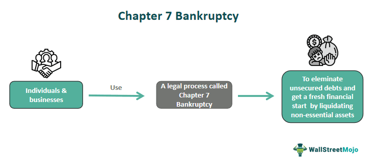

## Table of Contents

## What is Chapter 7 bankruptcy?

Chapter 7 bankruptcy is a type of bankruptcy that helps people who can't pay their debts. When someone files for Chapter 7, a court looks at their money and things they own. If the court agrees, some of the person's things might be sold to pay off their debts. This process is called liquidation. After the debts are paid as much as possible, the rest of the debts are usually forgiven, which means the person doesn't have to pay them anymore.

However, not everyone can file for Chapter 7. There are rules about how much money a person makes and how much they owe. If someone makes too much money, they might have to file a different type of bankruptcy, like Chapter 13. Also, not all debts can be forgiven in Chapter 7. Things like student loans, child support, and some taxes usually still need to be paid even after bankruptcy.

## Who is eligible to file for Chapter 7 bankruptcy?

To be eligible for Chapter 7 bankruptcy, a person must pass a test called the "means test." This test checks if the person's income is low enough to file for Chapter 7. If their income is less than the median income in their state, they can file. If it's higher, they might still qualify if they have a lot of expenses or special situations. The goal of the means test is to make sure that only people who really need it can use Chapter 7 to get rid of their debts.

Also, people who want to file for Chapter 7 cannot have filed for Chapter 7 bankruptcy in the last 8 years. They also need to complete a credit counseling [course](/wiki/best-algorithmic-trading-courses) from an approved agency within 180 days before they file. This course helps them understand their financial situation and options. If someone doesn't meet these requirements, they might need to look at other types of bankruptcy, like Chapter 13.

## What are the steps to file for Chapter 7 bankruptcy?

To file for Chapter 7 bankruptcy, you first need to gather all your financial information. This includes your income, expenses, debts, and assets. You'll need to complete a credit counseling course from an approved agency within 180 days before you file. After that, you fill out the bankruptcy petition and schedules, which are forms that list all your financial details. You'll also need to pay a filing fee, though you might be able to ask the court to let you pay it in parts or even waive it if you can't afford it.

Once you've got everything ready, you file your bankruptcy petition with the bankruptcy court in your area. After you file, a trustee is assigned to your case. This person's job is to review your paperwork and manage the sale of any non-exempt assets you have. You'll have to go to a meeting of creditors, where you answer questions about your finances under oath. If everything goes well, the court will discharge your debts a few months later, meaning you won't have to pay them anymore. But remember, some debts like student loans or child support won't be discharged.

## What debts can be discharged under Chapter 7 bankruptcy?

Under Chapter 7 bankruptcy, many kinds of debts can be discharged, which means you don't have to pay them anymore. This includes credit card debt, medical bills, personal loans, and most types of unsecured debts. If you owe money on a lease or contract, like a car lease, and you return the item, that debt can be discharged too. Some older tax debts might also be discharged if they meet certain conditions, like being at least three years old and having been filed on time.

However, not all debts can be discharged in Chapter 7 bankruptcy. You still have to pay debts like student loans, child support, alimony, and most taxes. Also, if you got a debt by lying or breaking the law, like fraud, that debt won't be discharged. Fines and penalties from the government, like traffic tickets, also can't be discharged. It's important to know which debts can and can't be discharged so you know what to expect after filing for bankruptcy.

## What assets can be protected during Chapter 7 bankruptcy?

In Chapter 7 bankruptcy, some of your things are protected and you get to keep them. These are called exempt assets. What you can keep depends on where you live because each state has its own rules. Common things that are usually protected include your home, car, some personal items like clothes and furniture, and a bit of money in your bank account. Some states also let you keep tools you need for your job or money from certain benefits like Social Security.

The goal is to help you keep what you need to live and work. The court looks at the value of these things, not just what they are. If your home or car is worth more than what your state says you can keep, you might have to give up the extra value, but you can still keep using the item. If you have debts on these things, like a car loan, you might have to keep paying those debts or give the item back to the lender. It's important to know your state's rules so you understand what you can keep and what you might lose.

## How does Chapter 7 bankruptcy affect credit scores?

When you file for Chapter 7 bankruptcy, it can hurt your credit score a lot. It stays on your credit report for 10 years. This means it can be harder to get loans, credit cards, or even rent a place to live because people see you as a bigger risk. Your credit score might drop a lot right after you file, maybe even by 100 to 200 points or more.

But, over time, Chapter 7 bankruptcy can actually help you. It wipes out a lot of your debts, so you can start fresh. If you work on rebuilding your credit after bankruptcy, like by paying bills on time and using credit wisely, your score can start to go up again. It takes time and effort, but many people find that their credit gets better in the long run after going through bankruptcy.

## What are the differences between Chapter 7 and Chapter 13 bankruptcy?

Chapter 7 and Chapter 13 bankruptcy are two different ways to deal with debts you can't pay. Chapter 7 is called liquidation bankruptcy. When you file for Chapter 7, the court can sell some of your things to pay off your debts. If you pass a test called the means test, which checks if your income is low enough, you can file for Chapter 7. After the process, most of your debts are forgiven, but you might lose some of your stuff. Chapter 7 is quicker, usually taking about 3 to 6 months, but it can really hurt your credit score for 10 years.

Chapter 13 is called reorganization bankruptcy. Instead of selling your things, you make a plan to pay back your debts over time, usually 3 to 5 years. You need to have a regular income to file for Chapter 13, and you can keep your stuff as long as you stick to the payment plan. This type of bankruptcy is good if you want to keep your home or car, but it takes longer and you have to follow the plan strictly. After you finish the plan, the rest of your debts might be forgiven. Chapter 13 stays on your credit report for 7 years, which is shorter than Chapter 7, but it still affects your credit.

## How long does the Chapter 7 bankruptcy process typically take?

The Chapter 7 bankruptcy process usually takes about 3 to 6 months from start to finish. After you file your paperwork with the court, a trustee is assigned to your case. The trustee's job is to check your financial details and sell any things you own that aren't protected by law. You'll have to go to a meeting with your creditors, where you answer questions about your money under oath. This meeting usually happens about a month after you file.

After the meeting, if everything looks good, the court will discharge your debts a few months later. This means you don't have to pay most of your debts anymore. The whole process is pretty quick compared to other types of bankruptcy, but it can still take a few months because the court and the trustee need time to review everything and make sure it's all done right.

## What are the costs associated with filing for Chapter 7 bankruptcy?

When you file for Chapter 7 bankruptcy, you have to pay a filing fee to the court. This fee is usually around $338, but it can change a bit. If you can't afford to pay the whole fee at once, you might be able to ask the court to let you pay it in parts. Sometimes, if you really can't pay, you can even ask the court to waive the fee completely.

Besides the filing fee, you'll also need to pay for a credit counseling course before you file and a debtor education course after you file. These courses usually cost around $10 to $50 each, but the price can be different depending on where you live and who you take the course from. You might also need to pay a lawyer to help you with the bankruptcy process, and their fees can range from a few hundred to a few thousand dollars. If you can't afford a lawyer, you might be able to find free legal help or represent yourself, but it can be tricky to do it on your own.

## What are the long-term financial implications of filing for Chapter 7 bankruptcy?

Filing for Chapter 7 bankruptcy can have a big impact on your finances for a long time. It stays on your credit report for 10 years, which means it can be harder to get loans, credit cards, or even rent a place to live. Lenders see you as a bigger risk, so they might charge you higher interest rates or turn you down for credit. This can make it tough to buy a house or a car, or even get a job if the employer checks your credit.

But, over time, Chapter 7 bankruptcy can actually help you start fresh. It wipes out a lot of your debts, so you can begin rebuilding your finances without those old debts hanging over you. If you work on rebuilding your credit by paying bills on time and using credit wisely, your score can start to go up again. It takes time and effort, but many people find that their financial situation gets better in the long run after going through bankruptcy.

## How can one rebuild their financial life after Chapter 7 bankruptcy?

After filing for Chapter 7 bankruptcy, it's important to start rebuilding your financial life carefully. Begin by creating a budget to keep track of your money. Spend less than you earn and save some money each month. This helps you live within your means and avoid getting into debt again. Also, make sure to pay all your bills on time, like rent, utilities, and any small loans or credit cards you might get. Paying on time shows lenders that you're responsible and can help improve your credit score over time.

Another way to rebuild is by getting a secured credit card. This type of card requires a deposit, but it can help you start using credit again. Use the card for small purchases and pay it off completely every month. This shows lenders that you can handle credit well. As you keep paying on time, you might be able to get unsecured credit cards or loans with better terms. It takes time and patience, but by sticking to a budget, paying bills on time, and using credit wisely, you can slowly rebuild your financial life after bankruptcy.

## What are some advanced strategies for maximizing the benefits of Chapter 7 bankruptcy?

One advanced strategy for maximizing the benefits of Chapter 7 bankruptcy is to carefully plan which assets you'll keep and which you'll let go. Before you file, look at your state's exemption laws to see what you can protect. If you have things that are worth a lot, like a car or some jewelry, you might want to sell them before filing and use the money for things that are protected, like your home or bank account. This way, you can keep more of what you need. Also, if you have debts that can't be discharged, like student loans, try to pay those down before filing so you're left with less debt after bankruptcy.

Another strategy is to time your filing right. If you know you're going to get a big bonus or tax refund soon, it might be better to wait until after you get that money to file. That way, you can use the money to pay for the bankruptcy process or to help you get back on your feet after. Also, make sure to keep good records of all your debts and payments. This can help you and your lawyer make the best plan for your bankruptcy. By planning carefully and timing things right, you can make the most out of Chapter 7 bankruptcy and start rebuilding your financial life in a better position.

## References & Further Reading

[1]: Warren, E. (2009). ["The Law of Debtors and Creditors: Text, Cases, and Problems."](https://www.amazon.com/Law-Debtors-Creditors-Problems-Casebook/dp/1454822384) Aspen Publishers.

[2]: Tabb, C. J., & Brubaker, R. E. (2019). ["Bankruptcy Law: Principles, Policies, and Practice."](https://cap-press.com/books/isbn/9781531013622/Bankruptcy-Law-Fifth-Edition) Carolina Academic Press.

[3]: Lopez de Prado, M. (2018). ["Advances in Financial Machine Learning."](https://www.amazon.com/Advances-Financial-Machine-Learning-Marcos/dp/1119482089) Wiley.

[4]: U.S. Courts. (n.d.). ["Chapter 7 – Bankruptcy Basics."](https://www.uscourts.gov/services-forms/bankruptcy/bankruptcy-basics/chapter-7-bankruptcy-basics)

[5]: Jansen, S. (2020). ["Machine Learning for Algorithmic Trading: Predictive models to extract signals from market and alternative data for systematic trading strategies with Python, 2nd Edition."](https://www.amazon.com/Machine-Learning-Algorithmic-Trading-alternative/dp/1839217715) Packt Publishing.