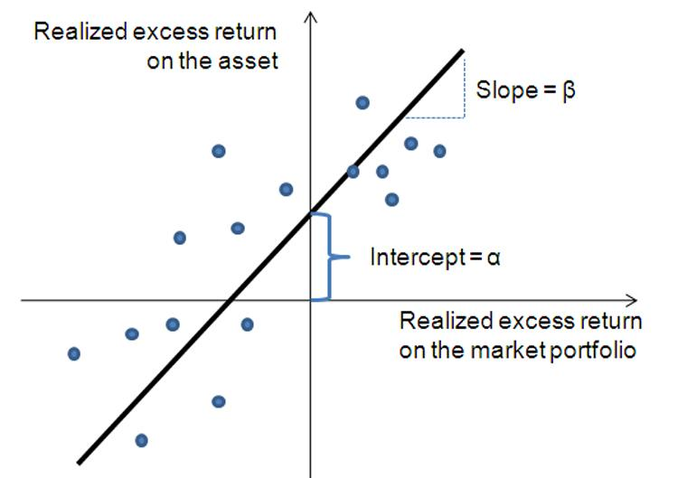

Investment analysis serves as a cornerstone in the field of finance, offering essential insights for both individual and institutional investors seeking to achieve specific financial objectives. The landscape of investment analysis is shaped by an array of financial theories and methods, which collectively empower investors to make informed decisions and navigate complex markets effectively. One of the foundational components within these financial theories is the characteristic line, which plays a pivotal role in evaluating potential investment opportunities.

The characteristic line, often referred to as the security characteristic line (SCL), is integral to understanding the risk and return dynamics of securities. This tool offers a graphical representation of the relationship between a security's performance and the overall market performance, providing critical insights into systematic risk and excess return. By assessing the SCL, investors gain clarity on a security's beta and alpha, which indicate its volatility compared to the market and potential for abnormal returns, respectively.



In recent years, the advent of algorithmic trading has significantly transformed the execution of securities trades, thereby offering new perspectives on investment analysis through the use of advanced computer algorithms. This digital innovation has enhanced the efficiency and precision of trading operations, allowing investors to capitalize on real-time data and insights derived from financial theories like the characteristic line.

This article examines the intersection of characteristic line investment analysis with broader finance theories and the implications of algorithmic trading. By exploring these elements, the discussion will illuminate how these components collectively contribute to the development of modern investment strategies that optimize risk and return profiles for investors in a rapidly evolving financial environment.

## Table of Contents

## Understanding the Characteristic Line

The characteristic line, also known as the security characteristic line (SCL), serves as a fundamental tool in investment analysis by illustrating the relationship between a security's performance and the overall market portfolio. This relationship is graphically represented through a regression line which helps investors understand the dynamics of a specific security or portfolio relative to market movements over various time periods.

To construct the characteristic line, a graph is plotted with the excess return on the security on the Y-axis and the excess return of the market on the X-axis. The excess return is calculated by subtracting the risk-free rate from the actual return of the security or market, respectively. Mathematically, the characteristic line can be represented using the linear regression equation:

$$
R_i - R_f = \alpha_i + \beta_i (R_m - R_f) + \epsilon_i
$$

where:
- $R_i$ is the return on the individual security.
- $R_f$ is the risk-free rate of return.
- $\alpha_i$ represents the intercept, known as alpha, indicating the security's abnormal return, which cannot be attributed to market movements.
- $\beta_i$ denotes the slope of the line, known as the security's beta, which measures the systematic risk of the security compared to the overall market.
- $R_m$ is the return of the market portfolio.
- $\epsilon_i$ is the error term, reflecting the non-systematic risk.

Alpha ($\alpha$) stands as a critical parameter in understanding the additional return that a security might yield independent of market fluctuations. A positive alpha indicates that the security has outperformed what is predicted by its risk level, while a negative alpha suggests underperformance.

Beta ($\beta$), on the other hand, quantifies the security's sensitivity to market movements. A beta greater than 1 implies that the security is more volatile than the overall market, while a beta less than 1 suggests less [volatility](/wiki/volatility-trading-strategies). For example, a beta of 1.2 would indicate that the security is expected to move 20% more than the market, either upwards or downwards.

Grasping the implications of the characteristic line allows investors to effectively assess the risk-return profile of a security. This comprehension is crucial in making strategic investment decisions, such as whether a security fits an investor's risk tolerance or financial goals. By evaluating a security's alpha and beta, investors can form a nuanced perspective of its performance potential in relation to market dynamics.

For practical implementation, Python offers robust tools to compute the characteristic line of a security. The use of libraries such as NumPy for mathematical operations and Matplotlib for plotting can streamline this analysis. An example code snippet to calculate and plot the characteristic line is as follows:

```python
import numpy as np
import matplotlib.pyplot as plt
from sklearn.linear_model import LinearRegression

# Sample data: excess returns of security and market
excess_return_security = np.array([...])  # replace with actual data
excess_return_market = np.array([...])  # replace with actual data

# Reshape for sklearn
x = excess_return_market.reshape(-1, 1)
y = excess_return_security

# Linear regression model
model = LinearRegression().fit(x, y)
alpha = model.intercept_
beta = model.coef_[0]

# Plot the characteristic line
plt.scatter(excess_return_market, excess_return_security, color='blue', label='Data Points')
plt.plot(excess_return_market, model.predict(x), color='red', label=f'Characteristic Line: alpha={alpha:.2f}, beta={beta:.2f}')
plt.xlabel('Excess Return Market')
plt.ylabel('Excess Return Security')
plt.title('Security Characteristic Line')
plt.legend()
plt.show()
```

In summary, the security characteristic line is a powerful analytical tool that provides insights into the systematic risk and potential return of securities, forming a cornerstone for informed investment strategies. Understanding the nuances of alpha and beta within this context arms investors with the critical information necessary to navigate financial markets effectively.

## Finance Theory and Investment Analysis

Finance theory encompasses varied concepts and models that are instrumental in understanding market operations and the pricing of securities. Investment analysis is an integral part of finance, involving the evaluation of potential investments to determine their suitability within an investor's portfolio. This evaluation considers both risk and return expectations, ensuring alignment with financial goals.

Central to finance theory is the Capital Asset Pricing Model (CAPM), which utilizes the characteristic line to quantify an asset's expected return through its risk, or beta. The CAPM formula is typically expressed as:

$$
E(R_i) = R_f + \beta_i \times (E(R_m) - R_f)
$$

Where:
- $E(R_i)$ is the expected return of the investment
- $R_f$ is the risk-free rate
- $\beta_i$ is the beta of the investment
- $E(R_m)$ is the expected return of the market

The beta ($\beta$) in the CAPM formula represents the systematic risk of a security relative to the market. It is derived from the slope of the characteristic line in a regression analysis, which plots the historical returns of the security against the market. An asset with a beta greater than one is considered more volatile than the market, while a beta less than one indicates less volatility.

Another foundational theory is Modern Portfolio Theory (MPT), which employs principles like the characteristic line to construct efficient portfolios. MPT aims to optimize returns for a specified level of risk, helping investors maximize their portfolio's performance. The theory relies on efficient frontier analysis, suggesting that investors can attain optimal portfolios through diversification. This is mathematically represented by the portfolio's expected return and variance calculations, enabling investors to make informed decisions about asset allocation.

These financial theories blend to create a comprehensive framework that is crucial for investment analysis in both traditional and [algorithmic trading](/wiki/algorithmic-trading) environments. They equip investors with the tools needed to assess and mitigate risk while seeking returns, thereby facilitating strategic decisions that align with different financial objectives. The integration of these concepts into algorithmic trading, where trading decisions are automated based on pre-defined criteria, demonstrates the enduring relevance of finance theory in modern market strategies.

## Algorithmic Trading and its Impact

Algorithmic trading, commonly referred to as algo trading, leverages computer algorithms to automate trading decisions, a method that has transformed the global trading landscape. By executing trading orders based on pre-defined criteria without human intervention, algorithmic trading offers unprecedented speed, precision, and efficiency. This technological advancement enables traders to capitalize on market opportunities that would be difficult, if not impossible, for human traders to discern and act upon in real-time.

Central to algo trading is quantitative analysis, a discipline that integrates mathematical and statistical models to understand market dynamics and identify profitable trading opportunities. Among these models, the characteristic line plays a pivotal role. By plotting the excess return of a security against the excess return of the market, the characteristic line helps determine the beta and alpha of a security. In algorithmic trading, beta is essential for assessing systematic risk, while alpha represents the security's ability to yield returns independently of the market.

The use of characteristic line analysis in algorithmic trading allows for the real-time assessment of risk and potential returns. Traders can utilize this information within algorithms to make swift and informed trading decisions. By continuously evaluating a security's position relative to the market, algorithms can identify anomalies or inefficiencies that might suggest profitable trades.

As algorithmic trading continues to advance, its impact on financial markets becomes increasingly profound. The integration of traditional financial theories, such as those involving the characteristic line, into algorithms has paved the way for more sophisticated trading strategies. This evolution underscores the importance for traders and investors to understand and adapt to these underlying theories and techniques to remain competitive.

The dynamic nature of algo trading also presents challenges, such as the potential for increased market volatility and the need for enhanced regulatory frameworks to prevent market manipulation. Despite these challenges, the continued development of algorithmic trading holds promise for improving market [liquidity](/wiki/liquidity-risk-premium) and optimizing resource allocation across the financial ecosystem.

In conclusion, the rise of algorithmic trading signifies a significant shift in how trading is conducted, emphasizing the critical role of quantitative models and financial theory in developing robust trading strategies. Understanding these elements is crucial for investors and traders aiming to harness the full potential of this transformative approach in modern financial markets.

## Strategies for Effective Investment

Effective investment strategies are built upon a synthesis of finance theories, characteristic line analysis, and algorithmic trading techniques. Understanding these elements enables investors to optimize portfolios in alignment with their financial goals and risk tolerance.

A comprehensive understanding of the characteristic line, also known as the security characteristic line (SCL), is essential for identifying securities that offer abnormal returns for calculated levels of risk. The characteristic line's slope, which is the security's beta, measures the systematic risk compared to the market. The intercept, or alpha, signifies the security's abnormal return beyond market movements. Investors can leverage this knowledge to fine-tune their portfolios and pursue securities that may provide higher returns relative to expected risks.

Combining finance theory insights with the analytical capabilities of algorithmic trading can significantly enhance portfolio performance. The Capital Asset Pricing Model (CAPM), which integrates the characteristic line, helps assess asset returns based on their beta, facilitating more accurate expectations of risk-adjusted returns. By embedding these financial theories into algorithmic frameworks, investors can conduct real-time assessments and optimize trading decisions more effectively.

Risk management strategies play a pivotal role in ensuring that investment decisions reduce potential losses while maximizing returns. Diversification, one of the fundamental principles in risk management, involves spreading investments across various asset classes to mitigate unsystematic risk. Adjusting portfolio allocations based on characteristic line analysis helps maintain an optimal balance between risk and reward. For instance, if an asset's beta indicates a higher risk relative to market volatility, rebalancing the portfolio towards lower-beta assets might be a prudent decision.

Incorporating these investment strategies fosters a balanced approach, allowing investors to tailor their portfolios according to their risk tolerance and financial objectives. Regular portfolio reviews, guided by the principles of finance theory and characteristic line analysis, ensure alignment with evolving market conditions and personal investment goals.

In summary, integrating characteristic line analysis, finance theories, and algorithmic trading techniques forms the foundation of effective investment strategies. By understanding and applying these principles, investors can navigate financial markets with greater precision and confidence, optimizing both risk management and potential returns.

## Conclusion

The intersection of characteristic line investment analysis, finance theory, and algorithmic trading creates a robust framework crucial for assessing investment opportunities. As financial markets become increasingly sophisticated, these elements offer a structured approach to optimizing risk and return through informed decision-making. The security characteristic line (SCL), a pivotal component, enables investors to evaluate the systematic risk (beta) and potential abnormal returns (alpha) of securities. By understanding these components, investors can refine their strategies to maximize returns while managing acceptable levels of risk.

The adoption of algorithmic trading further enhances this framework, offering unparalleled speed and efficiency. Algorithms leverage the quantitative insights derived from characteristic line analysis and finance theories such as the Capital Asset Pricing Model (CAPM) and Modern Portfolio Theory (MPT) to identify profitable trading opportunities in real-time. Through continuous learning and the integration of advanced algorithms, investors can adapt to rapid market changes and maintain a competitive edge.

For investors, both individual and institutional, the practical application of these principles is vital. Crafting strategies that incorporate characteristic line analysis, finance theory insights, and algorithmic capabilities results in a dynamic investment process. This process effectively navigates the complexities of modern markets, aligning with varied risk appetites and financial goals.

The dynamic relationship between characteristic line analysis, finance theory, and algorithmic trading underscores the complexity and potential inherent in today's financial markets. Embracing these interconnections allows for the development of sophisticated strategies that not only mitigate risks but also capitalize on emerging opportunities. As markets evolve, continuous adaptation to new technologies and financial theories will be essential, empowering investors to thrive within the intricate landscape of modern finance.

## References & Further Reading

[1]: Roll, R. (1977). "A Critique of the Asset Pricing Theory's Tests Part I: On Past and Potential Testability of the Theory." Journal of Financial Economics, 4(2), 129-176.

[2]: Sharpe, W. F. (1964). "Capital Asset Prices: A Theory of Market Equilibrium under Conditions of Risk." The Journal of Finance, 19(3), 425-442.

[3]: Fama, E. F., & French, K. R. (1993). "Common Risk Factors in the Returns on Stocks and Bonds." Journal of Financial Economics, 33(1), 3-56.

[4]: ["Algorithmic Trading: Winning Strategies and Their Rationale"](https://www.wiley.com/en-us/Algorithmic+Trading%3A+Winning+Strategies+and+Their+Rationale-p-9781118746912) by Ernest P. Chan

[5]: Markowitz, H. (1952). "Portfolio Selection." The Journal of Finance, 7(1), 77-91.

[6]: ["Evaluation of Trading Strategies"](https://people.duke.edu/~charvey/Research/Published_Papers/P116_Evaluating_trading_strategies.pdf) by Robert Pardo